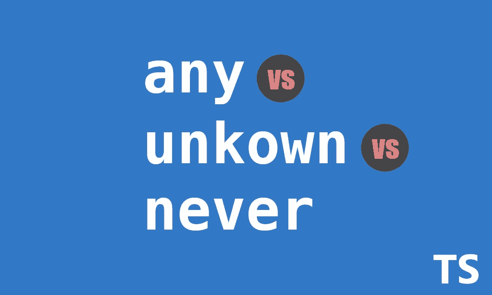

# TypeScript:任何 vs 未知 vs 从不

> 原文：<https://betterprogramming.pub/typescript-any-vs-unknown-vs-never-9d0eb7416b2b>

## 深入探究这三种有趣的类型

作者图片

`any`、`unknown`、`never`有什么区别？我们应该在什么时候使用其中的每一个？它的缺点和优点是什么？

TypeScript 最近已经十年了。为了庆祝它的周年纪念，我想探索和玩这些类型的复杂性。

本文将帮助您理解和学习它们的内部原理。有了这个清晰的概念，你就能很容易地确定在每种情况下应该使用哪一种。

# 任何的

在这三者中，`any`是我们倾向于首先学习的一个。你可以把它看作是 TypeScript 类型系统的一个出口。例如，当声明一个变量为`any`时，你可以把这个值赋给它的任何值。禁用 TypeScript 并将责任转移给开发人员是一个编译器指令。

通常情况下，它会制造更多的问题，而不是解决问题。

默认情况下，当类型注释缺失且无法推断时，编译器将默认为`any`类型。

这被认为是一种不好的做法，有一个简单的解决方法。我们可以启用`strict`模式`on`让上面的代码失效。

TypeScript `strict`模式将启用罩下的`noImplicitAny`、`noImplicitThis`、`alwaysStrict,`、`strictBindCallApply`、`strictNullChecks`、`strictFunctionTypes`和`strictPropertyInitialization`。

当`any`类型的隐式用法时,`noImplicitAny`将引发错误。除了启用`strict`之外，您可以选择仅启用该选项。

虽然不会禁止显式`any`的使用。这会导致一些严重的错误。

让我们看一个虚拟的例子:

虽然我们已经将参数`a`和`b`声明为数字，但是我们可以通过首先将变量声明为`any`来执行带有`string`的函数。这个错误很难发现，因为您实际上是在那些变量上选择了不使用 TypeScript 类型安全。

我们如何防止这种情况发生？通过使用一些林挺规则，比如`typescript-eslint`和启用`no-explicit-any`规则。

该规则可以帮助您阻止这些显式用法。然而，有时候，没有办法，使用`any`可能是唯一的解决方案。对于这些例外情况，您可以禁用该行的内衬规则。

# 未知的

`unknown`型很简单，但有时也是最难掌握的一种。它只是所有类型的父代。在直接进入之前，让我们检查一下 TypeScript `4.8`的一个新特性。

当使用`--strictNullChecks`选项时，空对象`{}`现在是除`null`和`undefined`之外的所有类型的超类型。为什么这很重要？有助于我们理解`unknown`的定义。

由于`{}`是除了`null`或`undefiend`之外的所有类型的超类型，因此很容易创建我们定制的`unknown`等价类型。

我们怎么知道上面的作品？让我们创建一个映射类型来测试我们定义的类型是否确实匹配`unknown`。

为什么重要？为什么上面的很酷？因为从`4.8`开始，我们现在可以缩小未知类型的范围，而无需显式提供类型断言。这将全部由控制流分析来完成。

让我们看一个例子:

建议使用`unknown`替代`any`。它让我们定义更广泛的类型，同时保持安全的类型检查。

`unknown`的一个常见用途是用作旁路打字的桥梁。编译器利用了开发人员的打字责任。也就是说，应该谨慎使用。

总之，`unknown`是`any`的首选替代，可以用来更好地表达一般类型。可以通过控制流分析或类型断言来缩小范围。

# 从不

`never`是一个简单但起初相当混乱的类型。它是一种类型，表示没有任何东西可以分配给它。这是一种不应该出现或被赋予的类型。

我们来看看编译器是如何利用这种类型更好地表达自己的。假设我们想将一个类型表示为`string`和`number`的交集。我们知道这是不可能的，因为没有可能的交集，但我们可以从句法上表达出来。

让我们看看当我们尝试这样做时会发生什么:

我们可以看到,`x`的类型变成了`never`,因为这种情况永远不会发生。

如果我们试着从一个`function`返回`never`会怎么样？我们得到一个错误。

为了让上面的代码工作，这个方法应该永远不会结束，有一种方法可以做到这一点——通过抛出一个异常。

所以`never`类型是一个很棒的工具，我们可以用它来表达我们代码的语义。

让我们创建一个有趣的方法记录器，它可以接受除日期之外的任何东西。代码如下:

在上面的代码中，我们创建了一个`log`函数，它可以接受除`Date`之外的任何类型。这是如何实现的？通过映射类型将`Date`映射到`never`。

# 包裹

我们已经看到了使用所有这些类型的复杂性和细微差别。它们都是这种语言的重要方面，但是有不同的用例。

一言以蔽之，应该尽量避免`any`而偏向`unknown`。然而，在`unknown`对您不起作用的某些情况下使用它是没问题的。

`never`类型有助于我们表达类型限制和识别语言的类型限制。

干杯！

 [## 5 个类型脚本库来改进您的代码库

### 增加你对静态打字的信心

better 编程. pub](/5-typescript-libraries-to-improve-your-codebase-d26f74a5c3)