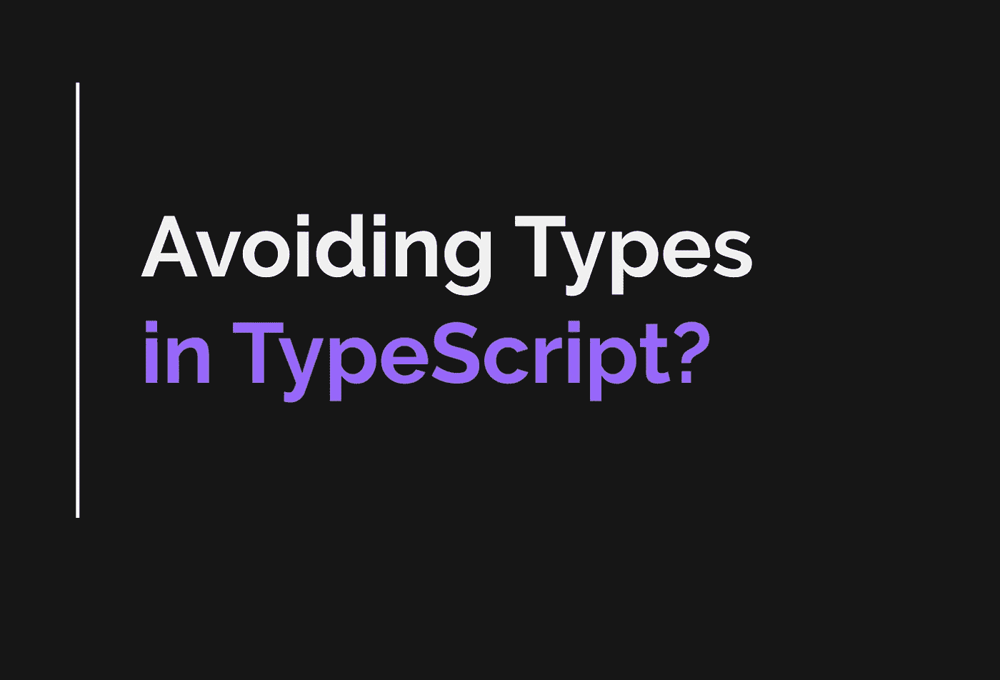

# 类型较少的 TypeScript？

> 原文：<https://betterprogramming.pub/typescript-with-fewer-types-f7fa636476db>

## 为什么我们应该尽可能避免手写打字



作者照片。

本月早些时候，我写了一篇文章，回顾了打字稿和流 *之间的一些[权衡。](https://medium.com/better-programming/please-put-typescript-down-for-a-moment-103f15378d34)*我试图公正地评价自己，但正如我所料，有相当多的人站出来为 TypeScript 辩护。

特别是，当我在文章中做了如下概括性声明时，有一个人不太高兴:

> “使用 TypeScript 和 Flow 的讽刺之处在于，手工打字并不是一件好事！”

这让我思考:虽然这可能是一个笼统的说法，但它是正确的吗？在这篇文章中，我将论证“是”

# 主要问题

首先，您的体验将高度依赖于您使用的库。例如，我将 TypeScript(和 Flow)与 React + Redux(以及 libs)一起使用。因此，我的观点可能与主要在 Express 中工作的人不同。

也就是说，一般来说，手写输入很容易成为一个容易出错且耗时的过程。

问自己以下问题:

*   您有多少次因为过时的类型定义而遇到错误(在处理 API 时最常见)？
*   你花了多少时间来更新你自己的类型定义(特别是 React + Redux)？
*   你花了多少时间操作或扩展第三方库的类型定义(希望不要太多)？
*   你花了多少时间调试非平凡代码中的类型错误(不包括组件上的无效属性类型，因为这些通常是最容易修复的)？

这些问题通常都有解决方案，具体取决于具体的场景。

这不是重点。花时间管理类型，特别是在上面列出的场景中，通常是没有效率的。

# 过时的 API 类型定义

假设你在一个名为团队 Alpha 的前端团队中(因为前端团队就是 Alpha…开玩笑),你正在使用一个由团队 Bravo 创建的 API。

您的团队很大，所以您使用 TypeScript 并为特定的 API 端点设计了一些类型定义:

好吧，酷。我们不仅有类型安全，而且很容易理解 API 端点的输入和输出。

快进一周，Bravo 团队对`/user`端点进行了更改。他们在 Slack 上的`api-news`频道发送了一条消息。阿尔法小组有人看到了，有人没看到。突然，你的前端坏了，你不知道为什么。以下是所做的更改:

现在，您编写的保护您的类型正在导致大量的调试问题，因为它们已经过时了。

在短暂的碰壁之后，你要么终于看到了 Bravo 团队的更新，要么自己找到了问题的根源。

也许第一次没什么大不了的。你更新类型，继续你的生活。

但是你要调试、更新和重构多少次呢？可能永远。

## 理想溶液

如果可能的话，一个很好的“自动”解决方案是为您的 API 模式使用类型生成器。如果您使用 GraphQL，那么您很幸运，因为类型生成器(GraphQL 代码生成器、Apollo codegen 等)有可靠的选项。

这样，当 API 发生变化时，您可以运行一个命令来下载请求和响应类型的变化。例如，如果您有时间，您可以在每次 API repo 更新时自动触发下载。这样，你就可以一直保持最新状态。

如果您在客户机和服务器上都使用 TypeScript，那么我认为利用这一事实并在下游共享类型是明智的。只要不在客户机上编写请求和响应类型，方式并不重要。

# 复杂类型

不是所有类型都写的一样！使用 React 时，常见的情况是编写某种 HOC(高阶组件)来增强其他组件。

```
function trivialHOC<Config: {}>(
  Component: React.AbstractComponent<Config>
): React.AbstractComponent<Config> {
  return Component;
}
```

这是心流的基本例子。如果你知道这里发生了什么，还不算太坏。

当您有一个将道具注入包装组件的 HOC 时会发生什么？

同样，如果你知道发生了什么，这可能不会太难。然而，真实世界的组件往往更加复杂。想一想正确写出这个需要多少时间。

最重要的是，如果其他人需要修改它，而创建这个组件的人已经不在了，怎么办？现在其他人不得不花费开发时间来完成类型定义。

如果您不使用 React，这并不一定会将您从类似这样的潜在情况中解救出来(尽管这种情况可能远不常见)。我们仍然应该尽我们的努力来避免这种情况。

# 这不仅仅是开发价值的问题

开发人员经常认为，从长远来看，类型有助于减少技术债务和错误。我强烈推荐[阅读这篇文章](https://medium.com/javascript-scene/the-shocking-secret-about-static-types-514d39bf30a3)，这篇文章解释了静态类型并不一定意味着更少的错误。

即使它确实减少了错误，你花费在管理类型定义上的时间仍然是一项商业成本*。*

开发人员花在管理类型上的每一个额外的小时，都是没有用于特性开发的额外的一个小时。

这真的可以归结为:什么是成本收益比？与管理类型定义(以及与类型相关的错误)所花费的时间相比，在错误修复上节省了多少时间？

如果你有一个打字专家团队，收益可能会超过成本。如果有一个打字专家领导一个由初级和中级 JavaScript 开发人员组成的混合团队，那么成本收益比可能就不会那么向右倾斜了。

# 我们如何最好地利用 TypeScript？

到目前为止，我所说的一切将会招致大量的憎恨和批评。我想说清楚，我认为打字稿是坏蛋。静态类型不是一件坏事。我只是不喜欢类型的存在突然意味着你的代码更安全或更好的想法。这件事还得*做好* *。*

我认为我们自己编写的类型越少(同时仍然具有 100%的类型安全性)，TypeScript 将为我们提供更好的服务，我们的代码也将更干净。

我不想听到类型安全弥补可读性的论调。不应该是一个对另一个！

我们是程序员，该死的。从代码的角度来看，我们喜欢控制，不喜欢妥协。

也就是说，这里有一些我认为可以减少手写字体的方法:

*   让 TypeScript 尽可能多地推断类型。TypeScript 在这方面相当擅长，我们应该利用这一点！不要显式编写 TypeScript 已经可以自己解决的内容。
*   如果可能的话，为 API 使用类型生成器。这并不总是可能的，但好处是巨大的。如果你使用 GraphQL，你已经有了一些惊人的选择。如果没有，这是一个值得与您的后端团队讨论的问题，以便合作制作一个(如果可能的话)。
*   真正更深层次的了解 TS 类型。有时，你可以使用奇特的泛型和帮助函数来编写一个有趣的类型定义或抽象，这将使你免于编写重复和脆弱的类型。问题是我们中的大多数人只在表面水平上学习如何编写类型，因为我们 90%的时间只需要基本的。
*   如果可能，坚持使用有 TS 支持的库。如果库本身是用 TS 写的，那就更好了。同样，这并不总是可能的，但是使用的缺乏 TS 支持的库越多，您自己要管理的类型就越多。
*   完全避免 TS 和 Flow。这不是一个受欢迎的选择，但是如果你发现 TS 真的阻碍了你或者你的团队的生产力，那么放弃它。我知道人们会说缺乏技能不是一个好的借口。说真的，别说了。他们的老板为他们有利可图的产出支付薪水，而不是他们写代码所用的语言。如果有人在香草 JS 中更有效率，那么他们应该坚持香草 JS，并在空闲时间玩 TS。

# 结论

写类型怎么可能是好事？我知道我们*不得不*去做这件事，但是如果我们能最小化它——同时保持类型安全——那不是一个理想的世界吗？

我们将总是不得不写类型…然而我们并不总是不得不写类型。你明白吗？

与其盲目地追求类型安全，不如让我们追求类型安全和干净、可管理的代码。

记住那句老话:最好的代码是你从来没有写过的代码。

如果您有问题、想法或顾虑，请留下评论！我不会坐在这里宣称我的观点是事实，因为事实并非如此。我很乐意就这个问题进行反复讨论。请随意尝试改变我的想法！