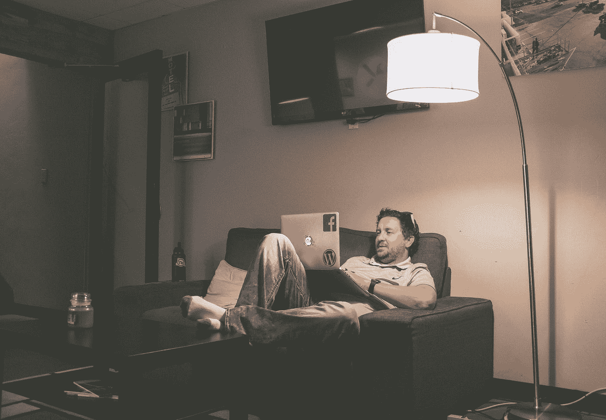

# 在家工作的丑陋真相

> 原文：<https://betterprogramming.pub/ugly-truths-about-working-from-home-e9907c7091ba>

## 经历

## 任何太好的东西都有隐性成本。确切地说，是反响。

在 [Unsplash](https://unsplash.com?utm_source=medium&utm_medium=referral) 上 [NeONBRAND](https://unsplash.com/@neonbrand?utm_source=medium&utm_medium=referral) 拍摄的照片

在家工作一直是许多人的梦想。对一些人来说，这仍然是一个非常理想的选择。给任何内向或懒惰的人一份远程工作，通常他们会用双手抓住它。

难怪，因为它有自己的一系列难以忽视的好处——节省运输成本和时间，有更多的时间照顾自己和家人，更高的生产率(至少最初是这样，以后会有更多的介绍)，自由，灵活性和对工作的控制——这个清单可以一直列下去。

有了这些额外津贴，在家工作的人数在本世纪初创下历史新高也就不足为奇了。如今，科技初创公司，尤其是那些处于初创阶段的公司，越来越喜欢远程员工——这不仅为他们节省了一些员工成本，也让双方实现了双赢。

虽然在家工作可能一开始看起来光彩夺目(对我来说是这样)，但随着时间的推移，你会意识到它被高估了。一开始让它成为一项有利可图的交易的额外津贴，将会在一段时间后困扰你。

坦率地说，在家工作很无聊。它创造了单调的生活。这让不在家工作的人很难理解你的处境。对于在办公室工作的同事来说，从家里回来看一些电视节目是一天最好的结束，而对于远程工作者来说，他们只想在一天的大部分时间呆在家里后出去走走。

在家工作有很多缺点。我将只谈论我作为一名远程工作者在旅途中经历的几个例子。

# 工作与生活的平衡被打破了

意识到这一点可能需要一些时间(也许几个月),但是当在家工作时，你的工作生活平衡肯定会在某个时候变得一团糟。你很容易忘记自己的工作时间，因为在家工作的自由会分散你的注意力，导致拖延。在家工作时获得的自由会让你比以前更懒，很快你就会开始沉迷于电视节目和电影，或者在工作时间做其他家务。固定办公时间是有原因的——让你在那段时间专注于手头的任务。

在家工作也会让你变得懒惰。它不需要像你在办公室里那样打扮。一段时间后，穿着睡衣就成了常态。即使保持活跃和锻炼也成为一个挑战，因为我们人类热爱 Netwon 的第一运动定律和惯性原理:除非受到外力的驱动，否则静止的物体保持静止。一个人在家呆在家里！

在家工作会让你更难评估自己的工作效率，因为在家会让你分心。在进行远程工作时，保持并坚持工作时间表非常重要，这样工作和生活的界限就不会重叠。

# 孤独和沮丧很容易到来

我们人类是群居动物，为了健康需要互动。当你整天呆在家里，没有办公室里不可避免的 F2F 互动、团队出游和社交活动时，这可能会导致孤独。即使是远程的同事，也会有隔阂，因为更多的时候，交流是关于工作相关的事情。因此，保持愉快的氛围和积极的文化是所有公司的首要任务也就不足为奇了。

对一些人来说，甚至建立一个网络也要比平时花更长的时间。为了不被孤立，需要额外的努力来保持与同龄人的联系。

交流有助于分享想法和了解社区的最新动态。在办公室和同事一起工作肯定能让你获得更多的洞察力，让你更好地了解你工作领域的最新趋势。

当你在家工作时，应对抑郁和低谷期会变得棘手。随着抑郁而来的是避免你曾经喜欢的社交互动和活动的需要。在这种情况下，由于你只能靠自己，孤独感会慢慢袭来。努力保持社会互动变得更加困难。当你在办公室工作时，情况就不一样了(我现在更喜欢在办公室工作，而不是远程工作)，因为你周围有同事在聊天和闲聊，这是日常工作中不可避免的一部分。

对一些人来说，在咖啡店、共同工作空间或去办公室工作有时有助于维持社交互动，并保持理智。

最后，对于那些渴望远程工作的人，我希望你考虑一下这些严酷的现实。虽然每个人都有自己处理事情的方式，没有两个远程员工会经历相同的旅程，但重要的是要认识到，全职在家工作并不像看起来那么容易，它有自己的一系列挑战，你必须应对这些挑战。另外，自律并不是每个人都喜欢的。

感谢您的阅读。我很想听听你对此的想法。