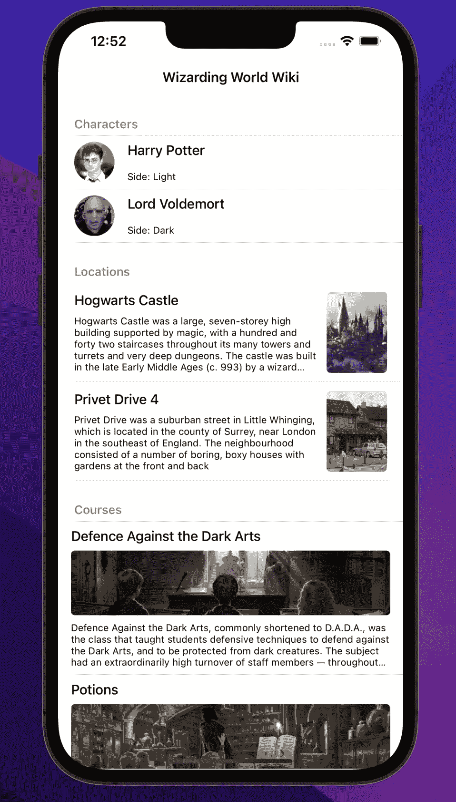

# 用嵌套类型生成 UITableView 节

> 原文：<https://betterprogramming.pub/uitableview-sections-with-nested-types-27eabb833ad9>

## 学习使用嵌套对象编写包含不同部分的动态 UITableview


来源:[未绘制](https://undraw.co/search)

在我的[上一篇文章](https://medium.com/@alessandromanilii/nested-object-in-swift-4cda290bfa18)中，我已经向您展示了 Swift 中的嵌套类型，并向您暗示了它们的威力。在今天的文章中，我将向您展示这种技术的一个实际例子，用多个部分编码一个`UITableView`。

我打算写一个假的哈利波特维基，向用户展示一些关于人物、地点和霍格沃茨班级的基本信息。因此，我们的列表将由三个部分组成，每个部分包含一个项目列表。

这将是最终结果:



一个非常简单的方法是创建三个对象，每个对象都有一个数组。

当实现`UITableViewDataSource`的核心函数时，你需要计算`IndexPath`的索引，编码如下:

这种方法有一个很大的缺点。如果您决定更改这些部分的顺序，会发生什么情况？

在这种情况下，您将被迫更改所有代码，从而几乎不可能创建一个动态表，比如一个可以由后端驱动的表。

更聪明的解决方案是使用枚举来描述所有可能的部分。更好的是，我们可以在案例中使用相关的值。但是枚举中的关联值是什么呢？Swift 官方文档称:

> …将其他类型的值与这些事例值一起存储有时会很有用。这个额外的信息被称为一个*关联值*，并且它会随着您每次在代码中使用那个 case 作为值而变化。
> 
> 您可以定义 Swift 枚举来存储任何给定类型的关联值，如果需要，对于枚举的每种情况，值类型可以不同。类似的枚举在其他编程语言中被称为*区分联合*、*标记联合*或*变体*。

基本上，你可以添加任何类型的对象到一个枚举案例中……这在`TableView`部分非常有用。让我们看看如何创建一个`Section`枚举:

如您所见，我已经创建了一个枚举，将我们的部分作为案例。

每个事例都有一个关联值，该值是该部分中对象的数组。

我还为部分本身的标题添加了一个计算变量。对于这种事情，我通常更喜欢添加一个计算过的 var，而不是添加一个原始值。只是更清楚了。

您可能已经注意到 enum 是类`ViewController`的嵌套类型。我这样编码是因为这些部分只属于这个类。我们不会在应用程序的其他控制器中使用它们——所以嵌套类型更好地代表了这种关系。

完美。

第二步是为我们的`UITableView`创建数据源。

为了实现这个东西，我们将使用一个`Section`数组！是的，枚举数组。

让我们创建一个能够做到这一点的函数:

请注意，`characters`、`locations`和`courses`是之前创建的数组。它们也可以从服务器获取…但是为了简单起见，我在代码中把它们删除了:

```
privare var characters = Character.exampleList
```

其中我们的`Character`是如下结构:

正如你在结构中看到的，出于同样的原因，我使用了嵌套类型。

好了，有了我们的区段数组，是时候实现`UITableViewDataSource`函数了，我们将看到，有了 enum，一切都将变得超级干净和超级清晰:

下面我们来逐一分析方法。

*   函数`numberOfSections`简单地返回数组的大小。如果我们添加或删除列表中的项目，这些部分将总是同步的。超级爽！
*   函数`numberOfRowsInSection`有一个用于枚举的开关，覆盖所有情况，并简单地返回相关数组的计数。正如您所看到的，即使在这里您修改了部分的数量或顺序，您也不需要做任何更改。
*   类似的方法在函数`cellForRowAt`中完成。开关盒覆盖所有盒并创建单元。请注意`cellIdentifier`…我们稍后回来。
*   最后一个方法，`titleForHeaderInSection`使用枚举的计算 var 创建部分的标题。

超级简单！

现在我们所有的部分都是动态的，我们可以简单地在函数`createDatasource`中改变它们，而不需要在其他地方修改代码！这真是太棒了！

之前我让你注意到了单元格标识符…你知道它是一个常量字符串，所以我们也可以使用嵌套类型，创建一个这样的结构:

有了这种结构，我们将把所有的常量字符串放在一个地方，维护整个代码将会容易得多。

上述技术允许我们为整个数据源建立动态逻辑。

例如，我们的用户应该被允许查看或不查看某个部分。也许后端可以排除这种情况。或者用户需要特殊权限。

通过对`createDatasource`函数的简单修改，我们可以创建这个逻辑。让我们重写我们的函数:

就这样搞定了！

现在我可以向您展示完整的控制器类代码:

我希望你喜欢这篇文章。编码愉快，感谢阅读。