# 使用开发人员和中型社交网络理解迭代器设计模式

> 原文：<https://betterprogramming.pub/understanding-design-patterns-iterator-using-dev-to-and-medium-social-networks-fa2e096f3c00>

## 深入研究并迭代

照片由[诺德伍德主题](https://unsplash.com/@nordwood?utm_source=unsplash&utm_medium=referral&utm_content=creditCopyText)在 [Unsplash](https://unsplash.com/s/photos/social-networks?utm_source=unsplash&utm_medium=referral&utm_content=creditCopyText) 上拍摄

原著中描述的经典设计模式有 23 种，`Design Patterns: Elements of Reusable Object-Oriented Software`。这些模式为软件开发中经常重复出现的特定问题提供解决方案。

在这篇文章中，我将描述什么是**迭代器模式**以及如何和何时应用它。

# 迭代器模式:基本思想

> *在面向对象编程中，* ***迭代器模式*** *是一种使用迭代器遍历容器并访问容器元素的设计模式。迭代器模式将算法从容器中分离出来；在某些情况下，算法必然是特定于容器的，因此无法解耦。* —维基百科
> 
> *提供一种方法来顺序访问一个集合对象的元素
> 而不暴露其底层表示。—设计模式:可重用面向对象软件的要素*

这种模式的主要特点是，它允许您遍历集合的元素，而不暴露其底层表示(数组、映射、树等)。).因此，这是该模式解决的两个问题:

1.  它允许我们在不改变算法实现的情况下改变集合的内部实现。
2.  它允许我们添加适用于所有现有集合类型的新算法。

总而言之，迭代器模式对客户端隐藏了集合的内部实现。这个模式的 UML 图如下所示:

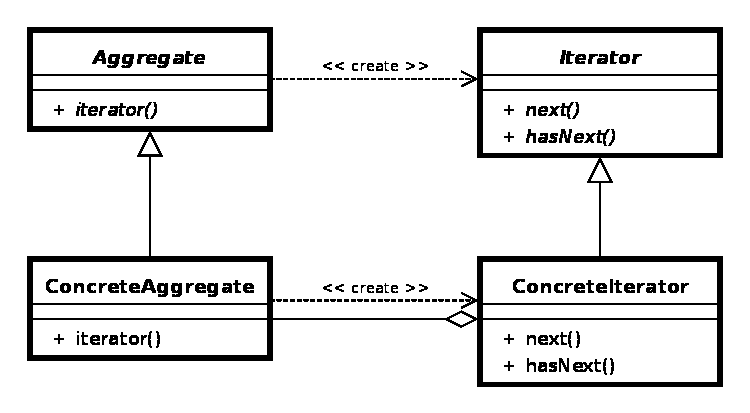

`Iterator`类是一个接口，它定义了导航到集合的不同操作(`next`或`hasNext`)，而`Aggregate`类将创建`Iterator`。最后，系统将使用`ConcreteAggregate`和`ConcreteIterator`。

1.  您的集合有一个复杂的数据结构，但是您想对客户隐藏它的复杂性。
2.  您需要减少应用程序中遍历代码的重复。
3.  您希望您的代码能够遍历不同的数据结构。

迭代器模式有几个优点，总结如下:

*   由于迭代器使用了**单一责任**和**打开/关闭**的可靠原则，代码**更容易使用、理解和测试**。
*   单一责任原则允许我们清理客户端和遍历算法的集合。
*   **开/闭原则**允许实现新类型的集合和迭代器，而不会破坏任何东西。
*   **在同一个集合上并行迭代**，因为每个迭代器对象都包含自己的迭代状态。
*   **干净的代码**因为客户端/上下文不使用复杂的接口，系统更加**灵活和可重用**。

# 第一个例子:单词集合

我现在将向您展示如何使用 JavaScript/TypeScript 实现这种模式。在我们的例子中，我编了一个问题，其中有一个名为`WordsCollection`的类，它定义了一个单词的列表(`items`)和它的一组 get 和 add 方法(`getItems`和`addItem`)。这个类由使用控制结构的`client`使用，例如`for`或`forEach`。下面的 UML 图显示了我刚刚描述的场景。

相关的`WordsCollection`代码如下:

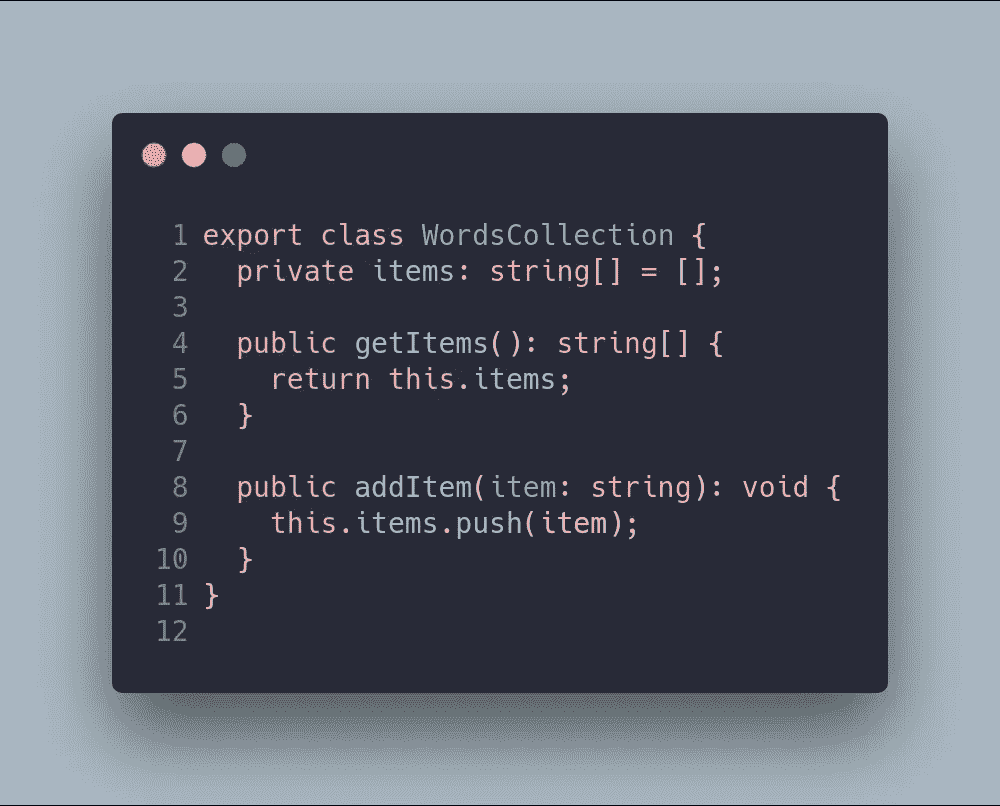

`client`代码关联是这样的:

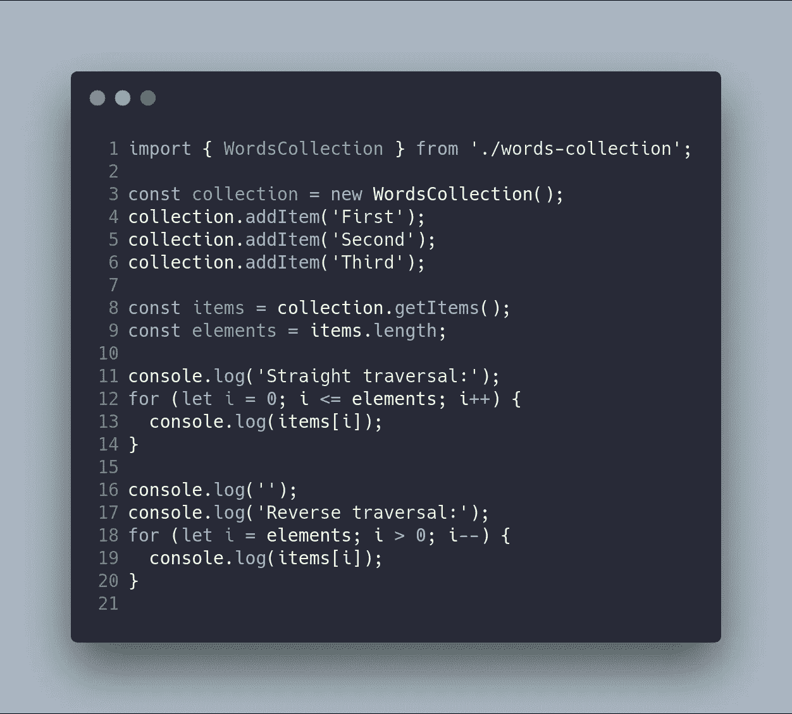

这种解决方案的主要问题是代码是耦合的。这意味着客户端需要知道集合的内部结构是如何实现两个被遍历的方法的(`Straight`和`Reverse`)。假设您需要将数据结构从`Array`更改为`Map`——与客户端相关的代码由于耦合而中断。迭代器模式的另一个有趣的用例是当您需要一种新的方法来迭代集合时，例如，`AlphabeticalOrdered`。

解决方案是使用迭代器模式，新的 UML 图使用下面的模式:

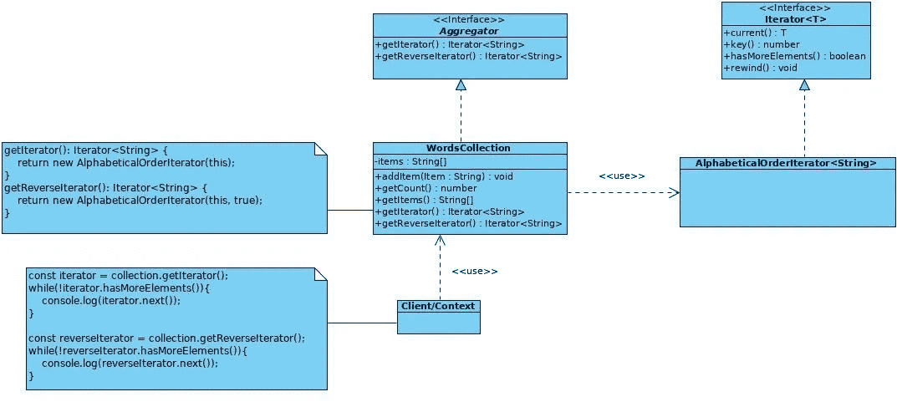

因此，该解决方案由一个接口类(`Iterator`)组成，该接口类定义了遍历集合的方法:

1.  `current()` : T。
2.  `key()`:编号。
3.  `hasMoreElements()`:布尔型。
4.  `rewind`:作废。

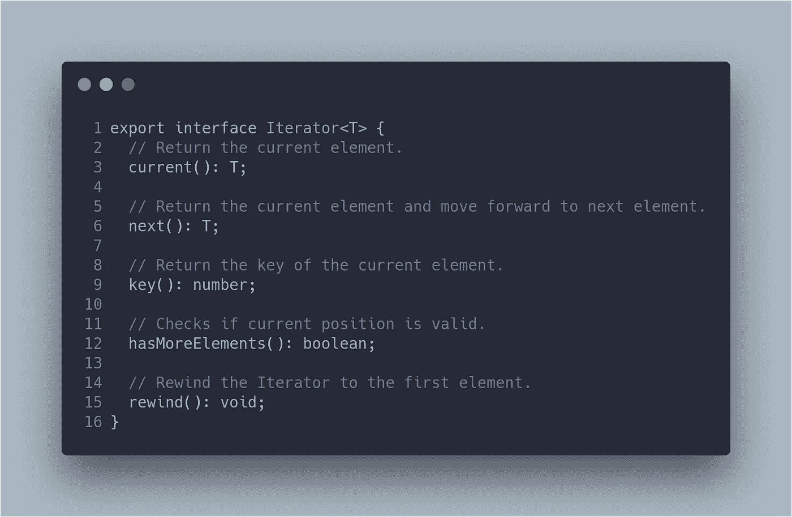

类`AlphabeticalOrderIterator`是迭代器，负责实现以正确的方式遍历集合的方法。迭代器需要使用聚合的(`WordsCollection`)集合和迭代的方式(反向或正向)。所以，与`AlphabeticalOrderIterator`相关的代码是这样的:

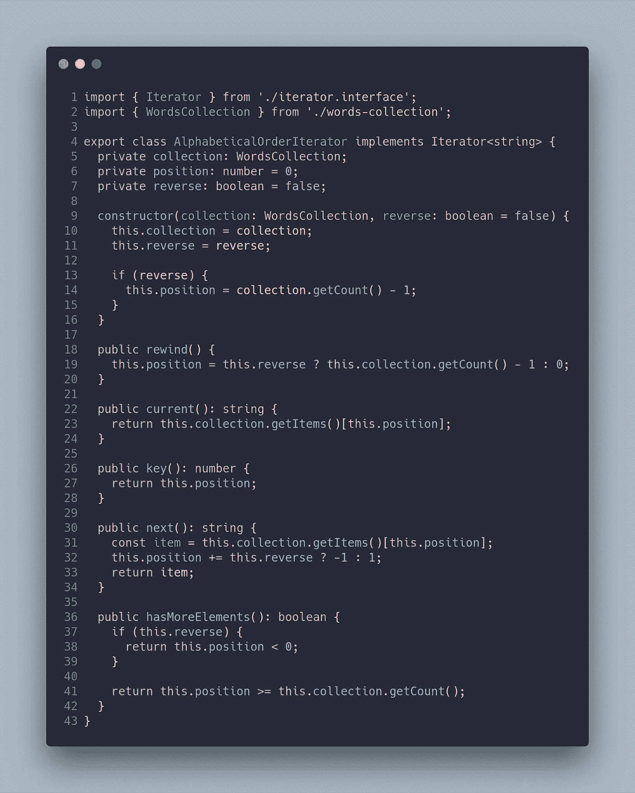

下一步包括定义`Aggregator`接口和修改集合来实现这个接口。所以，与`Aggregator`相关的代码是这样的:

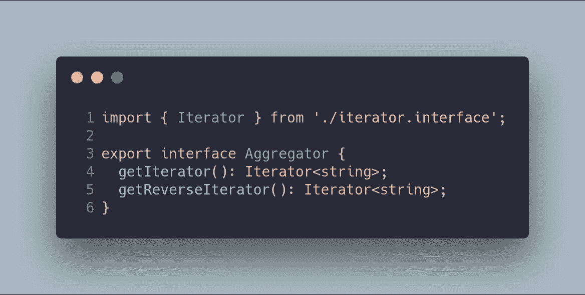

注意，`Aggregator`接口定义了创建新迭代器的方法。在这个问题中，我们需要两个迭代器:正向迭代器和反向迭代器。因此，`WordsCollection`被修改为包含这些方法，正如您在下面的代码中看到的:

最后，我们可以在客户端代码中使用迭代器，现在已经解耦了，如下面的代码所示:

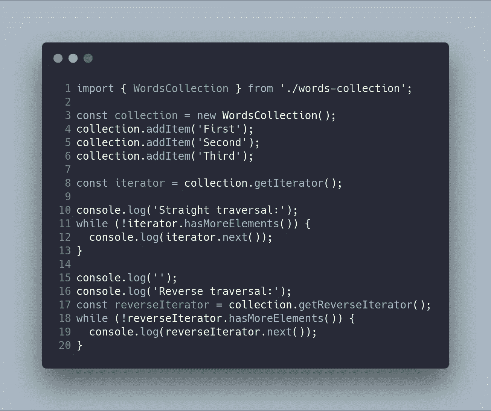

客户端从`WordsCollection class` ( *单一责任*)的内部结构中分离出来，你可以扩展软件实现新的迭代器(*打开/关闭*)。

在应用迭代器模式后，我创建了几个 NPM 脚本来运行这里显示的代码示例。

`npm run example1-problem`
`npm run example1-iterator-solution-1`

# 示例:中型和开发型

假设我们必须开发一个软件，允许我们向社交网络中的联系人发送电子邮件，并考虑到我们将区分发送的邮件类型。在我们的人际网络中，我们有两类联系人:朋友和同事。要发送的电子邮件会更正式，这取决于电子邮件要发送到的联系人的类型。

首先，我们有来自两个著名社交网络的联系人:Dev.to 和 Medium(我们不必澄清哪个是我的最爱，你们都知道！).每个社交网络的数据结构的实现是不同的——在 Dev.to 中使用数组来维护联系人，而在 Medium 中使用地图。

迭代器模式允许我们将代码与我们的联系人和社交网络完全解耦，因此我们可以将自己从每个社交网络的内部实现中抽象出来。我们甚至有能力添加新的社交网络(尽管…对于我们这些极客来说，其他社交网络甚至还存在吗？！)

你可以在下面的 gif 中找到使用我们整个结构的客户端(我已经做了一个小的 CLI 例子)。

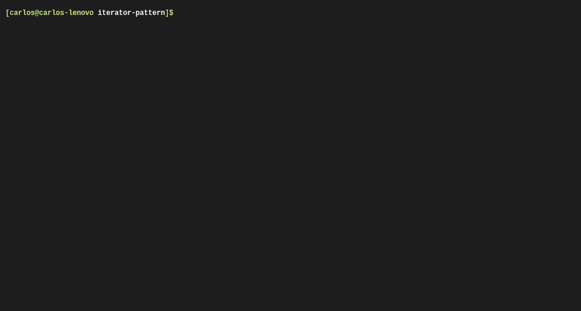

在下面的 UML 图中，您可以看到针对此问题提出的解决方案:

好的，这个问题中的模型不是一个字符串，而是一个用户的配置文件，正如您在下面的代码中看到的:

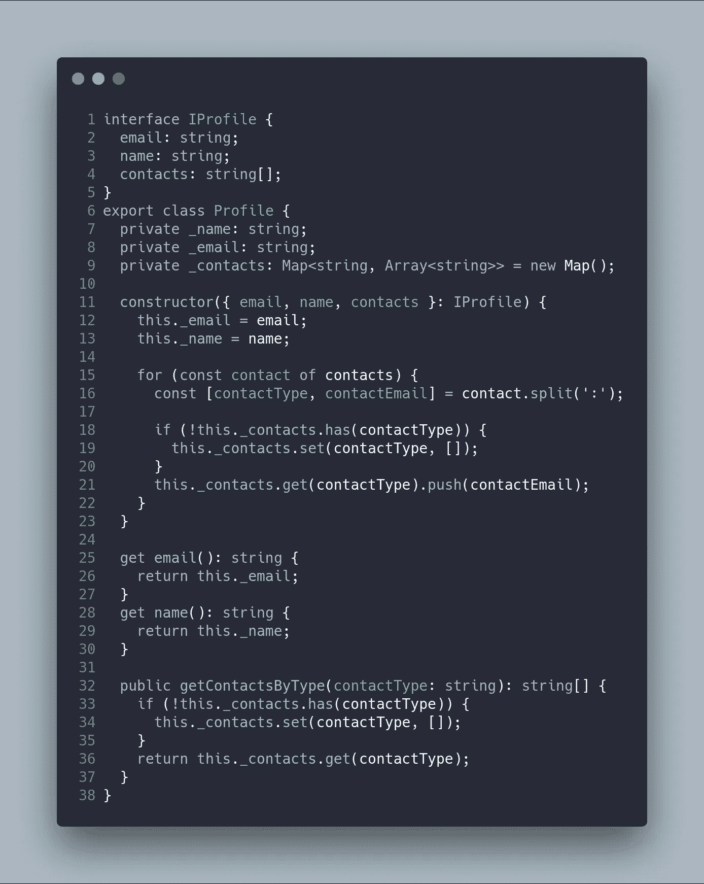

在`Profile`类中，我们有一个`getContactsByType`方法，它返回朋友或同事的联系人。

下一步是定义迭代器接口(`ProfileIterator`)和聚合器接口(`SocialNetwork`)，后者定义了每个迭代器和聚合器必须实现的方法。

因此，与这些接口相关的代码如下:

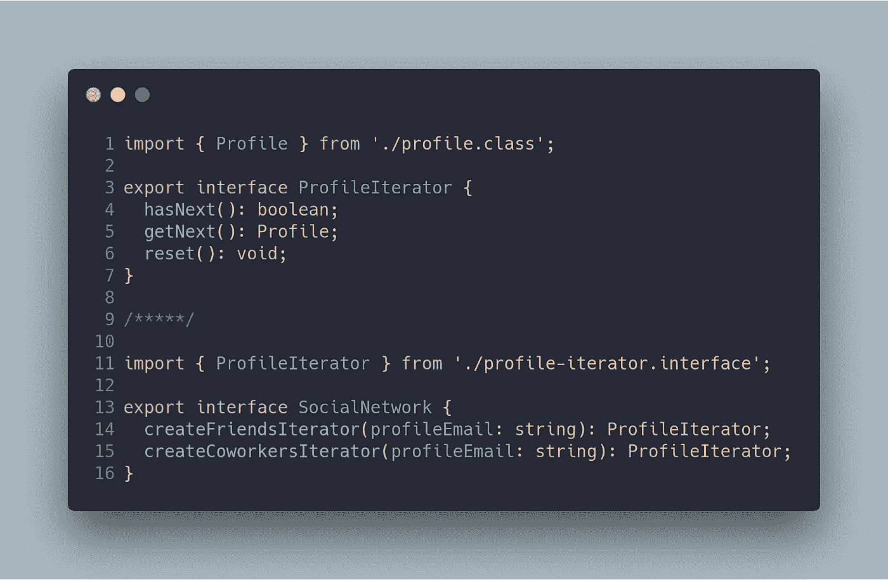

现在，我们需要实现前面接口的具体实现来解决我们的问题。我们将解析的第一个社交网络是 Dev.to。聚合器和迭代器的实现如下所示。

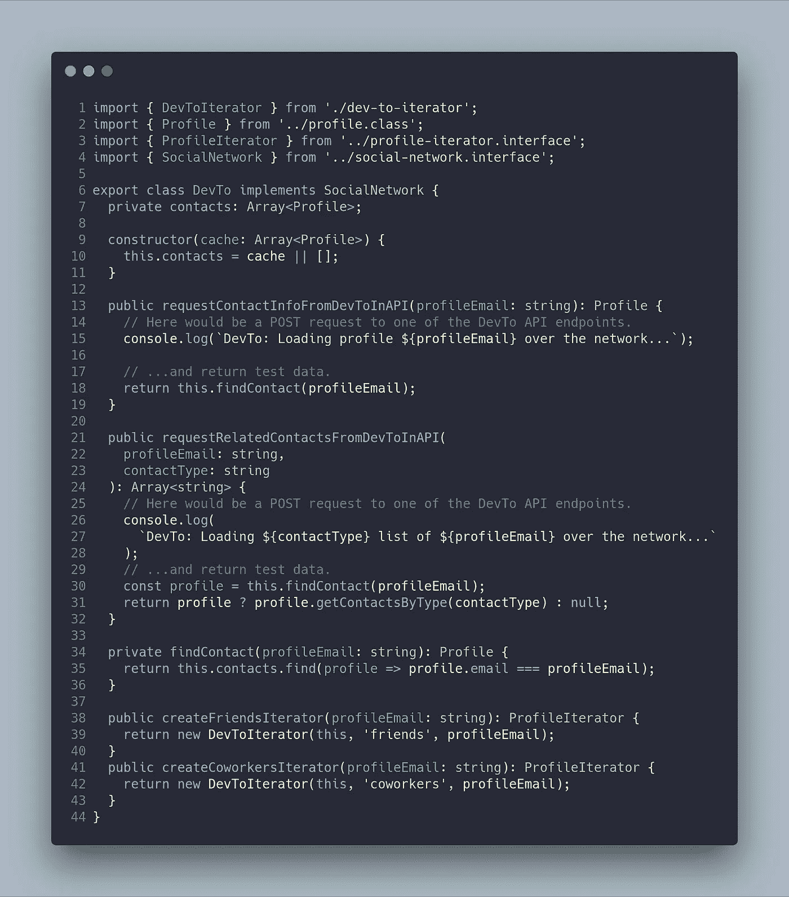

注意，存储联系人的集合是一个数组，并且实现了`createFriendsIterator`和`createCoworkersIterator`。它有几个方法来模拟到远程 API 的连接以获取联系人。

下面是与`DevToIterator`类相关的代码:

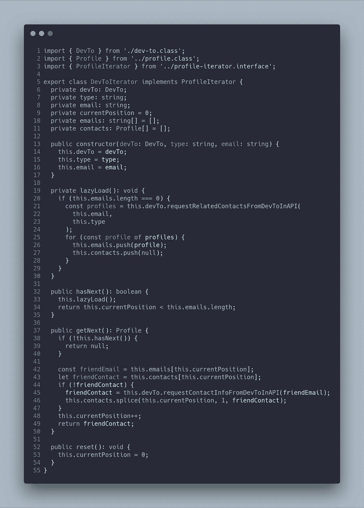

前面代码中最重要的部分是接口实现。具体实现基于集合(数组)的内部数据结构。您可能会注意到，我开发了一个请求联系人的惰性方法(仔细考虑一下——从一个朋友请求所有朋友可能会导致无限循环)。

此时，我们应该创建只使用接口的`SocialSpammer`类。正如您在这里看到的,`SocialSpammer`类与任何具体的类都是解耦的:

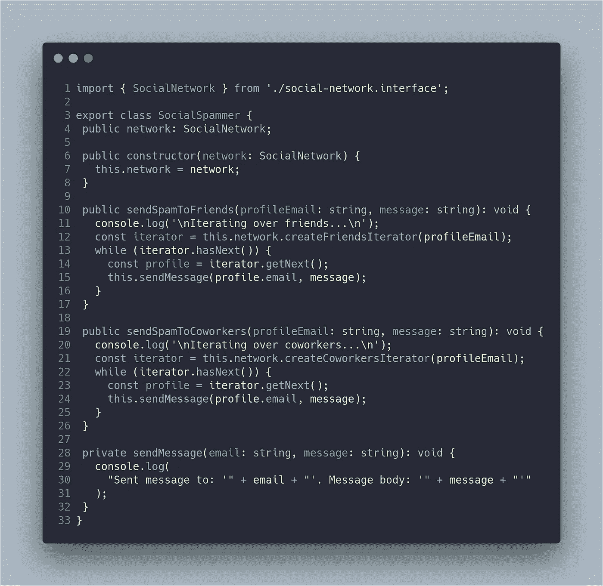

前面的代码根据电子邮件是发给朋友还是同事来使用迭代器。

现在，我们可以在下面的客户端中使用代码:

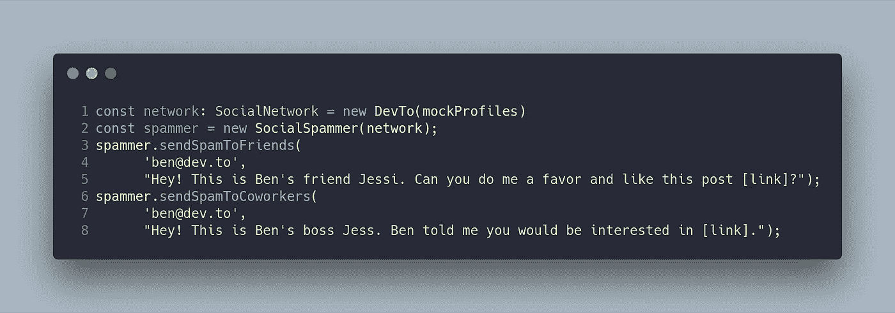

现在是时候检查我们是否可以通过创建一个新的社交网络及其迭代器来利用开放/封闭原则，而不破坏我们的应用程序。

这是与`medium`类相关的代码:

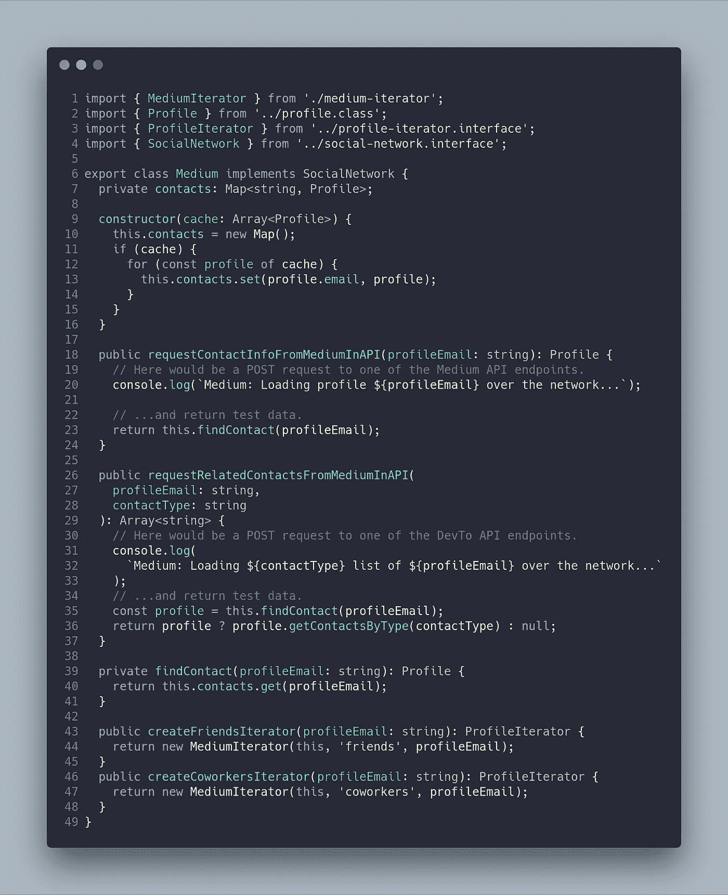

我们可以使用继承来简化 Dev.to 和 Medium 之间的代码，但为了不扩展这篇文章，我们更喜欢重复代码。您可以看到，Medium 类使用不同的数据结构来存储联系人。

最后，这是`medium-iterator`:

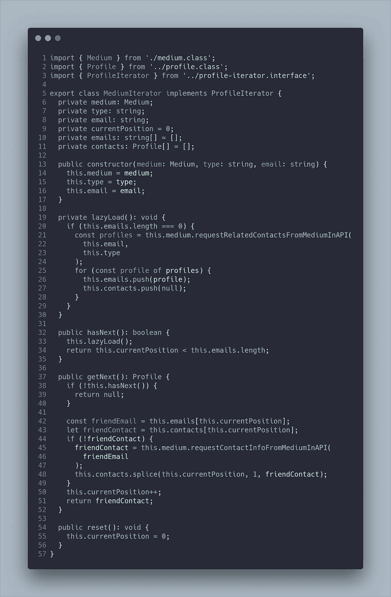

在应用迭代器模式和 CLI 接口后，我创建了一个 NPM 脚本来运行这里显示的示例。

`npm run example2-iterator-solution1`

# 结论

迭代器模式可以帮助您避免项目中的耦合代码。当集合中有多种算法和数据结构时，迭代器模式非常适合。这意味着你的代码会更干净，因为你应用了两个著名的原则，比如**单一责任**和**打开/关闭**。

最重要的事情不是实现我向你展示的模式，而是能够认识到这个特定模式可以解决的问题，以及你何时可以或不可以实现这个模式。这一点至关重要，因为实现会因您使用的编程语言而异。

*原载于 2019 年 6 月 12 日*[*https://www . carloscaballero . io*](http://www.carloscaballero.io/design-patterns-iterator/)*。*