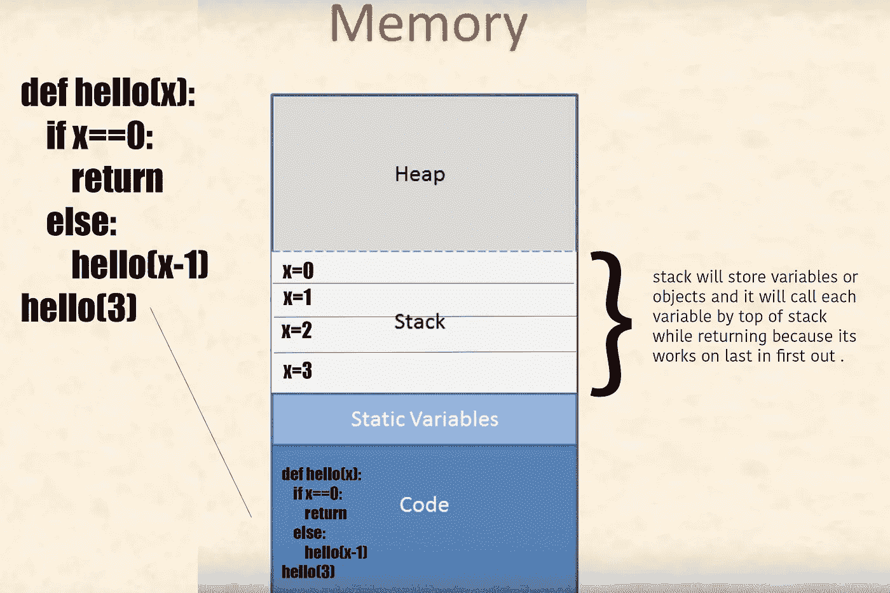

# 理解递归，递归

> 原文：<https://betterprogramming.pub/understanding-recursion-recursively-181f5f4dc528>

## 一种解决问题的方法，其解决方案依赖于问题的一个简单实例

由 [Unsplash](https://unsplash.com/search/photos/fractal?utm_source=unsplash&utm_medium=referral&utm_content=creditCopyText) 上的 [Taras Chernus](https://unsplash.com/photos/uQMyw1VFKqI?utm_source=unsplash&utm_medium=referral&utm_content=creditCopyText) 拍摄的照片

> 要理解递归，首先必须理解递归。
> 
> ——斯蒂芬·霍金

我在我的第一门计算机科学课程中学习了递归，然后很少使用它。我们被明确告知何时何地使用递归——在这些领域之外，我们班很少有人使用递归。回过头来看，这是可以理解的——递归是计算机科学中的一个主题，对许多人来说，它不是自然产生的。在大多数计算机科学项目中，学生在接触递归主题之前就已经学会了迭代思考。因此，大多数人在前进的过程中都会坚持迭代。

递归是一种解决问题的方法，其解决方案依赖于问题的一个简单实例。与试图建立解决方案的迭代相反，递归旨在将问题分解成最基本的形式。引入主题最常见的问题是阶乘。最起码，每个递归算法都需要两样东西:

1.  一个基础案例，它是问题的最简单形式的解决方案。基本情况的功能是作为一种摆脱递归调用的方式。
2.  递归调用，这是方法调用自身的点。

以上是 ruby 中阶乘问题的示例解决方案。阶乘问题最简单的例子是 0。0 的阶乘是 1，不需要进一步分解问题就可以解决。因此，我们首先检查给定的数字是否等于 0。如果是，我们简单地返回 1。在所有其他情况下，我们返回的数字乘以前一个数字的阶乘。事实上，大问题的解决方案是小问题解决方案的超集，这是这里的关键。它允许我们进行递归调用。不管起始数字是多少，我们知道如果我们继续分解问题，我们最终会得到一个小问题。

递归的一个必须强调的方面是它从来都不是必需的。递归只是解决问题的另一种方式。任何可以递归解决的问题也可以迭代解决。对于大多数程序员来说，递归思维通常比迭代思维更困难，除非你经常使用完全依赖递归的语言编程，否则你很可能会迭代地解决大部分问题。所有这些都回避了一个问题，为什么你要费心递归地思考。

幸运的是，在 Ruby 中，我们有 inject/reduce 方法。这两种方法互为别名，两者之间没有性能差异。这个方便的小方法意味着我们可以相对容易地解决这个问题。事实上，我们仍然使用相同的三元运算符将我们的解保留在一行中。首先我们检查数字是否为 0，如果为真，我们返回 1。在所有其他情况下，我们从 1 号开始并保存一个滚动产品，在最后返回它。

然而，在这方面，并不是所有的语言都像 Ruby 一样慷慨。如果您正在使用的编程语言没有 reduce/inject 等价函数，或者您从来不知道它，那么您的解决方案将类似于下图。您仍然使用相同的算法—检查数字是否等于 0，如果为真，则返回 1，否则保持滚动乘积，直到达到该数字。但是，看看为了实现相同的解决方案，还需要编写多少行代码:

一些解决方案在递归执行时看起来更简洁。更少的代码通常也意味着更易维护的代码。这意味着更少的逻辑错误区域和更好的可读性。例如，这段代码非常容易出错。如果你在`while`条件下或者在总数乘以计数器时忘记了等号，你将会得到一个错误的答案。每一个逻辑和语法都是另一个潜在的错误点，迭代解决方案比上面的递归解决方案有更多的错误。

现在我们已经看到了一个问题的递归解决方案的例子，让我们来理解为什么它会起作用。

谈到递归时，最常见的问题之一是，“它是如何工作的？”。初级程序员的困惑点包括不理解如何跟踪他们在递归调用中的位置，以及如何从基本情况返回到他们的问题实例。

(不那么)简单的答案是调用堆栈。顾名思义，调用堆栈是一种堆栈类型的数据结构，它遵循先进先出(或者后进先出，如果您愿意的话)的方法来存储数据。这个特殊的堆栈存储计算机程序的各种子程序的信息。我们一直与调用堆栈进行交互，尽管在大多数情况下，这个过程是自动的，并且通常是隐藏的。放心，任何时候你编程，你给的指令被发送到调用栈。

调用堆栈的可视化表示。

当我们第一次调用 factorial(5)时，三元组的计算结果是 5 * factorial(4)。被扔进调用堆栈。Following suit factorial(4)现在的计算结果是 4 * factorial(3 ),这也将被抛出到调用堆栈中，位于之前的计算结果之上。然后是 3 *阶乘(2)等等。这个过程一直持续到我们遇到调用 factorial(0)的基本情况，这里我们简单地返回 1。从这里，我们开始从调用堆栈中弹出。从调用堆栈中弹出 factorial(0)后，我们弹出 factorial(1)，其计算结果为 1 * factorial(0)。但这次我们将 factorial(0)计算为 1，因此我们得到 1 * 1，它被计算为 1，因此我们在调用堆栈 factorial(2)中弹出下一个实例，它被计算为 2 * factorial(1)。到现在为止，你可能已经注意到我们也有阶乘(1)的解，并且，事实上，我们可以回到我们最初的问题。

假设说，如果我们永远不中断递归调用会怎么样？事实上，我们可以做到这一点，只要简单地从我们的递归方法中删除我们的基本情况，或者绕过它。那么，在阶乘的情况下，如果我们，比如说，插入-1，会发生什么？在这种情况下，我们的阶乘(-1)将计算为-1 *阶乘(-2)，这又将计算为-2 *阶乘(-3)。所有这些指令都会被扔进堆栈，但是在这种情况下，我们的堆栈不会停止增长。这就是我们所说的堆栈溢出错误。我们不断地将指令压入堆栈，但从不弹出它们。最终，就像一堆文件，它变得太大，翻倒，程序崩溃。

我们现在可以更好地理解斯蒂芬·霍金在这个问题上的名言:“要理解递归，首先必须理解递归。”这似乎是一个奇怪的陈述——它天生就是递归的！如果我理解递归的唯一方法是理解递归，那么我如何理解递归呢？

答案很简单…理解递归。这个循环会一直持续下去，直到你理解了递归。你对递归的理解是这个递归调用的基础。在此之前，您将永远陷入堆栈溢出错误！