# 理解 React 钩子的闭包陷阱

> 原文：<https://betterprogramming.pub/understanding-the-closure-trap-of-react-hooks-6c560c408cde>

## 挖掘经典问题


现在当我们开发 React 项目时，我们一般使用钩子。

但是在开发过程中，我们经常会遇到一些问题。最经典的问题是 React 钩子的闭包陷阱。

有些朋友可能遇到过类似的问题，但可能并没有从 React 的底层原理去理解这个问题。在这里我们一起来讨论这个话题。

# 问题是

这是一个简单的 React 应用程序:

我们使用`useState`创建一个`count`状态，并在第一个`useEffect`中不断增加`count`的值，然后同时在另一个`useEffect`中打印出`count`的最新值。

你认为控制台输出会是怎样的？

结果如下:

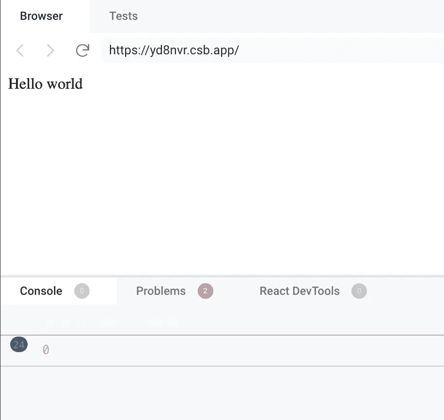

这是一个嵌入式演示:

控制台一直输入`0, 0, 0 …`而不是我们期望的`0, 1, 2, 3, …`。

这是封闭陷阱。

# 分析

## React 运行时中的组件是什么？

*   **一个组件实际上是一个纤维节点。**
*   而且每个纤程节点都有一个属性叫做`memorizedState`，它是一个链表。
*   组件的每个钩子对应于`memorizedState`链表的一个节点，它们从相应的节点访问自己的值。

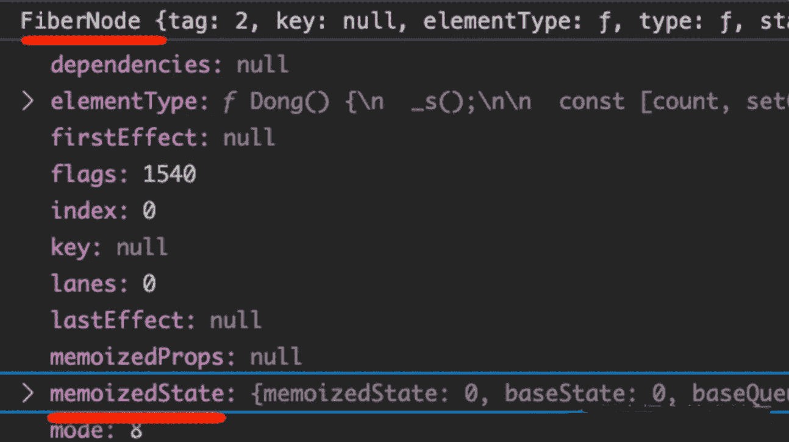

例如，上面的例子中有三个钩子，每个钩子对应于`memorizedState`链表中的一个节点:


然后每个钩子访问它自己的`memorizedState`来完成它自己的逻辑。

## 钩子的实现

钩子有两个阶段:挂载和更新。

挂载函数在第一次创建钩子时执行，而更新函数在此后每次钩子更新时执行。


下面是`useEffect`的实现:

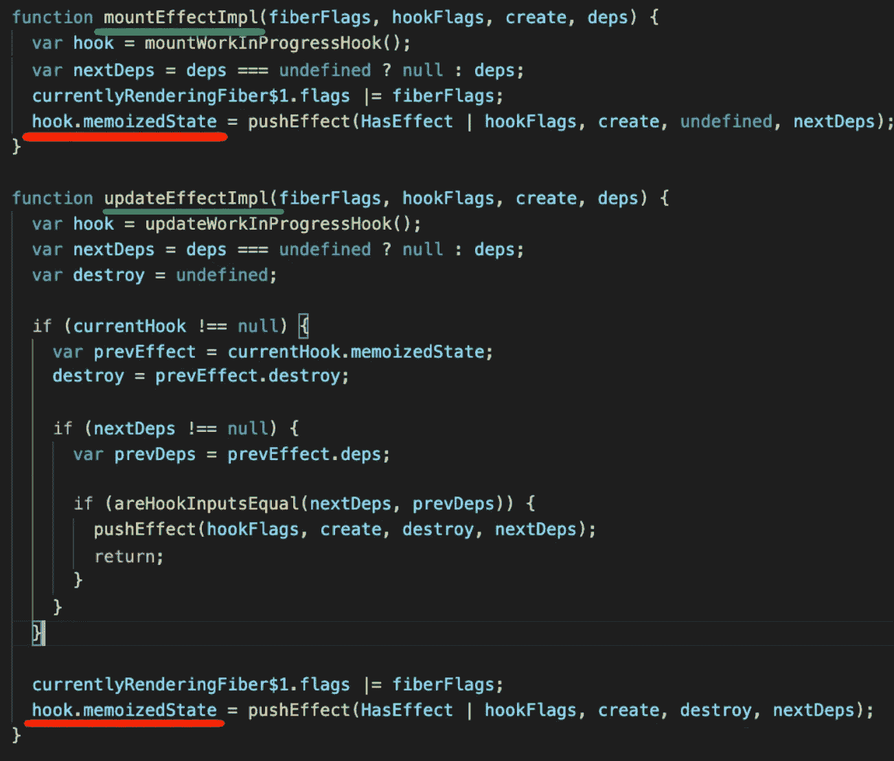

## **钩子如何处理 dep？**

这里我们要注意对`deps`参数的处理:如果`deps`未定义，那么`deps`被视为空。

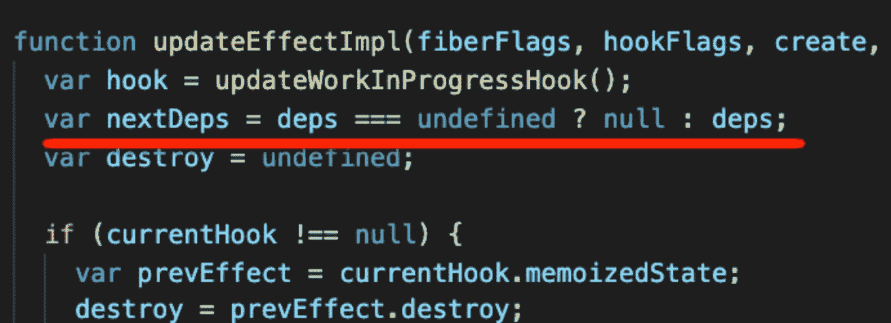

然后它将新传递的`deps`与之前存在于`memorizedState`中的`deps`进行比较:如果两者相等，则直接使用之前给定的函数，否则创建一个新的函数。

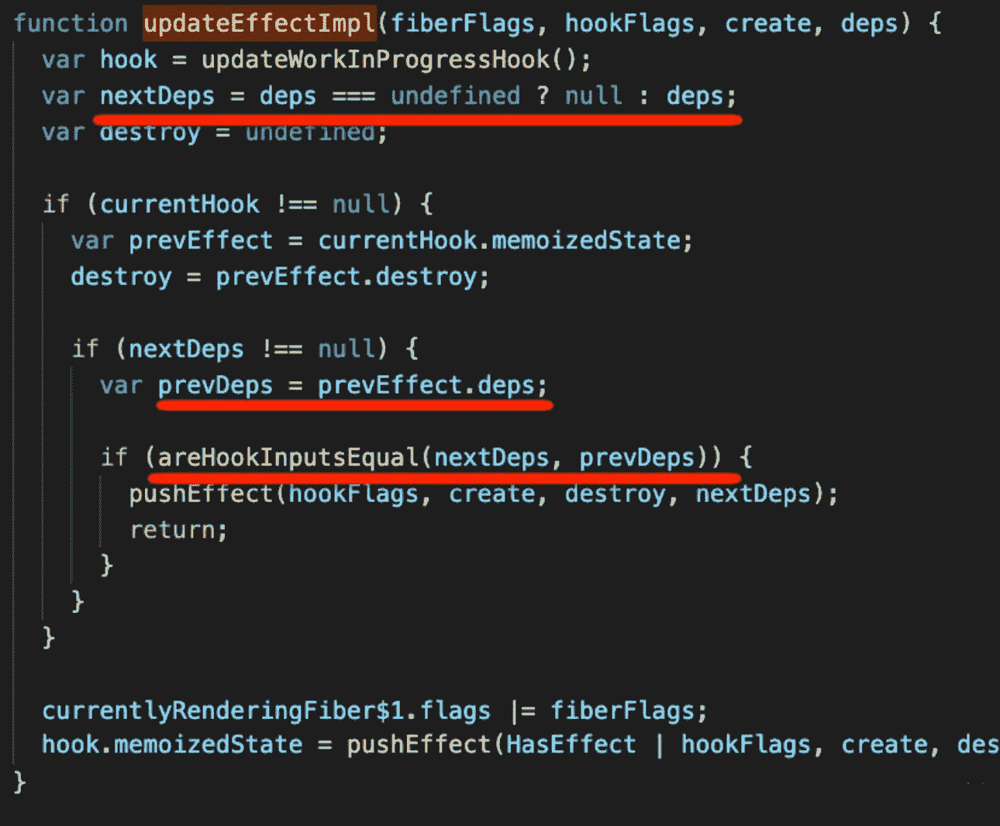

比较两个`deps`是否相等的逻辑很简单:如果前面的`deps`是`null`，那么直接返回`false`，即不相等；否则，将依次遍历和比较数组。


所以我们可以得到三个结论:

*   如果`useEffect`的`deps`参数未定义或为空，回调函数将在每次重新渲染时重新创建并执行。
*   如果是空数组，效果只会执行一次。
*   否则，它会比较`deps`数组中的每个元素是否都发生了变化来决定是否执行该效果。

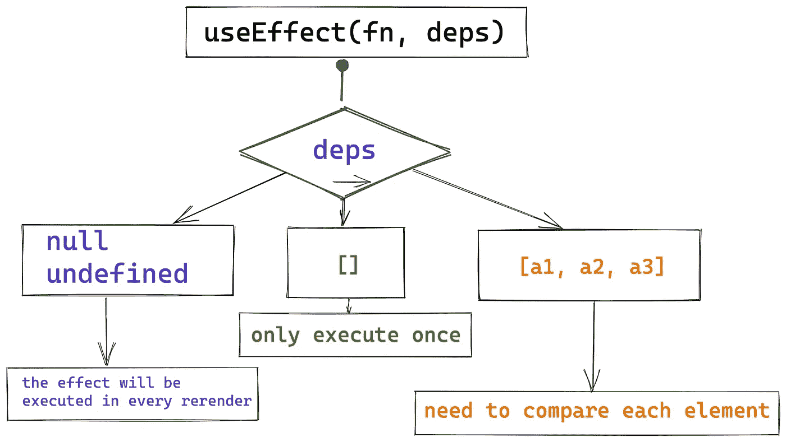

在阅读本文之前，你可能已经知道了这些结论，但这里我们是从源代码的角度来理解的。

像`useMemo`和`useCallback`这样的挂钩也以同样的方式操作`deps`:

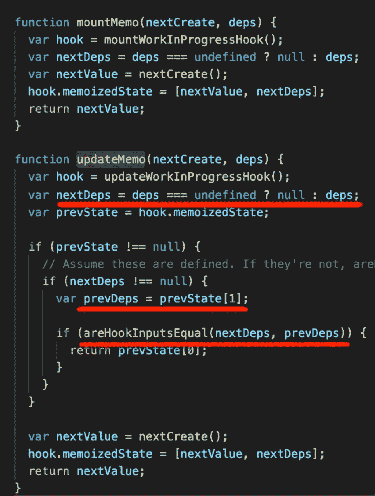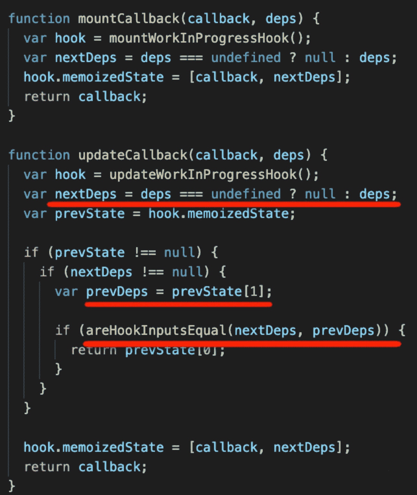

从前面的讨论中，我们知道两件事:

*   像`useEffect`这样的钩子访问`memriorizedState`中的数据。
*   钩子通过比较`deps`是否相等来决定是否执行回调函数。

## 封闭陷阱

现在回到我们的结束问题。我们这样写代码:

```
useEffect(() => {
    const timer = setInterval(() => {
        setCount(count + 1);
    }, 500);
}, []);useEffect(() => {
    const timer = setInterval(() => {
        console.log(count);
    }, 500);
}, []);
```

`deps`是空数组，所以这个效果只会执行一次。

相应的源代码实现如下:

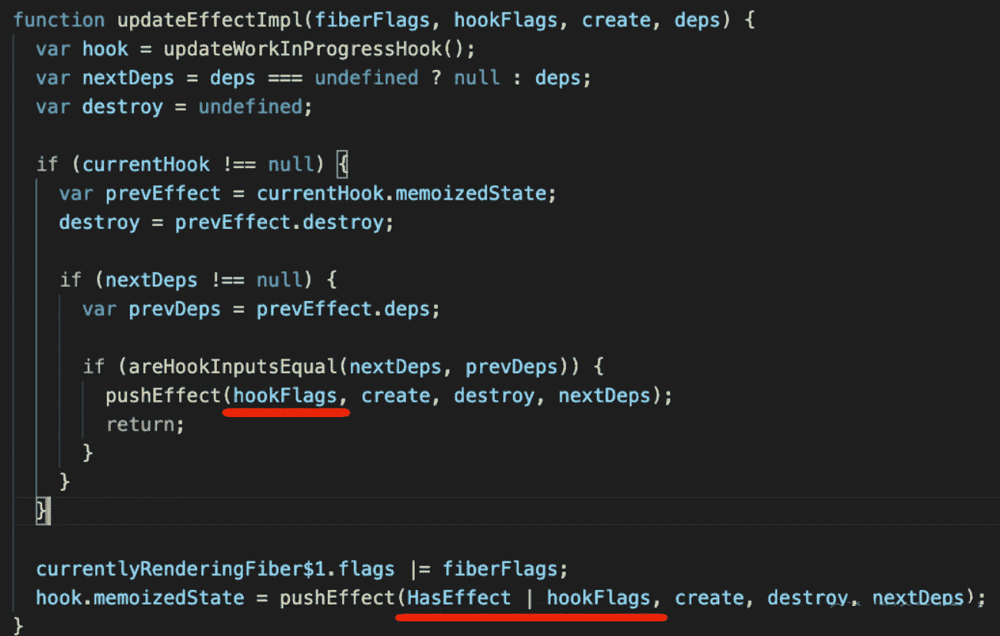

需要执行的效果会用`HasEffect`标记，稍后再执行:

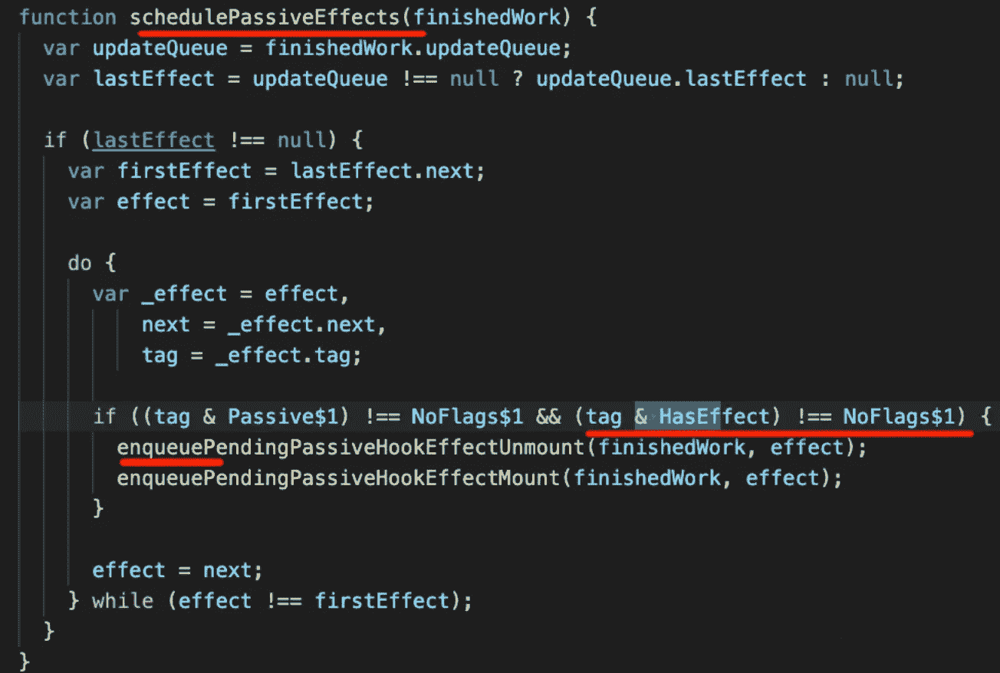

由于这里的`deps`是空数组，所以没有`HasEffect`标志。该效果将不再执行。

**所以我们的定时器** `**setInterval**` **只会设置一次。**因此，其回调函数引用的状态始终是初始状态，无法获得最新状态。

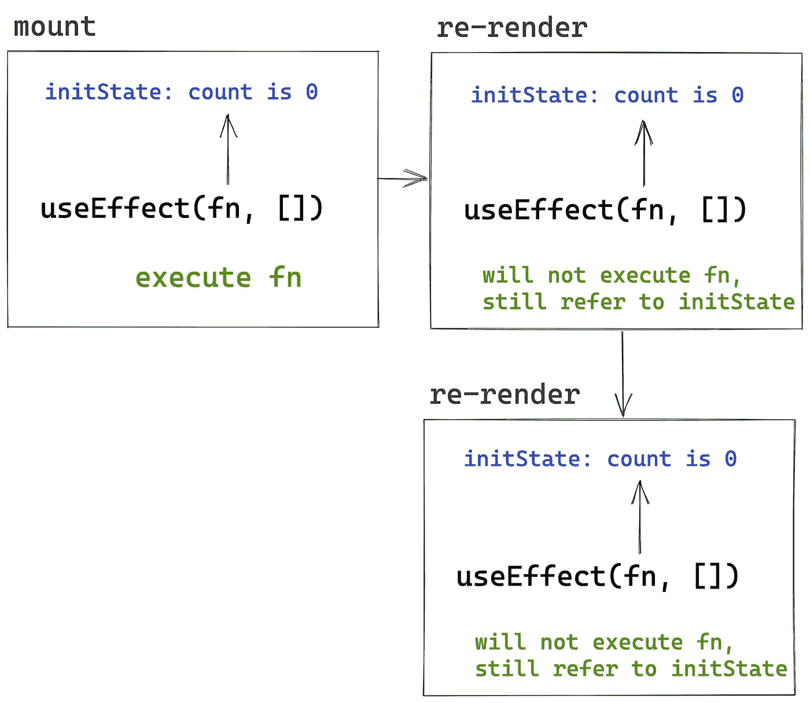

如果我们想获得最新的状态，那么我们需要让`fn`在每次刷新时执行一次。也就是说，我们要把`count`放在依赖数组里。

```
useEffect(() => {
        setInterval(() => {
            setCount(count + 1);
        }, 1500);
    }, [count]);useEffect(() => {
        setInterval(() => {
            console.log(count);
        }, 1500);
    }, [count]);
```

结果如下:

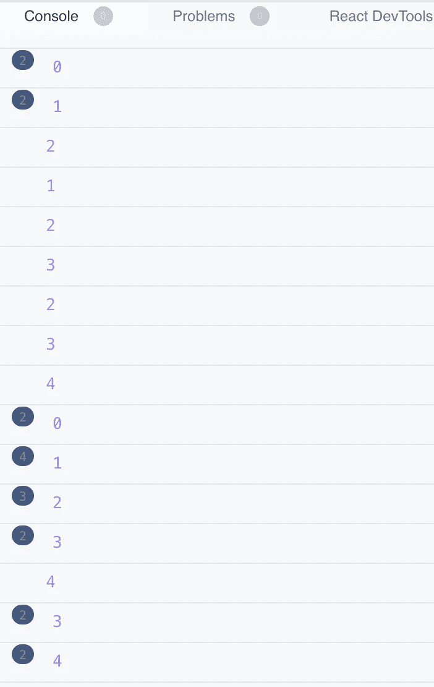

看起来`fn`得到的是最新状态，但是为什么控制台结果这么乱？

这是因为每个效果都会产生一个时间间隔。所以我们需要在效果中清除之前的时间间隔。

代码:

```
useEffect(() => {
    let timer = setInterval(() => {
      setCount(count + 1);
    }, 1500);
    return () => clearInterval(timer);
  }, [count]);useEffect(() => {
    let timer = setInterval(() => {
      console.log(count);
    }, 1500);
    return () => clearInterval(timer);
  }, [count]);
```

在线演示:

就这样，我们终于解决了这个封闭陷阱。

# 结论

名为`memorizedState`的链表存储在纤程节点中。链表的节点与钩子一一对应，每个钩子访问其对应节点上的数据。

像`useEffect`、`useMomo`、`useCallback`这样的钩子都有一个`deps`参数。每次重新渲染时都会比较新旧`deps`，如果`deps`发生变化，将重新执行回调函数。

所以每个渲染器都会执行参数为`undefined`和`null`的钩子，参数为`[]`的钩子只会执行一次，参数为`[state]`的钩子只有在状态改变时才会再次执行。

闭包陷阱的原因是在`useEffect`等钩子中使用了某个状态，但没有添加到`deps`数组中，这样即使状态发生变化，回调函数也不会重新执行，仍然引用旧的状态。

闭包陷阱也很容易修复，我们只需要正确设置`deps`数组。这样，每次状态改变时，回调函数都会被重新执行，引用新的状态。但是，我们也需要注意清理之前的计时器、事件侦听器等。

*   [用图表解释 10 个 JavaScript 闭包挑战](/10-javascript-closure-challenges-explained-with-diagrams-c964110805e7)
*   [面向高级 React 开发人员的 React 挂钩挑战](/a-react-hooks-challenge-for-senior-react-developers-f1190e1939ec)


[字节鱼](https://bytefish.medium.com/?source=post_page-----6c560c408cde--------------------------------)

## 反应文章

[View list](https://bytefish.medium.com/list/react-articles-f03ed95b6f26?source=post_page-----6c560c408cde--------------------------------)11 stories