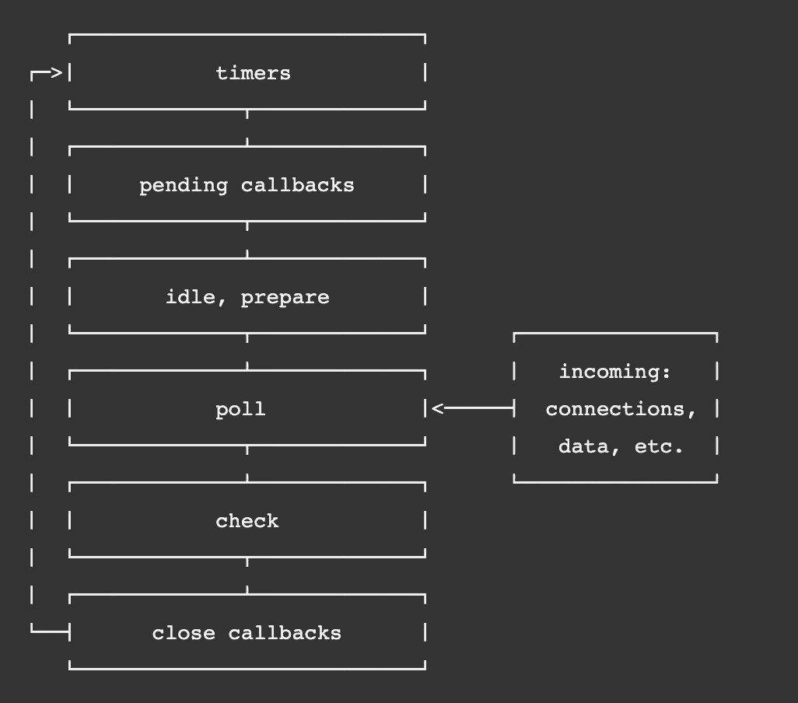
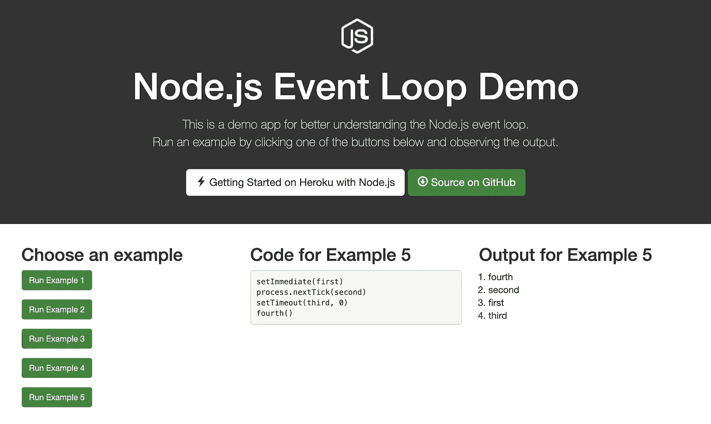

# 了解 Node.js 事件循环

> 原文：<https://betterprogramming.pub/understanding-the-node-js-event-loop-a4030f4b0716>

## 澄清事件循环概念的 5 个场景

[杰奎琳·戴](https://unsplash.com/@jacday_alabaster?utm_source=medium&utm_medium=referral)在 [Unsplash](https://unsplash.com?utm_source=medium&utm_medium=referral) 拍摄的照片。

JavaScript 是单线程的，那么当它等待一个动作完成时，如何处理异步代码而不阻塞主线程呢？理解 JavaScript 异步本质的关键是理解事件循环。

在浏览器中，[事件循环](https://www.educative.io/edpresso/what-is-an-event-loop-in-javascript)协调调用堆栈、web APIs 和回调队列之间的代码执行。然而，Node.js 实现了它自己的“ [Node.js 事件循环](https://nodejs.org/en/docs/guides/event-loop-timers-and-nexttick/)，这不同于常规的“JavaScript 事件循环”多么令人困惑！

Node.js 事件循环遵循许多与 JavaScript 事件循环相同的模式，但工作方式略有不同，因为它不与 DOM 交互，但处理输入和输出(I/O)之类的事情。

在本文中，我们将深入 Node.js 事件循环背后的理论，然后看几个使用`setTimeout`、`setImmediate`和`process.nextTick`的例子。我们甚至会将一些工作代码部署到 Heroku(一种快速部署应用程序的简单方法)上，来看看这一切是如何进行的。

# Node.js 事件循环

Node.js 事件循环协调来自计时器、回调和 I/O 事件的操作的执行。这就是 Node.js 在保持单线程的同时处理异步行为的方式。让我们看看下面的事件循环图，以便更好地理解操作顺序:

Node.js 事件循环的操作顺序(来源: [Node.js 文档](https://nodejs.org/en/docs/guides/event-loop-timers-and-nexttick/#event-loop-explained))

如你所见，Node.js 事件循环中有六个主要阶段。让我们简单看一下每个阶段发生了什么:

*   **定时器**:由`setTimeout`和`setInterval`安排的回调在此阶段执行。
*   **挂起的回调**:之前被推迟到下一次循环迭代的 I/O 回调在这个阶段被执行。
*   **空闲，准备**:此阶段仅供 Node.js 内部使用。
*   **Poll** :在此阶段检索新的 I/O 事件并执行 I/O 回调(由定时器调度的回调、`setImmediate`调度的回调和关闭回调除外，因为它们都在不同的阶段处理)。
*   **检查**:本阶段执行`setImmediate`安排的回调。
*   **关闭回调**:关闭回调，就像套接字连接被破坏时一样，在这个阶段执行。

有趣的是，`process.nextTick`在这些阶段都没有被提及。这是因为它是一个特殊的方法，从技术上讲，它不是 Node.js 事件循环的一部分。相反，无论何时调用`process.nextTick`方法，它都会将其回调放入队列中。根据文档的说法，那些排队的回调“在当前操作完成后被处理，不管事件循环的当前阶段”

# 事件循环示例场景

现在，如果你和我一样，对 Node.js 事件循环的每个阶段的解释可能仍然有点抽象。我通过看和做来学习，所以我在 Heroku 上创建了这个演示应用程序来运行各种代码片段示例。在应用程序中，单击任何示例按钮都会向服务器发送一个 API 请求。然后，Node.js 在后端执行所选示例的代码片段，并通过 API 将响应返回给前端。你可以[在 GitHub](https://github.com/thawkin3/nodejs-event-loop-demo) 上查看完整代码。

Node.js 事件循环演示应用程序

让我们看一些例子来更好地理解 Node.js 事件循环中的操作顺序。

## 示例 1

我们从一个简单的开始:

示例 1 —同步代码

这里，我们有三个相继调用的同步函数。因为这些函数都是同步的，所以代码只是从上到下执行。因为我们按照`first`、`second`、`third`的顺序调用函数，所以函数的执行顺序也是一样的:`first`、`second`、`third`。

## 示例 2

接下来，我们将通过第二个例子介绍`setTimeout`的概念:

示例 2 —设置超时

这里，我们调用我们的`first`函数，使用`setTimeout`调度我们的`second`函数，延迟为零毫秒，然后调用我们的`third`函数。这些功能按以下顺序执行:`first`、`third`、`second`。这是为什么呢？为什么`second`函数最后执行？

这里有几个关键原则需要理解。第一个原则是，使用`setTimeout`方法并提供延迟值*并不意味着*回调函数将在毫秒数之后*执行。更确切地说，该值表示在回调被执行之前需要经过的最小时间量。*

要理解的第二个关键原则是使用`setTimeout`将回调安排在稍后的时间执行，这将总是至少在事件循环的下一次迭代期间。因此，在事件循环的第一次迭代中，执行了`first`函数，调度了`second`函数，执行了`third`函数。然后，在事件循环的第二次迭代期间，达到了零毫秒的最小延迟，因此在第二次迭代的“计时器”阶段执行了`second`函数。

## 示例 3

接下来，我们将通过第三个例子介绍`setImmediate`的概念:

示例 3 — setImmediate 与 setTimeout

在这个例子中，我们执行我们的`first`函数，使用`setTimeout`调度我们的`second`函数，延迟为零毫秒，然后使用`setImmediate`调度我们的`third`函数。这个例子回避了下面的问题:在这个场景中，哪种类型的调度优先？`setTimeout`还是`setImmediate`？

我们已经讨论了`setTimeout`是如何工作的，所以我们应该简单介绍一下`setImmediate`方法的背景。`setImmediate`方法在事件循环下一次迭代的“检查”阶段执行其回调函数。所以如果`setImmediate`在事件循环的第一次迭代中被调用，它的回调方法将被调度，然后在事件循环的第二次迭代中被执行。

从输出中可以看到，本例中的函数是按以下顺序执行的:`first`、`third`、`second`。所以在我们的例子中，`setImmediate`调度的回调在`setTimeout`调度的回调之前执行。

有趣的是，您看到的`setImmediate`和`setTimeout`的行为可能会因调用这些方法的上下文而异。当从 Node.js 脚本中的主模块直接调用这些方法时，[时间取决于进程的性能](https://nodejs.org/en/docs/guides/event-loop-timers-and-nexttick/#setimmediate-vs-settimeout)，所以每次运行脚本时，回调实际上可以按任意顺序执行。然而，当这些方法在一个 I/O 周期内被调用时，`setImmediate`回调总是在`setTimeout`回调之前被调用。因为在我们的例子中，我们调用这些方法作为 API 端点响应的一部分，所以我们的`setImmediate`回调总是在`setTimeout`回调之前执行。

## 实例 4

作为快速检查，让我们使用`setImmediate`和`setTimeout`再运行一个例子:

示例 4 —再次是 setImmediate 与 setTimeout

在这个例子中，我们使用`setImmediate`调度`first`函数，执行`second`函数，然后使用`setTimeout`调度`third`函数，延迟为零毫秒。你可能已经猜到了，函数是按照这个顺序执行的:`second`、`first`、`third`。这是因为`first`函数被调度，立即执行`second`函数，然后调度`third`函数。在事件循环的第二次迭代中，`second`函数被执行，因为它是由`setImmediate`调度的，并且我们处于 I/O 循环中，然后`third`函数被执行，因为我们处于事件循环的第二次迭代中，并且指定的零毫秒延迟已经过去。

你开始掌握它的窍门了吗？

## 实例 5

让我们看最后一个例子。这一次，我们将介绍另一种叫做`process.nextTick`的方法:

示例 5 — process.nextTick

在这个例子中，我们使用`setImmediate`调度`first`函数，使用`process.nextTick`调度`second`函数，使用`setTimeout`调度`third`函数，延迟为零毫秒，然后执行`fourth`函数。这些函数最终按以下顺序被调用:`fourth`、`second`、`first`、`third`。

首先执行`fourth`函数的事实并不令人惊讶。这个函数被直接调用，没有被我们的任何其他方法调度。第二次执行`second`功能。这是和`process.nextTick`约好的。第三个执行的是`first`函数，最后执行的是`third`函数，这对于我们来说并不奇怪，因为我们已经知道在一个 I/O 周期内，由`setImmediate`调度的回调在由`setTimeout`调度的回调之前执行。

那么，为什么`process.nextTick`调度的`second`函数先于`setImmediate`调度的`first`函数被执行呢？这里的方法名有误导性！你可能会认为来自`setImmediate`的回调会在立即执行*，而来自`process.nextTick`的回调会在事件循环的下一个节拍*执行。然而，[其实反过来](https://nodejs.org/en/docs/guides/event-loop-timers-and-nexttick/#process-nexttick-vs-setimmediate)。很困惑，对吧？

结果是，来自`process.nextTick`的回调在*期间被立即执行，与调度的阶段*相同。来自`setImmediate`的回调在事件循环的下一次迭代或滴答中执行。所以在我们的例子中，由`process.nextTick`调度的`second`函数在由`setImmediate`调度的`first`函数之前执行是有意义的。

# 结论

到目前为止，您应该对 Node.js 事件循环以及像`setTimeout`、`setImmediate`和`process.nextTick`这样的方法更加熟悉了。您当然可以不深入研究 Node.js 的内部结构和处理命令的操作顺序。然而，当您开始理解 Node.js 事件循环时，Node.js 就不那么像一个黑盒了。

如果你想再次看到这些例子，你可以随时[查看演示应用](https://nodejs-event-loop-demo.herokuapp.com/)或[查看 GitHub](https://github.com/thawkin3/nodejs-event-loop-demo) 上的代码。你甚至可以自己把代码部署到 Heroku 上。

感谢阅读！