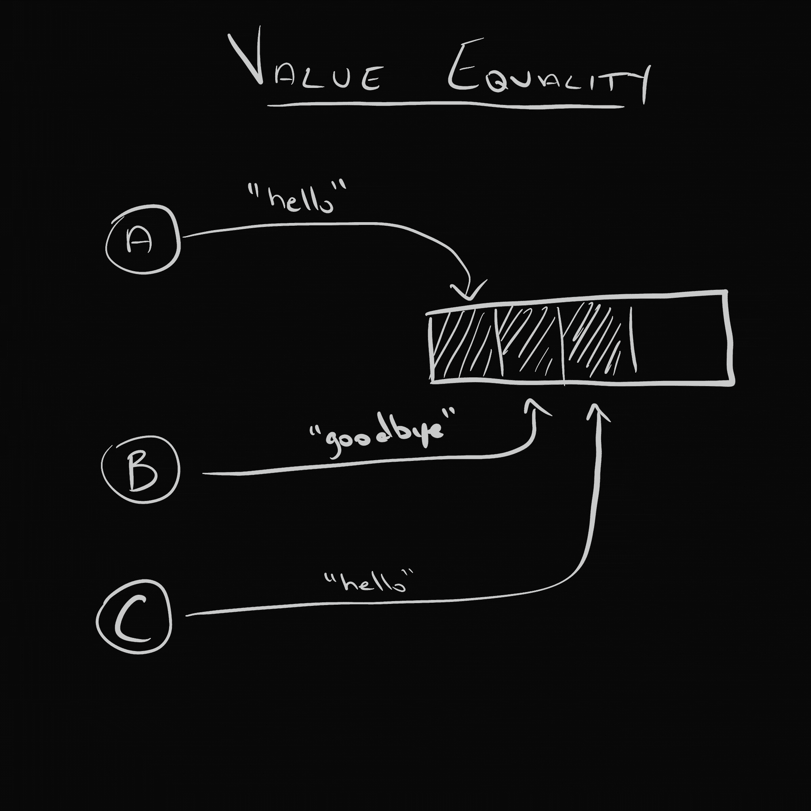
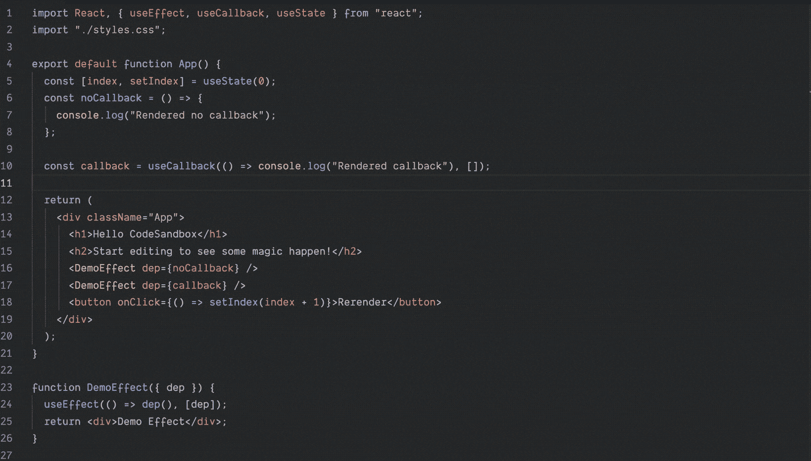
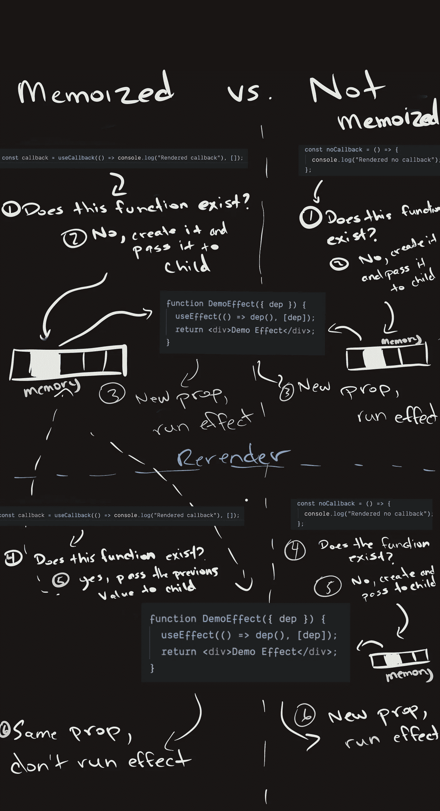

# 了解 useEffect 依赖项数组

> 原文：<https://betterprogramming.pub/understanding-the-useeffect-dependency-array-2913da504c44>

## 深入反应

[travelnow.or.crylater](https://unsplash.com/@travelnow_or_crylater?utm_source=unsplash&utm_medium=referral&utm_content=creditCopyText) 在 [Unsplash](https://unsplash.com/s/photos/understand?utm_source=unsplash&utm_medium=referral&utm_content=creditCopyText) 上拍摄的照片

# 介绍

最近写了一篇关于 [*上下文 vs 状态 vs Redux*](https://medium.com/better-programming/redux-vs-context-vs-state-4202be6d3e54)的文章。目标是尝试给开发者一些关于每个选择的优点和缺点，并希望帮助你对你计划使用的工具做出更好的选择。

在我发布之后，有几个人问我关于使用 [Redux](https://redux.js.org/) 移植到钩子的问题。一些开发人员在使用`mapDispatchToProps`和`connect` [React Redux](https://github.com/reduxjs/react-redux) HOC 时遇到了`useEffect`在每个渲染上运行的问题。

这些都是很好的问题！思考了一会儿之后，让我们来分析一下为什么你会看到这个，希望能帮助你理解为什么会发生这种情况。

因此，本文首先解释背景，然后解决这个问题的步骤是:

1.  什么是`useEffect`钩？
2.  什么是依赖数组？
3.  函数在依赖数组中工作吗？
4.  我们能用`useEffect`搭配`mapStateToDispatch`吗？

## 但是 useDispatch 呢？

在我们跳进去之前，我应该马上回答；React Redux 提供了一个`useDispatch`钩子。

这个挂钩允许我们像以前的`connect` HOC 一样进行调度，我强烈推荐将来使用它。

在本文的后面，我们将讨论它如何与`useEffect`一起工作的一些细节，但是这里关注的是围绕一个更“遗留的”(如果我们可以称之为遗留的)系统的工作，这个系统仍然在使用`connect`。

# 什么是 useEffect？

最简单地说，`useEffect`是一个钩子，允许你在功能组件中执行副作用。更详细地说，这些效果仅在组件渲染后执行，因此不会阻止渲染本身。

通常，这类似于获取组件需要的一些数据的请求。如果我们不处理副作用，React 组件将如何呈现？我们的副作用会阻碍用户界面吗？

## 阻止用户界面

您在代码中直接遇到的第一个问题是，您可以非常容易地阻止 UI 的呈现。您无法通过请求阻止它。[反应](https://reactjs.org/docs/hooks-reference.html)会阻止你得到那个选项。

例如，第一眼看上去，您可能决定等到数据返回后再进行渲染。如果尝试使用异步函数，React 将出错。

**注意:**React 中即将出现可中断组件！这将通过[并发模式](https://reactjs.org/docs/concurrent-mode-intro.html)实现，我强烈推荐阅读更多相关内容。也许我即将发表的一篇文章可以探索代码！

我很好奇是否有任何方法可以让 React 等待我的请求，但我做不到。我甚至使用了一个令人恶心的`sleep`方法，JavaScript 会在跳回解析一个承诺之前正确地完成这个函数。我只是觉得这很棒。

但是上面的例子确实说明了阻塞 UI。请注意，当单个组件被阻塞时，它将停止页面的呈现，等待它完成。

像这样冻结 UI 就是为什么我们不想阻止任何类型的渲染的副作用，并且应该有足够的理由尝试找到一些方法来隔离该功能，直到初始渲染之后。尽管如此，我们还是来看看阻塞以外的例子

假设我们没有屏蔽 UI，我们仍然使用承诺。我们的代码可能看起来像这样:

这里有几个问题，让我们一次看一个。

## 无限重渲染

上面代码的明显问题是，这将创建一个无休止的重新渲染循环。这也可能发生在`useEffect`中，但是有更多的规则来确保这种事情不会发生。

如果我们尝试观察状态中的数据，比如:

如果我们这样做，看起来会好很多。我的意思是，网页存在，这总是一个进步。当我们试图对这个组件进行推理时，这种方法的问题变得更加明显。然后，从那里开始，随着复杂性的增加。

所以让我们问问自己，这里的数据是什么？对于功能本身来说，它永远不是“现在”它总是上一次渲染的数据。

## 组件推理

在上面的例子中，组件推理不是一个大问题。我们只想要这个数据一次，不担心加载等问题。

但是，如果用户可以传入 URL，这意味着当它有数据时，实际上需要调用它，但只有来自指定 URL 的数据。该数据来自上一次渲染，而不是本次渲染。

现在，当然，`useEffect`效果是在渲染之后执行的，所以你可以说它在逻辑上和我们之前的没有什么不同。

但是我认为，通过在`useEffect`中放置一些东西，你明确地告诉下一个看到这段代码的开发者，它在逻辑上不在这个组件的流程中。

它不是用来自上而下阅读的。这个函数可以被认为是在这个组件的其余部分执行之后。然而，当某个东西与一个功能组件内联时，则假设数据现在对该组件可用。

现在，如果花一点时间收集我们想要的数据会怎么样？长时间运行的代码执行可能会阻止 UI 的呈现，但是为了简单起见，我将使用一个超时来假装这一点。

[自己试试吧！](https://codesandbox.io/s/delayed-fetch-without-effect-876qw)

如果您呈现它，您可能会注意到组件更新了几次，并且查询其事实的次数不可预知。这是因为我们现在需要记住渲染中的一些边缘情况。

如果有人在没有任何数据的时候更新了这个，但是我们已经在收集数据了，会发生什么呢？如果请求获取，但是我们的组件更新并请求另一个，会发生什么？

想象一下，在这段时间内，我们也有可以更新元素的交互，这似乎并不牵强。越来越难推理出我们组件的确切状态，以及在给定时间内发生了什么。

这并不是说这些事情是不可能的。但是肯定有更好的方法，这就引出了最后一点。

## 功能纯度

如果你在“函数式”编程的世界中工作过，你的函数中的这些效果是不被允许的。您希望确保组件具有[引用透明性](https://en.wikipedia.org/wiki/Referential_transparency)。副作用会带走你的功能的纯粹性。

我认为函数式编程是您应该掌握的一项重要资产，但是我今天不想深入探讨它。看待这个问题最简单的方法是问问自己，假设您将一组特定的输入传递给组件，您能期待相同的输出吗？

我们代码中的每个副作用都会降低这种可能性。现在，在你试图从你的系统中完全消除所有副作用之前，请记住用户输入本身就是一个副作用，使用`useEffect`仍然是一个副作用。

相反，我们的目标应该是管理、隔离和控制。如果我们想将测试从内部隔离到一个组件或系统，像这样处理输入在将来的测试中也很方便。

为了保持这个函数更加纯粹，我们将使用依赖数组。稍后我们将深入研究依赖数组，但是现在让我们看看它是什么样子的。

使用`useEffect`钩子的美妙之处还在于将它与 React 团队发布的 [ESLint 规则](https://www.npmjs.com/package/eslint-plugin-react-hooks)配对，这将让您知道数组中建议的依赖关系，并有助于尽可能保持该函数的纯净。

## 作为一个使用效果，这个例子看起来像什么？

[自己试试！](https://codesandbox.io/s/fetchexampleone-pf1il)

**注意:**在上面的例子中，`fetch`也应该是`useEffect`的依赖数组的一部分。在我们研究这个例子的时候，我不想添加太多的噪音，但是我们将在文章的后面回到为什么它需要在那里。

看看`[useEffect](https://reactjs.org/docs/hooks-effect.html)`，它看起来和我们之前的例子没有太大的不同。您会注意到，如果您将超时添加回代码示例，它现在也将正确工作。

我们稍后会解释为什么会这样，但是请注意，我们实际上只添加了两个新的部分，一个是`useEffect`调用，另一个是`[id, setData]`依赖数组。

正如我前面提到的，我发现随着我对钩子越来越熟悉，看到一个`useEffect`告诉我这段代码不会影响组件，直到初始渲染之后。

它允许我快速找到代码中的“副作用”,减少了运行组件的认知负荷，增加了可读性。

如果这是一个我们在其他组件中经常看到的请求，我们甚至可以将它分解成自己的自定义钩子，这对于可读性更有帮助:

## 所以，我应该在副作用上使用 useEffect 钩子？

唷，是的。你应该。这是一个很长的列表，说明了为什么不应该将它与组件内联，但是我希望这些例子能够帮助您理解为什么要构建它。

`useEffect`允许您:

*   而不是阻止用户界面。
*   创建一个可视化的“代码块”,这是一个可见的效果。
*   保持你的函数的纯净(或者，它试图保持纯净)。
*   增加代码的可读性
*   需要时可以方便地提取自定义钩子，以便我们可以在其他组件之间共享。

# 它是如何与类组件联系在一起的？

对于 React 的长期开发人员来说，当我开始讨论钩子时，经常出现的第一个问题是:“什么是生命周期方法钩子？”

或者在给他们看`useEffect`的时候会被问到:“这是我的`componentDidMount`发生的地方吗？”我对回答这些问题非常谨慎。

本质上，人们想要的是一种将类组件 1:1 地逻辑映射到功能组件的方法，但是我不太愿意用这种方式把它绑在一起。你必须摆脱功能组件和[类组件](https://reactjs.org/docs/components-and-props.html)之间 1:1 映射的思维。

尝试以一种新的方式重新想象一个功能组件，最关键的是这个功能可以并且应该在任何时候都可以被调用。

有些东西不仅仅叫做“在山上”。相反，应该用一个依赖数组来调用它们，比如父级的状态。并且只有当依赖关系改变时，才应该再次调用它。

依赖数组在`useEffect`之外也能工作，`useCallback`和`useMemo`是其他很好的例子。

我们希望记忆一个函数或返回值，并且只有在依赖数组中的特定数据发生变化时才调用/重新初始化这些东西。但是，这应该可以随时调用。

**注:**如果你想看这方面更深入的描述，我强烈推荐看看丹·阿布拉莫夫的[分解](https://overreacted.io/a-complete-guide-to-useeffect/) `[useEffect](https://overreacted.io/a-complete-guide-to-useeffect/)`。

# 什么是依赖数组？

因此，我已经多次抛出了“依赖数组”，我们最好将其分解并理解它的作用。依赖数组是`useEffect`函数中的第二个可选参数。

顾名思义，这是一个依赖关系数组，当从以前的渲染中改变时，将调用第一个参数中定义的效果函数。我们先来看一个例子:

那么，这种效应到底在做什么呢？每次这个组件被更新时，它都会调用这个`useEffect`。也许这就是我们想要的，这是可以接受的。

但通常情况下，你可能只是因为其他原因才希望这种效果发生。也许只有当数据改变时，或者也许当用户第一次看到组件时。

在上面的例子中，我们似乎只希望这个效果在`id`中的值改变时运行。为了做到这一点，我们通过将`id`放入依赖数组来告诉效果“仅在`id`改变时运行”。

现在这个效果只在`id`与之前更新不同时执行。我上面提到也许你只希望它在用户“第一次看到组件”时运行，但是我之前也提到不要把它想成`componentDidMount`……我不是自相矛盾吗？

不完全是，因为当我们谈论“第一次看到”时，我们实际上是从用户的角度来谈论它。他们的体验不一定需要像我们一直期望的那样符合代码。

很可能，如果我们为一个页面加载数据，目的是在用户登陆该页面时获取数据。所以，如果你想这样做，你可以这样做:

这只会在第一次被调用时获取数据。这是有道理的，对吗？我们给了这个效果一个依赖数组。所以我们的效果认为:“嘿，只有当这个数组中的值改变时，才回忆这个效果”。但是没有值，所以它永远不会更新。

但是我警告你不要使用这种风格来构建你的效果。React 团队也是如此。

它会导致令人困惑的、难以发现的错误。相反，让我们考虑一下这个组件。我们传入一个 URL，它定义了我们在哪里进行这个获取。如果我们像这样把 URL 放在数组中会发生什么？

有三种结果。

1.  该 URL 永远不会改变，效果应该只运行一次。
2.  该 URL 正在更改，但您只希望它在第一时间进行查询。
3.  该 URL 不断变化，您希望它每次都进行查询。

对于数字 1 和 3，无论你想走哪条路，第二个解决方案都适合你。

对于第一点，如果 URL 在第一次进入道具后没有改变，那么它已经正常工作了。URL 是依赖关系，并且这种依赖关系不会改变。

如果由于某种原因，它确实发生了变化，您将会更快地看到错误，而将一个空数组传递给依赖数组将会对您“隐藏”这个错误。

对于第三点，这就是构建依赖数组的目的。每次 URL 改变时，效果都会重新运行，您不需要设置任何复杂的逻辑来将它绑定到组件，就像我们在本文开始时必须做的那样。

所以，唯一真正的问题是第二点。但是当你停下来想一想，你在这个例子中构造组件的方式似乎有一个更重要的问题。

您希望数据进入，但是这些数据只是组件的一个实例的代表。如果有人稍后拍摄组件的快照，并将这些输入传递给新的组件，您将不会得到相同的输出。

我们的例子没有我们想要的组件的引用透明性。我们应该期望给定一组输入，我们总是得到相同的输出。

我们的目标应该是这些组件在任何时候都是可调用的。所以，我强烈建议你，如果你达到了第二个结果，重新考虑你的部分。

# 函数在依赖数组中工作吗？

是啊！它们的工作方式与依赖数组中的值的工作方式相同，但是它们被绑定到该函数的引用上。每当那个函数的引用改变时，我们都要重新运行那个效果。

在上面的例子中，我们作弊了，因为我们从未真正定义过`fetchData`是什么。让我们看一个没有组件的函数的例子。

这行得通，对吧？嗯，是的，但可能不是以我们想要的方式，因为这将再次调用我们对组件的每次更新的影响。每次更新`ExampleComponent`时，我们都要重新初始化`fetchData`函数。

**注意**:同样，我们不想将我们的心智模型绑定到类组件中，很多人已经习惯了类组件中的实例变量/方法。

在功能组件的情况下，我们没有贯穿更新的“以前的值”。如果再次调用一个函数，所有这些值都会被重新创建，包括函数。

你对上面这个问题的第一个想法可能是:“那么，为什么还要在依赖数组中有这个函数呢？如果我删除它，它工作正常。”

是的，在这种情况下，它会像你预期的那样工作，但是如果你使用 React 的 [ESLint 作为钩子](https://www.npmjs.com/package/eslint-plugin-react-hooks)(我强烈建议你这样做)，你会注意到它不是这样的。

这是因为同样的原因，我们上面谈到了第一次渲染时的*和我们的`url`道具。这可能会给我们带来想要的结果，但是它也可能隐藏了一个不想要的 bug。*

在上面的例子中，我们实际上只希望使用一个函数，但是你可以将一个函数作为道具传递给你的组件。并且该功能可以是几种不同的可能功能之一。

就像`url`道具一样，我们希望确保如果我们收到一个新函数，我们会再次调用 effect。

因此，随着推理的方式，我们如何才能解决我们的 ESLint 问题，并保持我们的效果尽可能纯净。有三种方法，每一种解决不同的用例。

## 方法 1。将函数移动到效果中

用例:这个`fetchData`调用只在这个本地`useEffect`中使用。

如果你计划只在这个`useEffect`中使用这个函数，最直接和推荐的解决方案是将函数直接移到效果闭包中。

这适用于我们之前讨论的所有内容，它确保了我们的效果函数本身尽可能的纯净和透明。它将逻辑封装在一个区域中，并且让开发人员知道这个功能只是一个副作用。

那看起来像什么？

由于`fetchData`函数现在是我们效果的一部分，它不再是我们效果的依赖项，我们可以简单地将它从依赖数组中移除。

## 方法 2。用 useCallback 记忆函数

用例:这个函数在多个本地钩子中使用，或者将要在一个子组件中传递。

`useCallback`是一种新的反应手段。它允许我们记忆一个函数，以便在组件的后续更新中，该函数保持其引用相等，因此不会触发效果。

`useCallbacks`使用与`useEffect`相同的依赖数组，因此如果它所依赖的值或函数改变，它将被重新初始化。为了理解这是如何工作的，我认为跳到引用和值相等是有用的。

**引用相等与值相等**

出于我们的目的，我们正在寻找两种类型的等式，值和引用(也称为*复合值*)。

值相等稍微好理解一点。值相等是变量的实际“值”的比较，例如:

在上例中，`A === C`，而`B`也不等于。但是如果我们现在改变`A`，那么`A`和`C`的值将不再相等。

现在，不仅这些值不再相等，而且它们指向内存中的两个不同点。我们知道这一点，因为当我们改变 A 时，C 并不随之改变。

如果它们共享内存中的同一个位置，两个值将同时更新。这就是为什么这些是价值上的平等，而不是指称上的平等。让我们来看看我们的记忆是什么样子的:

对于原始值，如字符串或整数，我们只能通过值进行比较，我们没有办法存储另一个变量的引用。即使我们这样做:

尽管我们将变量`B`指向我们的`A`变量，但我们并没有得到内存中的位置，我们仍然只是得到了变量值的一个副本。

许多其他语言确实有能力存储变量的“引用”,通常称为指针。这在 C/C++语言中可能最为人所知。

另一方面，我们可以比较引用值和复合值，比如对象、函数和数组。

**注意:**技术上来说函数和数组也是 JavaScript 中的对象。

为了回到使用`useEffect`依赖数组中的函数，让我们看看函数的引用相等性:

函数 A 和 B 都指向内存中的同一个点。现在，如果有人要给 A 重新赋值，它会把 A 移动到内存中的一个新位置，就像上面一样，B 仍然会指向原来的位置。

另一方面，如果 A 持有一个对象，我们改变了这个对象，B 也会得到这些更新。让我们用图表来看看上面的代码示例。

## 回到我们的记忆函数

因此，知道我们可以为给定的函数在内存中存储对某个点的引用，我们可以将该引用传递到一个`useEffect`的依赖数组中。

如果组件被重新渲染，而那个函数没有指向内存中的同一个点(即使是同一个函数和参数)，那么`useEffect`会被再次调用，因为它把它看作一个新函数。

如果我们可以记住函数引用，这意味着我们可以阻止`useEffect`重新运行，除非它真的改变了。让我们看看那是什么样子。

[自己试试！](https://codesandbox.io/s/testing-usecallback-flow-yhcxy)

如果您只打算使用一次函数，我建议像上面那样移动逻辑，但是当您需要将函数传递给多个`useEffects`时，这种模式很方便。

当将功能传递给子组件时，您会发现`useCallback`更加方便。如果我们不使用这种模式，子组件将重新呈现每次更新，即使它已被记忆。这是因为该函数永远不会具有与先前渲染相同的引用相等性。

更重要的是，如果这个子组件有任何依赖于这个函数的钩子，它们每次都会被调用。因此，用`useCallback`构建传递给子组件的函数总是一个好的选择。

**注意:**这并不意味着你应该用`useCallback`构建每一个函数。只有当它被传递给子组件时才是至关重要的。记忆本地函数调用通常会给代码增加不必要的开销和复杂性。

因此，我们知道如果我们在一个依赖数组中使用我们的函数，我们应该通过将它包装在一个`useEffect`中来记忆它们。如果我们不这样做，每次组件更新后效果都会重新运行。

那么，为什么在最初的`useEffect`例子中，我现在用`setData`函数做了呢？

那是因为在`useState`钩子中返回的函数已经被你记住了。`useReducer`也是如此。这为开发人员在创建钩子的过程中建立了一个基本的设计原则。

如果你从钩子返回一个函数，很可能你希望这个函数被记忆，这样开发者就可以使用它们，而不需要额外的处理开销。

## 浏览一个例子

我帮助一个朋友浏览了一个代码示例，以更好地理解记忆化函数和非记忆化函数的工作原理，方法是先看一个代码示例，然后画一个图表。

我认为没有我同时口头讨论它，它会显得有点乱，所以我想清理它，也许动画它，但在那之前，我会把它贴在这里，以防它对某人有帮助。

代码示例可以在 [CodeSandbox](https://codesandbox.io/s/useeffectwithandwithoutcallback-t3gff) 中找到。下面的代码是我们将要经历的；`memoized`函数使用我们上面描述的`useCallback`方法，而`notMemoized`函数将在每次更新时重新初始化。

然后，这两个函数被同一个组件(不同的实例)使用，这个示例有两个呈现，以说明在更新期间发生了什么。

## 方法三。请导入该函数

我们可以为我们的`fetchData`函数使用的最后一种样式实际上是将它移到组件本身之外。

这是一种不像前两种那样经常被谈论的风格，但是，根据它的作用，它可能是我最喜欢的风格。这种风格确实需要你在模块中使用 ESM `import`风格，而不是 CJS 风格。

**注意:**不要说太多细节，这是因为导入语句会给我们一个不能变异的函数实例，而带有 CJS 的导出模块可以变异。

这也是 ESM 可以静态分析的原因。如果你真的想了解更多，在 be [减少 JS 包大小](https://medium.com/better-programming/reducing-js-bundle-size-58dc39c10f9c)系列中，模块被频繁提及。

在上面的例子中，可能是这样的:

因为模块不能变异，我们不必在依赖数组中指定函数，因为它不可能改变。现在，您仍然可以将函数放在依赖数组中，但即使是 ESLint 也不会强迫您这样做。

那么，为什么这样更好呢？只是为了避免把函数放在依赖数组里？

我经常将我的函数拆分成这样的 utils 函数的最大原因是为了增加它的可测试性。有时我会在我的`useEffect`中有一些复杂的逻辑，我想单独测试。

现在，有很多方法可以测试钩子，但是做起来更有挑战性。我还发现将这些代码块分割成命名的函数增加了我的代码的可读性，所以这样做通常更有帮助，并且将它移动到一个新的模块给我带来了更好的免费测试。

最后，当我们这样做的时候，当我们对那个组件进行集成测试的时候，它也使得模拟那个效应的副作用变得更加容易。

在这个例子中，我们已经分离了实际的异步“获取”副作用。我们可以模仿`fetchData`方法，取而代之的是，调用`setData`参数来填充我们想要测试的数据。

# 可以在依赖数组中使用连接调度函数吗？

那么现在，所有这些背景信息都清楚了，我们终于可以回答手头的原始问题了吗？如果我们用一个`mapDispatchToProps`和我们的`useEffect`，它还能工作吗？它会重新渲染还是我们必须把每个道具都包在一个`useCallback`里？

不，你不需要对`mapDispatchToProps`做任何事情，它会像我们期望的那样开箱即用，就像`useDispatch`一样。甚至过去的版本。但这是为什么呢？

React Redux 已经在旧代码和最近发布的新`useDispatch`钩子中记忆了它们的功能。他们遵循了我们上面谈到的设计原则，并确保您在取回它们时不必记忆。

但是对于前面的`mapDispatchToProps`代码来说，这样做也有显著的性能优势。如果 React Redux 库不处理这一点，用户就必须在每次组件更新时处理这种引用相等的差异。

但是，为什么有些用户在使用旧的`mapDispatchToProps`示例时会遇到问题呢？

嗯，这个问题花了我一点时间来找出确切的原因，但它归结为`ownProps`。`ownProps`是可选地传递给`mapDispatchToProps`函数调用的第二个参数，是来自父组件的道具。

关于这个问题的更多细节，请点击查看[更多信息。](https://spin.atomicobject.com/2018/04/02/redux-rerendering/)

所以，在这个例子中:

[自己试试吧！](https://codesandbox.io/s/connect-with-mutliple-rerenders-9r00m)

如果我们查看作为`mapDispatchToProps`一部分的`ownProps`参数，我们会看到一个看起来像这样的对象:

现在，我们上面的例子完全是虚构的，因为实际上什么也没有发生。

尽管如此，只要我们有一个属性被传入到`Container`组件中，并且我们在`mapDispatchToProps`中有一个`ownProps`参数，这个函数在每次更新时都会失去它的引用相等性。

这是有意义的，因为这个对象在每次渲染时都是一个新的对象。我们必须添加额外的逻辑来处理等式检查，以确定对象中的数据是否相同。

对我来说，从一个`useCallback`的角度考虑这个问题更容易。如果`useCallback`是我们组件的一部分，我们实际上会触发类似的问题。

传递整个 prop 对象不是您通常构造一个`useCallback`的方式，而不是您正在寻找的单个值。但是它有一个类似的问题，您跟踪的是在更新时构造的整个对象，而不是所需的值。

与通过比较内存引用或像对象、数组或函数那样的深度比较相比，确保字符串和整数等值的相等总是更容易。

所以，我认为在`useCallback`中解决这个问题更难，因为这是一种更不自然的构建代码的方式，这也是当你对钩子越来越熟悉的时候，它变得如此伟大的原因。通常，这种代码风格会引导您采用一种不太容易出错的格式。

在上述情况下，我仍然建议您尽可能使用`useDispatch`来避免这类问题，但是如果您不能这样做，请记住，通过使用`ownProps`，您可能会使您的代码性能更差，更容易出错。

如果您想继续使用`mapDispatchToProps`，更好的方法是通过函数传递所需的值，然后通过`ownProps`进行捕获。

# 结论

我希望您发现今天的演练很有价值，并且对什么是`useEffect`有更好的理解，最重要的是，依赖数组是如何工作的。这些知识跨多个钩子工作，并且是构建功能组件的心智模型的基础。

我希望您带走的最重要的部分是对这些值和引用需要在功能组件中如何处理的更好的理解。

目标是让你的组件总是可渲染的，并且尽可能的具有引用完整性。

我在接触钩子和函数组件的人身上看到的最常见的问题之一是对依赖关系和函数引用的误解，这导致了大量的重渲染或不良副作用。

我知道很多人对钩子整体上有点担心，特别是转向新的 React Redux 钩子，但是我个人发现它们使我的代码更可读，并且一旦你更熟悉了，就不容易出错。

我强烈推荐 React 团队发布的 ESLint 插件，因为当你更习惯这种风格时，它们会帮助你做出正确的选择。

我正试图在我的文章中引入更多的可视化图表，并希望它们越来越生动。我绝不是一个插画师，但以我个人的经验，我经常发现视觉队列比大的文章更容易记忆。

我也想过用视频解释/编码来补充这些文章以获得更好的指导，所以让我知道你是否对此感兴趣！

如果您有任何其他想法来帮助使这些信息更丰富或您想听到的主题，请留下评论。

干杯！