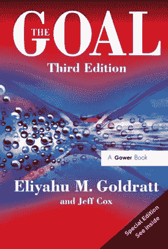
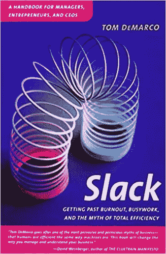

# 工程师不可错过的读物

> 原文：<https://betterprogramming.pub/unmissable-reading-for-engineers-4e99cefd7734>

## 在我的职业生涯中翻过一页的书

苏珊·尹在 [Unsplash](https://unsplash.com/search/photos/library?utm_source=unsplash&utm_medium=referral&utm_content=creditCopyText) 上的照片

在科技领域，书籍有时会显得过时。我们阅读博客、文章和“如何做”指南。我们听播客或者去聚会。或者至少，我是这么认为的，直到我注意到几乎每个我所敬仰的工程师都有一个趋势。

他们都有自己的清单。成就他们事业的书籍。它们并不总是技术性的。有时它们是虚构的小说，给了他们新的视角。但是他们都有一个会不断推荐的系列。我开始阅读。然后我列出了自己的清单，从那以后我一直在增加清单。

# 该标准提到

我以前读过一些这样的文章。每个工程师的书单里都有经典。 [*鲍伯·马丁大叔的清净代号*](https://www.amazon.com/Clean-Code-Handbook-Software-Craftsmanship/dp/0132350882/ref=sr_1_1?keywords=clean+code&qid=1560743012&s=gateway&sr=8-1) 。 [*极限编程*](https://www.amazon.co.uk/Extreme-Programming-Explained-Embrace-Change/dp/0321278658/ref=sr_1_2?crid=1MDHK80TMRYWU&keywords=extreme+programming+explained+embrace+change&qid=1560743077&s=books&sprefix=extreme+programming+ex%2Cstripbooks%2C493&sr=1-2) 作者肯特·贝克。 [*重构*](https://www.amazon.co.uk/Refactoring-Improving-Existing-Addison-Wesley-Technology/dp/0134757599/ref=sr_1_1?crid=146ME7N7WUU9D&keywords=refactoring+martin+fowler&qid=1560743106&s=books&sprefix=refactoring+martin%2Cstripbooks%2C467&sr=1-1) 马丁·福勒著。

基础书籍的清单是无穷无尽的。我已经避免了这些，因为，作为一名工程师，它们只是主食。它们是现代技术的支柱。即使你不是一个爱读书的人，你也可能读过它们。

考虑到这一点，我坚持阅读那些可能不是你首选的书籍。鲜为人知，但同样黄金。让我们开始吧。

## [1。加速](https://www.amazon.co.uk/Accelerate-Software-Performing-Technology-Organizations/dp/1942788339/ref=sr_1_1?keywords=Accelerate+-+Nicole+Forsgren&qid=1560743134&s=books&sr=1-1)——妮可·福斯格伦，杰斯·亨布尔&吉恩·金

这本书一落地，整个科技界都丢了。最后，严谨的科学遇到了工程师每天提出的常识性论点。它容易接近，容易理解，并且始终是彻底的。

这本书让公众意识到了四个关键指标。每一页都有一块宝石，如果你是首席执行官或初级工程师，它是完全不可或缺的。这应该成为任何技术领导团队的基本大纲，并且对于寻找*实际工作的具体分析的工程师来说是完全不可错过的。*

## [2。产品开发流程的原则](https://www.amazon.co.uk/Principles-Product-Development-Flow-Generation/dp/1935401009/ref=sr_1_1?keywords=The+Principles+of+Product+Development+Flow+-+Donald+G.+Reinertsen&qid=1560743166&s=books&sr=1-1) —唐纳德·g·赖纳森

这个标题听起来像是写于 1914 年。它离成为关于产品流本质的论文只有一步之遥。不要被推迟。它写得很好，辩论得很好，内容丰富，有深度。

它提供了一个很好的介绍，并深入探讨了流程在产品开发周期中是如何工作的。这将让你重建你的[看板](https://www.atlassian.com/agile/kanban)板，拆分你的流程，并重新思考你的产品如何在你的组织中移动。

这里有一点科学，那里有一点数学(没什么太重的)和一大堆常识。阅读这是一个新的时刻，我开始看到心流是如何对我办公室的一切产生巨大影响的。

## 3.[目标](https://www.amazon.co.uk/Goal-Process-Ongoing-Improvement/dp/0566086654/ref=sr_1_1?keywords=the+goal+-+eliyahu+goldratt&qid=1560743224&s=books&sr=1-1) —埃利雅胡·戈德拉特和杰夫·考克斯

伊莱·戈德拉特的名字最近已经从公众的意识中消失了，但是他的创造“约束理论”却是不朽的。在这部小说中，他以引人入胜、文笔优美的方式介绍了这一理论。一旦你完成了这个，这个世界将开始看起来像约束。

它为您提供了开始分析流程和寻找瓶颈所需的工具。对于任何工程师来说，这都是一本很好的入门书和关键文本。以第一人称小说的形式写成，人物塑造得出奇的好，情节引人入胜。

## 4.跨越鸿沟

这不是一本技术书，是关于市场营销的。这本书解释了一个创作的共同转变，从浮华和新的，到稳定，坚如磐石的产品。

它讨论了人们成功运用的实践和策略。作为一名工程师，重要的是拓宽你的视野，不仅仅是代码。代码是金子，但是理解一个产品如何工作会让你知道如何花费这些金子，以及如何挖掘更多。

## 5.文化代码 —丹尼尔·科伊尔

另一篇非技术性的文章。这本书讨论了作者在试图弄清楚文化是如何形成的，伟大的文化是什么样子，以及一些关键因素是什么时的观察。

信息很简单。让人有归属感。它可以就此打住，变得有价值，但它深入探讨了这一点是如何体现出来的。像“归属线索”这样的想法在交流中发挥作用，或者个人如何在群体中表现得像“胶水”。

这本书将迫使你看一看你正在帮助打造的办公室环境。当你看完之后，它会告诉你如何改进它，以创造一个包容、安全和赋权的环境。

这是现代优秀工程的基石。

## 6.[懈怠](https://www.amazon.co.uk/Slack-Getting-Burnout-Busywork-Efficiency-ebook/dp/B004SOVC2Y/ref=sr_1_1?keywords=Slack+demarco&qid=1560743352&s=books&sr=1-1) —汤姆·狄马克

感觉这些书的封面有 80 年代的主题…

对于许多项目经理来说，最大限度地提高工程师的生产力一直是一个令人头疼的问题。他们变得如此痴迷，以至于没有意识到整个努力的愚蠢。没有一点空闲时间——一点填充——计划注定要失败。

汤姆·狄马克出色地解释了 slack 是如何工作的，以及如何用它来克服倦怠和微观管理。作为一名工程师，你要制定计划。一直都是。你需要对计划中的人有一种欣赏。

## 7.[现场可靠性工程](https://www.amazon.co.uk/Site-Reliability-Engineering-Betsy-Beyer/dp/149192912X/ref=sr_1_1?keywords=Site+Reliability+Engineering&qid=1560743384&s=books&sr=1-1)——贝齐·拜尔、克里斯·琼斯、詹妮弗·彼得夫&尼尔·墨菲

站点可靠性工程是一本充满无穷智慧的书。这是绝对包装，从封面到封面，建议如何工程高可用性，弹性，安全的软件。

这本书的内容充满了这个领域中一些最聪明的头脑的故事、轶事、建议和警告，它将为你提供如何在你扩展时改进你的软件的大量想法。

如果你对你的基础设施、前端设计感兴趣，或者甚至你只是想把一些脚本放在一起使你的工作自动化，这本书提供了一个深入的指导来帮助避免常见的陷阱。

## 8.拉斯维加斯的恐惧和厌恶 —亨特·S·汤普森

因为它会让你意识到，科技世界就像正常世界一样，只是你已经经历了六个小时的迷幻之旅。

我定期在[推特](https://twitter.com/chris_cooney)上写更短的书。