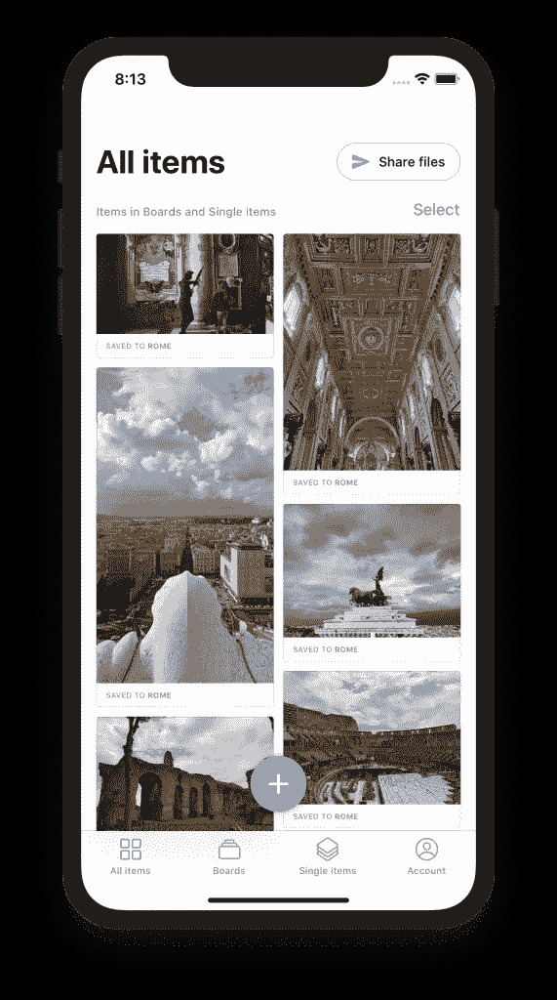

# 使用“NSFetchedResultsController”扩展来观察关系变化

> 原文：<https://betterprogramming.pub/use-an-nsfetchedresultscontroller-extension-to-observe-relationship-changes-ff730c112913>

## 基于数据关系自动刷新内容


卢克·普莱斯在[维基共享资源](https://commons.wikimedia.org/wiki/File:Changing_of_the_Seasons_(16136991162).jpg)上的照片

苹果为我们提供了很棒的类，比如`NSFetchedResultsController`来与我们应用程序中的核心数据数据库进行交互。API 经过多年的发展，增加了对新的`NSDiffableDataSource`的支持。然而，仍然存在默认 API 不够有用的情况。

在 WeTransfer，我们大量使用核心数据。我们所有的内容都通过获取的结果控制器显示，并通过`NSFetchedResultsControllerDelegate`回调自动刷新。我们遇到的一个问题是缺乏对观察关系变化的支持。

# “NSFetchedResultsController”是如何工作的？

为了充分理解这个问题，首先理解`NSFetchedResultsController`是如何工作的很重要。

一个`NSFetchedResultsController`通常也被称为 *FRC* 并利用一个`NSFetchRequest`来获取其数据。FRC 委托可用于更新一个`UITableView`或`UICollectionView`，因为我们获得了对节和单元格索引路径的插入、删除和更新的更新。这些变化是根据 FRC 中新旧数据集之间的比较自动计算出来的。

示例设置如下所示:

```
let fetchRequest = NSFetchRequest<Content>(entityName: "Content")
fetchRequest.sortDescriptors = [NSSortDescriptor(keyPath: \Content.creationDate, ascending: true)]
let controller = NSFetchedResultsController(fetchRequest: fetchRequest, managedObjectContext: persistentContainer.viewContext, sectionNameKeyPath: nil, cacheName: nil)

do {
    try controller.performFetch()
} catch {
    fatalError("Failed fetching content items with error: \(error)")
}
```

在这个例子中，我们获取所有的`Content`实体并在一个列表中显示它们。FRC 将确保数据集在以下情况下自动更新:

*   插入一个`Content`项目
*   一个`Content`项目被删除
*   一个`Content`项目被更新

这些变化中的任何一个都将触发委托回调，我们可以据此更新我们的`UICollectionView`或`UITableView`。

# 问题解释:当关系属性更改时更新数据集

正如我们在上一节中所解释的，我们现在知道，无论任何一个`Content`实例发生更新，一个`NSFetchedResultsController`都会更新它的数据集。让我们假设我们有下面的`Content`实体，它属于一个`Bucket`实体:

```
final class Content: NSManagedObject {
    @NSManaged var name: String
    @NSManaged var creationDate: Date
    @NSManaged var bucket: Bucket
}

final class Bucket: NSManagedObject {
    @NSManaged var name: String
    @NSManaged var content: Set<Content>
}
```

这种关系是一对多的，因为一个内容项目只能有一个存储桶，但是一个存储桶可以有许多内容项目。

我们像以前一样配置了我们的`NSFetchedResultsController`,这里我们使用一个根据内容创建日期排序的获取请求:

```
let fetchRequest = NSFetchRequest<Content>(entityName: "Content")
fetchRequest.sortDescriptors = [NSSortDescriptor(keyPath: \Content.creationDate, ascending: true)]
let controller = NSFetchedResultsController(fetchRequest: fetchRequest, managedObjectContext: persistentContainer.viewContext, sectionNameKeyPath: nil, cacheName: nil)
```

这导致这样一个事实，即一旦任何一个`Content`实体属性发生变化，更新就会通过——例如，当我们更新一个内容项的名称时:

```
content.name = "Updated name"
try persistentContainer.viewContext.save()
```

然而，设想我们有以下观点:



由“NSFetchedResultsController”支持的“UICollectionView”的示例

这是一个由`NSFetchedResultsController`支持的`UICollectionView`。它显示属于许多不同存储桶的所有内容项目。

在每个图像单元中，我们显示内容和包含的存储桶名称。这意味着当单元格的包含桶获得新名称时，我们需要更新单元格:

```
content.bucket.name = "Updated name"
try persistentContainer.viewContext.save()
```

不幸的是，事实并非如此，因为 FRC 被设计成只监控模型层的变化。

# 我们找到但不喜欢的解决方案

[网上存在的一些解决方案](https://stackoverflow.com/questions/7533849/nsfetchedresultscontroller-with-relationship-not-updating)建议通过像`reloadData()`调用这样的硬重新加载来解决这个问题。这样做是可行的，但是有很大的性能缺点，因为我们必须重新绘制所有的单元格(包括那些没有受到这个变化影响的单元格)。

另一个解决方案是通过添加一个`NSNotification.Name.NSManagedObjectContextDidSave`观察者来观察每个单元中相关存储桶的变化。这也会对性能产生负面影响，因为我们需要为每个需要更新的单元设置多个观察器。

显然，一旦我们需要监控多种关系，这个问题就会变得更加严重。如果我们有一个`User`实体，它是一个内容项目的所有者，并且我们也显示用户的名字，那会怎么样？你可以想象这很容易成为维护的大问题。

如果您在任何时候遇到调试问题，可以考虑阅读我关于使用启动参数在 Xcode 中调试核心数据的博文。

# 扩展“NSFetchedResultsController”以观察关系变化

是时候深入研究我们编写的解决方案了。即使你的项目中可能不需要这个，通读它仍然是非常有价值的——因为它展示了你如何很好地解决类似的问题。

我们解决方案的最终实现如下所示:

```
let fetchRequest = RichFetchRequest<Content>(entityName: "Content")
fetchRequest.sortDescriptors = [NSSortDescriptor(keyPath: \Content.creationDate, ascending: true)]

fetchRequest.relationshipKeyPathsForRefreshing = [
    #keyPath(Content.bucket.name)
]

let controller = RichFetchedResultsController(fetchRequest: fetchRequest, managedObjectContext: persistentContainer.viewContext, sectionNameKeyPath: nil, cacheName: nil)
```

有些事情已经改变了:

*   我们现在有了一个`RichFetchRequest`实例，它允许我们用定制功能来丰富默认的`NSFetchRequest`
*   因此，我们现在也有了一个`RichFetchedResultsController`,它只处理丰富的获取请求
*   最后，我们添加了一个新属性`relationshipKeyPathsForRefreshing`,它采用一个关系键路径数组来观察更新

这太棒了！它看起来几乎像一个本地 API，并且可以从 fetch 请求设置中发现。除此之外，我们还集中了描述数据集更新方式的设置。

让我们深入了解一下这是如何创建的。

## 整体结构

这有助于了解我们在这里创建的结构的概况。我们有几个共同努力实现这一目标的例子:

*   `RichFetchRequest`
*   `RichFetchedResultsController`
*   `RelationshipKeyPath`
*   `RelationshipKeyPathsObserver`

fetch 请求定义了要观察的关系键路径，并将它们传递给 FRC。FRC 设置了一个`RelationshipKeyPathsObserver`,负责设置所需的观察值，如果需要，还会触发所需的刷新。

## 创建`'RichFetchRequest'`和`'RichFetchedResultsController'`

这些类有点简单，仅用于将关系键路径传递给观察者。

```
/// An enhanced `NSFetchRequest` that has extra functionality.
public final class RichFetchRequest<ResultType>: NSFetchRequest<NSFetchRequestResult> where ResultType: NSFetchRequestResult {

    /// A set of relationship key paths to observe when using a `RichFetchedResultsController`.
    public var relationshipKeyPathsForRefreshing: Set<String> = []
}
```

这是采用泛型`ResultType`的`RichFetchRequest`。当我们从 Objective-C 类继承时，我们需要为我们的`NSFetchRequest`基类设置一个强类型。这里我们还可以看到`relationshipKeyPathsForRefreshing`属性，它收集了要观察的关系键路径。

```
/// An enhanced `NSFetchedResultsController` that has extra functionality.
public class RichFetchedResultsController<ResultType: NSFetchRequestResult>: NSFetchedResultsController<NSFetchRequestResult> {

    /// The relationship key paths observer that is only initialised if the fetch request has a `relationshipKeyPathsForRefreshing` set.
    private var relationshipKeyPathsObserver: RelationshipKeyPathsObserver<ResultType>?

    public init(fetchRequest: RichFetchRequest<ResultType>, managedObjectContext context: NSManagedObjectContext, sectionNameKeyPath: String?, cacheName name: String?) {
        super.init(fetchRequest: fetchRequest, managedObjectContext: context, sectionNameKeyPath: sectionNameKeyPath, cacheName: name)

        relationshipKeyPathsObserver = RelationshipKeyPathsObserver<ResultType>(keyPaths: fetchRequest.relationshipKeyPathsForRefreshing, fetchedResultsController: self)
    }

}
```

这是`RichFetchedResultsController`，它保留观察器，并使用丰富的获取请求来设置观察器本身。我们只需要创建一个新的初始化器，允许将`RichFetchRequest`作为输入。

## 构建“关系密钥路径服务器”

这是所有奇迹发生的班级。`RelationshipKeyPathsObserver`负责在给定的上下文上建立观察，将它与我们的关系键路径匹配，并最终确保正确的实体被刷新。

该类使用一个`RelationshipKeyPath`结构，它将给定的关系键路径解析成一个实例，该实例给出了与我们的 FRC 核心实体的关系信息。在我们的例子中，这是与我们的核心`Content`实体的关系。

```
/// Describes a relationship key path for a Core Data entity.
public struct RelationshipKeyPath: Hashable {

    /// The source property name of the relationship entity we're observing.
    let sourcePropertyName: String

    let destinationEntityName: String

    /// The destination property name we're observing
    let destinationPropertyName: String

    /// The inverse property name of this relationship. Can be used to get the affected object IDs.
    let inverseRelationshipKeyPath: String

    public init(keyPath: String, relationships: [String: NSRelationshipDescription]) {
        let splittedKeyPath = keyPath.split(separator: ".")
        sourcePropertyName = String(splittedKeyPath.first!)
        destinationPropertyName = String(splittedKeyPath.last!)

        let relationship = relationships[sourcePropertyName]!
        destinationEntityName = relationship.destinationEntity!.name!
        inverseRelationshipKeyPath = relationship.inverseRelationship!.name

        [sourcePropertyName, destinationEntityName, destinationPropertyName].forEach { property in
            assert(!property.isEmpty, "Invalid key path is used")
        }
    }
}
```

这些属性都用于识别`managedObjectContext`中应该触发刷新的变化。

我们的基本类设置如下所示:

```
/// Observes relationship key paths and refreshes Core Data objects accordingly once the related managed object context saves.
public final class RelationshipKeyPathsObserver<ResultType: NSFetchRequestResult>: NSObject {
    private let keyPaths: Set<RelationshipKeyPath>
    private let fetchedResultsController: RichFetchedResultsController<ResultType>

    private var updatedObjectIDs: Set<NSManagedObjectID> = []

    public init?(keyPaths: Set<String>, fetchedResultsController: RichFetchedResultsController<ResultType>) {
        guard !keyPaths.isEmpty else { return nil }

        let relationships = fetchedResultsController.fetchRequest.entity!.relationshipsByName
        self.keyPaths = Set(keyPaths.map { keyPath in
            return RelationshipKeyPath(keyPath: keyPath, relationships: relationships)
        })
        self.fetchedResultsController = fetchedResultsController

        super.init()

        NotificationCenter.default.addObserver(self, selector: #selector(contextDidChangeNotification(notification:)), name: NSNotification.Name.NSManagedObjectContextObjectsDidChange, object: fetchedResultsController.managedObjectContext)
        NotificationCenter.default.addObserver(self, selector: #selector(contextDidSaveNotification(notification:)), name: NSNotification.Name.NSManagedObjectContextDidSave, object: fetchedResultsController.managedObjectContext)
    }
}
```

它负责将关键路径解析到我们的`RelationshipKeyPath`实例中，并向`NSFetchedResultsController`上下文添加两个观察者。让我们来分解这两个通知，并描述它们的作用。

## 观察'【T6]'的变化

我们的第一个观察者利用了`NSManagedObjectContextObjectsDidChange`通知，并负责跟踪上下文中的任何变化。我们利用这个通知，因为它允许我们使用`NSManagedObject.changedValues()`方法读出改变的值。这个方法不会在“已保存”通知中返回任何内容，因为更改已经被合并了。

通知回调如下所示:

```
@objc private func contextDidChangeNotification(notification: NSNotification) {
    guard let updatedObjects = notification.userInfo?[NSUpdatedObjectsKey] as? Set<NSManagedObject> else { return }
    guard let updatedObjectIDs = updatedObjects.updatedObjectIDs(for: keyPaths), !updatedObjectIDs.isEmpty else { return }
    self.updatedObjectIDs = self.updatedObjectIDs.union(updatedObjectIDs)
}
```

这个方法负责将更新后的`NSManagedObjectID`实例收集到一个`Set`中。我们使用了一个`Set` ——因为它允许我们保存一个唯一实例的集合，并防止我们以后多次刷新一个单元格。

注意，我们只考虑更新的对象，因为我们不关心新插入或删除的实例。这些由`NSFetchedResultsController`正确处理，不需要任何定制的重新加载。

使用的方法如下:

```
extension Set where Element: NSManagedObject {

    /// Iterates over the objects and returns the object IDs that matched our observing keyPaths.
    /// - Parameter keyPaths: The keyPaths to observe changes for.
    func updatedObjectIDs(for keyPaths: Set<RelationshipKeyPath>) -> Set<NSManagedObjectID>? {
        var objectIDs: Set<NSManagedObjectID> = []
        forEach { object in
            guard let changedRelationshipKeyPath = object.changedKeyPath(from: keyPaths) else { return }

            let value = object.value(forKey: changedRelationshipKeyPath.inverseRelationshipKeyPath)
            if let toManyObjects = value as? Set<NSManagedObject> {
                toManyObjects.forEach {
                    objectIDs.insert($0.objectID)
                }
            } else if let toOneObject = value as? NSManagedObject {
                objectIDs.insert(toOneObject.objectID)
            } else {
                assertionFailure("Invalid relationship observed for keyPath: \(changedRelationshipKeyPath)")
                return
            }
        }

        return objectIDs
    }
}

private extension NSManagedObject {

    /// Matches the given key paths to the current changes of this `NSManagedObject`.
    /// - Parameter keyPaths: The key paths to match the changes for.
    /// - Returns: The matching relationship key path if found. Otherwise, `nil`.
    func changedKeyPath(from keyPaths: Set<RelationshipKeyPath>) -> RelationshipKeyPath? {
        return keyPaths.first { keyPath -> Bool in
            guard keyPath.destinationEntityName == entity.name! || keyPath.destinationEntityName == entity.superentity?.name else { return false }
            return changedValues().keys.contains(keyPath.destinationPropertyName)
        }
    }
}
```

这是相当多的消化，但通过分解，这应该是可能的。

*   首先，我们尝试为更新后的对象获取更改后的键路径。如果它不匹配任何我们观察的关键路径，我们可以直接跳过这个对象。
*   基于实体匹配找到匹配
*   子实体也被考虑，例如，从`Content`实体继承的`ImageContent`
*   最后，使用`changedValues()`方法来验证变化包含我们观察的关键路径
*   其次，我们通过获取反向关系属性从实例中获取对象 id。这确保我们在多对多关系的情况下获得所有的对象 id。例如，我们的拥有许多`Content`项的`Bucket`实体将把它们都添加到我们的对象 id 的`Set`中。

## 观察“managedObjectContext”保存

我们的最后一段代码存在于监控保存到我们的上下文中。这是我们真正想要触发单元格重载的唯一时刻——因为数据最终被提交。这导致了更好的性能，否则我们将在每次未提交的更改时重新加载一个单元。

观察值的回调如下所示:

```
@objc private func contextDidSaveNotification(notification: NSNotification) {
    guard !updatedObjectIDs.isEmpty else { return }
    guard let fetchedObjects = fetchedResultsController.fetchedObjects as? [NSManagedObject], !fetchedObjects.isEmpty else { return }

    fetchedObjects.forEach { object in
        guard updatedObjectIDs.contains(object.objectID) else { return }
        fetchedResultsController.managedObjectContext.refresh(object, mergeChanges: true)
    }
    updatedObjectIDs.removeAll()
}
```

我们确保有更新的对象要刷新。之后，我们获取当前获取的数据集，并开始对它们进行迭代，以查看是否找到匹配的更新对象标识符。

每当我们找到一个，我们触发`refresh(_:mergeChanges:)`方法，将`mergeChanges`设置为`true`。这确保了任何未提交的更改不会被丢弃，而是与新的可用数据合并。这个刷新方法也负责触发`NSFetchedResultsController`，因为它是自动拾取的。您的所有委托方法都将被相应地调用，就像我们正在更新核心`Content`实体的名称一样。

# 结论

就是这样！我们扩展了`NSFetchedResultsController`并创建了一个可发现且易于使用的顶级 API。通过在一个集中的`RelationshipKeyPathsObserver` observer 类中观察变化，我们允许自己创建一个性能良好的解决方案来保持我们的内容对于关系变化是最新的。

如果你正在考虑对你的应用进行更高性能的更新，你可以考虑阅读我在[上的博文，使用‘NSBatchDeleteRequest’删除核心数据](https://www.avanderlee.com/swift/nsbatchdeleterequest-core-data/)中的批处理。

谢谢！