# 使用网格来配置、比较和操作服务网格解决方案

> 原文：<https://betterprogramming.pub/use-meshery-to-configure-compare-and-operate-service-mesh-88f23dbf0b74>

## Meshery 入门


里卡多·戈麦斯·安吉尔在 [Unsplash](https://unsplash.com/s/photos/mesh?utm_source=unsplash&utm_medium=referral&utm_content=creditCopyText) 上的照片

# 介绍

现在有很多服务网格解决方案(Istio、Linkerd、Consul、Maesh 等等)。在性能/开销/使用方面，要选择最符合我们需求的一个，可能相当困难。 [Meshery](https://meshery.io) 将通过使部署、管理和评估不同的解决方案变得非常容易，在选择过程中为您提供帮助。

本文分为以下几个部分，一步一步地说明如何开始使用 Meshery:

*   服务网格快速介绍
*   Istio 概述
*   关于网状组织
*   创建一个 Kubernetes 集群
*   经营网络
*   部署示例应用程序
*   运行性能测试

# 服务网格快速介绍

一个*服务网格*被定义为一个基础设施层，它允许你管理应用程序的微服务之间的通信。它与应用程序一起部署在 Kubernetes 集群上，无需任何代码更改即可提供许多特性。可用的功能如下:

*   微服务之间的加密(TLS/mTLS)
*   可观察性(日志和指标)
*   认证/授权
*   故障恢复
*   限速
*   A/B 测试，金丝雀

几个服务网格基于相同的架构:部署在应用程序容器旁边的 sidecar 容器(理解:在应用程序的每个 Pod 内添加一个容器)。每个 sidecar 容器都是一个代理(通常基于 [Envoy](https://www.envoyproxy.io/) )，它拦截旁边应用程序容器的通信。所有这些代理形成了网状网络并相互通信。

服务网格由两个主要组件组成:

*   代理网络被称为*数据平面*。它通过 sidecars 将流量转发给其他服务。
*   *控制平面*处理配置和管理、安全以及监控相关的功能。它用于配置代理之间的通信。

下图说明了这些概念。

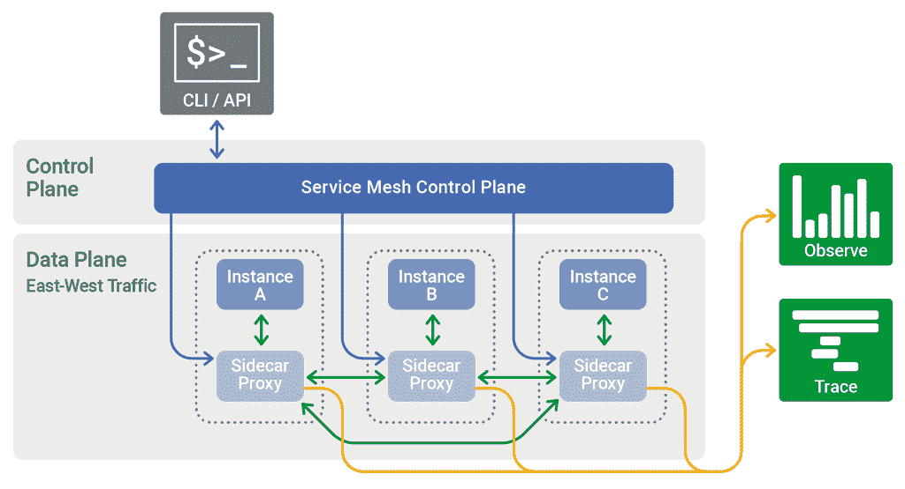

数据和控制平面(https://nginx.com)

注意:其他服务网格参与者使用不同的架构模型。例如，他们在节点级别部署代理，而不是在 Pod 级别(例如， [Maesh](https://containo.us/maesh/) )。

为了无差别地管理服务网格解决方案，目前正在指定一个[(服务网格接口)SMI](https://smi-spec.io/) 。

如 SMI 网站所述，SMI 涵盖了最常见的服务网格功能:

*   流量策略—跨服务应用身份和传输加密等策略
*   流量遥测—捕获服务间的错误率和延迟等关键指标
*   流量管理—在不同服务之间转移流量

SMI 背后的思想是提供一组 CRD(Kubernetes 自定义资源定义),无论选择什么解决方案，都可以用它们来管理服务网格。

**注意**:一个*定制资源定义*是一种扩展 Kubernetes 定义默认不存在的资源的方式。

还值得注意的是，Layer5 和 Meshery 是 SMI 的启动伙伴，Meshery 支持 SMI。您可以访问以下链接了解更多信息[https://layer 5 . io/blog/a-standard-interface-for-service-mesh](https://www.google.com/url?q=https://layer5.io/blog/a-standard-interface-for-service-meshes&sa=D&ust=1590158878311000&usg=AFQjCNET2Hc3NH41Yr_sB4mgAS927tbsuw)。

# Istio 概述

Istio 是我们将在本文中用来说明网格的服务网格。Istio 有两个核心组件:

*   Envoy 代理的扩展版本，用于拦截服务网格中所有服务的所有入站和出站流量。这个代理网络构成了数据平面。
*   Istiod，它提供服务发现、代理配置和证书管理。Istiod 依靠 Pilot 来管理流量(金丝雀、超时、重试等)。)，在 Citadel 上管理加密、认证和授权，在 Galley 上配置内部 Istio 组件。

下面的架构图说明了它们之间的关系。


来源 [https://istio.io](https://istio.io)

注意:随着最新版本中 Istiod 的引入，Istio 架构在 1.4 和 1.5 版本之间得到了简化。在[https://developer.ibm.com/blogs/istio-15-release/](https://developer.ibm.com/blogs/istio-15-release/)有一篇关于架构演变的博客文章。

此外，在这些组件之上(取决于所使用的 Istio 配置文件),还可以部署其他组件(Prometheus、Grafana 等。).

# 关于网状组织

[网格](https://meshery.io)作为服务网格管理平面出现。它允许您设置、基准测试和操作市场上的许多服务网格解决方案。

这个项目是由李·卡尔科特创建的。它由 [Layer5.io](https://layer5.io) 的社区管理，该社区的成员数量在不断增加。

从技术的角度来看，Meshery 由一组工具组成，这些工具可以部署在一个 [Kubernetes](https://kubernetes.io) 集群或者任何运行 [Docker](https://hub.Docker.com) 的机器上。它提供了一个 web 界面和一个 CLI 来部署、管理和基准测试所有领先的服务网格解决方案。

目前，Meshery 支持以下服务网格提供商:

*   [Istio](https://istio.io)
*   [链接器](https://linkerd.io)
*   [网络服务网格(NSM)](https://networkservicemesh.io/)
*   [领事](https://www.hashicorp.com/products/consul/service-mesh/)
*   [八氢萘](https://www.octarinesec.com/)
*   思杰 CPX (测试版)
*   梅什(阿尔法)
*   [应用网格](https://aws.amazon.com/fr/app-mesh/) (alpha)
*   [库马](https://kuma.io)(阿尔法)

下面的模式详细描述了整个网格体系结构。

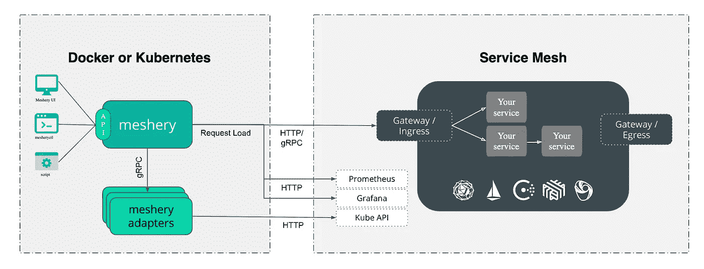

Meshery 的架构(来源: [https://meshery.io)](https://meshery.io))

管理员使用 Meshery web UI 或 CLI 将服务网格组件部署到目标 Kubernetes 集群。每个服务网格由其自己的网格适配器管理。

# 创建一个 Kubernetes 集群

对于这个演示，我们将使用在 [Civo](https://www.civo.com/) 上创建的集群。该公司有一个基于伟大的 [k3s](https://k3s.io/) (牧场主实验室的轻量级 Kubernetes 发行版)的托管 Kubernetes 产品(目前处于测试阶段)。

首先，从 CIVO 的 web 界面中，我们选择 Kubernetes 菜单并创建一个三节点集群，每个集群有两个 CPU 和 4 GB RAM。创建群集只需几秒钟的时间。

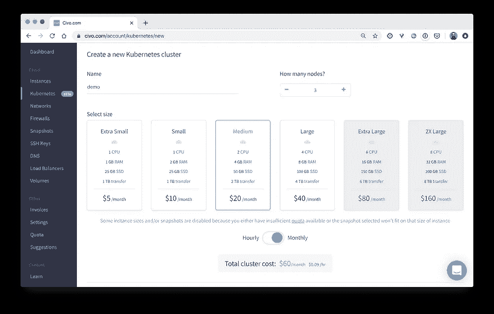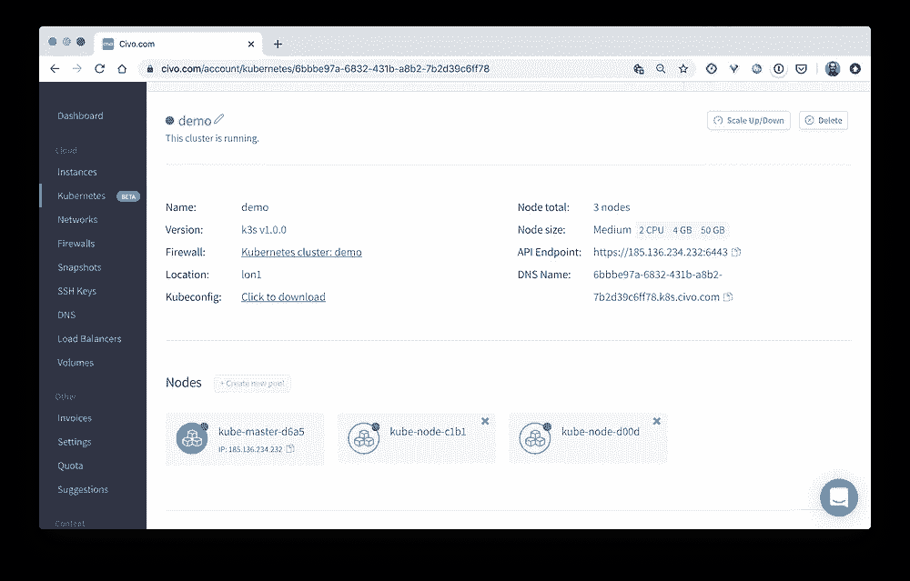

在 civo.com 上创建的 K3s 集群

然后，我们下载`kubeconfig`文件(此处为`civo-demo-kubeconfig`)并将其保存在一个安全的地方，因为我们将在接下来的步骤中用到它。

# 经营网络

Meshery 可以在 macOS、Linux 和 Windows 上本地运行，也可以直接在 Kubernetes 集群中运行。在本文中，我将用以下命令将它安装在 Docker 容器内的 macOS 上:

```
$ curl -L https://git.io/meshery | bash -
```

它下载了最新版本的`mesheryctl`工具(在撰写本文时是 0.3.12 ),并运行几个容器:

*   一个用于 web 界面
*   每个适配器一个


mesheryctl 运行的容器

web 界面可通过端口 9081 进行本地访问:


Meshery web 界面

从这个界面中，我们可以看到 Meshery 中处于稳定状态的六个服务网格解决方案。

我们还没有连接到任何集群，所以让我们更改它，并使用设置菜单导入我们之前下载的`kubeconfig`。


与 Kubernetes 星团相连的网状结构

Meshery 现在可以与我们的集群通信，并准备好部署一个可用的服务网格。下面，我们将重点介绍 Istio。

从左侧的 Istio 菜单中，我们可以看到可用的操作:

*   管理服务网格生命周期
*   管理示例应用程序生命周期
*   应用服务网格配置
*   验证服务网格配置
*   应用自定义配置

首先，我们使用管理服务网格生命周期以标准方式部署 Istio(与 SMI 无关)。


Istio 管理页面

使用伟大的 Kubernetes 客户端(如果你不知道这个人，你一定要试一试),我们可以看到所有与 Istio 相关的组件都已经部署好了，Istio 现在正在集群上运行。

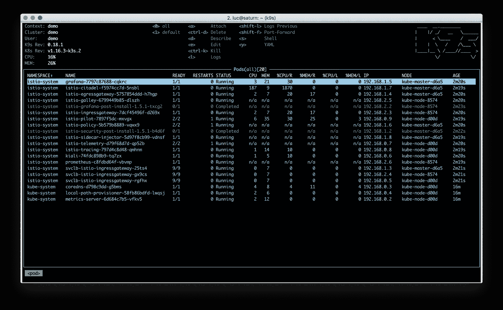

通过 k9s 客户端运行的 pod 列表

接下来，我们将部署一个示例应用程序，并配置其微服务之间的通信。

# 部署示例应用程序

首先，从 Meshery web 界面中选择 Manage Sample Application life cycle 菜单。可以部署三个示例应用程序:

*   潮人商店
*   BookInfo
*   httpbin


可以为 Istio 部署的应用程序列表(只需点击一下鼠标)

我们使用 BookInfo 应用程序，它由四个微服务组成:

*   `productpage`是一个用 Python 写的 web 前端，公开一本书的信息。它从两个微服务收集不同的信息:`reviews`和`details`。
*   `details`微服务是用 Ruby 写的，返回书的细节。
*   `rating`微服务是用 NodeJs 写的，它为书返回一个标记。
*   `reviews`微服务是用 Java 写的，它返回一篇书评。这个微服务有三个版本:v.1 不调用`rating` *，* v.2 调用`rating`并使用黑星显示标记，v.3 调用`rating`并使用红星显示标记。

下图说明了这些微服务之间的交互:

*   左边是没有 Istio 的应用程序:微服务直接相互通信。
*   右边是带有 Istio 的应用程序:微服务通过代理进行通信，这些代理作为 sidecar 容器注入到应用程序的每个 Pod 中。

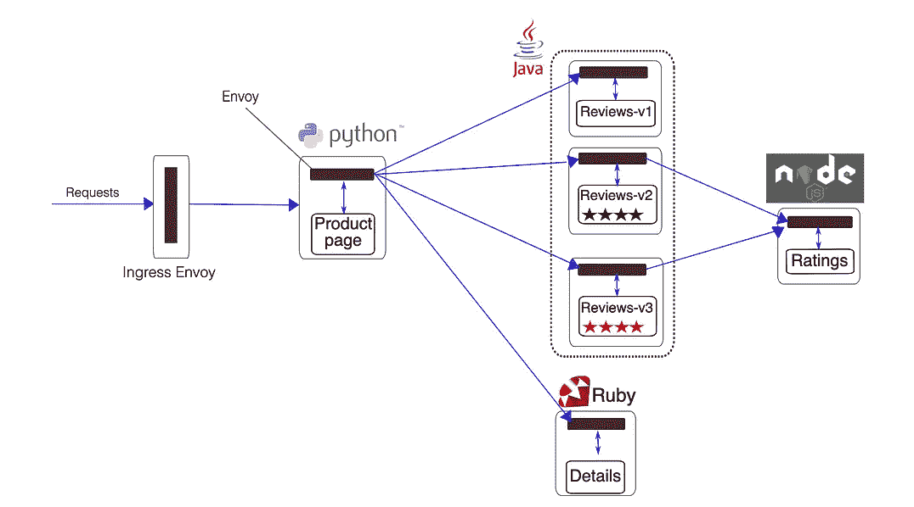

BookInfo 应用程序的架构(https://istio.io) -不带 istio(左)/带 Istio(右)

接下来，我们验证 BookInfo 是否已部署。从 k9s 中，我们可以看到应用的微服务(`productpage`、`ratings`、`details`、`reviews`微服务的三个版本)。


BookInfo Pods 列在所有正在运行的 Pods 中

从 Civo web 界面(我们创建集群的地方)，我们可以检索 DNS 名称来访问集群中运行的应用程序。


获取到达群集的 DNS

如果我们对`/productpage`端点进行几次调用，我们可以看到不同版本的`reviews`服务以循环方式被调用。

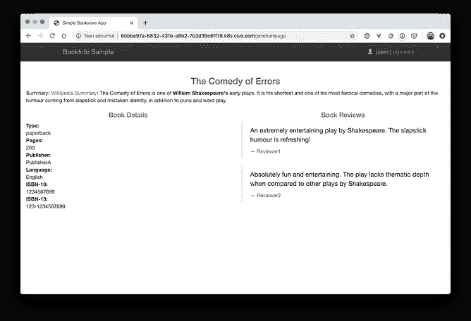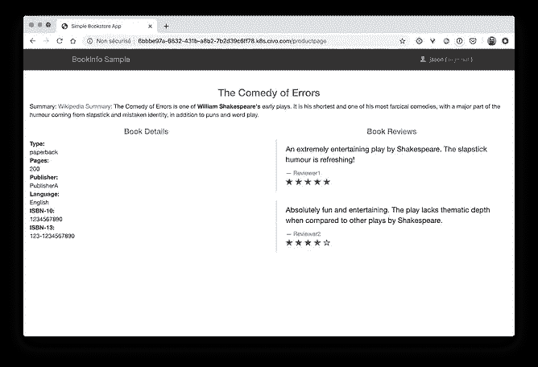

BookInfo /productpage 的连续调用

接下来，我们应用默认的 BookInfo 目的地规则配置。它基本上定义了每个微服务的不同版本，并将用于定义以下通信规则:

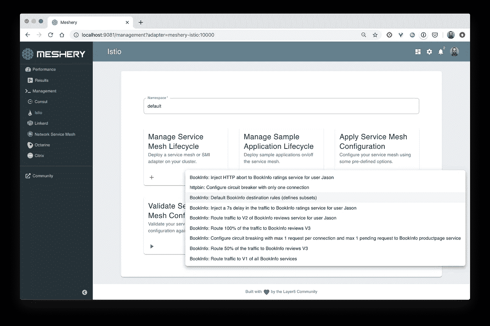

定义 BookInfo 的默认目的地规则

然后，我们应用一个配置，确保只有当请求来自一个名为 jason 的登录用户时，所有流量才被发送到`reviews` v.2。


定义流量规则:用户 jason 应该限于版本 2 的评论微服务

从 k9s 中，我们可以看到已经创建了一个新的`VirtualService`，它定义了上面选择的规则。我们现在不会深入研究`VirtualService` CRD，但是我们可以记住它们是用来定义代理之间的通信规则的。


一旦应用了配置，就会创建一个虚拟服务

现在让我们测试应用程序，以确保这条规则得到执行。从 BookInfo，我们使用 jason 作为用户名登录。一旦登录，我们只能看到带黑星的评论。这是指所选规则中定义的`reviews`服务的版本 2。

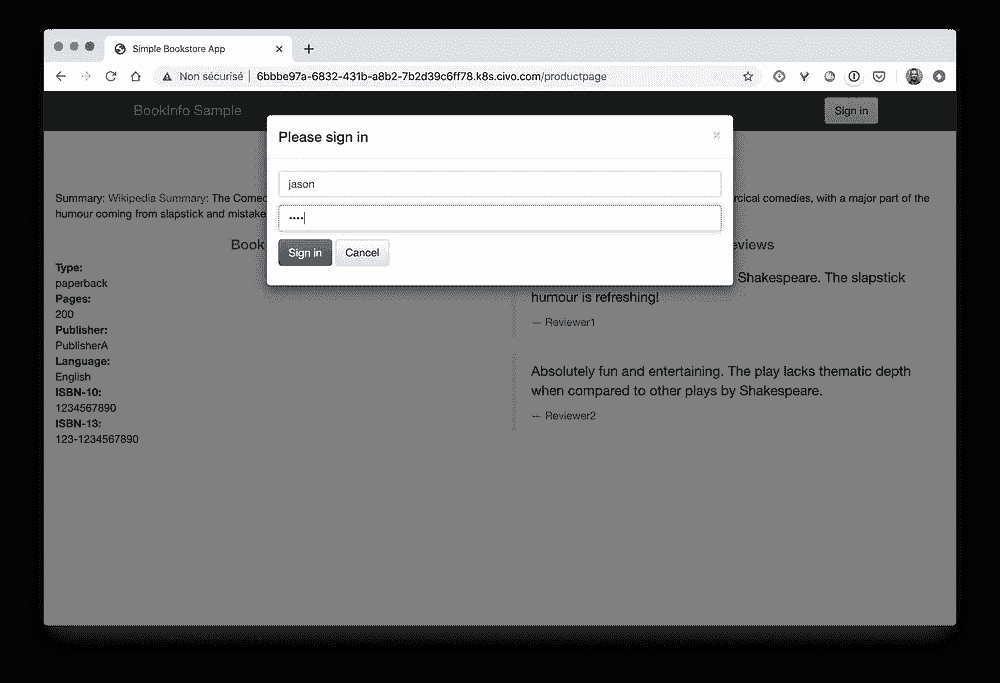

用户 jason 只能看到 reviews 服务的版本 2

通过几次点击，我们已经部署了应用程序并应用了一些预先配置的通信规则。太棒了。

还有许多其他操作可以用来配置 BookInfo 应用程序的微服务如何相互通信。(提醒一下:一旦安装了 Istio，通信就通过代理完成，而不是直接在微服务之间进行)。不要犹豫运行这个例子和测试其他规则。

# 运行性能测试

Meshery 还允许我们测试服务网格在我们自己的架构/应用程序上的表现。

首先，我们选择左侧的 Performance 菜单，并提供一些参数来运行测试:

*   要测试的 URL(此处为 BookInfo 的`/productpage`)
*   并发请求的数量
*   请求的数量
*   测试的持续时间

然后，在测试完成后，我们在一个漂亮的图表中得到结果。

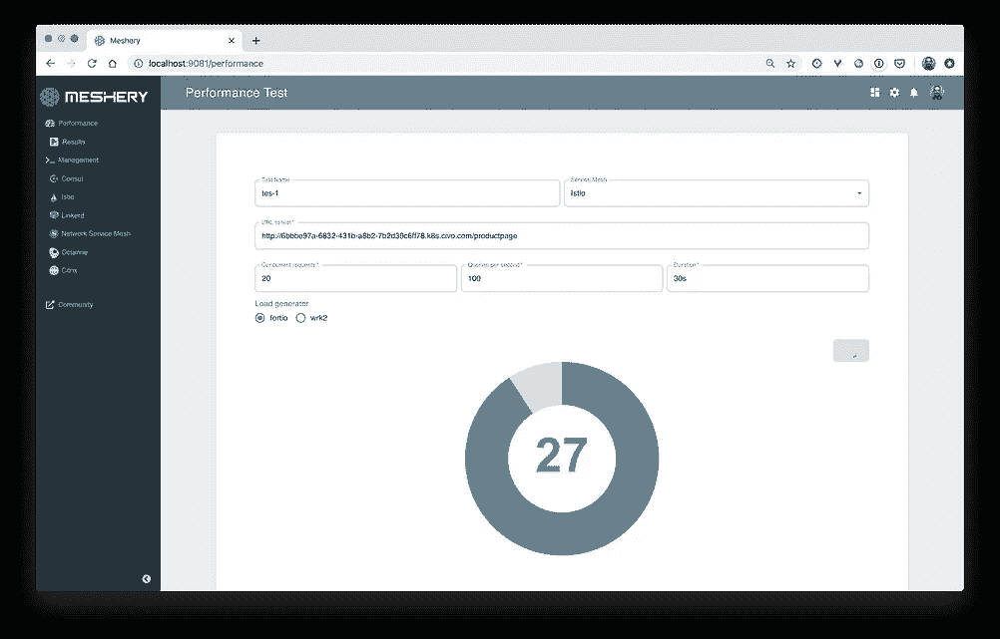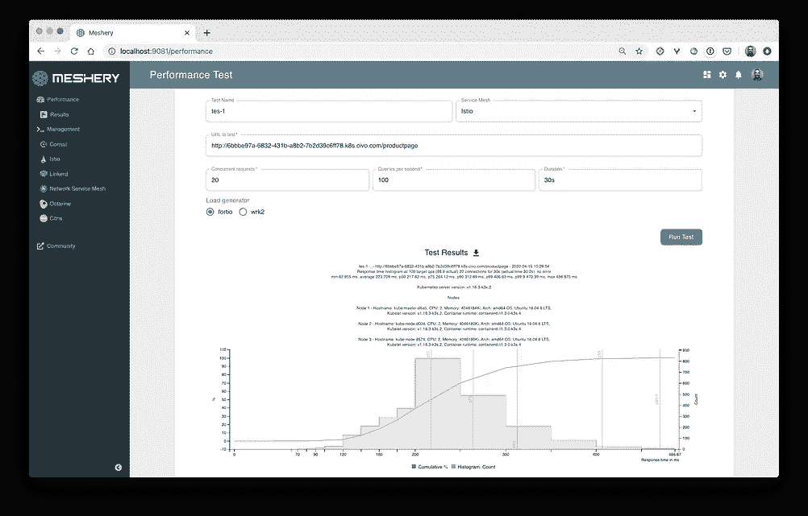

用 Istio 对 BookInfo 应用程序进行性能测试

运行性能测试不是一蹴而就的事情。例如，它可以定期运行以建立基线，并且可以被评估:

*   对于所选服务网格的每个新版本
*   对于服务网格配置的每次更改
*   对于应用程序的每个新版本

它可以用来比较服务网格，并找到最适合我们的需求和约束的服务网格。

我们将不讨论性能测试的细节，对其结果的解释，或者如何使用它来定义某种基线，因为这可能是未来文章的主题。

一旦我们完成了，就可以很容易地删除我们到目前为止已经安装的所有组件(Istio 和它的 BookInfo 应用程序),因为一切都可以使用 Meshery 的 web 界面中的专用图标来清理。


从集群中删除 BookInfo 和 Istio 组件

# 结论

在本文中，我们仅仅触及了 Meshery 的皮毛，但是我希望您对它的能力有一个总体的了解。正如我们所见，Meshery 使得在 Kubernetes 上部署和管理服务网格变得非常容易。最重要的是，它可以用来对不同的服务网格进行基准测试，建立基线，并跟踪每个服务网格对基础设施的总体影响。

请随意尝试 Meshery——前往 [Meshery.io](https://meshery.io) 。

注:非常感谢[李·考科特](https://medium.com/u/fdffb5a98b8a?source=post_page-----88f23dbf0b74--------------------------------)、[安特·维斯](https://medium.com/u/e13eb32c8fa0?source=post_page-----88f23dbf0b74--------------------------------)和[艾苏科里](https://medium.com/u/b840e4bcadf7?source=post_page-----88f23dbf0b74--------------------------------)审阅本文。