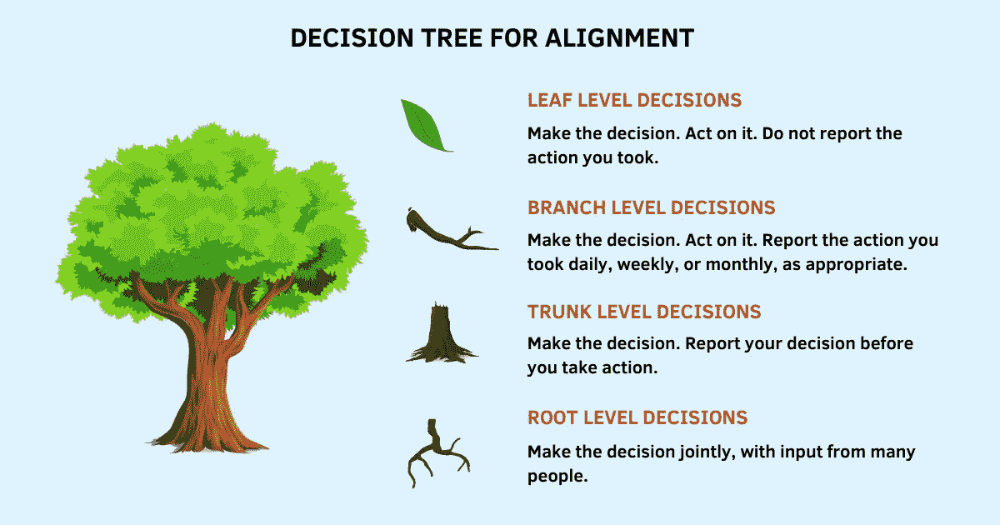

# 使用协调模型在工作中做出更好的决策

> 原文：<https://betterprogramming.pub/use-the-alignment-model-to-make-better-decisions-at-work-4120a200de1c>

## 你是专门打鼹鼠还是找幼虫？



鸣谢:作者

当一个组织中的领导者致力于打鼹鼠，而不是他们应该做的是寻找幼虫时，会发生什么？

《激烈对话》的作者苏珊·斯科特通过她自己和哥哥萨姆的故事解释了这个想法，故事是这样的:

在我们十几岁的时候，在我们可以随心所欲地做事情之前，我和萨姆有周六的家务要做。萨姆的责任是处理我们院子里的鼹鼠问题。每个星期六早上，萨姆都会望着窗外，叹一口气。我们的院子在摩尔中心。几十条小路的尽头是一大堆新翻的泥土。

坚决，萨姆将头出门去战斗。有时他会用水管，把它尽可能深地推入洞穴。很快就会有小股水流流遍整个院子。另一种方法是把散发恶臭的烟雾弹塞进洞里，之后我们的院子就像一个奇妙的银河景观，布满了喷出有毒烟雾的活火山。然后就有了陷阱。在一个作战计划中，一只鼹鼠会触发陷阱，然后被串起来。

萨姆花了很多个星期六的早晨去打鼹鼠。他认真对待他的工作。很多年后，山姆打电话给我说，“苏西，你不会相信的。我在五金店排队，站在一个家伙后面，他拿着一大包东西，上面有骷髅和交叉骨。我问他这是干什么用的，他说，“痣的问题。”所以我问他，‘你怎么把那东西放进洞里？’他说，‘哦，这不是给鼹鼠的。你把它洒在草地上，它会杀死鼹鼠吃的幼虫。"

电话那头沉默了片刻，然后我听到一个微弱的声音:“该死！”我咯咯地笑着，山姆继续说道。"如果我去追蛴螬，我就可以骑着自行车度过周六了."

# 致力于消灭内奸的领导者会让他们的员工和组织陷入困境

当一个组织中的领导者在工作中犯了大错:他们有一长串重要的事情要做，但是他们没有在工作中的困难部分取得进展，推动他们的团队和组织前进，而是被琐碎的决定拖累。

打鼹鼠挺有趣的。你干掉了一只鼹鼠，又有一只在等着你。让你忙起来。让你觉得自己很重要，并给人一种高效的错觉。

但是它的影响是相当有害的。

## 它如何影响领导者

一旦打鼹鼠成为一种习惯，领导者就会参与每一个决定，每一个问题。他们认为这是他们工作的一部分。

参与每一个小细节，每一个小问题不是闹着玩的。这需要大量的精力，并且经常导致[决策疲劳](https://www.techtello.com/decision-fatigue/)、精疲力竭和[精疲力竭](https://www.techtello.com/wrong-about-burnout-at-work/)。

还有一个问题。关注表面问题的疲惫留给思考困难问题的精神空间更少。花在小决策上的时间越多，留给关键决策的时间就越少，而这些决策对企业和组织的发展至关重要。他们要么行动太晚，要么一起逃避。

在他们的案例中，花在解决问题上的时间与价值创造成反比。

## 它如何影响员工

> 这种有意识或无意识的内部反应对组织和个人来说都是极其昂贵的。试图通过定期向你的才华展示来培养领导者，必然会导致缺乏发展。你将不会允许你周围的任何人带着你自己无法触及的解决方案出现。如果你的员工认为他们的工作就是做你告诉他们的事情，那你就完了——苏珊·斯科特

依赖老板为他们做所有的思考，员工不能为自己思考。每一个小决定都依赖老板，每一个小行动都会阻碍他们的成长:让他们慢下来，阻止他们发展批判性思维技能，让他们感觉没有灵感和动力。

> 控制导致合规；自主导致参与——丹尼尔·平克

没有自主权，就没有敬业度，敬业度越低，增长空间就越小，从而导致更多的损耗。

领导者需要做的不是抓鼹鼠，而是抓幼虫——关注根源，而不是叶子层面的问题和决定。只有当领导者从控制转向环境时，这种情况才会发生。当他们向他们的员工阐明他们可以独立于需要他们关注的决策时。一旦他们停止在可见的事物上浪费时间，他们就可以开始看到那些隐藏和看不见的问题。

# 致力于寻找蛴螬的领导者采用决策树模型

> 用上下文来引导，而不是控制。当你让低层员工访问通常为高层管理人员保留的信息时，他们自己就能完成更多工作。他们工作得更快，不会停下来询问信息和请求批准。他们不需要高层的意见就能做出更好的决定——雷德·哈斯汀斯，没有规则

当员工被授权做决定时，他们会感到有动力，并愿意尽一切努力让事情运转起来。这难道不是很有意义吗——鼓励员工从组织的最大利益出发思考和行动。领导者有足够的时间思考[未来方向](https://techtello.com/how-to-develop-strategic-thinking-skills/)。员工成长。组织成长。明显的双赢。

Susan Scott 提供了描述四类决策的决策树模型:

**叶决定:**做出决定。行动起来。不要报告你采取的行动。

**分支决策:**做出决策。行动起来。根据情况，每天、每周或每月报告你采取的行动。

**干线决策:**做出决策。在你采取行动之前报告你的决定。

**根本决策:**共同做出决策，听取许多人的意见。这些决策如果制定和执行不当，可能会对组织造成重大损害。

每位领导者的目标应该是双重的:

1.  将更多决策移到叶级别。
2.  蔻驰让更多的员工做出分支和主干级别的决策。

> 任何级别的错误决策都会伤害一个组织，但是如果你无意中从树上扯下一片叶子，树不会死。如果决策和执行不当，树叶决策不会杀死树。然而，从根本上来说，一个错误的行为会造成巨大的损失――苏珊·斯科特

# 如何在您的组织中实施决策树

在一封致股东的简讯中，杰夫·贝索斯区分了两种决策——不可逆的(第一种)和可逆的(第二种)。

他将不可逆转的决定比作“单行道”，并表示，这种决定应该有条不紊地、仔细地、缓慢地、经过深思熟虑和磋商后做出，“如果你穿过去，不喜欢你在另一边看到的东西，你就无法回到你之前的位置。”

然而，他说，一个组织中的大多数决策并不是这样的。它们是可变的和可逆的。它们是双向的,“如果你做了一个次优的第二类决定，你就不必为这个结果活那么久。你可以重新开门，然后回去。这些决定可以也应该由判断力强的个人或小团体迅速做出。”

许多组织都倾向于将可逆的决策视为不可逆的，这使得领导者们更倾向于挖墙脚而不是挖墙角。贝佐斯说:“随着组织变得越来越大，似乎有一种在大多数决策中使用重量级 1 型决策过程的趋势，包括许多 2 型决策。这样做的最终结果是缓慢、不充分的风险规避、未能进行充分的实验，从而减少了发明。”

为了实施决策树模型，领导者需要帮助他们的员工回答以下问题:

1.  是不可逆的(1 型)还是可逆的(2 型)决策？所有类型 1 的决策都是根决策。
2.  如果是类型 2——是叶级、分支级还是主干级决策？这通常归结于他们的经验、知识和能力。

[让员工](https://www.techtello.com/empowering-teams/)结合自己的能力评估决策的风险，有助于他们发现自己的知识差距，让他们意识到自己需要学习什么，并树立他们承担预计风险的信心，从而实现高效协作和更多创新。

# 决策树的优势

## **领导人**

1.  释放带宽，专注于需要他们关注的想法和项目。
2.  花在根本决策上的时间和精力越多，决策的总体质量就越高。
3.  通过授权员工根据他们的技能和能力做出决策来利用他们的优势。

## **其他**

1.  让员工有机会发现自己在知识和技能方面的差距，为成长和发展指明道路。
2.  通过将他们的知识运用到实践中，并从自己做出的决定中学习，建立自信。
3.  因为员工觉得对自己的决定负责，所以提高了做得更好的动力。
4.  当他们从根到干，从枝到叶的层次决策时，有一种进步感。被授权做出更复杂的决定意味着更多的成长。

在任何组织中，领导者的工作都不是告诉人们做什么，参与每个问题，或者提供 100%完美的结果。他们的工作是让他们的员工能够利用他们的知识做出自己的决定，激励他们建立自信所需的技能，并有效地利用自己的时间来展望未来和解决困难的问题。

```
**Want to Connect?**This story was originally published at [https://www.techtello.com](https://www.techtello.com/decision-tree-for-making-better-decisions/).
```