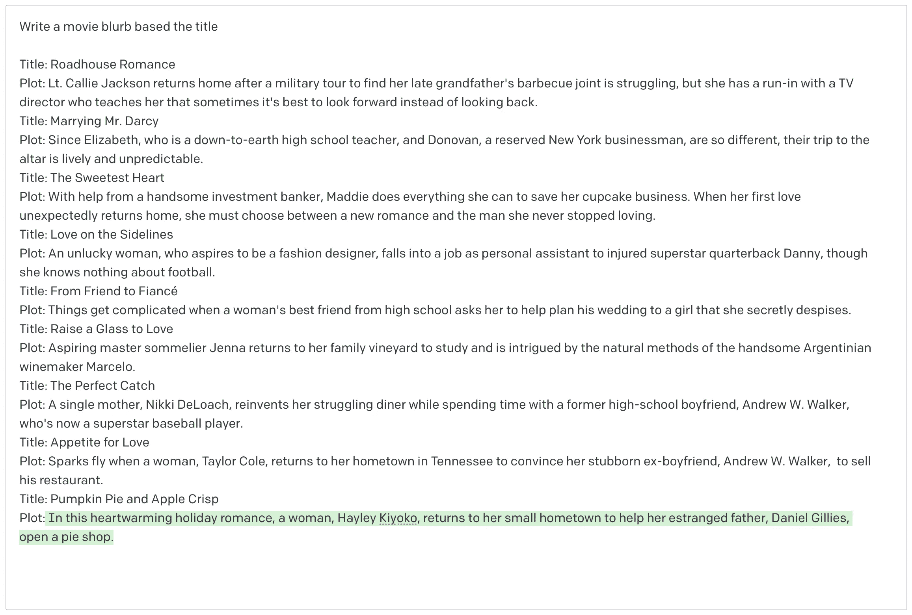
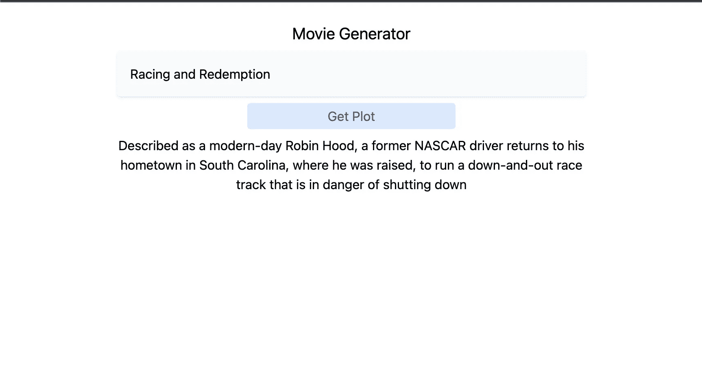
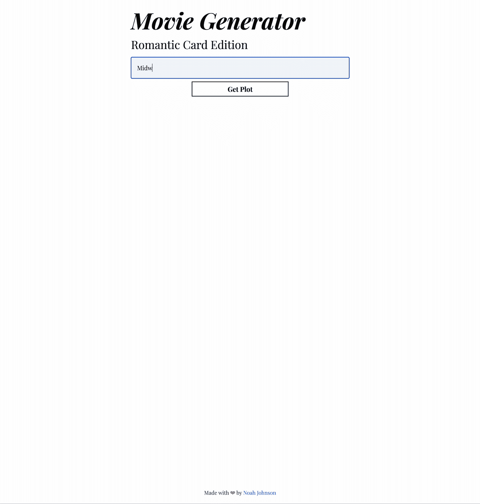

# 使用 OpenAI API 生成电影情节

> 原文：<https://betterprogramming.pub/using-ai-to-generate-movie-plots-29557da71a8d>

## open ai+Deno+Remix+TailwindCSS+Framer Motion


照片由 [Aaron Burden](https://unsplash.com/@aaronburden?utm_source=medium&utm_medium=referral) 在 [Unsplash](https://unsplash.com?utm_source=medium&utm_medium=referral)

最近，我们在一个流媒体服务上浏览电影，进入了一个可以被称为“标志性电影区”的地方虽然不是来自霍尔马克电影，但这些体现了每一个俗气的浪漫故事的基本情节点。一个小镇女孩在分开多年后回到自己的城市，拯救家族生意并坠入爱河。那种电影。

我的开发人员的大脑开始转动，我意识到我可能可以根据标题找到生成这些图的方法。所以，这正是我所做的。下面是我是如何做的，学到的经验教训，以及这个项目未来的发展方向。

# 使用 OpenAI

我迈出的第一步只是尝试 OpenAI。如果您不熟悉，OpenAI 已经推出了一些令人难以置信的文本完成、图像生成等模型。是 [GitHub Copilot](https://github.com/features/copilot) 使用的服务，最近 [DALL-E 2](https://openai.com/dall-e-2/) 被很多刊物重点报道。

在这个项目中，我使用了一个名为达芬奇的核心 GPT 3 模型。它本质上理解和处理文本，以便能够智能地完成各种情节。一些例子是纠正语法，总结文章或书籍，根据产品描述创建广告，将电影标题转换为表情符号，等等。说真的，看看他们所有的[例子](https://beta.openai.com/examples)，你会对它能做的一切感到惊讶。

我开始只是利用他们的操场来获得一些简单的剧情概要。我会给几个例子，然后一个电影名称，并要求一个情节摘要回来。看起来是这样的:



PM.png 时间 2022 年 8 月 26 日的屏幕截图

当我做这个的时候，我们正在度假，所以我们开始想出尽可能多的主意，因为我们对来自 OpenAI 游乐场的许多回应感到好笑。这是令人愉快的，但我认为它可以更好，以及与自己的网站集成。

# 微调

OpenAI API 的一个特性是，您可以创建微调的模型来满足您的特定需求。基本上，你可以输入你在上面看到的所有例子数据(在这种情况下是标题和情节)，它会训练模型更准确地找到你想要的。它也将更具成本效益和更快，因为它不需要每次都处理所有的文本。

我最初只是看了看谷歌，看看我能找到多少情节摘要。这有助于初步理解微调是如何工作的，但是一般来说，您需要更多的数据。这是我转到[电影 DB](https://www.themoviedb.org/) 的时候。他们有一个 API，可以让你用关键词、标题或者公司来查询电影。

我把我能找到的所有霍尔马克电影都放在一个带有标题和情节摘要的 JSON 对象中。我可以用多种方式来实现这一点，但是我想尝试一下[Deno](https://deno.land/)(NodeJS 的另一种 JavaScript 运行时)。使用一个简单的函数，我遍历了数据页面，并将其全部写入一个 JSON 文件。

之后，我能够使用这些数据，以及 OpenAI 的 CLI 工具，来准备和训练一个新的微调模型。虽然我打算在以后的文章中更深入地讨论技术细节，但是你可以在 [OpenAI 的网站](https://beta.openai.com/docs/guides/fine-tuning)上找到更多信息。

以这种方式收集给了我几百个模型的例子，但是一旦我开始收集，我就意识到有一个问题。我得到的一些数据被列在 Hallmark movies 下，但并不完全符合我们希望用该工具生成的数据。例如，有一些恐怖电影，所以偶尔我会给模型一个标题，一个非常不浪漫的电影情节就会产生。

为了解决这个问题，我返回并手动从训练数据中删除了一些电影。这是我想在未来改进该工具的一种方式。使用 Movie DB 的 API，我可以添加关键字来缩小电影的范围，或者能够获得他们列出的标志性电影之外的更多数据。

随着训练模型中的可变性问题的解决，我能够继续创建一个应用程序，该应用程序将利用这个经过微调的模型，允许用户使用一个漂亮的界面来创建他们梦想中的标志性电影情节。

# 创建 Web 应用程序

最近，我一直在使用 [Remix](https://remix.run/) 构建许多应用程序。虽然我几乎要尝试一个不同的框架，但我决定坚持使用 Remix，因为我真的很喜欢在它里面使用和部署 project 的体验。起初，我只是用最少的样式创建了一个页面(使用 [TailwindCSS](https://tailwindcss.com/) )来获得一个接受电影标题的简单表单设置。然后，它向一个 ActionFunction 发布，该函数从 OpenAI 返回绘图摘要。

虽然并不漂亮，但这是一个很好的例子，说明建立一个简单的表单、使用 OpenAI JavaScript SDK 查询数据并在页面上显示它是多么容易。它看起来是这样的:



Image.jpeg

您可能会注意到，提示符也变得更长、更详细。总会有一些差异，但我注意到微调后的模型肯定更加详细和准确(根据我们的准确性衡量，看过霍尔马克电影)。

最后一步是给网站添加更多的风格。我还添加了一些简单的认证，所以我可以与一些朋友分享，而不需要得到 OpenAI 的批准。我真的希望能把它做得更好一点，以便获得批准，并让任何人都可以使用它。

不仅如此，我还为一些简单的动画使用了[帧运动](https://www.framer.com/motion/)，并充实了页面的其余部分。它仍然很简单，但我真的很喜欢这种体验。这里有一个例子:



AnimatedImage.gif

# 结论

继续这个非常有趣的示例项目，您可以做的事情太多了。首先，各种微调模型可以用于特定类型的电影或流派。额外的提示可以传递到 OpenAI 模型中，以进行更多的变化和实验。该模型还考虑了一些参数，比如完工时应该承担多少风险。这将是展示修改这些参数将如何影响输出的好机会。

我见过的其他例子是生成完整脚本的模型。如果能看到像这样的模型可以用更多的数据做些什么，比如来自各种 Hallmark 或其他电影的剧本，那将是非常有趣的(也是有教育意义的)。

总的来说，这是将多种技术结合在一起的一个很好的例子(有些我以前没有用过)。将 OpenAI、Deno、Remix、TailwindCSS 和 Framer Motion 一起使用到一个有凝聚力的项目中，然后将它部署在 Vercel 上，这是一个很好的例子，说明了我们所拥有的现代工具的强大功能。

请让我知道你的想法，如果有任何电影名称，你想看到人工智能生成的情节！

```
*This article was originally published on my other, technical focused blog,* [*Noah Johnson Dev*](https://blog.noahjohnson.dev/using-ai-to-generate-movie-plots)*.*
```