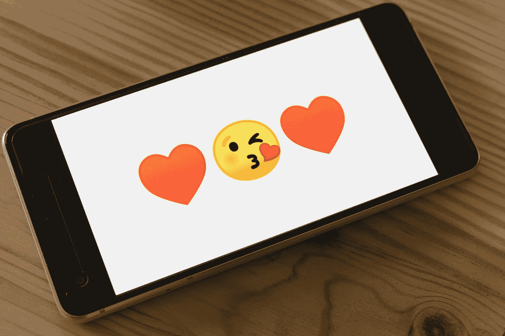

# 使用这个 Python 库将表情符号转换成文本

> 原文：<https://betterprogramming.pub/using-emoji-to-convert-emojis-to-text-f1969352083c>

## 如何用语言表达所有的乐趣



马库斯·温克勒在 [Unsplash](https://unsplash.com?utm_source=medium&utm_medium=referral) 上拍摄的照片

我目前正在进行一个 Twitter 抓取项目(改天再谈)，我碰到了这个:

> *'通信🌿🖤 |我来买爆米花。🍿*

不用说，我必须做点什么。

对我来说幸运的是，有一个很棒的图书馆可以把这个:

> *🗣@赌博播客\n🚀@theSGPNetwork🤝@ bluewirepods \ n \ n # together blue | # Hokies🦃| #比特币\n \投资者名下的 1H 帐户\ n🎥*

变成这样:

> *:speaking _ head:@ gambling podcast \ n:rocket:@ the SGP network:handshake:@ bluewirepods \ n \ n # together blue | # Hokies:turkey:| # bit coin \ n \ n 投资人名下的 1H \ n:movie _ camera:*

你问这是哪个图书馆？当然是为什么表情符号😁。

# 如何使用[表情符号](https://pypi.org/project/emoji/)

# 装置

安装`emoji`再简单不过了:

`$ pip install emoji`

一旦安装完毕，我们就可以探索它的功能了。

# 基本使用案例

虽然你可以像这样把短代码转换成表情符号:

```
result = emoji.emojize('Python is the :bomb:')
print(result)Python is the 💣
```

这个库的真正价值是将表情符号转换成短代码，如下所示:

```
result = emoji.demojize('Python is the 💣')
print(result)'Python is the :bomb:'
```

用于清洁、过滤和/或将来的分析。

# 英语以外的语言

如文档中所述，默认语言是英语，但它也支持以下欧洲语言:德语、葡萄牙语、意大利语、法语和西班牙语。Por ejemplo:

```
result = emoji.demojize('Python es la 💣', language='es')
print(result)Python es la :bomba:
```

现在我知道你在想什么了:

> “我如何清洗整个熊猫系列？”

谢谢你的关心。

# 清洁熊猫系列

假设你有一个熊猫系列，如下图所示:

```
sentences = ["I want a 🍔", "I don't want a 🍔",
             "I ❤️ 🍔", "I 💩 🍔", "I am 💩 ⚽"]pd.Series(sentences)0 I want a 🍔
1 I don't want a 🍔 
2 I ❤️ 🍔 
3 I 💩 🍔 
4 I am 💩 ⚽
```

要用短代码替换表情符号，你只需像这样在 lambda 函数中传递`emoji.demojize()`:

```
pd.Series(sentences).apply(lambda x: emoji.demojize(x))
```

对于我们的玩具示例，您将获得期望的输出:

```
0 I want a :hamburger: 
1 I don't want a :hamburger: 
2 I :red_heart: :hamburger: 
3 I :pile_of_poo: :hamburger: 
4 I am :pile_of_poo: :soccer_ball:
```

然而，[生活不是一场小马秀](https://pevansimpson.medium.com/building-custom-datasets-with-beautiful-soup-d037f14c469d)，所以我们不能确定`pd.Series`中的每一条记录都包含像上面玩具例子中的文本。例如，如果我们的`pd.Series`包含一个像这样的`Nan`值:

```
sentences = ["I want a 🍔", "I don't want a 🍔",
             "I ❤️ 🍔", "I 💩 🍔", "I am 💩 ⚽, np.nan"]pd.Series(sentences)0 I want a 🍔
1 I don't want a 🍔 
2 I ❤️ 🍔 
3 I 💩 🍔 
4 I am 💩 ⚽
5 NaN
```

我们将得到以下错误:

`TypeError: object of type ‘float' has no len()`

为此，我们需要一种方法来处理`NaN`值，尽管我毫不怀疑还有其他更简洁/高效/python 式的方法来处理这个问题(如果你知道其中一个，请在评论中留下)，下面概述的方法对我来说很有效，而且非常简单。

```
def emoji_to_text(text):
    if type(text) != float:
        return emoji_cleaner(text)
    else:
        return text
```

简单地说，只要我们系列中的值不是浮点数(这就是`NaN`值)，我们就是好的。

最后，我们将我们的`emoji_to_text()`函数传递给`pd.apply()`来创建一个新的 `pd.Series`:

```
pd.Series.apply(emoji_to_text)
```

瞧啊。你现在有了一个`pd.Series`，每个表情符号都被替换成了相应的短代码。

> 太好了，我正在处理一个数据框架。我该怎么办？

哦，那真的很简单！

只需在您的`pd.DataFrame`中想要转换的列上调用`apply()`，并将输出保存到一个新列，如下所示:

```
df['clean_sentences'] = df['sentences'].apply(cleaner)
```

# 结束语

如果是做社交媒体帖子的文字分析，遇到表情符号的可能性接近 100%。因此，拥有一个能够快速、轻松地将它们转换成可用文本的工具是至关重要的。

幸运的是，`emoji`库就是这样一个工具。