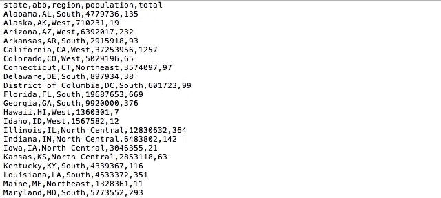

# 使用 Python 将 Excel 文件中的工作表转换为单独的 CSV 文件

> 原文：<https://betterprogramming.pub/using-python-to-convert-worksheets-in-an-excel-file-to-separate-csv-files-7dd406b652d7>

## ETL 改进


卡洛斯·穆扎在 [Unsplash](https://unsplash.com?utm_source=medium&utm_medium=referral) 上的照片

与各种不同的客户打交道让我接触到以 Excel `.xlsx`格式提供数据文件的场景。对我个人来说，这种文件格式在以编程方式使用它做某些事情时不是很通用和兼容。

有几个原因，但其中一个主要原因是 Excel 如何自动将一些值解析为特定的格式(例如数字、科学记数法和日期)，因为它试图变得“智能”。

在某些情况下，这可能是有用的，但当涉及到编程时，这可能会导致错误并增加复杂性。


因此，在开始处理 Excel 文件中包含的数据之前，我通常会将 Excel 文件转换为 CSV 文件。

这是为了使数据格式保持一致，一般来说，CSV 文件很容易集成到任何程序中(因为它只是一个文本文件，其中的数据由逗号`,`分隔)。



最初，我只是将 Excel 工作簿中的每个工作表导出为`CSV`，并保存为新文件。

然而，随着我不断获得更多的 Excel 文件进行处理并成为 ETL 管道的一部分，我决定需要以编程的方式自动化它，这样我就不需要花费更多的时间将它们手动转换成 CSV 文件。

我相信你们中的一些人正在经历同样的事情，所以我决定分享下面这个简单的 Python 脚本，它将 Excel 工作表转换成 CSV 文件。

exceltab_to_csv.py

# 属国

首先，你需要使用`pip install xlrd`安装 Excel 库`xlrd`。另外两个库`csv`和`sys`是 Python 标准库，所以不需要安装。

# 游戏攻略

库`xlrd`允许我们与 Excel 文件交互。下面一行显示了如何将 Excel 文件读入内存的一行程序。

```
workbook = xlrd.open_workbook(excel_file)
```

然后，脚本遍历 Excel 文件的工作表，在一个`for loop`中一个接一个。该循环包括以下步骤:

*   获取工作表名称。

```
workbook.sheet_names()
```

*   从每个工作表中提取数据。

```
worksheet = workbook.sheet_by_name(sheet_name)
```

*   创建一个新的 CSV 文件，其名称为原始 Excel 工作表名称。整理了一点替换空格和破折号。

```
csv_file_full_path = csv_file_base_path + sheet_name.lower().replace(" - ", "_").replace(" ","_") + '.csv'csvfile = open(csv_file_full_path, 'wb')
```

*   写入新的 CSV 文件，一次一行。

```
writetocsv = csv.writer(csvfile, quoting = csv.QUOTE_ALL)for rownum in xrange(worksheet.nrows):
            writetocsv.writerow(
                list(x.encode('utf-8') if type(x) == type(u'') else x
                    for x in worksheet.row_values(rownum)
                )
            )csvfile.close()
```

# 执行

要运行这个 Python 脚本，请转到您的终端并执行以下操作。

```
MacBook-Pro:~ bobthedude$ python exceltab_to_csv.py ./datafiles/client_data.xlsx ./datafiles/client_data_csv/
```

这一计划的论据是:

*   第一个参数:要转换为. csv 的 Excel 文件路径。
*   第二个参数:要保存。csv 文件在。

就是这样！下次需要将 Excel 文件转换为. csv 文件时，可以使用该脚本。

我希望这有助于您的工作流程！