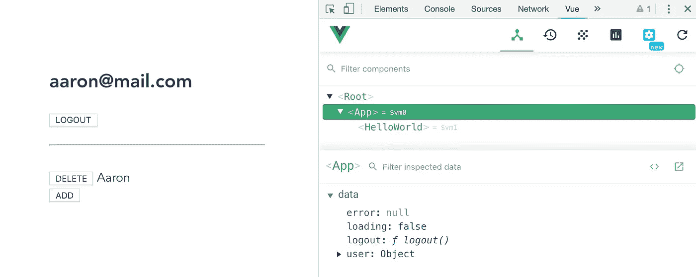

# 将 Vue.js 组合 API 与 Firebase 一起使用

> 原文：<https://betterprogramming.pub/using-vue-composition-api-with-firebase-18bd9154e19>

## 使用新的 Vue.js 组合 API 将 Firebase 集成分离到 Vue.js 应用程序中的示例



# 概观

我们将使用新的 VueJS 组合 API 将 Firebase 集成分离到一个 VueJS 应用程序中。我们将重点确定是否已经保存了与应用程序相关的用户信息，或者用户是否需要登录应用程序。如果用户需要登录到应用程序，我们将提供使用组合 API 应用程序结构登录和注销 Firebase 的能力。

# 视频系列播放列表

[https://www.youtube.com/playlist?list = pl2py 2-9 rsgl 2 BGN tx 9 omldisiwh 1 nyinz](https://www.youtube.com/playlist?list=PL2PY2-9rsgl2bgNTX9omlDisiWh1NYInz)

我们假设对 [VueJS](https://vuejs.org/) 和 [Firebase](https://firebase.google.com/?authuser=0) 有一个基本的了解。关于设置您的应用程序以使用 Firebase JavasSript SDK 的更多信息可以在这个[链接](https://firebase.google.com/docs/web/setup?authuser=0)中找到。

其他部分:

*   [带视频的 VueJS 组合 API 示例应用](https://medium.com/@c_innovative/vuejs-composition-api-sample-app-w-video-eaff85c13efa)
*   [使用带有 Firebase 和 Vuex 的 Vue.js 组合 API:第三部分](https://medium.com/@c_innovative/using-vue-composition-api-with-firebase-vuex-part-iii-7870be80a0b)

# 入门指南

如果你还不熟悉的话，请看看我的视频 [VueJS 组合 API 示例应用程序，带视频](https://dev.to/aaronksaunders/vuejs-composition-api-sample-app-w-video-d04)开始了解 [VueJS 组合 API](https://buff.ly/2He4rUk)

# 设置`main.js`

确保您为组合 API 安装了 Vue2 插件。

```
// main.jsimport Vue from 'vue'
import App from './App.vue'
import VueCompositionApi from "@vue/composition-api";

Vue.config.productionTip = false
Vue.use(VueCompositionApi);

new Vue({
  render: h => h(App),
}).$mount('#app')
```

在我们的`App.vue`中，我们有一个基本模板，它使用`ThingList`组件显示一个事物列表，我们使用`Login`组件显示一个表单。

渲染的内容由三个反应属性控制:`loading`、`error`和`user`。

```
// App.vue<template>
  <div id="app">
    <div v-if="loading">LOADING...</div>
    <div v-else-if="error">{{error}}</div>
    <div v-else-if="user">
      <h2>{{user.displayName}}&nbsp;&nbsp;{{user.email}}</h2>
      <h4>
        <button @click="logout()">LOGOUT</button>
      </h4>
      <hr />
      <br />
      <ThingList />
    </div>
    <div v-else>
      <LoginForm></LoginForm>
    </div>
  </div>
</template>
```

这些属性来自于使用 3.0 中发布的新的[合成 AP](https://vue-composition-api-rfc.netlify.com/) I，但是在 2.0 中可以通过使用`vue-composition-api`插件来访问

Vue2 插件可从[这里](https://buff.ly/35TgSja)获得。

# Vue 合成 API 函数:`useAuth`

该函数将执行 Firebase 认证检查，并在检查用户的认证状态时设置`user`属性或`error`属性。当 Firebase 进行 API 调用时，`loading`属性也将被设置。

我们在这里所做的就是进行`firebase` API 调用，并根据 API 调用的结果更新函数中的属性。由于这些状态变量是反应性的，当它们被更新时，将导致屏幕/UI 被重新呈现。

```
// useAuth.jsimport { toRefs, reactive } from "@vue/composition-api";
import firebase from "firebase";
// Required for side-effects
import "firebase/firestore";

// initialize firebase, this is directly from the firebase documentation
// regarding getting started for the web
if (firebase.apps.length === 0) {
  const firebaseConfig = {
    /* YOUR CONFIGURATION GOES HERE */
  };
  firebase.initializeApp(firebaseConfig);
}

export default function() {
  // our reactive properties...
  let state = reactive({
    user: null,
    loading: true,
    error: null
  });

  // make the firebase call to listen for change in auth state,
  // we have set initial loading status to true so nothing happens on UI 
  // side until loading is set to false
  firebase.auth().onAuthStateChanged(_user => {
    if (_user) {
      state.user = _user;
    } else {
      state.user = null;
    }
    state.loading = false;
  });

  // return all of the properties from the function
  return {
    ...toRefs(state)
  };
}
```

# Vue 合成 API 函数:`useLogin`

这个函数将完成 Firebase 的登录和注销功能；这将在检查用户的认证状态时设置`user`属性或`error`属性。当 Firebase 进行 API 调用时,`loading`属性也将被设置。

重要的是要注意，当我们进行登录调用并发生错误时(因此提示我们设置`error`，我们不需要设置`user`对象，因为另一个复合函数正在监听用户状态的变化。当检测到时，它将更新`user`对象。

```
// useLogin.jsimport { toRefs, reactive, computed } from "@vue/composition-api";
import firebase from "firebase";
// Required for side-effects
import "firebase/firestore";

export default function() {
  let state = reactive({
    error: null,
    username: null,
    password: null,
    user: null
  });

  /**
  * have this value `isValid` get updated when the dependent properties 
  * are changed in the composition function
  */
  let isValid = computed(() => {
    let { username, password } = state;
    return (
      username !== null &&
      username.length !== 0 &&
      password !== null &&
      password.length !== 0
    );
  });

  const login = () => {
    firebase
      .auth()
      .signInWithEmailAndPassword(state.username, state.password)
      .then(() => {}, error => (state.error = error))
      .catch(error => {
        // Handle Errors here.
        state.error = error;
      });
  };

  const logout = () => {
    firebase
      .auth()
      .signOut()
      .then(() => {}, error => (state.error = error))
      .catch(error => {
        // Handle Errors here.
        state.error = error;
      });
  };

  return {
    // return all of the properties from the function
    ...toRefs(state),

    // return all of the computed value to make sure we
    // get non null values for username/password from the 
    // function
    isValid,

    // pass back a login and logout function to be utilized 
    // by the login form
    login,
    logout
  };
}
```

# 返回到应用程序组件

现在我们已经有了复合函数集，我们可以看看应用程序中真正发生了什么。

```
// App.vue<script>
import ThingList from "./components/ThingList.vue";
import LoginForm from "./components/LoginForm.vue";

// composition api imports
import { computed } from "@vue/composition-api";

// our custom composition functions for firebase auth check
// and for logging in and logging out of firebase
import useAuth from "./use-auth";
import useLogin from "./use-login";

export default {
  name: "app",
  components: {
    ThingList,
    LoginForm
  },
  setup() {
    // load in the authentication properties
    let { user, loading, error } = useAuth();

    // load in the login function
    let loginState = useLogin();

    return {
      user,
      loading,

      // here we need to ensure that we get the error from 
      // either the loginState or the error returned from the useAuth
      // function
      error : computed(() => (loginState.error  || error).value),

      // set the logout function from the usLogin composition function
      logout: loginState.logout
    };
  }
};
</script>

<style>
#app {
  font-family: "Avenir", Helvetica, Arial, sans-serif;
  -webkit-font-smoothing: antialiased;
  -moz-osx-font-smoothing: grayscale;
  color: #2c3e50;
  padding: 60px;
}
</style>
```

当我们调用这个函数时…

```
let { user, loading, error } = useAuth();
```

…我们将调用 Firebase 来查看以前登录时是否已经有可用的用户信息。如果是，则相应地设置用户对象。否则，我们没有用户也没有错误，应用程序将呈现视图，因为值是反应性的，然后我们将显示`LoginForm`。

```
(a) when firebase is checking for user we are showing loading 
(b1) when loading is complete do we have an error? 
(b2) when loading is complete do we have a user? If so then render the ThingList Component and some user information 
(b3) when loading is complete do not we have a user? If so render the Login Form
```

来自`App.vue`的实际模板代码:

```
// App.vue<template>
  <div id="app">
    (a) <div v-if="loading">LOADING...</div>
    (b1)<div v-else-if="error">{{error}}</div>
    (b2)<div v-else-if="user">
      <h2>{{user.displayName}}&nbsp;&nbsp;{{user.email}}</h2>
      <h4>
        <button @click="logout()">LOGOUT</button>
      </h4>
      <hr />
      <br />
      <ThingList />
    </div>
    (b3)<div v-else>
      <LoginForm></LoginForm>
    </div>
  </div>
</template>
```

# 登录表单

让我们回到登录表单，看看这一切是如何组合在一起的。

当应用程序加载这个组件时，我们可以访问`useLogin`组合功能。该函数返回以下内容作为其`state`对象:

*   `username`
*   `password`
*   `error`

并返回两个函数:

*   `login`
*   `logout`

并返回一个我们用来检查字段是否有效的计算函数:

*   `isValid`

在调用了`login`方法之后，我们将在模板上显示一个`error`或者我们将得到一个成功的结果，这将改变`useAuth`复合函数的状态。

然后它将返回一个有效的`user`对象，这将导致应用程序呈现`ThingList`组件并隐藏`LoginForm`组件。

```
// LoginForm.vue<template>
  <div>
    <input type="text" placeholder="username" v-model="username" />
    <input type="password" placeholder="password" v-model="password" />
    <button @click="login" :disabled="!isValid">LOGIN</button>
    <p>{{error}}</p>
  </div>
</template>

<script>
// import { reactive, toRefs } from "@vue/composition-api";
import useLogin from "../use-login";
export default {
  setup() {
    let state = useLogin();
    return {
        ...state
    }
  }
};
</script>
```

# 结论

Vue Composition API 是对 VueJS 3.0 版本的一个非常有趣的补充。我认为它提供了类似于 [react-hooks](https://reactjs.org/docs/hooks-intro.html) 的功能，所以 VueJS 开发者不应该觉得他们错过了什么。

完整源代码:[https://github . com/aaronksaunders/vue-composition-firebase-app](https://github.com/aaronksaunders/vue-composition-firebase-app)