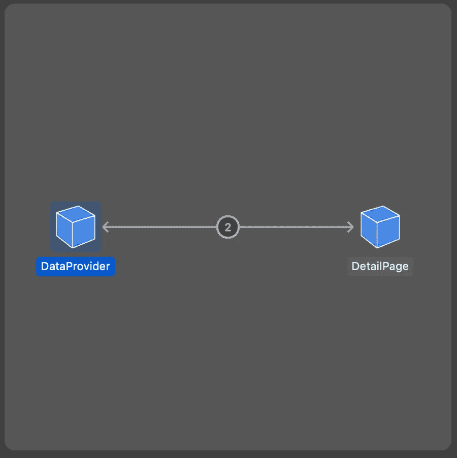

# 使用 Xcode 的内存图查找内存泄漏

> 原文：<https://betterprogramming.pub/using-xcodes-memory-graph-to-find-memory-leaks-f6650cf69ade>

## 查找和打破保留周期


照片由 [Soragrit Wongsa](https://unsplash.com/@invictar1997?utm_source=unsplash&utm_medium=referral&utm_content=creditCopyText) 在 [Unsplash](https://unsplash.com/s/photos/memory?utm_source=unsplash&utm_medium=referral&utm_content=creditCopyText) 上拍摄

代码运行不理想有很多原因。在一篇文章中，我向您展示了如何使用[时间分析器](https://developer.apple.com/videos/play/wwdc2016/418/)来测量代码中每个方法花费的时间，以及如何分析结果。

虽然使用这些工具可以发现、分析和修复许多与性能相关的问题，但是内存使用情况通常必须进行稍微不同的调试。尤其是和内存泄漏有关的时候。

在今天的帖子中，我将向您展示如何使用 Xcode 中的内存图工具来分析为您的应用程序保留在内存中的对象，以及如何使用该工具来发现内存泄漏。今天，我将特别关注保留周期。

# 激活内存图

当您使用 Xcode 运行应用程序时，您可以点按位于您的代码和控制台之间的内存调试器图标，或者如果您没有打开控制台，可以点按 Xcode 窗口底部的图标:


当您点按此图标时，Xcode 会对您的应用程序的内存图以及每个对象与其他对象的关系进行快照。

您的应用程序的执行将被暂停，Xcode 将向您显示当前在内存中的所有对象。请注意，这可能需要一点时间，具体取决于您的应用程序有多大。


在左侧的边栏中，Xcode 显示了它发现的所有对象的完整列表。

当您在侧边栏中选择一个对象时，中间部分将显示您选择的对象，以及它与其他对象的关系。有时候，是大图，就像截图里那样。其他时候，它是一个只有几个对象的小图。

如果 Xcode 发现它怀疑是内存泄漏或保留循环的关系，它会在边栏中的对象后面添加一个带问号的紫色正方形。

在你刚刚看到的截图中，紫色方块在哪里是相当明显的。如果它们更隐蔽，或者您只想过滤内存泄漏，您可以使用侧边栏底部的 filter 菜单，如下面的屏幕截图所示:


上面的截图显示，两个不同对象的实例被保存在内存中，而 Xcode 认为它们不应该被保存。当您单击其中一个时，问题会立即显现出来。



本例中的`DataProvider`和`DetailPage`相互指向对方。保留周期的经典例子。让我们看看这是如何发生的，以及您可以做些什么来修复它。

# 了解保留周期是如何发生的以及如何修复它们

在 iOS 中，当没有其他对象保持对对象的强引用时，对象将从内存中删除。您在应用程序中创建的每个对象实例都有一个保留计数。

每当您将对对象的引用传递到代码中的不同位置时，它的保留计数都会增加，因为现在又有一个对象指向该对象在内存中的位置。

这个保留计数的原则主要适用于类。因为，当你在代码中传递一个类的实例时，你实际上是在传递一个内存引用，这意味着多个对象指向同一个内存地址。

当你传递值类型时，值在传递时被复制。这意味着值类型的保留计数通常总是 1；永远不会有一个以上的对象指向值类型的内存地址。

为了从内存中移除一个对象，它的引用计数必须为零；内存中不应有任何对象引用该地址。

当两个对象相互引用时，这是使用代理时经常出现的情况，有可能这两个对象的引用计数从未达到过零，因为它们相互引用。

请注意，我在本节开始时提到了一个`strong`参考。我是故意这样做的，如果我们有一个强引用，肯定有一个像`weak`引用这样的东西，对吗？有！

弱引用是对引用类型的实例的引用，这些引用不会增加引用所指向的对象的引用计数。这里应用的原则与在闭包中使用[弱自](https://www.donnywals.com/when-to-use-weak-self-and-why/)完全相同。

通过使委托成为一个对象的属性`weak`，委托和它的拥有者不再互相存活，两个对象都可以被解除分配。在我们看到的示例中，这意味着我们需要更改以下代码:

```
class DataProvider { 
  var delegate: DataDelegate? 
  // rest of the code 
}
```

变成以下内容:

```
class DataProvider { 
  weak var delegate: DataDelegate? 
  // rest of the code 
}
```

要做到这一点，`DataDelegate`必须被约束为一个类，您可以通过将`: AnyObject`添加到您的协议声明中来做到这一点。例如:

```
protocol DataDelegate: AnyObject { 
  // requirements 
}
```

当您再次运行应用程序并使用内存图来查找保留周期时，您会注意到不再有紫色方块，内存图看起来与您预期的完全一样。

# 概括起来

在本文中，我向您展示了您可以使用 Xcode 来可视化和探索您的应用程序的内存图。这有助于您找到内存泄漏并保留周期。

当单击内存中的一个对象时，您可以探索它与其他对象的关系，最终您可以跟踪保留周期。您还了解了什么是保留周期，它们是如何发生的，以及如何打破它们。