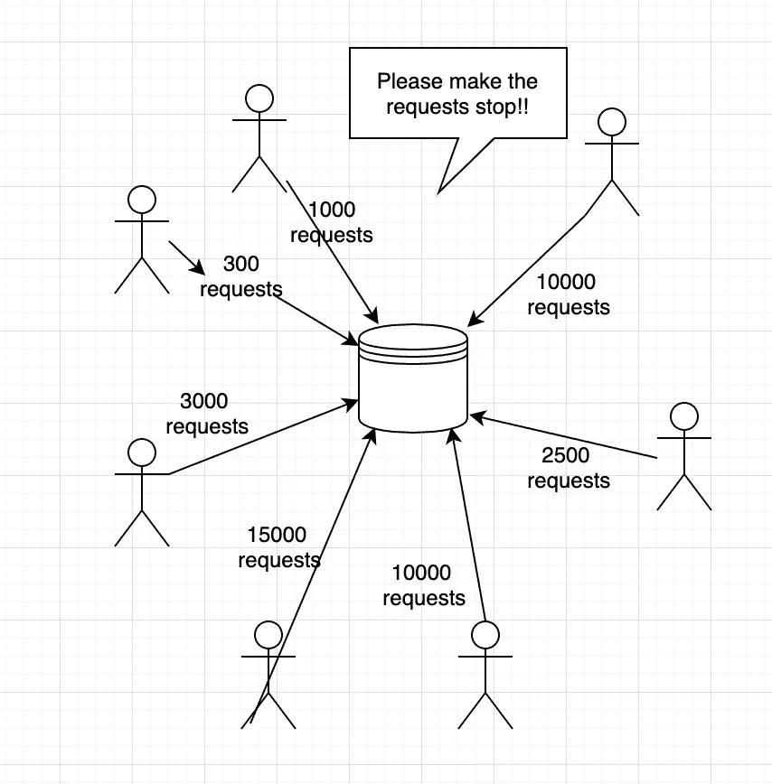
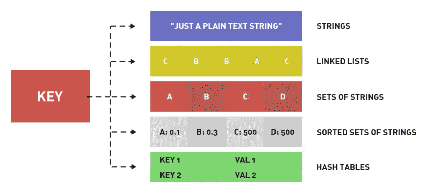

# 通过系统设计面试

> 原文：<https://betterprogramming.pub/walking-through-the-system-design-interview-679a408c048f>

## 如果我们有 10 亿用户呢？你的设计还能扩展吗？

由 [You X Ventures](https://unsplash.com/@youxventures?utm_source=unsplash&utm_medium=referral&utm_content=creditCopyText) 在 [Unsplash](https://unsplash.com/search/photos/white-board?utm_source=unsplash&utm_medium=referral&utm_content=creditCopyText) 上拍摄的照片

如果你没有经历过技术面试，那么你可能不知道系统设计面试是什么样的。

一轮系统设计面试通常只涉及一两个大问题，面试官会要求你设计一个通常已经存在的系统或应用程序。

这些轮不仅仅是软件工程师。数据工程师、支持工程师甚至数据科学家会发现自己不得不设计系统来复制 TinyUrl、Twitter、Instagram、优步或停车场应用。

# 系统设计为什么重要？

这个问题的目的是超越你的标准数据结构和算法问题。面试官希望确保你能考虑全局。

他们希望看到你思考操作场景、边缘情况、限制和假设。不是所有的工程师都想要这种技能。一些程序员只想专注于编程，而不是大局。

但是大局是重要的(与我的[讽刺经验丰富的工程师](https://medium.com/better-programming/top-signs-of-an-over-experienced-programmer-22bbe0b57663)的重点相反)！澄清一下，总体情况始于最终用户，止于后端。一些人可能会认为，最近的波音事故有一个糟糕的系统设计。听起来，实际的软件和硬件运行良好，但最终用户方面没有得到正确处理。这是工程师必须考虑的事情。即使您的系统是按规格设计的，也不意味着应用程序或硬件会被正确使用。

工程师从初级到高级的方式是希望关注更大的图景，并在这些边缘情况发生之前看到它们。

所以问题就变成了，你如何承担系统设计面试问题？

# 特征

你的第一步应该是列出你要设计的功能。例如，如果你正在设计一个 Instagram 复制，那么你可能需要能够上传图片，评论/喜欢，并关注用户。老实说，Twitter 并没有太大的不同，只是它更关注文字，而不是图像。

这一阶段的重点只是规划出你将要深入的领域。如果面试官有他们感兴趣的具体特征，这也给了他一个机会引导你向不同的方向发展。

你可以从一些基本功能开始。其他像搜索、趋势和故事这样的概念也可能被加入进来，因为它们更具时代感。

# 数据库

一般来说，在讨论应用程序之前，我觉得从数据库开始最舒服。

例如，在 Twitter 的例子中，我们现在可以将其简化为三个表。那就是用户、推文和关注者。有很多其他功能，在某些时候可能需要被包括在内，包括喜欢和趋势。但是你的时间有限，如果你的面试官没有深究，那就不要在细节上纠缠。这是关于高层次的设计，所以没有必要讨论数据库的类型和每个特定的字段。

如果您试图一次添加太多的特性和表来支持上述特性，很快就会变得过于复杂。

# **基础设施**

一旦表格开发完成，你现在可以关注另一方面:用户以及他们如何与应用程序交互。我们现在假设这是一个应用程序，因此你将有一个手机发出请求，更有可能是标准的 HTTPS 向某种面向外部的负载平衡器发出请求。

在内部，您的系统可能有几个服务，然后接受来自负载平衡器的请求。

在这种情况下，您可以分解服务。例如，可能有针对用户、推文和时间线或提要的服务。当你登陆应用程序的主页时，提要可能是应用程序提供的常见服务之一。

这是一个关键点，因为它让我们知道 Twitter 是一个阅读量很大的应用程序。当你向前设计时，注意这一点很重要，因为它改变了你设计后端的方式。

如果你还记得，之前我们粗略地设计了一个数据库来管理推文。

我们目前的基础设施存在一个问题。

最终用户登录他们的手机，手机向负载均衡器发送请求以获取提要。然后，网关向提要服务发送一个请求，提要服务需要在获取信息之前向数据库发送一个请求。

像 ML 模型、数据源和分析仪表板这样的预先计算实际上很常见。这是因为数据库很难管理成千上万的请求。

您曾经尝试过在数据库上运行 select 语句吗？即使您与数据库有某种父子关系，或者添加了许多节点，它也不能很好地扩展——拥有数百万用户和数 TB 的数据会使这个过程非常缓慢。

想想看，如果一个用户想要获得他们的订阅源，并且他们关注了 300 个人，那么你将不得不发送 300 个选择 user_id 等于 1–300 的查询，或者编写某种大规模的“user_id IN ("1 "，" 2"…"300 ")”，这两种方法都非常慢，并且当数百万用户开始查询数十万关注者时，最终会使服务器陷入瘫痪。

twitter 会如何处理这件事？

有什么想法吗？

一般来说，面试官可能会在这一点上通过添加假设来刺激你的设计，比如如果用户一夜之间翻倍会怎样。这将迫使你不仅要考虑功能，还要考虑规模。

这是系统设计面试的重点之一。他们不只是想看到你可以编程特性，他们还想看到你可以为规模设计。

在这种情况下，答案是他们在用户提出请求之前预先计算好时间线，并将其存储在内存中。特别是，他们可能会在内存数据库中使用一个 [Redis](https://codeburst.io/redis-what-and-why-d52b6829813) 。

首先，我们需要将 tweet 发送到 Redis DB，以便 tweet 能够持久。现在，我们将推文发送给关注此人的所有关注者。这就是扇出部分发挥作用的地方。该推文现在将在每个关注者时间线中更新。无论用户当前是否登录，此更新都会发生。这样，查询的计算不需要实时进行。

图片: [Redis 数据结构](https://keestalkstech.com/2019/04/building-a-high-performing-last-viewed-list-using-redis/)

家庭时间轴本质上可以由 tweet _ ids 的数组或列表来表示，当用户登录时，可以从 tweet 表中快速提取这些数据。从普通用户的角度来看，这有助于处理规模问题。

# 边缘案例和规模

在开发这个应用程序时，您需要考虑更多的概念。

例如，你将如何处理一个用户拥有数百万追随者的极端情况？对数百万用户进行预计算仍然是理想的吗？

使用预计算技术，你能预见到任何问题吗？

当你在做系统设计面试时，回答一个问题通常只会引出另一个问题。

所以一定要考虑到边缘情况！

简化设计，你会补充什么？

对于我们这些喜欢思考整个系统的人来说，系统设计面试实际上很有趣。它们很有挑战性，让你超越编码。

系统 A 将如何与系统 B 交互？当我们增加用户或增加新的国家时会发生什么？

如果停电或 AWS 中断怎么办？

回答所有的“如果”并提出好的解决方案是我个人的最爱。所以不要让系统设计面试回合吓到你。想几个应用程序，试着设计出来！