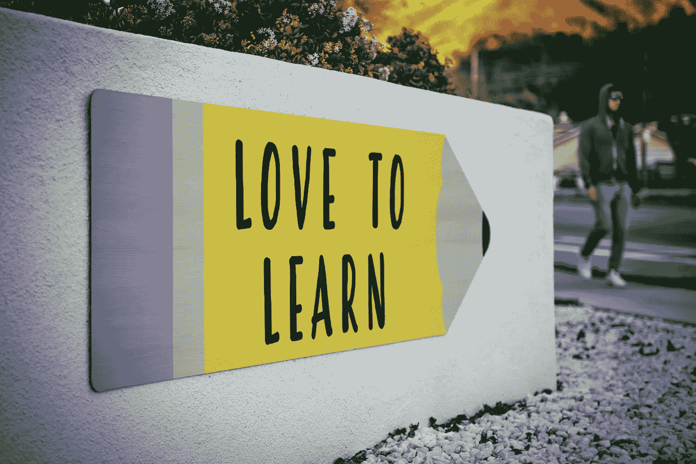

# 想切实提高？停止沉迷于代码教程

> 原文：<https://betterprogramming.pub/want-to-actually-improve-stop-obsessing-over-code-tutorials-a0eefad58091>

## 更多的是理解代码，而不仅仅是阅读更多的教程

蒂姆·莫斯霍尔德在 [Unsplash](https://unsplash.com/s/photos/learning?utm_source=unsplash&utm_medium=referral&utm_content=creditCopyText) 上的照片

每个有思想的开发人员都知道这一点:当学习新的语言、框架或其他与代码相关的东西时，教程是你的面包和黄油。它们很容易理解，让你做出令自己惊叹的东西。但是它们能让你到达你想去的地方吗？

阅读教程会阻碍你真正的学习潜力。跟随一步一步的教程似乎令人满意，但是在尝试一个之后，你有没有想过你刚刚学到了什么？两三周后，当你需要再次做类似的事情时，你还记得这件事吗？

# 我的个人教程之旅

作为一名网站开发人员和一家代理公司的老板，我每天编写代码，指导实习生，解决我的初级新员工无法解决的问题。但我也把大部分编程工作留给了我的员工，因为我正忙于新的业务和项目创意。

当我需要开始一个项目或者为一个项目建立一个新的基础时，我通常会跳到教程上来开始。随着我的同事们的进步和了解的更多，我发现越来越难回答为什么我选择了某种方法或者为什么某种方法比另一种编码方法更好的问题。这让我很沮丧。

经过长时间的思考，我知道了。我只是按照一个教程，但我从来没有回答为什么的问题。例如，我只是遵循了某段代码，并接受了它应该这样做。但是为什么要这样做，我从来没有想过，也从来没有真正感兴趣。我从事的是寻找解决方案的工作，而不是获取新技能或拓展知识。

# 以不同的方式学习教程

自从意识到这一点，我开始以不同的方式阅读教程。这比以前花费了更多的时间，这在一开始令人沮丧，但在后来的过程中非常令人满意。

在每一步的指导或解释中，我都会问自己，“我真的理解为什么和如何理解吗？”通常情况并非如此。我为什么需要一个教程呢？如果没有，我需要做更多的研究，看看某个函数是做什么的，深入代码行，逐行查看它做什么，并确保理解它在做什么。

在这次调查中，跟随教程变得越来越有学习性，而不仅仅是跟随并在几分钟内找到解决方案。

在这个过程中，我还收集了关于特定代码语言、框架或应用程序的笔记。这样，我需要写下一段代码实际上在做什么，为什么它会这样工作，以及它在幕后是如何表现的。在这个过程中，记录这个学习路径对我帮助很大。

## 用笔记优化学习

当我跟随教程学习时，我经常会打开多个笔记。例如，在学习 Laravel 框架的一些东西时，我有一个专门针对本教程的笔记，在那里我写下了我需要做什么以及为什么要做。但是这是对框架 Laravel 的更深入的研究，也是对 PHP 语言的更深入的研究。

在遵循教程的同时，我需要做一些特定于教程的事情。过了一会儿，我偶然发现了 Laravel 的一个我不知道的特性，于是我打开了 Laravel 的文档和代码库。我试图抓住背后的逻辑，并把我的笔记写在 Laravel 笔记中。再深入一点，我看到一些只在 PHP 7.4 中使用的东西，我以前从未使用过，我去研究了一下。

当你看到一些东西时，你真的进入了兔子洞。一件事导致另一件事。像这样有条理的笔记有几个好处:

*   写笔记有助于你更好地记住信息。
*   有条理的笔记会让你更容易回想你已经做过的事情。
*   笔记让你对最近学习的内容的回顾变得更有趣，这样你就能记住更多的信息。

# 完全远离教程

下面是下一步:当你试图做某件事时，停止阅读教程。这真的是帮助我更快升级的东西。当然，对你正在做的事情有一个良好的基础知识是必要的。在软件开发方面变得更加熟练会使这变得更容易。

这几年，我几乎再也不看任何教程了。当我需要做一些我不知道的事情时，我首先求助于文档。试图从文档中找出一些东西是如何工作的通常要好得多，并且迫使你自己去思考解决方法。一开始这可能很难，但是当你真的想提高你的学习和软件开发技能时，这是至关重要的。

尝试研究更广泛的概念，如架构、设计模式和最佳实践。让更有经验的开发人员来审查你的代码可能也会有所帮助。对我来说，这是让我以更快的速度提高的原因。

Emile Perron 在 [Unsplash](https://unsplash.com?utm_source=medium&utm_medium=referral) 上的照片

# 开始读书

正如我在关于阅读文档的上一部分中所建议的，下一步是开始阅读更多的书。与教程不同，书籍通常并不真正针对一个精确的解决方案，而是更多地涉及更高层次的概念和更深层次的知识。虽然我总是觉得书枯燥无味，理论性很强，但随着我的进步，我对它们越来越感兴趣，可能是因为我对写下的东西理解得更好了。

我也在上面的方法中使用书籍。如果我不确定某个特定的 Javascript 函数，我会拿起《雄辩的 JavaScript》这本书来研究这个主题。

在读书的过程中，我做笔记时也有同样的做法。我经常有一个特定的读书笔记，但也会将信息写在特定的 JavaScript ES6 笔记中，或者我有的 React 或 Vue.js 笔记中。

祝你在新的学习旅程中好运，我希望这能帮助你提高你正在做的事情。

想保持联系，有问题，或者评论？
**在** [**推特**](https://twitter.com/kayintveen) 上加入对话