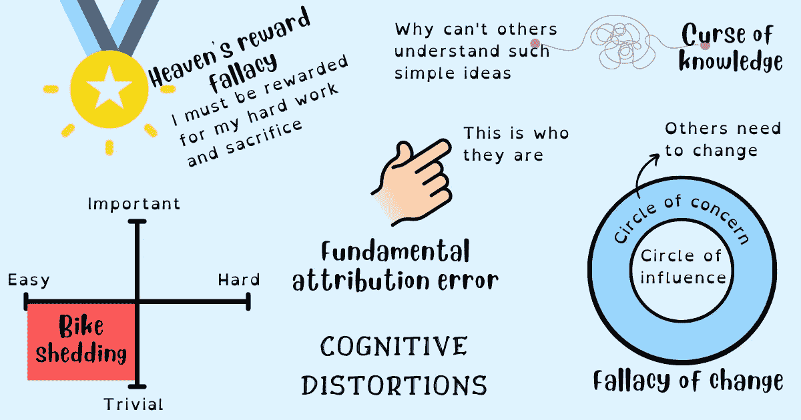

# 想在工作中有效沟通？消除这 5 种认知扭曲

> 原文：<https://betterprogramming.pub/want-to-communicate-effectively-at-work-eliminate-these-5-cognitive-distortions-679caa76cd2a>

## 偶尔的思维错误会让我们对现实形成不准确的看法并坚持下去，从而影响我们的行为和行动



鸣谢:作者

在关于认知扭曲的第一部分中，我写了五种认知扭曲，它们通过削弱你清晰思考的能力来影响你的决策。

在这篇文章中，我将讲述影响沟通的五种认知扭曲:

1.  天道酬勤谬论
2.  知识的诅咒
3.  基本归因错误
4.  变化的谬误
5.  自行车脱落

让我们开始吧。

# 天道酬勤谬论

我们都希望自己的努力和付出能得到表扬。我们都想被欣赏，被关注，被奖励。但是我们做的很大一部分工作往往不被人注意。总是对别人做好事不会总是有好结果。努力工作，牺牲，用无止境的工作耗尽我们自己，并不会让成功更有可能。

寻求外部奖励和外部认可只会导致失望、愤怒、[、沮丧和怨恨，因为现实往往与我们的期望不符。](https://www.techtello.com/frustration-at-work/)

那些受天道酬勤谬论影响的人很难[说不](https://www.techtello.com/how-to-say-no-to-last-minute-requests/)。他们认为，如果他们不断对别人做好事，别人也会对他们做好事，或者如果他们总是乐于助人，别人也会在他们需要的时候帮助他们。

但是这个世界是不公平的。不断给予别人并不能保证回报。

## **天道酬勤谬误认知扭曲的例子**

假设你正在领导一个大项目。你认为这个项目是展示你的技能、证明你的价值和进入职业阶梯下一步的机会。因此，[你格外努力工作](https://www.techtello.com/hedonic-treadmill/)，牺牲家庭时间，甚至周末和深夜都在工作，以确保没有任何事情阻碍它的成功。但是就在最终交付的前几周，公司决定终止这个项目。

组织内部的重组导致了公司战略的改变——你的项目，曾经被认为是非常有价值的，现在不再有用了。

思维错误——我做了我被要求做的事情，公司改变战略不是我的错——你必须为你迄今为止所做的所有努力和牺牲获得回报，当回报没有到来时，这只会导致愤怒、失望和痛苦。

## **如何解决**

为了避免这种认知扭曲的影响，不要根据你想要达到的具体结果来考虑你的努力。相反，用你的进步、你正在学习的东西和你正在如何提高来描述它。

通过寻求内部认可，而不是外部衡量你的价值，并重新定义你的奖励，从表现到学习，你可以将你的行动与你的原则和价值观结合起来，并将你的精力用于变得更好，而不是寻求特定的职位、奖励或认可。

简而言之，将输入与输出分离。

# 知识的诅咒

知识的诅咒是一种认知偏见，在这种偏见中，特定领域的专家或在特定领域知识渊博的人做出错误的假设，认为其他人与他们有相同的背景和知识。

被知识诅咒会使与他人分享知识变得无效——大多数人要么不理解它，要么信息不持久。发生这种情况是因为知道一些事情会让你更难想象其他人没有达到他们的水平，他们仍然有很多事情要做。不了解他人的心理状态会造成他们传达的内容和他人理解的内容之间的脱节。

那些受知识诅咒影响的人使用抽象的语言，在没有建立明确联系的情况下在主题之间切换，或者使用只有对主题有深刻知识的人才理解的短语和行话。

> “我们很多人都有特定领域的专业知识。成为某方面的专家意味着我们越来越着迷于细微差别和复杂性。这时，知识的诅咒开始发作，我们开始忘记不知道自己知道什么是什么感觉。”—奇普和丹·希斯，《为坚持而生》

## **知识认知扭曲的诅咒的例子**

假设你是一名高级工程师，负责指导一名刚加入你团队的初级工程师。在知识的诅咒下，你可能会跳过给出上下文，解释术语，或者某些事情在团队中是如何完成的。

成为你的事情的专家，并且花了这么多时间做好它，会让你忘记你刚开始做的时候并不是专家。当初级工程师对你刚刚说的话或如何做某件事表现得一无所知时，他们无法跟上你的计划增加了你的挫败感。

## **如何应对**

为了避免这种认知扭曲的影响，使用费曼技巧——就像你在和一个五岁的孩子说话一样交流。关注基本概念及其关系，远离复杂的词汇和行话，使用容易理解的单词和短语。

简而言之，如果你是某个特定领域的专家或希望有效沟通的领导者，请记住你现在知道的和你以前知道的之间的差距，并使用简单的语言来传达你的想法和策略。

# 基本归因错误

根本归因错误或归因偏差是一种认知扭曲，在这种扭曲中，我们在没有分析促成他们行为的情境因素的情况下，就对人们做出判断或打上“这就是他们”的印记。

我们对某人了解得越少，我们就越容易给他们贴上标签，将他们的行为归因于他们的性格，然后坚持这些假设，而不考虑他们可能在其中运作的限制和约束。

当同事拒绝你的会议邀请时，你认为他们很粗鲁吗？

*当同事拒绝帮忙时，你会说他们傲慢吗？*

这样判断性格是一种有缺陷的思维方式。使用有限或不完整的信息，而不考虑其他观点或其他可能影响他们行为的因素，可能会破坏沟通，影响合作，甚至让某人丢掉工作。

> “我们错误地认为性格是统一的、无所不包的，这非常类似于我们处理信息的一种盲点。
> 
> 心理学家将这种倾向称为基本归因错误(FAE)，这是一种有趣的说法，即当涉及到解释其他人的行为时，人类总是会犯下高估基本性格特征的重要性和低估情境和背景的重要性的错误。”—马尔科姆·格拉德威尔，《引爆点》

基本归因错误的发生是因为我们的大脑在自动驾驶仪上运行，他们选择了简单而自动的个人归因，而不是复杂而故意的情境归因。没有经过深思熟虑的思考，我们就会走捷径。

当我们给人们贴上难以相处、无能、懒惰、粗心或愚蠢的标签时，我们并不认为我们的判断有什么错，因为我们相信我们对现实的看法。

## **基本归因错误认知扭曲的例子**

假设你是一家在线教育公司的高管。你有一个新的团队成员，Rhea，今天加入领导你的新业务计划。

在一次清晨与 Rhea 和其他高管的会议中，你注意到 Rhea 一直心不在焉。她似乎迷路了，一直在查看手机，而不是试图与他人交流。Rhea 的妈妈住院了。她第一天上班就来到办公室，但现在很担心，等待着丈夫的回复，他正在医院照顾妈妈。

没有和 Rhea 谈过，也不了解她为什么心烦意乱，你可能会说她不可靠、傲慢或不适合这个角色。

## **如何解决**

你不能完全消除[基本归因错误](https://www.techtello.com/fundamental-attribution-error/),因为它源于你的大脑需要应用快捷方式，而这些快捷方式通常是必要和有益的——在你所有的互动中进行深思熟虑的思考是不可能的，因为它太慢了。

但是，当风险很高时，你可以通过问这些问题来避免基本的归因错误:

*   为什么这个人会这样？
*   在什么情况下，我可以看到自己或他人有类似的行为？
*   什么样的环境因素会导致这种情况？

放慢速度，停下来寻找证据，让你找到不同于默认设置的方向。

简而言之，地图不是领土。故事总比你想象的要复杂。

# 变化的谬误

这种认知扭曲伴随着一种信念，即我们的成功和幸福取决于我们周围的人，改变他们是获得我们想要的东西的唯一途径。

*只有当我的老板不再对我进行微观管理时，我才会对自己的工作感到满意。*

*只有当我的队友不再反对我，并开始倾听我要说的话，我的工作才会更有意义。*

期望别人改变是一种谬误——给别人施加压力、操纵他们或者鼓励他们改变并不能保证幸福，因为真正的幸福不是外在的。它来自内心。

认为别人是你问题的根源，并期望你周围的每个人都改变，除了你自己，这让你专注于别人的行为和行动——你无法控制的事情——而不是你自己的行为和行动——你可以控制的事情。

这不同于对某人的行为表示失望或指出他们的错误——你对他们的改进并不感兴趣，而是出于让他们做你想做的事情的愿望。试图控制他人会产生冲突——他们可能会感到被攻击或被推来推去，这进一步增加了冲突，使他们更抗拒改变。

## **变化谬误认知扭曲的例子**

你可能认为你的团队不欣赏你的想法，没有充分听取他们的意见就拒绝了他们。这让你反感他们。你开始隐瞒并停止分享你的想法，认为除非你的团队改变态度并开始倾听你的想法，否则分享毫无意义。

怨恨他们或期望他们同意你不会发生。相反，把你的注意力从“我怎样才能让别人听到我的声音？”到“我如何贡献价值？”

*   确定你传达想法的方式需要改变的地方。
*   你对团队需要什么的理解有差距吗？
*   告诉他们他们不喜欢你的想法，以及你可以如何改进。

## **如何解决**

不要通过假设你的痛苦是他们的错或者除非别人按照你期望的方式行事，否则你的需求无法得到满足来要求别人改变，而是为你自己的行为和决定——你做了或没做的事情——承担责任。期待别人改变是徒劳的。你唯一能改变的人就是你自己。

> “一个人的气质没有错。但是他们的行为、态度和选择可能有很多问题。他们已经做了很长时间的选择，所以这不是我们能轻易改变的。我们不能保证他们会做出正确的选择，但我们可以选择如何应对这些选择。”—迈克·贝克特尔

简而言之，把你的精力放在你自己的行为和行动上，不要浪费在试图改变他人上。

# 自行车脱落

当我们在琐碎的事情上花费过多的时间，却忽略了重要的事情时，认知扭曲，也被称为琐碎的帕金森定律就会显现出来。

我们都参加过[会议](https://www.techtello.com/too-many-meetings-at-work/)，在这些会议上，次要或不重要的问题占据了大部分时间，留给更复杂问题的时间更少，或者讨论被转移到琐碎的事情上，使得复杂的问题很少受到关注。

这是因为讨论一个简单的问题感觉很舒服——在我们的能力范围内，它更容易理解，需要更少的认知资源，并允许我们与他人分享我们的观点。另一方面，复杂的问题需要更多的工作——未知、不确定性和问题的性质需要仔细分析。你可能没有完全理解其中的复杂性，或者觉得表达自己的观点有风险。

当你把复杂的任务一拖再拖，同时在你的待办事项清单上勾掉简单的任务时，骑车族也会影响你个人。将琐碎的工作优先于更重要的工作只会给你一种效率很高的[幻觉。看起来更容易的任务需要更少的时间来完成，让你相信你是有效率的，但是推迟从长远来看更有价值的工作，同时分配更多的时间给琐碎的任务是浪费你的时间。](https://www.techtello.com/are-you-keeping-busy-or-being-productive/)

## **自行车脱落认知扭曲的例子**

假设你是一家软件公司的高级工程师，负责新产品的设计。这项任务很复杂，涉及许多未知因素。

不要把大部分时间花在那些复杂的元素上(什么是故障点，什么是可接受的容错，要使用的技术堆栈)，而是花更多的时间考虑数据库表的名称，决定 API 端点，重构现有代码，或者承担其他简单的任务。

如果你以推迟重要而复杂的任务为代价，继续做简单的工作，而这些任务很难处理，但却能为项目增加更多价值，那么骑车族就是有效的。

## **如何解决**

为了避免在小组讨论中出现骑自行车的情况，为所有只有一个议程项目的会议设定一个明确的目标，并要求小组指出讨论偏离了轨道。

在《聚会的艺术》中，Priya Parker 说“特殊性”是成功讨论的关键因素。换句话说，每次会议都需要有一个集中而明确的目的。思考会议的目的也有助于你决定邀请谁——最好不要邀请那些没有相关知识和经验的人。

就个人而言，对于你自己的工作来说，意识到骑车是抵消其影响的起点——不要把琐碎的事情看得比重要的工作更重要。

简而言之，困难的问题可能需要更长的时间来解决，但也更有效。他们帮助你克服恐惧，迎接挑战，掌握新技能，从而推动你前进。

# 摘要

1.  认知扭曲限制了你有效沟通的能力。
2.  在天道酬勤谬论的影响下，你期望你所有的努力、付出和牺牲都能得到回报。当这些回报没有到来时，你可能会表现出失望、沮丧、怨恨和不满。
3.  知识的诅咒让你更难意识到别人没有分享你的知识和专业水平。你用一种别人很难理解的方式交流。
4.  基本归因错误使你将他人的行为和行动与他们的性格联系在一起，而没有考虑情境和其他因素。
5.  改变的谬误让你专注于改善他人，而不是从内部审视自己的行为和行动。
6.  骑车会让你花更多的时间关注琐碎的事情，而不是优先处理复杂的问题。

```
Follow me here and on [Twitter](https://twitter.com/techtello) for more stories. This story was originally published at [https://www.techtello.com](https://www.techtello.com/avoid-these-cognitive-distortions-to-communicate-effectively/).
```