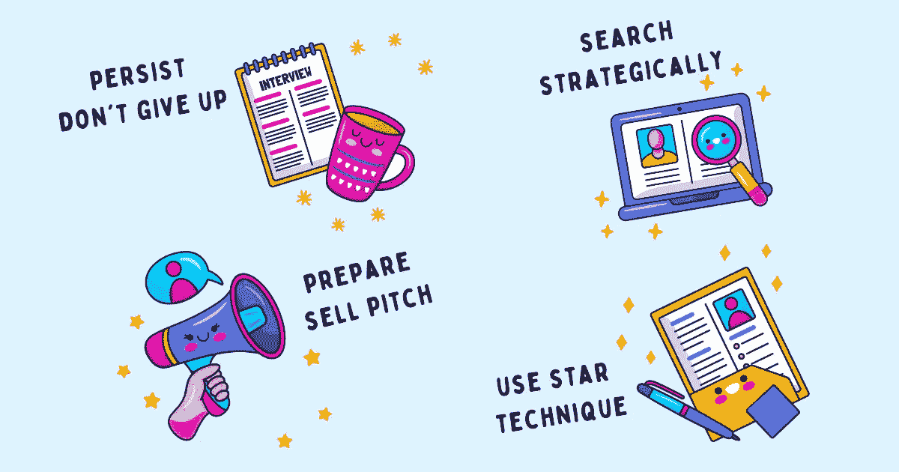

# 想被录用吗？要找到合适的工作，你需要做以下事情

> 原文：<https://betterprogramming.pub/want-to-get-hired-heres-what-you-need-to-do-to-land-the-right-job-9d548790ac40>

## 我们都想要梦想中的工作，并且永远做下去。但是这个世界是不公平的，大多数事情不会以我们期望的方式结束。

鸣谢:作者

随着经济的不确定性，许多公司不仅宣布冻结招聘，而且还在缩小整个部门和非盈利计划的规模。

接任 Twitter 首席执行官的 Elon Musk 最近将员工人数削减了一半。该公司解雇了全球 7500 名员工中的 45-50 %,称这是必要的，因为该公司每天损失超过 400 万美元。紧随马斯克之后的是马克·扎克伯格，他宣布了公司历史上最大规模的裁员，以削减成本。最近有 11000 人被 Meta 解雇。

继 Meta 和 Twitter 之后，微软、亚马逊和其他科技公司在动荡的宏观经济环境中解雇了数千名员工。

无论你是被迫找另一份工作，还是有人把它作为一种选择，找另一份工作的过程从来都不容易。不遵循良好的实践而犯错误会降低你按时找到工作的可能性，增加压力，甚至可能在精神上和经济上伤害你。

如果你想被自己选择的公司录用，这里有一些好的做法可以遵循。

> 从今天起，你所做的选择将引导你一步一步走向你应得的未来——克里斯·莫瑞

# 有意识地花时间在社交媒体上

大多数人在找工作时会求助于社交媒体。虽然像 LinkedIn 和 Twitter 这样的平台可以把你和其他处境相同的人联系起来，让你获得关于潜在工作的宝贵信息，甚至可以帮助你与其他志同道合的人建立联系，但不知道如何利用它们也是有害的。

当你没有意识到你是如何在社交媒体上度过时间的时候，你可能最终会:

1.  对信息超载感到不知所措。内容太多了。你如何从噪音中分离出信号？
2.  因为阅读凸显你恐惧的内容而感到气馁和害怕。如果这么多人被解雇，失去工作，你还有什么机会？
3.  浪费太多时间去滚动阅读信息或者与实际上没有增加真正价值的人交流。

如果你的目标是尽快找到合适的工作，你需要战略性地利用这些平台。我并不是建议你脱离现实，但是淹没在负面信息中或者无意识地花时间浏览信息对你没有好处。相反，请这样做:

1.  在你的关系网中找出那些被安排到你正在寻找的职位或工作的人。给他们留一张私人便条，询问他们是否有空缺，请求介绍和联系，以帮助你找到合适的工作。
2.  避开那些只分享信息而不提供帮助的人。他们在那里是为了获得追随者和喜欢，并不真正关心你的工作。相反，寻找那些真正参与改变的人。他们总是会留下如何联系他们的信息，或者利用他们的关系网给你提供工作信息和其他有用的联系方式。
3.  在 LinkedIn 等平台上查找招聘信息，联系他们的人力资源，看看是否有空缺。
4.  当你对未来不确定时，你的大脑会自动试图寻找更多的负面信息。不要助长它的恐惧。
5.  限制花费的时间。一旦你访问了这些网站，计划好你打算做什么，就这么做，然后退出。

有意识地计划你让什么进入你的生活——通过避免消极和采取更平衡的观点——会让你感觉在控制之中。控制感会鼓励你向前看并采取建设性的行动，从而停止沉思。

> 我们选择关注什么，选择忽略什么，这决定了我们的生活质量

# 准备推销

你可能在技术上很棒，有出色的协作技巧，或者你可能在处理冲突方面很出色。但是如果你不能让他们看得见，你所有的专业知识、技能和能力都没有用。

面试中最重要的品质是知道如何推销自己。你不能仅仅因为你被解雇了或者厌倦了以前的工作，就指望别人雇佣你。说“我在寻找更好的机会”很棒。但它没有谈到为什么他们应该在众多候选人中选择你。

> 如果你不知道为什么要雇用你，他们也不会知道――弗兰克·索南伯格

这就是你的“个人推销”发挥作用的地方——你的独特之处，是什么让你脱颖而出，你带来了什么，以及你如何为组织的成功和发展做出贡献。

当回答大多数雇主倾向于问的问题“你为什么要找工作”时，简要地谈谈你被解雇的事实或寻找新工作的任何原因。然后转换话题，把他们的注意力转移到你的优势和技能上。只有当他们看到你将为组织和团队带来的价值时，他们才会为你而战，并试图让你加入。

# 运用明星技术

大多数组织会问行为面试问题，以判断你解决问题的能力，你如何处理困难的情况或评估你的工作经验和总体工作风格。

这被认为是更好地了解你的一种非常有效的方法。用你过去的行为来预测你未来的表现，有助于决定你是否适合他们想要的角色。你对工作中各种情况的反应和回应为你如何与他人沟通、协作和工作提供了有用的信息。

以下是一些常见的行为面试问题:

*   告诉我你最近在工作中遇到的挫折，以及你是如何处理的。
*   告诉我最近一个你不得不在压力下工作的项目。你面临过哪些挑战，又是如何克服的？
*   告诉我你犯错误的时候。后来你做了什么？
*   告诉我你与同事发生冲突的时候。你是怎么处理的？

如果你没有准备好或者不知道如何很好地组织你的想法，很难回答这些问题。这就是 STAR 技术(S =情境，T =任务，A =行动，R =结果)在回答行为面试问题时非常有效的地方。

它是这样工作的:

1.  **情境**:根据所提问题呈现情境。设定场景，分享背景，给出必要的细节来描述发生的事情。
2.  **任务**:描述一下在那种情况下你的职责是什么。面试官会看你在这种情况下想要达到什么目的。
3.  **动作**:你做了什么？面试官会询问你做了什么，为什么这么做，有什么选择。
4.  你行动的结果是什么？你通过自己的行动实现了什么？你达到目标了吗？你从这次经历中学到了什么？从那以后你用过这种学习方法吗？

确保选择一个故事——即使是在谈论你的失败和错误的时候——一个积极的结果，无论是学习还是你采取的改进措施。

# 坚持，不要放弃

与人接触，做后续工作，接到电话，准备面试，然后出现是精神和身体上的疲惫。当你焦急地等待消息时，如果事情不是你所期望的那样呢？在面试过程中，拒绝、没有回应或漫长的等待周期是很常见的。

你不能失去希望。你不能放弃。

做好应对失望的心理准备。答应自己不要止步于第一次、第二次甚至第十次拒绝。只有你坚持不懈，不断尝试，你才会成功。

> 尽管不确定前方会发生什么，但我们必须愿意向前迈进。我们必须相信，今天看起来对现在没有影响的行动实际上正在朝着积极的方向积累，这只会在未来的某个未知时刻向我们揭示。健康的实践每天都在发生

以下是处理拒绝时要提醒自己的几件重要事情:

*   拒绝不是衡量你价值的标准。
*   你只有不断努力才能找到工作，而不是屈服于消极的想法而无所事事。
*   此刻看起来如此艰难的一切或者你不得不面对的困难都只是暂时的。
*   一旦你找到了合适的工作，你所有的努力都会有回报。

我们都想得到梦想中的工作，并永远留在其中。但是这个世界是不公平的，大多数事情不会以我们期望的方式结束。与其浪费时间回味过去，不如遵循这些做法，获得你选择的工作，创造你应得的未来——对社交媒体要有战略眼光，准备你的*推销*，使用明星技巧，不要放弃。

> 有些雇主确实想要你。是的，你。但找到你不是他们的工作。找到他们是你的工作。―理查德·N·博尔斯

# 摘要

1.  找合适的工作是一个累人的过程。当你没有遵循正确的做法时，你找到合适工作的机会不仅会减少，未知未来的压力和焦虑也会伤害你的个人福祉和心理健康。
2.  虽然 Twitter 和 LinkedIn 等社交媒体平台有助于找到你想要的工作，但没有战略性地使用它们可能会导致无意识的滚动、强烈的负面情绪，甚至可能证实你的非理性恐惧。
3.  你的技能和能力很重要。但同样有用的是能够突出你的优势。除非面试官明白你的独特价值，否则你不可能在面试过程中脱颖而出。
4.  行为面试问题被大多数组织用来根据候选人过去的表现来评估他们未来的表现。使用 STAR 技术来准备对一些最常见问题的回答。
5.  做好最坏的打算，而不是最好的情况。当面试结果对你不利时，感到失望是可以的，但是不要让失望变成失败。不断尝试，只向前看。

在这里和[推特](https://twitter.com/techtello)上关注我，了解更多故事。这个故事最初发表在 https://www.techtello.com 的。