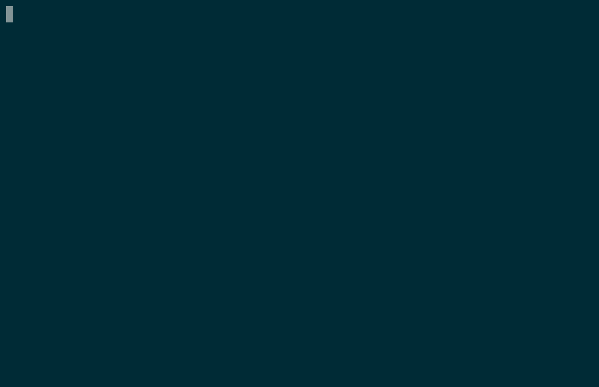

# 最简单的节省时间的方法？

> 原文：<https://betterprogramming.pub/want-to-know-the-easiest-way-to-save-time-use-make-eec453adf7fe>

## 用“造”！


[rawpixel](https://unsplash.com/@rawpixel?utm_source=medium&utm_medium=referral) 在 [Unsplash](https://unsplash.com?utm_source=medium&utm_medium=referral) 上的“佩戴圆形白色手表的人”

人们总是在寻找使他们的工作更容易的方法。使用工具和自动化是人类独有的特征还是其他物种共有的，这是一个有争议的问题。事实是，我们试图将最平凡的任务外包给机器——这很好！

# 为什么要自动化？

重复往往会导致厌倦和疲劳。无聊是走向倦怠的第一步，而疲劳是错误的主要来源。因为我们不想让我们的同事(或我们自己)筋疲力尽，就像我们不想犯代价高昂的错误一样，我们试图自动化日常任务。

致力于普通任务自动化的软件似乎越来越多。在节点中。仅 JS 生态系统，就有(或曾经有)像 Bower、Yeoman、Grunt、Gulp 和 NPM 脚本这样的解决方案。

但是也有一个很好的标准 UNIX 工具。所谓标准，我的意思是它实际上有健壮的文档，这是许多其他工具似乎已经忘记的。我说的是`make`。更具体地说，这篇文章关注的是 GNU make，它可以在 macOS、Windows、Linux 和大多数其他操作系统上使用。

`make`非常标准，你已经安装了。在命令行中输入“make ”,然后自己检查。这款软件于 1977 年问世，这意味着它基本上经过了实战考验。很古怪吗？是的，即使是 70 年代的标准。但它做得很好，这是我们对它的全部期望。

# 难道 Make 不是针对 C/C++代码的吗？

当你读到`make`的时候，你可能会想起过去有这样一个工具来构建 C/C++项目。事情是这样的`./configure && make && make install`。是的，我们谈论的是完全相同的工具——它不局限于编译 C/C++代码。说实话，它连代码都不会编译。

几乎所有`make`理解的都是文件。它知道一个文件是否存在，以及哪个文件是最新的。它的另一半功能是维护依赖图。它并不多，但这两个特性就是它的力量所在。

为了让`make`真正做任何事情，你要写一套食谱。每个配方由一个目标、零个或多个依赖项以及零个或多个规则组成。目标是您想要获取的文件。依赖项是创建或更新目标所需的文件。这组规则描述了将依赖关系转换为目标的过程。例如，假设您想要在 Node.js 包中自动安装:

```
node_modules: package.json
	npm install
```

这意味着文件`node_modules`(是的，目录也是文件)可以通过运行`npm install`规则从文件`package.json`中导出。还和我在一起吗？

现在，这些依赖项也可以是其他目标。这意味着我们可以链接不同的规则集并创建管道。例如，我们可以让测试结果目录依赖于构建目录，构建目录依赖于`node_modules`目录，而`node_modules`依赖于`package.json`。见鬼，我们甚至可以动态地创建`package.json`，使它成为另一个规则的目标。还记得我提到的`make`跟踪哪个文件是最新的吗？这为我们节省了时间。如果没有这个特性，每次我们运行`make test`(按照上面的例子)我们将不得不从头开始运行整个链(`npm install`，构建，然后测试)。但是如果什么都没有改变，为什么要再次安装包呢？为什么要建？为什么要进行测试？

这才是`make`真正出彩的地方。在确定作业顺序的同时，它会检查目标和依赖项的时间戳。只有在以下情况下，它才遵循该规则:

*   一个或多个依赖项比目标更新
*   目标不存在。

还有一件事！由于`make test`不会实际创建一个名为`test`的文件，我们需要添加这个目标作为`.PHONY`目标的依赖——另一个约定。像这样:

```
.PHONY: test

test: build
	npm test

build: node_modules
	npm build

node_modules: package.json
	npm install
```

在我们上面的例子中，`package.json`中的一个单独的改变将导致从头开始构建一切。但是如果我们只改变其中一个测试的代码，`make`会跳过测试之前的所有步骤，前提是依赖关系写得正确。

# 但是我使用的语言已经有了自己的构建系统

许多现代编程语言和环境都有自己的构建工具。Java 有 Ant，Maven，和 Gradle，Ruby 有它的 Rake，Python 用 setuptools。如果你担心我会把那些玩具拿走，换成`make`，那你就错了。

这样来看:把一个人介绍给你的团队并让这个人富有成效需要多少时间？这意味着建立开发环境，安装所有的依赖项，配置每个移动部分，构建项目，运行项目，甚至可能将项目部署到开发环境中。

新员工会在几个小时内开始实际工作吗？几天？希望不是几周。记住，在设置过程中浪费的不仅仅是新员工的时间。当事情出错时，有些人也会被许多问题困扰(他们通常会这样)。

我喜欢在我的项目中使用一个惯例。因为这是多个项目共有的约定，所以人们可以在它们之间自由迁移。每一个新项目或每一个新介绍的人都需要学习这个惯例，以达到期望的结果。这个约定假设项目有它们自己的 Makefiles，带有一组预定义的目标:

*   安装所有可能需要的外部应用程序。通常这是用一个`Brewfile`和 Homebrew/Linuxbrew 完成的。由于这一步是可选的，编码人员可以选择自己的安装方法，风险自担。
*   `make dev`建立本地开发环境。通常，它构建并调用 Docker 容器，但是由于`make`充当了包装器，它可以很容易地被任何需要的东西替代(比如`npm serve`)。
*   `make deploy`将代码部署到选择的环境中(默认情况下是它的`development`)。在引擎盖下，它通常运行 Ansible。
*   `make infrastructure`这是`make deploy`的先决条件，因为它首先使用 Terraform 来创建所述环境。
*   `make all`生产部署所需的所有工件。

你知道这意味着什么吗？这意味着强制性的`README.md`可以关注项目的业务需求，并概述一些协作过程。我们在最后附上上面的列表，这样每个人都知道这些目标是什么。这意味着当你进入一个新项目时，你所要做的就是`make prepare`和`make dev`。几个 CPU 周期之后，你面前就有了一个工作项目，你就可以开始破解了。

# 我有一个持续的集成管道

在这一点上，有些人可能会注意到我在说什么。工件、步骤、部署、基础设施。这就是我们的持续集成/持续部署管道所做的。我肯定是这样的！但是请记住，CI/CD 不仅仅是在每次弹出新的提交时运行测试。

正确实施的 CI/CD 使重现问题和执行根本原因分析变得更加容易，从而有助于减少调试。怎么会？版本化的工件就是这样一种方法。它们可能有助于找到根本原因，但不一定有助于解决问题。

要修复这个 bug，你需要修改代码并生成你自己的版本。你明白我的意思吗？如果您的 CI/CD 管道可以本地镜像，开发人员可以测试和部署微小的更改，而不需要实际使用 CI/CD 管道，从而缩短周期。使您的 CI/CD 管道在本地可用的最简单的方法是用一个薄薄的包装器包裹住`make`。

假设你有一个后端和一个前端，并且你对它们也有一些测试(如果没有，你在没有测试的情况下疯狂的运行 CD！).这将产生四个不同的 CI 任务。他们可以被概括为`make backend`、`make test-backend`、`make frontend`、`make test-frontend`。或者任何你想遵循的惯例。

这样，无论是在本地机器上还是在 CI 上，代码都以完全相同的方式构建。涉及完全相同的步骤。进入你的`Jenkinsfile`或`.travis.yml`(或其他)的命令越少，你就越不依赖神圣的构建机器。

# 好吧，但是真的有人用 Make 吗？

事实证明，是的。如果你环顾四周，你会发现像“Makefiles 卷土重来的时候了”(Jason Olson)这样的文章。“Makefile 的力量”(Ahmad Farag)。“重写我们的部署工具:从 Makefile 到 Bash，然后再回来”(Paul David)。或者“面向 Node.js 开发人员的 Makefile”(Patrick he naise)。这些都是去年的文章，不是上个世纪的回忆。

是的，我不得不承认`make`很笨重。我知道它的许多缺点和怪异的语言特征。但是给我展示一个更好的实际开发工作流自动化工具，我会很乐意转换。在那之前我会 ROTFL 看着这个:



[https://asciinema.org/a/dQb0jENCYWsBOCC9UiKxxKG4x](https://asciinema.org/a/dQb0jENCYWsBOCC9UiKxxKG4x)

如果你想驾驶它，可以在 GitHub 上找到它。

# 酷，现在给我看看代码

以下是一些摘录，向您展示使用`make`的可能性。

```
.PHONY: dev

.stamps:
	@mkdir -p $@

.stamps/git-hooks.installed: | .stamps
	# This checks whether git-hooks is an executable and installs it with
	# Homebrew/Linuxbrew is possible.
	@if ! command -v git-hooks >/dev/null 2>&1; then \
	  if command -v brew >/dev/null 2>&1; then \
	    brew install git-hooks; \
	  else \
	    echo "You have to install https://github.com/icefox/git-hooks"; \
	    exit 1; \
	  fi; \
	fi
	@touch $@

.git/hooks.old: | .stamps/git-hooks.installed
	git hooks --install

dev: | .git/hooks.old
	pip install -e .[dev]
```

这个代码片段建立了一个简单的开发环境。因为我们想确保所有开发人员在使用 Git 时使用相同的预提交挂钩，所以我们为他们安装了这些挂钩。

为此，我们需要安装 git-hooks(这是钩子管理器的名字)。我们利用 git-hooks 将原始钩子移动到`.git/hooks.old`的知识，因此我们检查这样一个文件的存在，以确定我们是否想要运行`git hooks install`。

我们在这里使用的一个技巧是`|`来表示仅顺序依赖。如果您只想确定某个东西存在，而不是它比目标修改得更快，那么只有顺序的依赖关系是最好的选择。我想，到目前为止还不错。

现在假设我们想要构建一个 Docker 容器，其中包含一个我们不能在源代码中分发的文件。

```
WEBAPP_SOURCES = $(sort $(notdir $(wildcard webapp/**/*)))

all: webapp

.stamps: Makefile
	@mkdir -p $@

third-party/top_secret.xml:
	# WEB_USER and WEB_AUTH_TOKEN are variables that should contain credentials
	# required to obtain the file.
	@curl -u "$(WEB_USER):$(WEB_AUTH_TOKEN)" https://example.com/downloads/this_is_a_secret.xml -L -o $@

webapp: .stamps/webapp.stamp
.stamps/webapp.stamp: .stamps webapp/Dockerfile third-party/top_secret.xml $(WEBAPP_SOURCES)
	docker build -t example/webapp -f webapp/Dockerfile webapp
	@touch $@

.PHONY: all webapp
```

由于我们不能使用 Docker 创建的实际文件(因为图像有严格的权限)，我们只能退而求其次。我们创建一个空文件，表明我们已经在一个时间点成功运行了`docker build` *。*

这种文件的一个常见约定是称它们为“戳记”。我们的 Docker 图像标记显然依赖于`Dockerfile`，依赖于源文件和另一个目标，后者运行`curl`从环境变量中获取文件获取凭证。

因为我们不想将凭证打印到输出中，所以我们在命令前面加上了`@`。这意味着规则本身不会打印到屏幕上。然而，规则的输出并没有消失。如果您想要运行的任何程序有将敏感信息记录到 stdout 或 stderr 的倾向，请记住这一点。

好，我们可以设置 git 挂钩，我们可以建立一些 Docker 图像。为什么不让开发人员在云中创建他们自己的环境，并在其上部署呢？

```
# We include the previous Makefile so we can build the image
include previous.mk

.stamps/webapp_pushed.stamp: .stamps/webapp.stamp
        docker push example/webapp
        @touch $@

infrastructure: $(INFRASTRUCTURE_SOURCES)
        cd deployment/terraform && terraform apply

deploy: all infrastructure
        cd deployment && ansible-playbook -i inventories/hosts deploy.yml

.PHONY: infrastructure deploy
```

作为代码和配置管理的实际基础设施超出了本文的范围。我来告诉你，`terraform apply`管理云资源，`ansible-playbook`在远程机器上进行配置。你可能知道`docker push`是做什么的。简而言之，它将本地映像推送到 Docker Hub(或任何其他注册表)，因此您可以从任何地方访问它。至此，我相信您可以理解上面的代码片段是做什么的了。

# 这个工具是给谁用的？

尽管 DevOps 最近越来越受关注，但是在 Dev 和 Ops 之间仍然有很大的距离。有些工具仅由开发人员使用，有些仅由运营人员使用。有一点共同点，但能达到多远取决于团队。

开发包管理、源代码布局和编码指南都是开发的领域。代码、配置管理和编排等基础设施是运营部门的玩具。构建系统和持续集成管道可能在两者之间分开，也可能属于任何一方。你能看到共同点是如何被拉长的吗？

改变事物，允许更广泛的合作。因为它服务于开发和运营的目的，所以它是一个共同点。每个人都说它的语言，每个人都可以做出贡献。但是因为它非常容易使用，即使当你想做复杂的事情时(就像在我们上面的例子中)，DevOps 的真正力量被赋予了团队中的每个人。每个人都可以运行`make test`，每个人都可以修改它的规则和依赖关系。每个人都可以运行`make infrastructure`，为开发或生产提供一个好的集群。毕竟它们是用同一个代码记录的！

当然，当有共同点时，确定谁负责哪个部分是很好的。您最不希望的事情就是开发人员和运营人员重写彼此的工作！但是伟大的团队合作总是依赖于伟大的沟通，所以无论有没有`make`都可能发生。

因此，如果您使用任何与 DevOps 相关的新潮技术，都没有关系。你可能不需要也不想要任何 Docker，Cloud，Terraform 或者 Travis。你可以编写桌面应用程序，无论其价值如何，精心编写的`Makefile`仍然是 DevOps 的推动者。