# 想做开发者赚更多的钱？开始销售 API

> 原文：<https://betterprogramming.pub/want-to-make-more-money-as-a-developer-start-selling-apis-5f0b7e9a44ec>

## 了解如何构建 API 并从中获利


图片由[视觉故事||米歇尔](https://unsplash.com/@micheile?utm_source=medium&utm_medium=referral)在 [Unsplash](https://unsplash.com?utm_source=medium&utm_medium=referral)

你知道卖你的 API 可以赚钱吗？构建和销售 API 是创造新的被动收入来源的好方法。

因此，在本文中，您将看到如何做到这一点！首先，你将从头开始创建一个 API，然后你将在 [RapidAPI](https://rapidapi.com/hub?utm_source=Catalin-Pit&utm_medium=DevRel&utm_campaign=DevRel) 上出售它！

# 什么是 API？

让我们先回顾一下 API 是什么。缩写 **API** 代表应用编程接口，是两个计算机程序之间进行通信的一种方式。

简单地说，它是一个软件，通过一组预定义的功能为其他程序提供服务。其他程序不需要知道 API 实现，因为函数描述了如何使用 API。您通过请求与 API 通信，有四种类型的请求:

1.  `GET`请求-获取所有信息
2.  `POST`请求-创建新数据
3.  `PUT`请求-更新现有数据
4.  `DELETE`请求-删除数据

API 公开了不同的端点，这些端点是 URL，您可以向它们发出四个请求中的任何一个。

每当你访问互联网上的一个网页时，你最有可能与一个 API 进行交互。例如，当您访问一个社交媒体平台的新闻提要时，您向该平台的 API 发出 GET 请求以获取人们的帖子。或者，当你在手机上查看电子邮件或天气应用程序时，你会与一个 API 进行交互。

# 现实世界的类比

让我们以一家花店为例来看一个真实世界的类比。

你去花店买些花。你走进商店，向花店老板要一束定制的花束。花店有一份你可以使用的所有鲜花和装饰品的清单。你选择花和装饰品，然后下订单。花店准备了你要的定制花束，一旦准备好了，他们就会给你送去。你买了花束，离开了商店。

因此，您(客户端)向花店(API)发出了一个带有自定义数据的请求。花匠去花店 atelier(服务器/数据库)把你的花束带回来(API 响应)。

## **为什么选择 API？**

API 的使用加快了开发时间和过程。它还简化了开发人员的工作，因为他们可以使用现成的解决方案。没有必要重新发明轮子，花时间去建造已经存在的东西。

让我们来看看谷歌地图，例如，开发者可以将它嵌入到应用程序和网站中。您可以简单地使用 Google 提供的地图，而不是每次需要时都构建地图。你能看到这样节省了多少时间和资源吗？

此外，它打开了你的工作赚钱的途径。您可以创建一个 API 并将其使用货币化。例如，每月前 1000 个请求可能是免费的。但是，在此之后，您可以对每个额外的请求收取 0.001 美元的费用。

因此，通过使用 API，您可以节省时间和资源，还可以将您的工作货币化！

# 你如何销售 API

RapidAPI 是互联网上最大的 API 中心，所以我们将利用它来赚钱！RapidAPI 的与众不同之处在于，它们允许开发者出售对其 API 的访问权。因此，你可以将你的 API 转化为收入流，甚至转化为被动收入。

此外，他们的平台允许开发人员发现和使用现有的 API。

## **这是什么意思？**

您可以使用 RapidAPI 平台来查找和使用所有类别的 API。例如，他们有翻译、飞行数据、文本到语音 API 等等。因此，您可以找到您的应用程序所需的任何 API。

此外，您可以使用多个 API，而不必担心不同的 SDK 和 API 密钥。借助 RapidAPI，您可以在一个地方使用多个 API 和**一个** SDK、API 密匙和仪表板——所有这些都在一个地方！

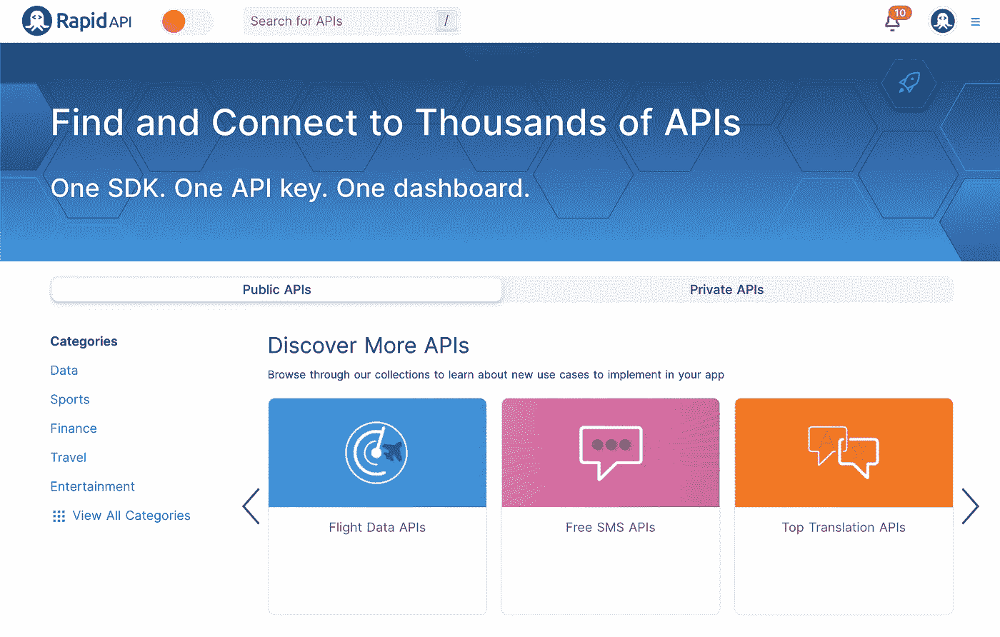

*图 1*

但是，还有更多！使用他们的平台，你还可以添加你的 API，并通过定价层出售访问权限。RapidAPI 为您创建了将 API 货币化的基础设施。你不需要担心做任何额外的工作来销售你的 API。你可以简单地上传你的 API，配置层并让开发者使用它。

在下面的图 2 中，你可以看到一个在线图片托管服务 Imgur 的例子，它将 API 货币化。他们有四个计划，每个计划都有相应的价格。您还可以看到任何额外的请求和上传的额外费用。

因此，人们可以选择适合他们需要的计划并开始使用它。通过这种方式，您可以将您的 API 转化为被动收入的来源！

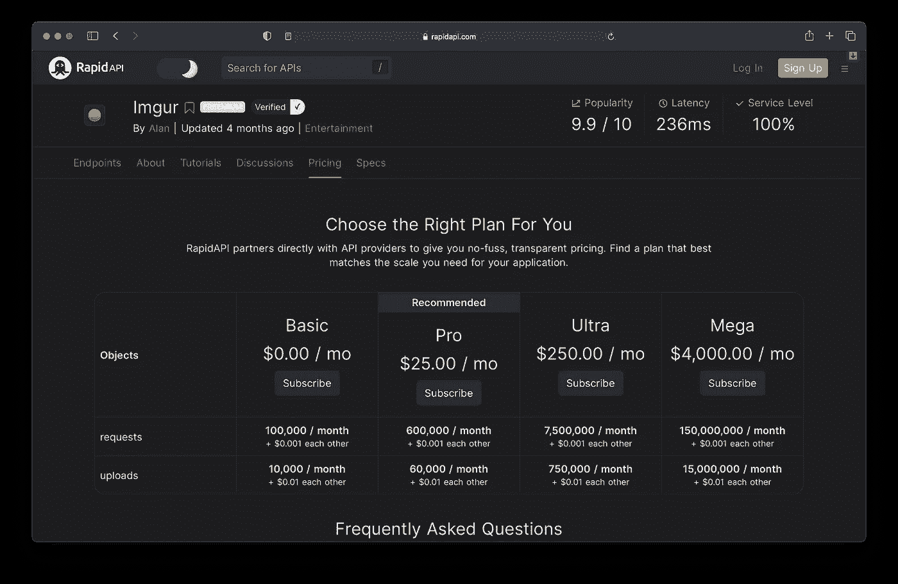

*图 2*

RapidAPI 最大的好处就是任何人都可以出售他们的 API。你不需要成为一个公司，一个受欢迎的开发者，或者任何类似的东西。谁都可以！

因此，让我们看看如何销售他们的 API！

## 构建和部署 API

*如果想直接跳到货币化部分，可以在这里*[](#setup-api-on-rapidapi)**。**

*在本文中，您将使用 Node.js 和 Express 构建一个非常简单的应用程序。本文的目的是展示如何将您的 API 货币化，因此您将创建一个只有一个端点的伪 API。*

*对于这个例子，您将使用 Express application generator，它创建一个应用程序框架。要启动生成器，请在终端中运行以下命令:*

```
*npx express-generator rapidapi-example*
```

*该应用程序只公开了一个端点`/users`，它返回一个带有虚假详细信息的人员列表。因此，开发人员可以使用这个简单的 API，在向公众发布应用程序之前，用虚假数据测试他们的应用程序。*

*让我们从修改框架应用程序开始。*

*打开项目`rapidapi-example`。打开后，进入`views`文件夹，打开`index.jade`。用以下代码替换内容:*

```
*extends layout

block content
  h1= title
  p Welcome to #{title}
  p See the available list of 
    a(href='/users') users*
```

*下一步是在根目录下创建一个文件夹。新文件夹将包含带有假用户的 JSON 文件。因此，您可以按如下方式创建新文件夹和文件:*

```
*mkdir data
touch data/users.js*
```

*接下来，打开`users.js`文件并添加以下代码:*

*在上面的代码中，您创建了一个人员数组，然后将其导出。这样做的原因是为了将数据导入到 API 中。*

*因此，让我们将数据导入 API。首先，转到`routes`文件夹，打开文件`users.js`。之后，通过在`var router`行下添加以下行来导入人员数组:*

```
*var users = require('../data/users');*
```

*接下来，用下面一行替换行`res.send('respond with a resource');`:*

```
*res.json(users);*
```

*现在，当人们访问端点`/users`时，他们得到 JSON 格式的人员数组。*

*在终端中从项目的根目录运行`npm start`来启动和测试应用程序。然后应用启动后，再去`localhost:3000/users`测试一下！*

*下面的图 3 展示了您应该看到的内容！*

*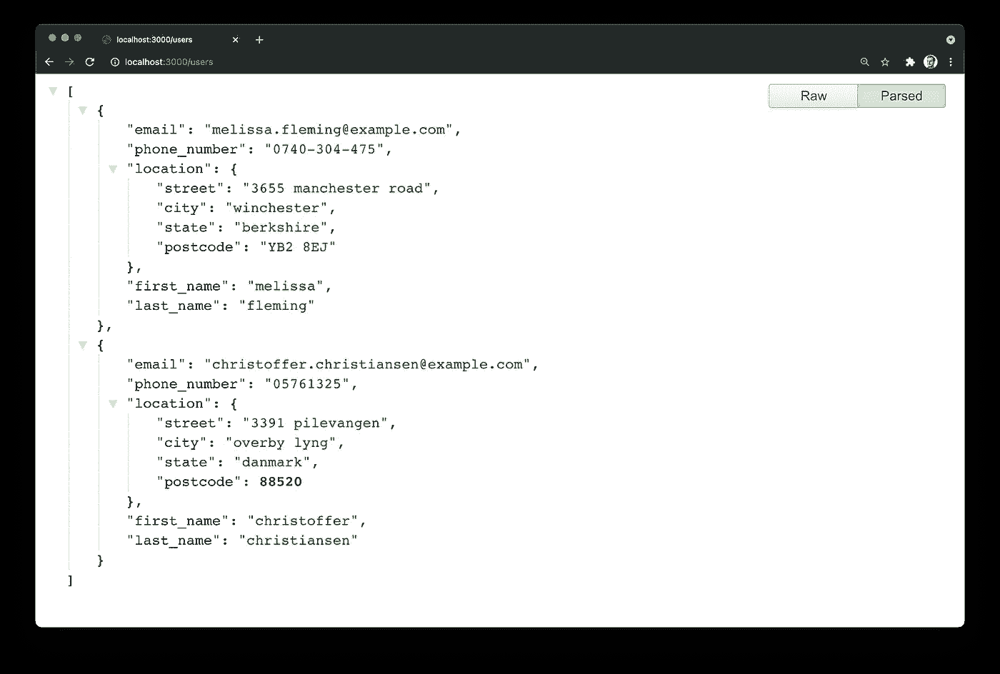*

*图 3*

*最终文件`users.js`应该如下所示:*

```
*var express = require('express');
var router = express.Router();
var users = require('../data/users');

/* GET users listing. */
router.get('/', function(req, res, next) {
  res.json({ users });
});

module.exports = router;*
```

*如您所见，该 API 只有一个端点，它返回一组带有虚假详细信息的人员。因此，在 RapidAPI 上发布 API 之前，您需要将其部署在托管服务上。*

*你可以在 [GitHub](https://github.com/catalinpit/rapidapi-example) 上看到我的知识库，以供参考。*

## *部署 API*

*有许多平台可以部署 Node.js 应用程序，但是在本教程中，您将看到如何在 Heroku 上部署。*

*本文展示了部署到 Heroku 的高级概述。如果你想要一个深入的指南，我推荐你查看一下[官方文档](https://devcenter.heroku.com/articles/git)。话虽如此，让我们快速部署新创建的应用程序吧！*

*第一步是登录 Heroku，进入[仪表盘](https://dashboard.heroku.com/apps)。在仪表盘上，点击“新建”按钮，然后选择“创建新应用”图 4 展示了您应该看到的内容:*

*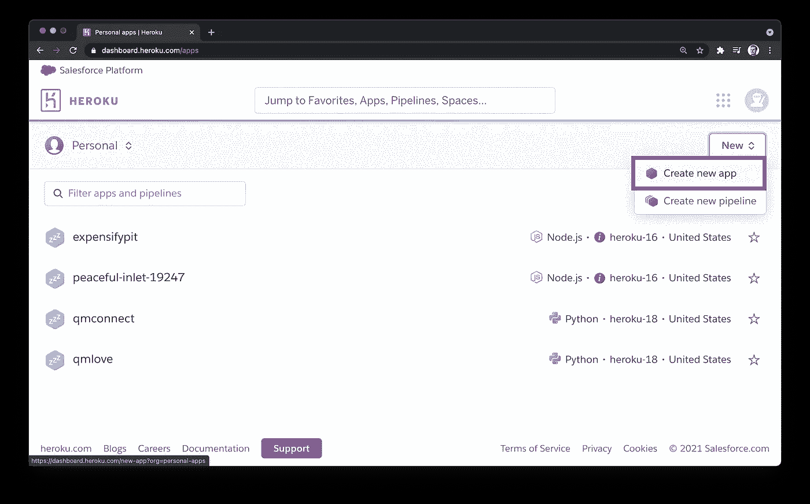*

*图 4*

*下一步是为您的应用选择**应用名称**和**区域**。您可以使用下面图 5 中的相同细节，也可以使用定制的细节。输入完详细信息后，单击“Create app”按钮，如图 5 所示:*

**

*图 5*

*点击“创建应用程序”按钮后，您将进入一个新页面，在此您可以找到部署详细信息。您可以使用 Heroku CLI 或 Github 部署您的应用程序。选择适合你需要的方法。*

*然而，在本教程中，您将看到如何使用 GitHub 部署到 Heroku。在“部署”页面上，选择“GitHub”方法进行部署。然后，搜索存储库名称，找到后，单击“Connect”按钮。*

*参考图 6！*

*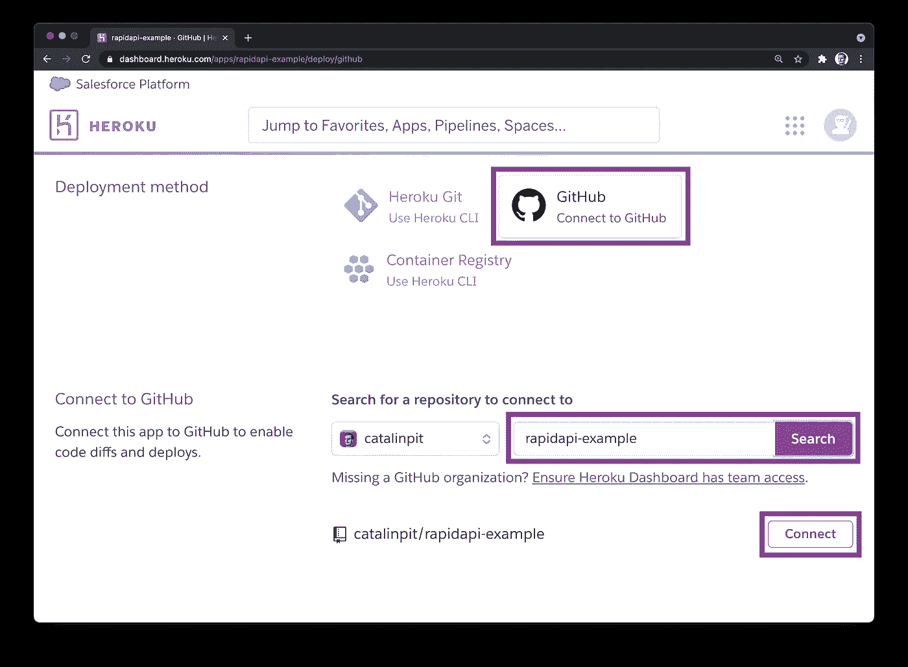*

*图 6*

*在进一步部署应用程序之前，您需要选择 API 的构建包。buildpack 是 Heroku 在部署应用程序时运行的脚本。它用于配置您的应用程序环境并安装应用程序所需的依赖项。因为 API 是用 Node.js 构建的，所以您需要安装`Node.js` buildpack。*

*如图 7 所示，转到 settings 页面并滚动，直到看到“Buildpacks”部分。*

**

*图 7*

*图 8 展示了向下滚动页面时应该看到的内容。现在点击“Add buildpack”按钮，如下面的图 8 所示:*

**

*图 8*

*当您单击“Add buildpack”按钮时，会出现一个新窗口，您可以在其中选择 node . js——参见下面的图 9。点击它，然后点击“保存更改”*

*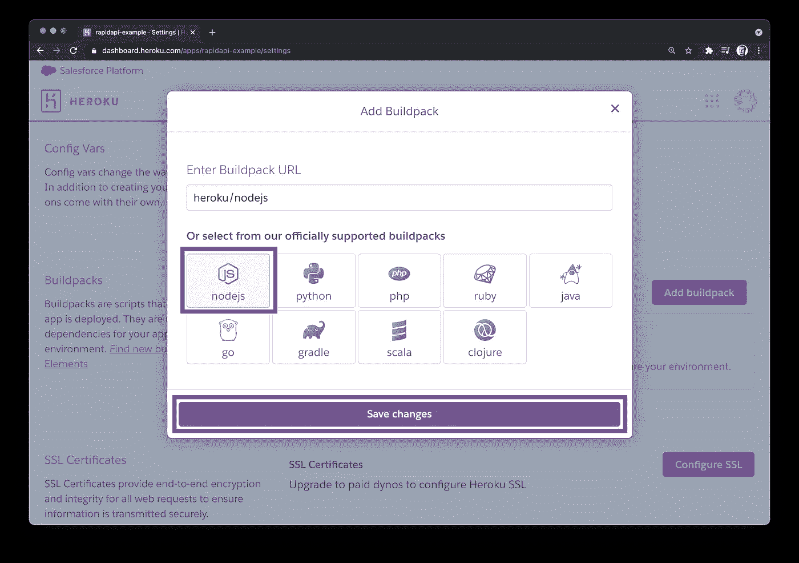*

*图 9*

*现在，您已经准备好在 Heroku 上部署应用程序了。首先，回到“部署”部分。如果找不到，这是图 7 中的第三个选项。*

*进入该页面后，滚动到页面底部查看“手动部署”部分此时，您应该看到一个显示“部署分支”的按钮来部署您的应用程序。请参考图 10。*

*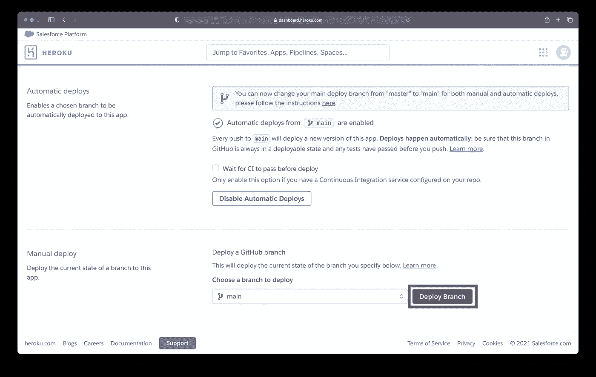*

*图 10*

*点击按钮触发部署，这应该在几秒或几分钟内完成。一旦部署了应用程序，您应该会看到一条成功消息，如图 11 所示。*

*您可以通过点击“查看”按钮在浏览器中打开 API！*

*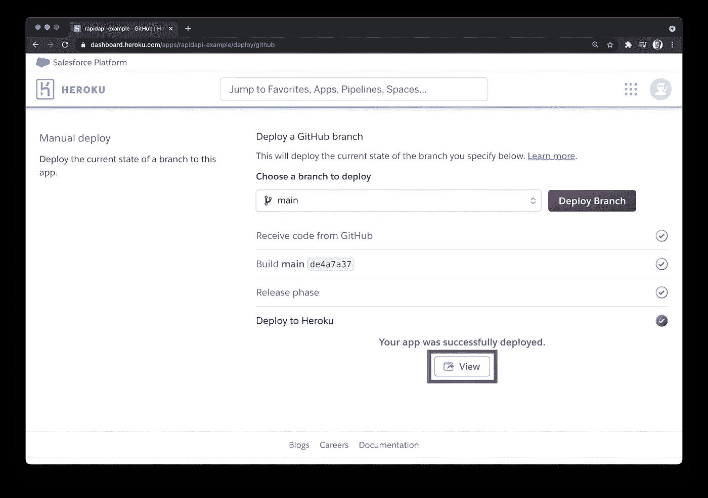*

*图 11*

*最后，您可以在 RapidAPI 平台上发布和销售您的 API 了。*

# *在 RapidAPI 上设置 API*

*在本节中，您将:*

*   *创建 RapidAPI 帐户*
*   *将 API 上传到平台*
*   *设置定价等级*
*   *向公众发布 API*
*   *等待被动收入*

*因此，让我们从第一步开始，这是关于创建一个 RapidAPI 帐户。要创建帐户，请转到 [RapidAPI Hub](https://rapidapi.com/auth/sign-up?utm_source=Catalin-Pit&utm_medium=DevRel&utm_campaign=DevRel) 并用您喜欢的方式注册。*

*按照说明操作，一旦注册成功，您应该会看到 RapidAPI Hub 主页，如图 12 所示。*

*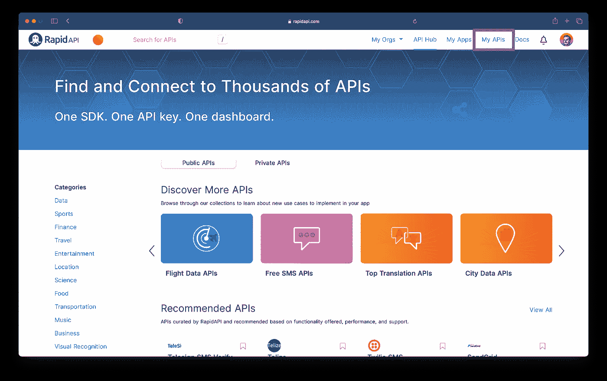*

*图 12*

*在主页上，您应该看到一个名为**我的 API**的选项(在图 12 中突出显示)。点击它，它会把你带到一个新的页面，在这里你可以添加你的 API。*

*此时，您应该与下面图 13 中的页面在同一页面上。*

*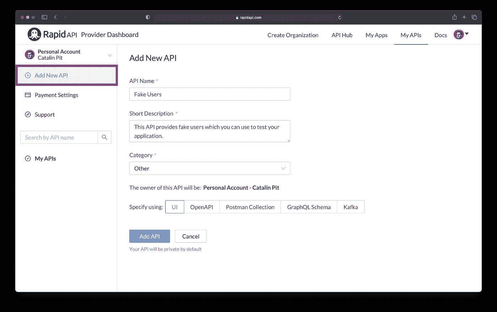*

*图 13*

*一旦进入这个页面，点击按钮**添加新的 API** ，它在图 13 中突出显示。下一步是输入关于 API 的详细信息:*

*   ***API 名称** —命名您的 API*
*   ***简短描述** —描述你的 API 做什么，这样人们就知道它的用途*
*   ***类别** —为 API 选择一个类别*
*   ***如何指定 API** —您可以从这五个选项中选择任意一个。但是，在本教程中，您将看到 **UI***

*输入所有细节后，点击蓝色按钮**添加 API** 。单击该按钮会将您带到 API 仪表板，如下面的图 14 所示。*

*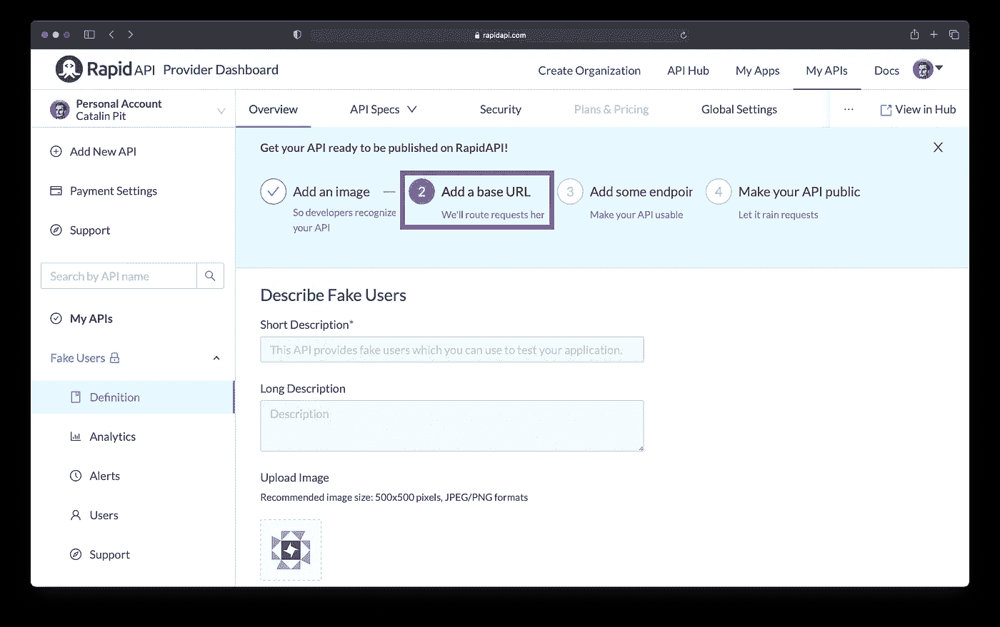*

*图 14*

*该过程的最后一步是输入您的基本 API URL，添加端点，并定义定价层。因此，单击上面图 14 中突出显示的第二步。*

## *添加基本 URL*

*下一步是为您的 API 添加基本 URL。基本 URL 是你的 API 的“主页”。例如，本教程中构建的 API 的基本 URL 是:*

```
*[https://rapidapi-example.herokuapp.com](https://rapidapi-example.herokuapp.com)*
```

*您需要添加基本 URL 的原因是您将有各种端点。然后，您需要在 RapidAPI 中单独配置每个端点。例如，这个 API 的唯一端点是:*

```
*[https://rapidapi-example.herokuapp.com/users](https://rapidapi-example.herokuapp.com/users)*
```

*接下来，通过点击**配置**按钮添加基本 URL，如图 15 所示。*

*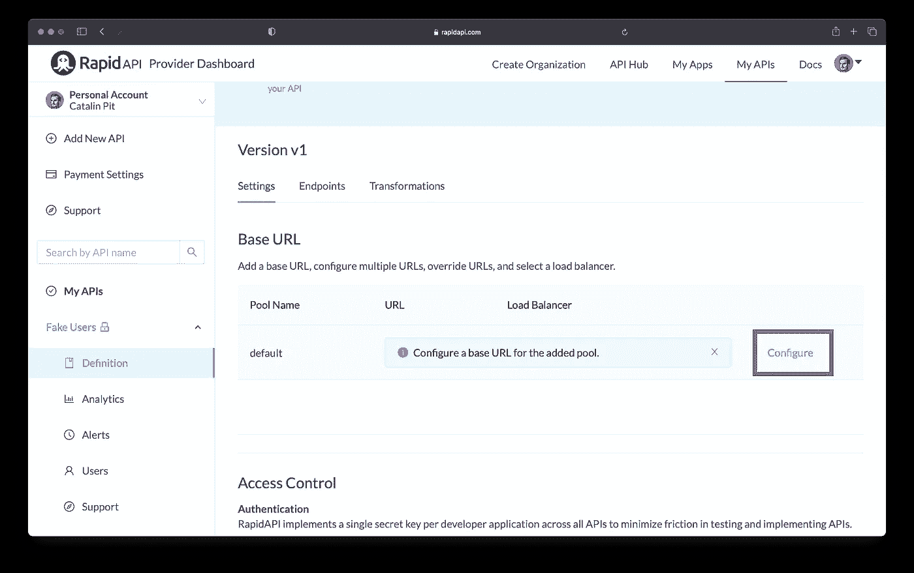*

*图 15*

*点击按钮后，会出现一个新的弹出窗口，您可以在其中输入 URL。输入，然后保存。*

*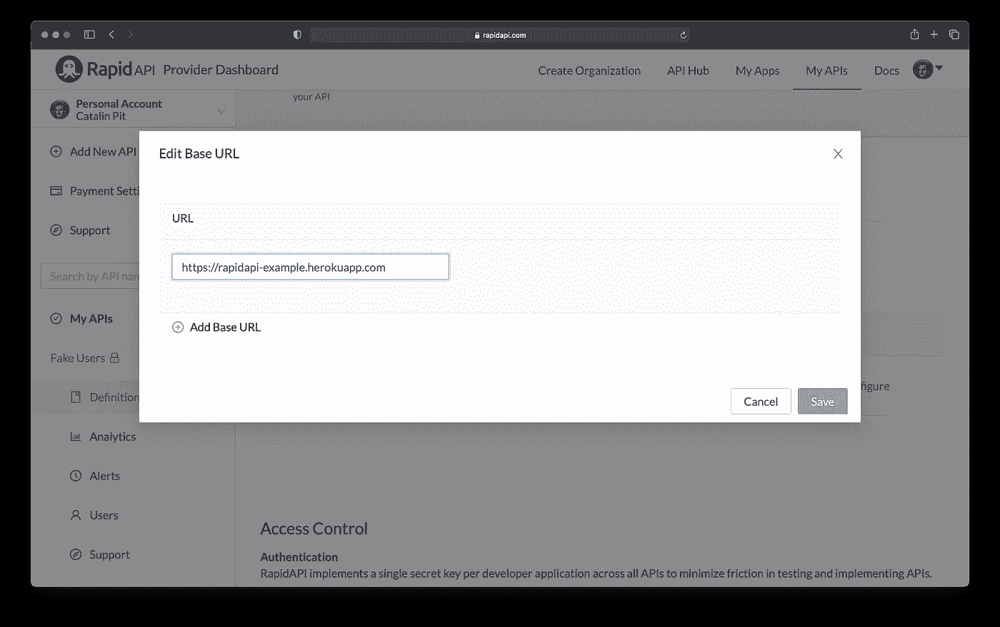*

*图 16*

*图 17 展示了您应该在屏幕上看到的内容。既然您已经设置了基本 URL，那么您需要单独配置每个端点。点击**端点**选项，如图 17 所示。*

*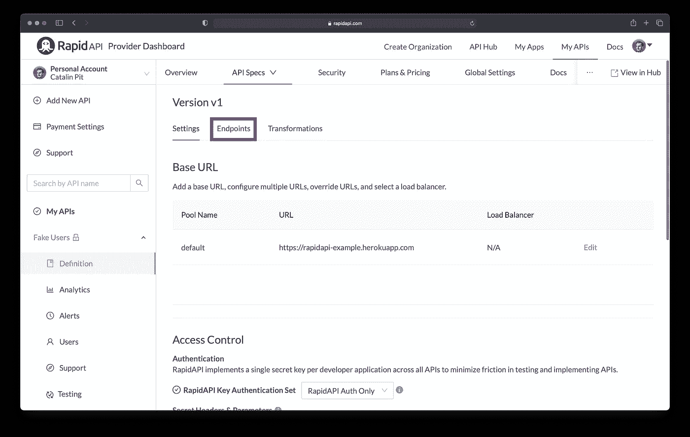*

*图 17*

## *配置 REST 端点*

*在这个新页面上，您可以添加一个 REST 端点或者一个 GraphQL 端点。因为我们有一个 REST API，所以点击选项**创建 REST 端点**。*

*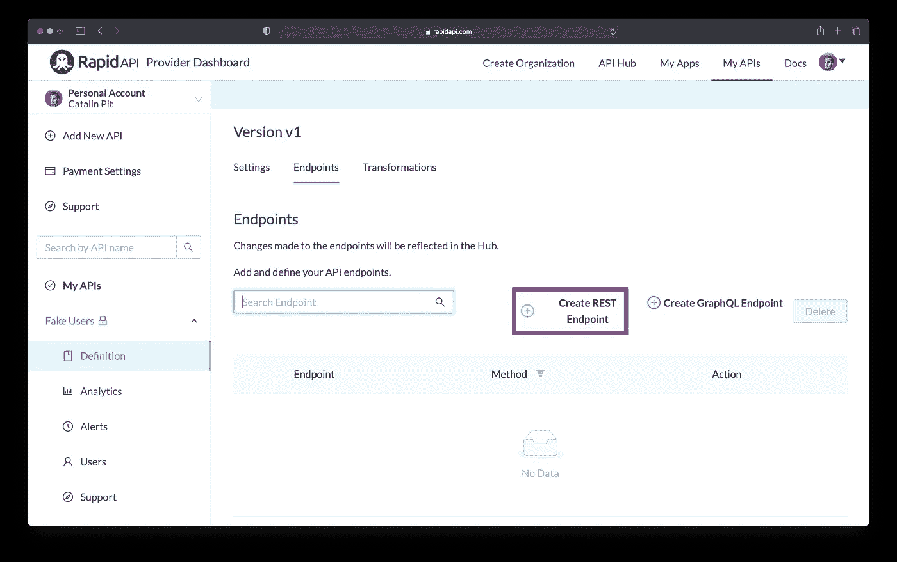*

*图 18*

*下一步是为您的端点配置以下内容:*

*   *一个名字*
*   *描述*
*   *HTTP 方法和端点*

*图 19 展示了`/users`端点的细节。观察您如何只需要指定端点`/users`而不是输入整个 URL。这样做的原因是因为您之前设置了基本 URL。*

*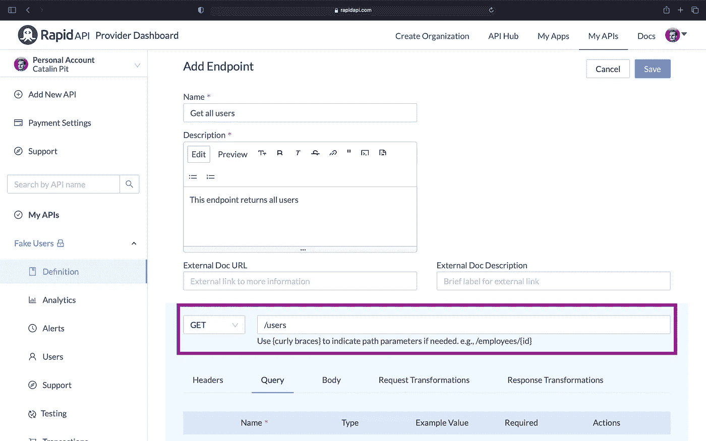*

*图 19*

*现在，您可以测试您的端点。通过点击图 20 中突出显示的任何按钮来保存端点。*

*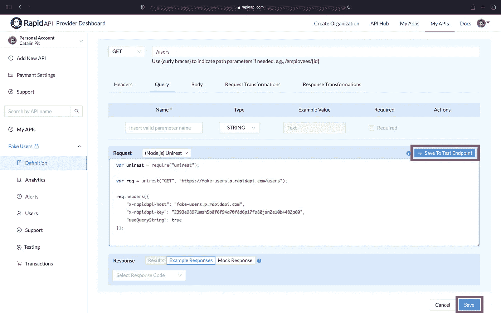*

*图 20*

*保存终点后，按钮**保存到测试终点**转变为**测试终点**。单击它进行测试，并查看端点是否返回正确的数据。*

*在图 21 中，您可以看到一个成功的端点测试——它返回了用户数组。*

*在这里，您可以设置一个示例响应来显示在 API 的页面上。这个示例响应的目的是帮助开发人员理解他们应该为端点获得什么样的响应。*

*要创建示例响应，单击按钮**从响应**创建示例。这就是你要做的！*

*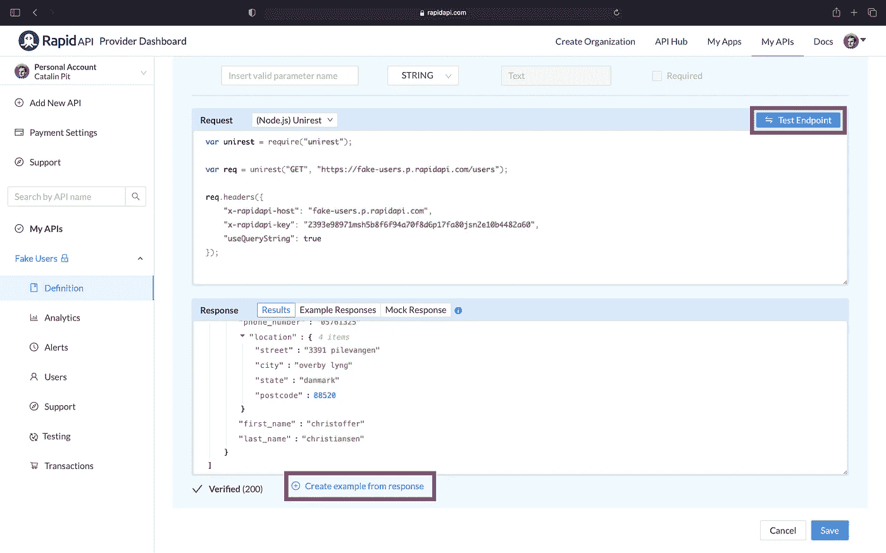*

**图 21**

*现在，您可以保存端点并进入下一步，即设置定价层。是的，您将在下一步看到货币化部分！*

*为此，点击**计划&定价**选项，如图 22 所示。*

*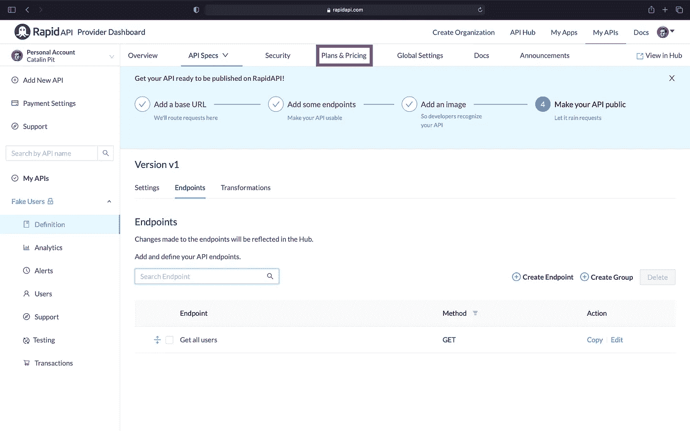*

**图 22**

# *API 定价*

*有关定价计划的详细信息，请查看 RapidAPI 的[官方指南](https://docs.rapidapi.com/docs/pricing-your-api-1?utm_source=Catalin-Pit&utm_medium=DevRel&utm_campaign=DevRel)。它教你高级选项，如自定义配额，速率限制，和私人订阅计划。*

*在本文中，您将根据用户请求的数量来为 API 定价。在图 23 中，您可以看到 RapidAPI 上的定价页面。从这里开始，您可以将您的 API 货币化。*

*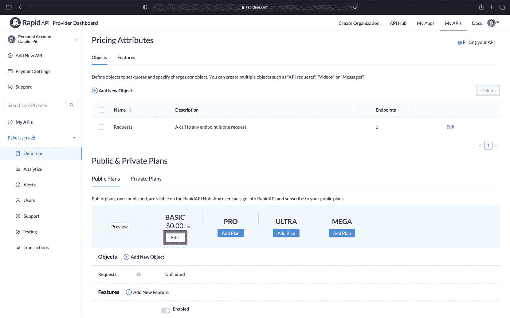*

**图 23**

*先说“基础”计划，也就是免费计划。要配置层，请单击“编辑”按钮。单击编辑按钮后，将打开一个新页面。在此页面上，您可以按如下方式配置您的定价等级:*

*   ***对象名称** —在这里，您可以根据您想要向用户收取的费用进行选择。例如，使用这个 API，您可以根据人们发出请求的数量来收费。*
*   ***配额类型** —配额类型指定用户的配额类型，即每天/每月有多少请求是空闲的。*
*   ***配额限制** —通过配额限制，您可以指定有多少请求是空闲的。在这个例子中，人们每天可以发出 500 个免费请求。*
*   ***限制类型** —在这里，你有一个硬限制和软限制。硬限制意味着用户在超过配额限制后不能发出任何额外的请求。另一方面，软限制意味着用户在超过配额限制后将支付特定的费用。*

*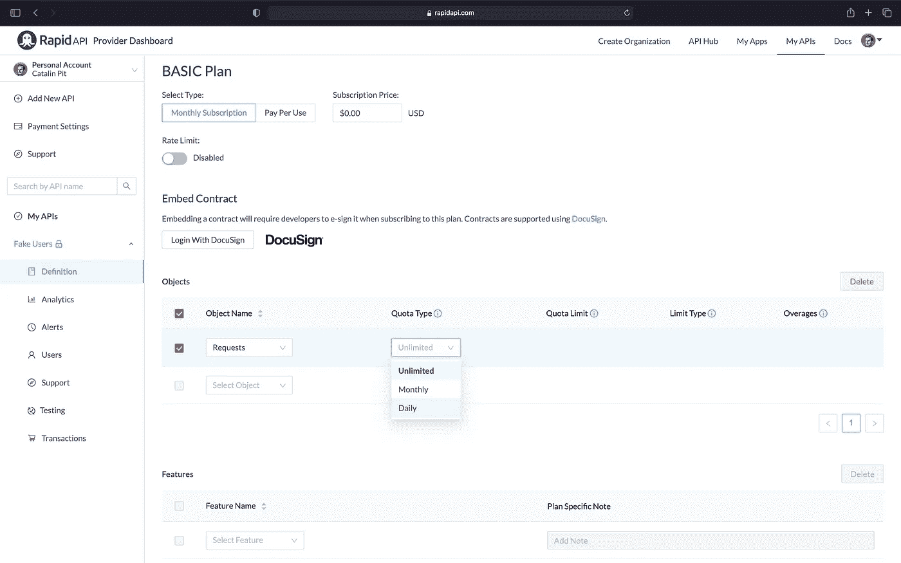*

**图 24**

*对于这个例子，API 的空闲层每天将有 500 个空闲请求。如果用户超过配额限制，他们将无法再进行任何请求。*

*图 25 展示了这个定价层的配置。*

*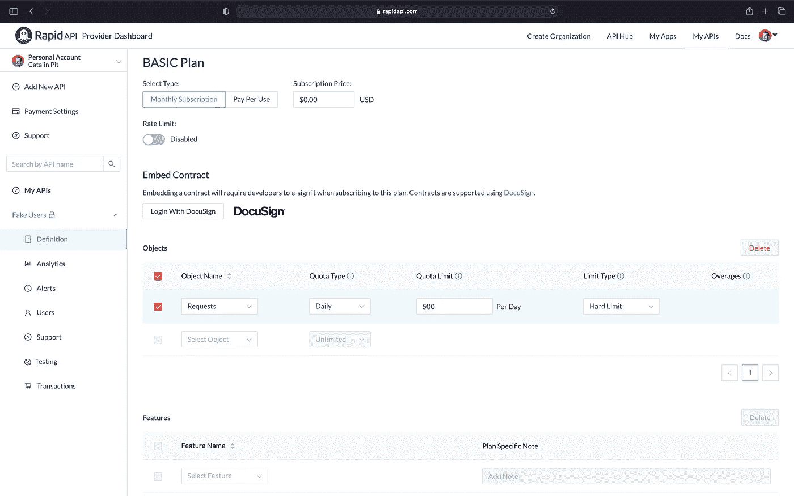*

**图 25**

*同样，我们也加入一些付费计划。毕竟我们是来赚钱的，对吧？点击“pro”部分下的“Add Plan”按钮，如图 26 所示。*

*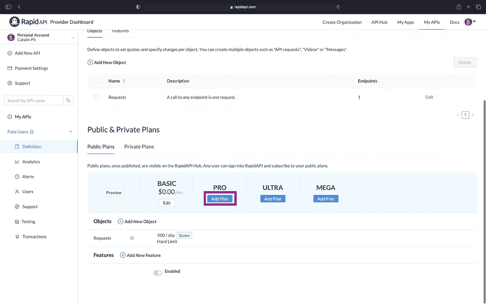*

**图 26**

*将打开一个新页面，您可以在其中添加关于层的常见详细信息。对于对象名称，再次选择“Requests ”,因为您希望根据用户发出的请求数量收费。*

**

**图 27**

*之后，输入以下信息:*

*   ***配额类型** —选择月度配额类型。*
*   ***配额限制** —输入 10，000，因此您允许人们每月发出 10，000 个免费请求。*
*   ***限制类型** —为此端点选择一个软限制，然后对任何额外请求收取 0.01 美元。*

*参考图 28。现在你也完成了职业计划。在它生效之前，您需要向下滚动到页面底部并保存它。*

*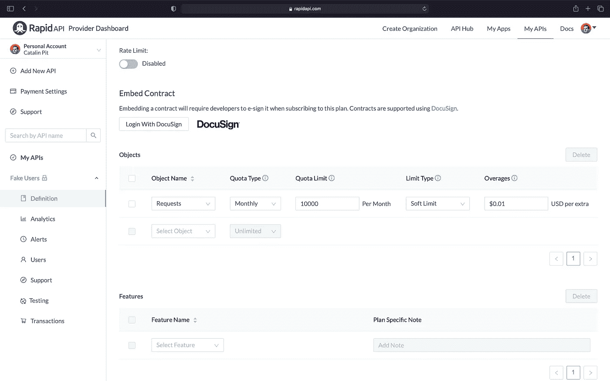*

**图 28**

*保存计划后，您可以返回定价控制面板，查看配置的层级。*

*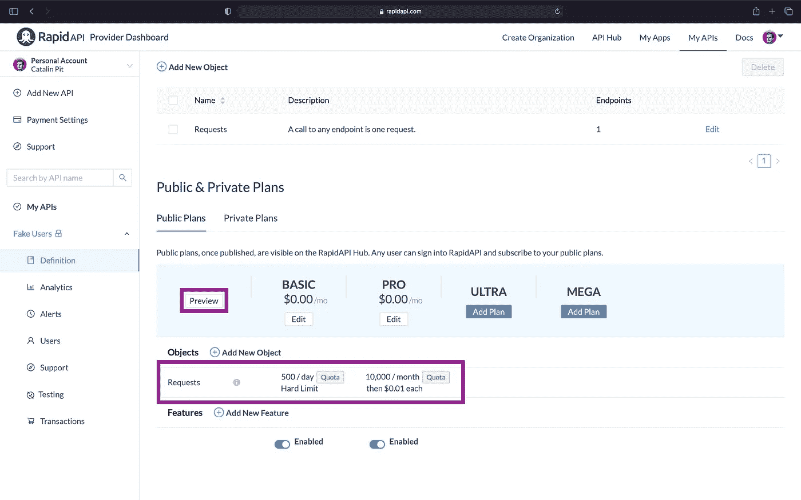*

**图 29**

*此外，您可以点击图 29 中突出显示的“Preview”按钮，查看计划的更多细节。请参考图 30。*

*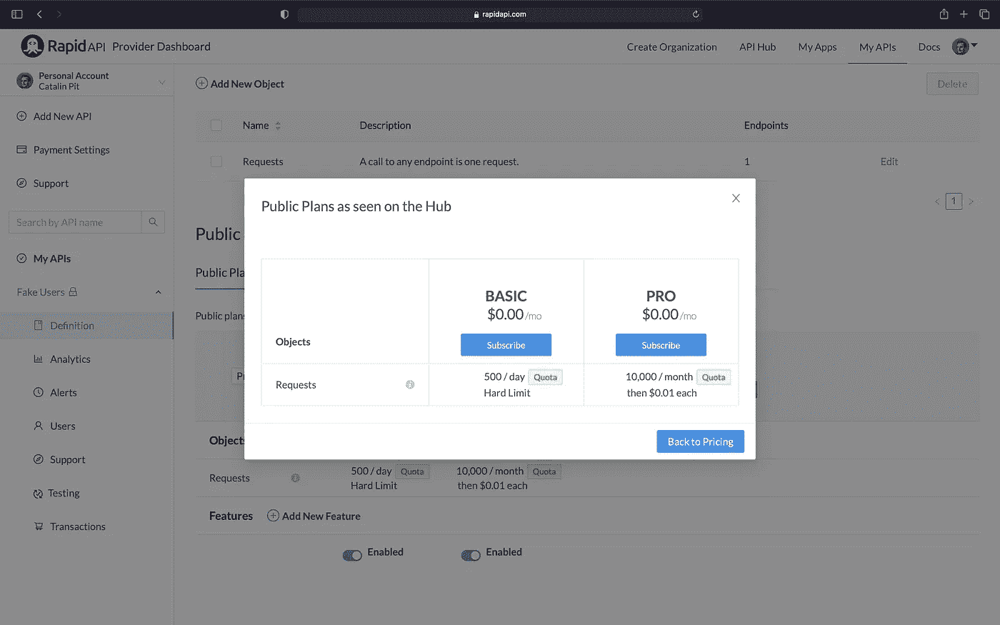*

**图 30**

*配置另外两个层— **Ultra** 和 **Mega** —与您已经设置的两个计划类似。因此，作为练习，请自己创建这两个层！*

*下一步也是最后一步是将 API 公开，这样其他开发者就可以使用它了！*

# *发布 API*

*在任何人可以使用你的 API 并为之付费之前，你需要把它公之于众。因此，进入**全局设置**，如图 31 所示。*

*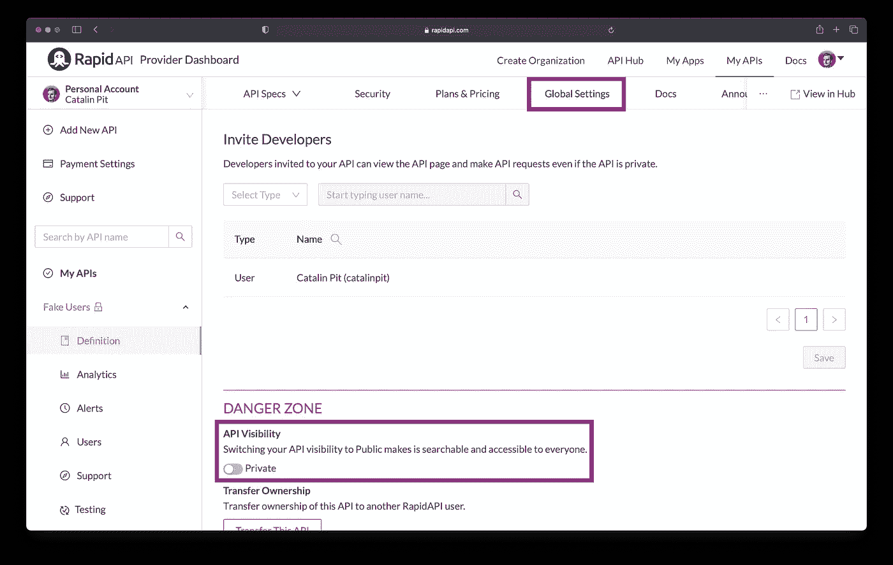*

**图 31**

*在那里，将 API 可见性切换到“public”为此，单击图 31 中突出显示的开关。*

*单击开关后，会出现一个新的弹出窗口，告诉您即将公开您的 API。最后，点击蓝色按钮“公开 API”，就大功告成了！*

*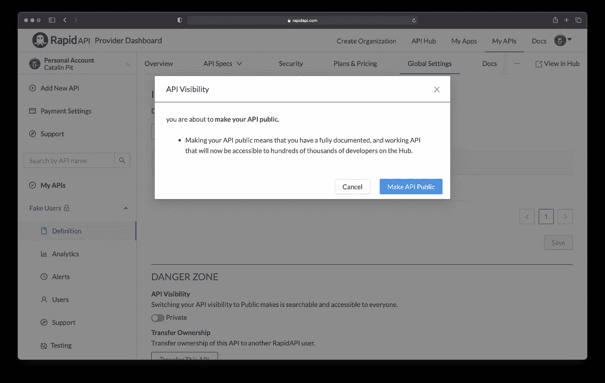*

**图 32**

*现在，您应该在 RapidAPI Hub 中看到您的 API。这意味着 API 是公开的，其他开发者可以在他们的应用程序中使用它。*

*图 33 展示了本教程中 RapidAPI hub 上的示例 API。*

*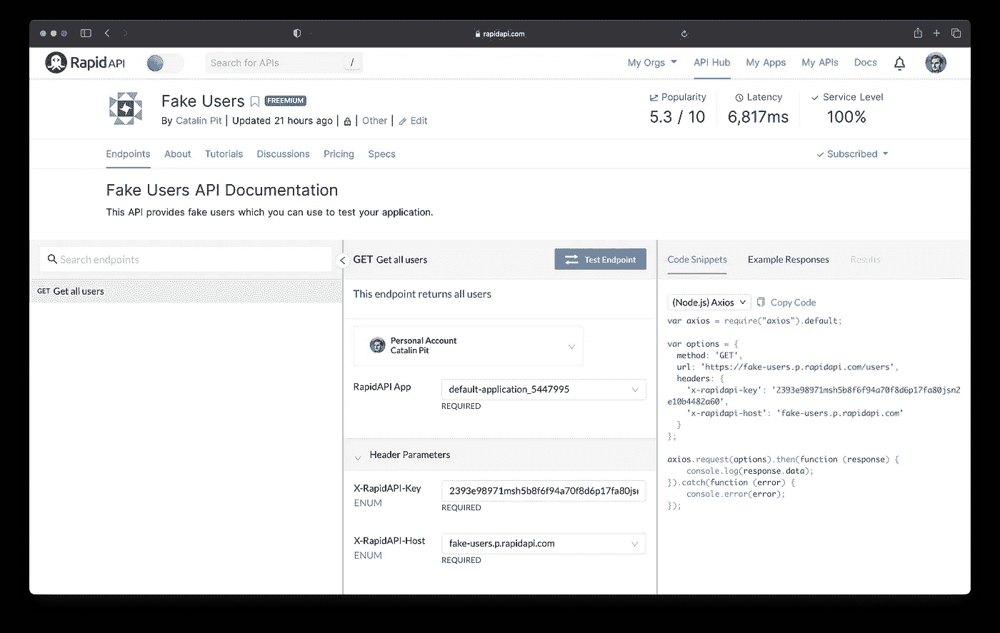*

**图 33**

# *结论*

*销售你的第一个 API 做得很好！在本文中，您了解了:*

*   *什么是 API*
*   *如何构建和部署简单的 API*
*   *如何在 RapidAPI hub 上销售 it 访问权限*

*正如你所看到的，销售你的 API 有很大的潜力。你可以把你的 API 变成新的收入流，甚至可以是被动的。你构建一次 API，销售它，然后销售多次。*

## *想多看作者？*

**要不要* [*学编程*](https://catalins.tech/20-best-places-to-learn-programming-for-free) *？* [*利用这些资源免费学习如何编码*](https://catalins.tech/20-best-places-to-learn-programming-for-free) *。**

**你被项目想法困住了吗？查看这些* [*编程项目思路*](https://catalins.tech/10-programming-project-ideas-for-beginners) *！**

**学习如何使用* [*替换所有 JavaScript 的*](https://catalins.tech/the-fastest-way-to-replace-all-occurrences-of-a-string-in-javascript) *方法。**

**要开始学习 Vue 吗？先看如何入门* [*Vue CLI 和 UI*](https://catalins.tech/get-started-with-vue-cli-and-ui) *。**

**学习如何使用 API* *构建一个应用程序。**

**我又开始学* [*全栈开发*](https://catalins.tech/learn-full-stack-development) *！**

**学习* [*亚马逊 RDS(关系数据库服务)*](https://catalins.tech/amazon-relational-database-service-the-basics-of-aws-rds) *的基础知识。**

*JavaScript 是最流行的编程语言之一。查看这些资源 [*学习 JavaScript*](https://catalins.tech/best-resources-to-learn-javascript-as-a-beginner) *。**

**你知道* [*参数 VS 自变量*](https://catalins.tech/parameter-and-argument-what-is-the-difference-between-them) *的区别吗？**

**如果你是开发人员，在 Mac 上工作，学习这些* [*Mac 终端命令*](https://catalins.tech/mac-terminal-commands) *。**

**查看这些* [*Web 开发者作品集*](https://catalins.tech/14-best-web-developer-portfolios-to-get-inspiration) *为你的下一个作品集获取灵感。**

**了解* [*Git 别名*](https://catalins.tech/git-aliases-what-are-they-and-how-to-use-them) *以及如何使用它们。**