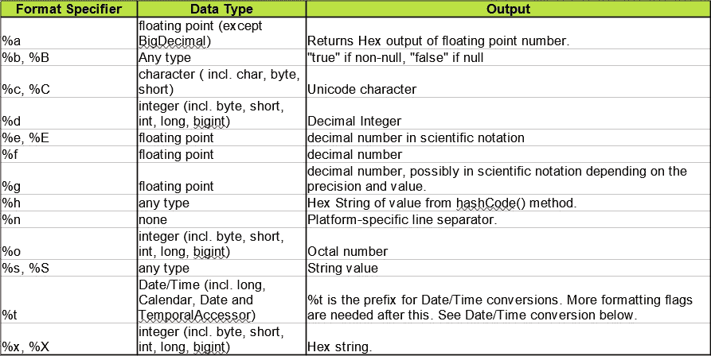

# 执行 Java 字符串格式化的 3 种方法

> 原文：<https://betterprogramming.pub/ways-to-java-string-formatting-d0aecc391cc9>

## 使用 printf()、format()和 Formatter 类生成漂亮的字符串


照片由[马克西米利安·魏斯贝克尔](https://unsplash.com/@maxweisbecker?utm_source=unsplash&utm_medium=referral&utm_content=creditCopyText)在 [Unsplash](/s/photos/java-coding?utm_source=unsplash&utm_medium=referral&utm_content=creditCopyText) 上拍摄

因为我学习 Java 是我最早的面向对象编程语言之一，所以有人会认为我现在已经接近掌握 Java 了。然而，这在编程语言的世界里是行不通的，因为他们在每次更新的时候都会不断地发布新的东西。

记得第一次学 Java，版本肯定是小于 Java 8 的。现在已经过了 12 版了。然而，有时在一个或两个版本中会有重大更新，这意味着在一个版本中会突然引入许多新方法(与其他版本相比),可以帮助开发人员更容易地编码。

在今天的文章中，我将谈论可能是最简单的事情之一，但也可能是令人困惑的。它是关于 Java 字符串格式化的。

您可能在早期遇到过字符串格式化。然而，即使几年过去了，你现在可能还在谷歌上搜索它。是的，就是我。似乎我有点看不起它的简单性，但它背后的复杂性可能是真正有助于高效编程的一件事。此外，每次我试图寻找关于它的信息时，似乎信息总是无处不在。所以我决定试着用最简单的解释形式把它们汇编成一篇文章。

我们开始吧！

Java 字符串格式化返回给定格式的格式化字符串。我认为有三种方法可以做到:

1.  `System.out.printf()`
2.  `String.format()`
3.  `Formatter`阶级

你可能会注意到，这三个基本上是不同的:

*   第一个是打印输出。
*   第二个可以存储在变量中。
*   最后一个简直就是一个类。

让我们进一步看看它们。

# 1.Printf()

这是一个带有给定格式和参数的格式化字符串的简单打印输出。这个方法是`java.io.PrintStream`类的一部分。

语法:

```
System.out.printf(“string_format” [, arg1, arg2, …]);
System.out.printf(locale, “string_format” [, …args]);
```

在内部，`printf()`使用 [](https://www.baeldung.com/java-string-formatter) `java.util.Formatter`类解析格式字符串并生成输出。

`“string_format”`由文字和格式说明符(以%开头的格式规则)组成。什么是*格式指定符*？根据我自己的理解，它就像是决定字符串外观的东西，因为字符串的输出将由标志、宽度、精度和转换字符决定(指定)。当格式说明符存在时，参数是必需的，因为它们被转换字符所替代。我们将在后面看到更多的例子。

格式说明符的顺序如下:

```
%[flags][width][.precision][conversion-character]
```

标志、宽度和精度是可选的。转换字符本身是强制的，因为它表示要替换的参数类型。

## **旗帜**

这些定义了修改输出的标准方法，最常用于格式化整数和浮点数。

*   `-`左对齐。(默认为右对齐。)
*   `+` 输出数值的加号(+)或减号(-)。
*   `0`强制用零填充数值。(空格是默认值。)
*   `,`是逗号分组分隔符(用于数字> 1000)。
*   `[space]`如果数字为负数，将显示减号；如果数字为正数，将显示空格。

## 宽度

宽度指定输出参数的字段宽度。它表示要写入输出的最小字符数。在确定数值宽度时，包括预期逗号的空格和小数点。

## 精确度

它指定输出浮点值时的精度位数。此外，我们可以使用它来定义要从字符串中提取的子字符串的长度。数字被舍入到指定的精度。

## 转换字符

*   `d`:十进制整数(byte，short，int，long)
*   `f`:浮点数(float，double)
*   `c`:字符(大写 C 将字母大写。)
*   `s` : String(大写 S 会将字符串中的所有字母大写。)
*   `h` : hashcode(一个 hashcode 就像一个地址。这对于打印参考非常有用。)
*   `n`:换行符(特定于平台的换行符——使用`%n`代替`\n`以获得更好的兼容性。)

尽管在格式化一个字符串时有很多可用的选项，但是有一个格式说明符用得很多，那就是行分隔符，用`%n`表示。这将创建一个新行。

通常，在普通的字符串中你可以使用`\`，但是在格式化方法下，它通常是`%n`。

示例:

```
System.out.printf("Mark%nZuck%nNewLine");// Output
Mark
Zuck
NewLine
```

一些字符转换可以返回大写字母的值。怎么会？简单地将字符大写如下:

```
System.out.println(“%b%n”, null);
System.out.println(“%B%n”, false);// Output
false
FALSE
```

注意当`b`被资本化时，结果也被资本化。

其他示例:

# 2.String.format()

这个方法也属于`Formatter`类。它是通过`String`类的静态方法公开的。另外，它的使用方法与`printf`类似，只是这个可以赋给一个变量。

也就是说，这个 format 方法返回一个对字符串的引用。

语法:

```
String.format(“string_format” [, arg1, arg2, ...]);String.format(locale, “string_format” [, ...args]);
```

简单回顾一下，上述内容包括:

*   `string_format` —字符串的格式
*   `args` — 0 个或多个参数
*   `Locale` —指定如何格式化特定区域。通常当涉及到数字时，我会更多地使用它，比如基于前面的例子，整数在`Locale.US`和`Locale.ITALY`之间的不同显示。

如果您没有在您的`String.format()`方法中指定区域设置，它会通过调用`Locale.getDefault()`方法来使用默认区域设置。

因为它类似于`printf`方法，所以它也遵循相同的格式规则。格式说明符的语法如下:

```
%[argument_index$][flags][width][.precision][conversion-character]
```

其中:

*   `argument_index`是一个整数 *i* ，表示该参数在所提供的参数列表中的第*个*位置。
*   `flags`是一组用于修改输出格式的字符。
*   `width`为正整数，表示写入输出的最小字符数。
*   `precision`是一个通常用来限制字符数的整数，其具体行为取决于转换。
*   `conversion-character`是一个强制部分，指示替换什么数据类型。

我们来看看`argument_index`是怎么工作的。

```
String greetWorld = String.format(“Hello %2$s, I am %1$s !”, “Index”, “World”);// Output
Hello World, I am Index !
```

注意参数索引的语法(基于上面的例子)是如何分别用`2$`(第二个参数)和`1$`(第一个参数)表示的。

尽管如此，让我来和你分享一下你如何仍然可以使用`format()`方法，并且没有应用格式规则。

```
String s = String.format(“It is an amazing 90%% chance!”);
System.out.pritnln(s);// Output
It is an amazing 90% chance!
```

当我试图想出一个不常见的随机例子时，这句话就在我脑海中弹出来了，所以不要问我什么或为什么。奇怪的东西放在一边，注意我没有使用任何格式说明符。但是为什么我要用 2%的符号呢？原因是因为我们使用的是`format()`方法，我们多使用了一个`%`来转义字符，这样它就显示为 90%。

由于格式化选项、标志等与`printf`方法非常相似，您可以参考该部分。因此，对于这一部分，我将包括更多的例子。

示例:

当我们使用`%f`格式化-452.534 时，我们得到的是 **-** 452.533997。并不是因为`format()`方法。Java 不返回浮点数的精确表示。

当使用`%.2f`格式说明符时，`format()`在小数点后给出两个数字。

其他示例:

在德国，整数用句号而不是逗号分隔。

还有八进制和十六进制输出的替代表示法，它打印带有前导“0”的八进制数和带有前导“0x”的十六进制数。

```
String.format("|%#o|", 93);
// prints: 0135
String.format("|%#x|", 93);
// prints: 0x5d
String.format("|%#X|", 93);
// prints: 0X5D
```

也就是说，这里我列出了一些 Java 字符串格式说明符。请注意，这并没有涵盖全部内容(请参考文档中的完整列表)。



我见过/用过/读过的一些格式说明符。

# 3.格式化程序类

这个类是指`java.util.Formatter`类。对于这种情况，我们需要创建一个`Formatter`实例，并使用它来调用`format()`方法。

示例:

从上面的例子可以看出，`Formatter`实例被创建，然后链接到`StringBuilder`。基本上，`format()`方法的输出被附加到`StringBuilder`对象上，然后我们通过使用`toString()`方法将它转换成一个字符串来打印出来。

然后，您可以继续将格式化的内容添加到您的`StringBuilder`中。

就格式规则而言，它们与另外两个相同，`printf()`和`String.format()`。因此，您可以重用这些规则，它也适用于这里，因为其他两个固有地使用了`Formatter`类来格式化。

# 总结

在本文中，我们看到了由`java.util.Formatter`类提供的不同格式化方式。我们还看到了可用于格式化字符串的各种语法，以及可用于不同数据类型的转换类型。希望你能更好地了解他们。

今天的学习到此为止。如果你发现了我在这篇文章中遗漏的东西，请在下面的评论区分享。我们都喜欢一起学习。

感谢阅读。