# 在 CSS 中设置图像文本样式的 6 种方法

> 原文：<https://betterprogramming.pub/ways-to-style-text-on-images-in-css-fa94e31d63e7>

## 六种样式，从调整图像的不透明度到给文本添加背景色

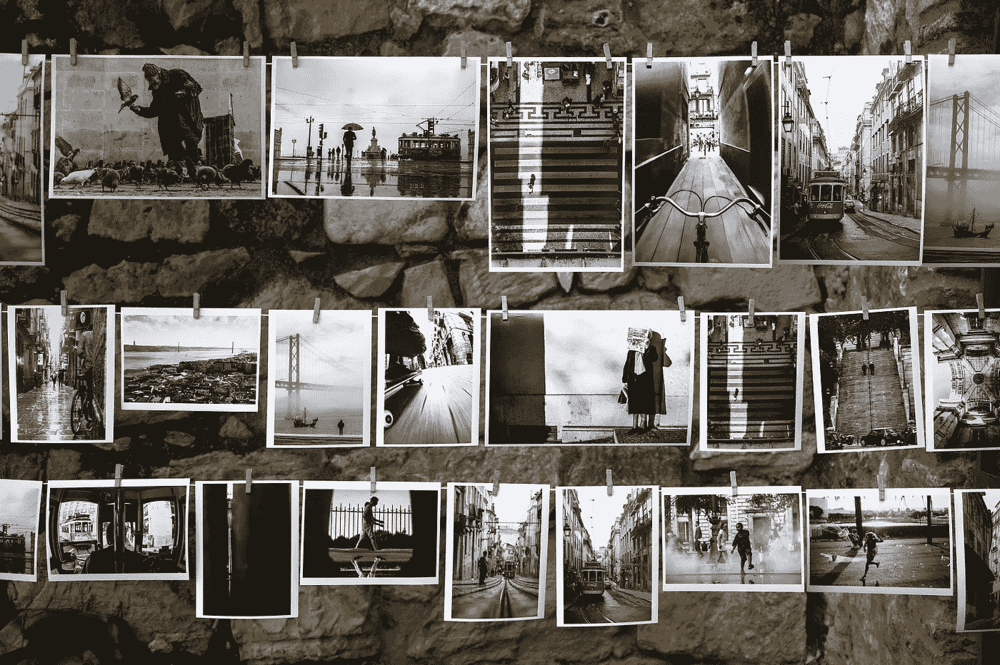

布里吉塔·施奈特在 [Unsplash](https://unsplash.com/@brisch27?utm_source=unsplash&utm_medium=referral&utm_content=creditCopyText) 上拍摄的照片

图像不仅仅是我们网页的空间填充物。当我们在基于给定设计的网页上工作时，我们可能没有注意到它们的用途。那么我们为什么要费这么大劲去使用图像呢？

一张图能说明千言万语。

图像是传达信息的一种快捷方式，早在网络出现之前，我们就已经使用了。我们用它们来诱导情感，使我们更容易接受某些信息，展示产品或服务，将内容分解成可消化的信息，增加内容的趣味，等等。

向网页添加图像很容易，但当您必须处理图像上的文本时就不容易了。然而，我们经历这种麻烦是因为一张有文字的图片可以讲述 1000+个单词。

在这篇文章中，我将分享我用来在图片上叠加文字的设计和方法。如果你想继续编码，我已经在 [CodePen](https://codepen.io/collection/DZabyz/) 上添加了两个启动文件，方法 1 和方法 2。

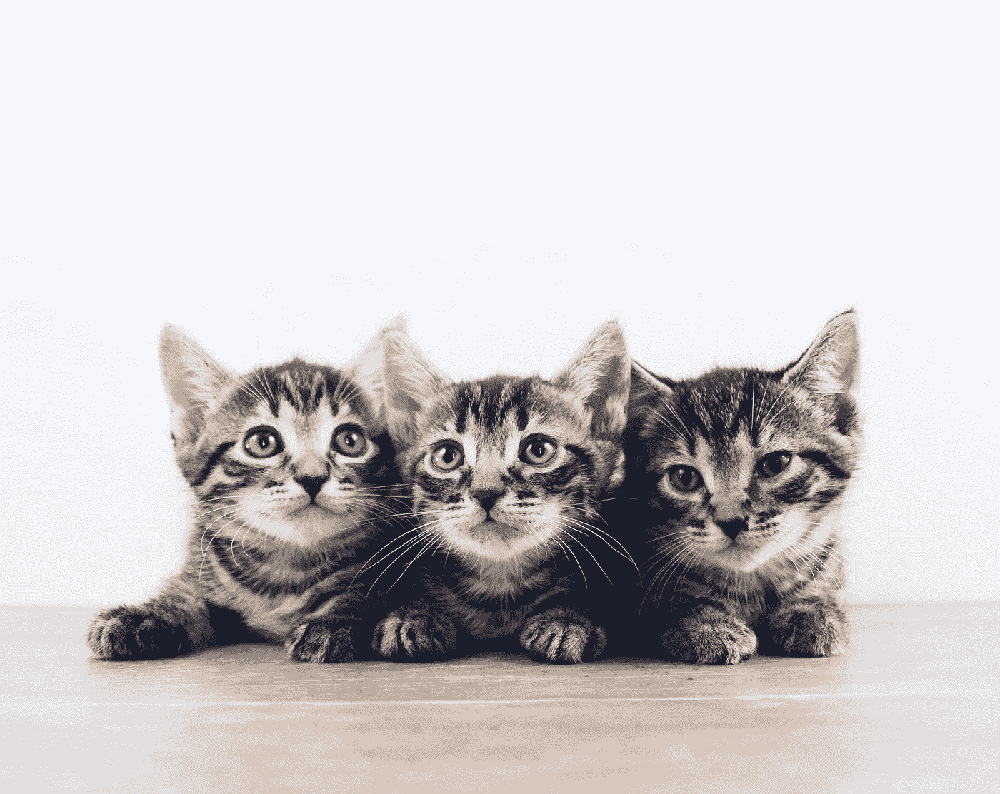

引发情绪的图像(照片由[幸运的猫](https://unsplash.com/@theluckyneko?utm_source=unsplash&utm_medium=referral&utm_content=creditCopyText)在 [Unsplash](https://unsplash.com/s/photos/kittens?utm_source=unsplash&utm_medium=referral&utm_content=creditCopyText) 上拍摄)

展示产品的图片(由 [Aaina Sharma](https://unsplash.com/@aaina?utm_source=unsplash&utm_medium=referral&utm_content=creditCopyText) 在 [Unsplash](https://unsplash.com/s/photos/airpods?utm_source=unsplash&utm_medium=referral&utm_content=creditCopyText) 上拍摄)

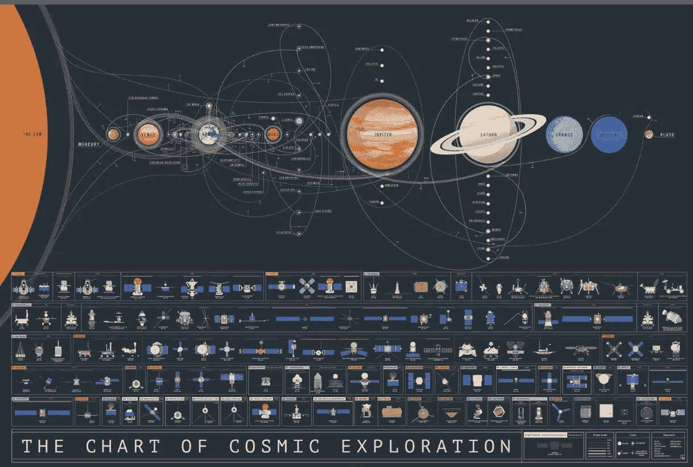

将内容分解成可消化信息的图像(信息图来自 [PopChart](https://popchart.co/collections/prints/products/the-chart-of-cosmic-exploration)

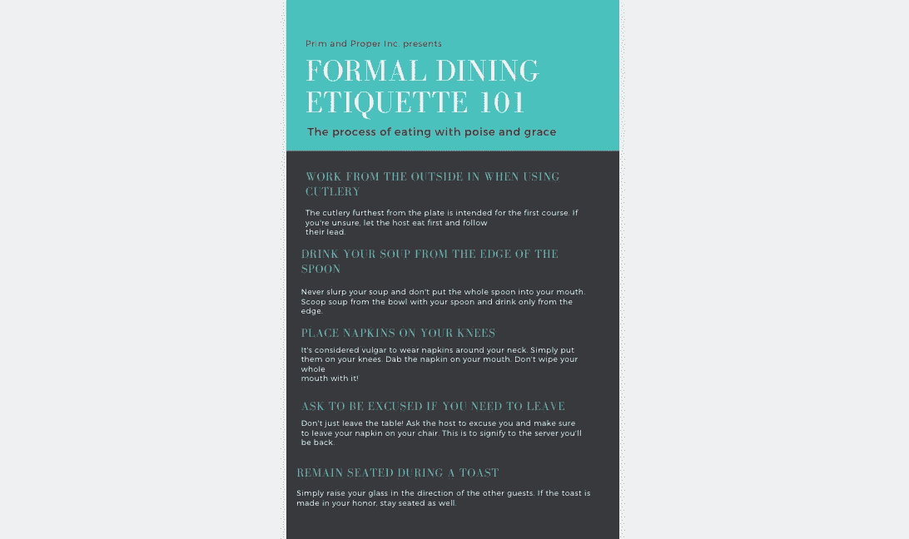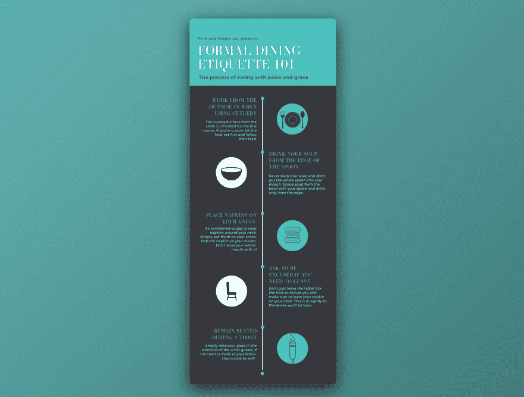

增加内容趣味的图片(图片来源:作者)

# 起始代码

两组[启动码](https://codepen.io/collection/DZabyz/)将创建如下网页:

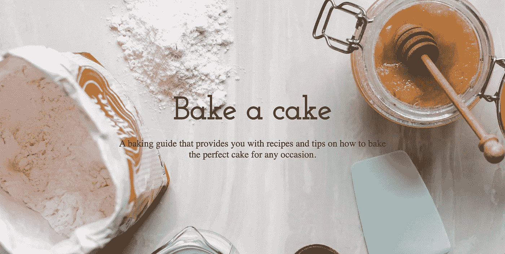

使用由 [Calum Lewis](https://unsplash.com/@calumlewis?utm_source=unsplash&utm_medium=referral&utm_content=creditCopyText) 在 [Unsplash](https://unsplash.com/s/photos/cake?utm_source=unsplash&utm_medium=referral&utm_content=creditCopyText) 上拍摄的照片进行光照成像

正如你所看到的，这个设计并不理想，因为你不能很容易地阅读文本的开始，因为文本是红色背景下的黑色。此外，可读性取决于所使用的图像。如果你换成其他的图像，这个设计可能就行不通了。

# 式样

现在，我们将通过以下六种方式来改进我们的网页设计:

1.  在图像上添加文本
2.  调整图像的不透明度或清晰度
3.  给文本添加背景色
4.  更改文本的位置
5.  使用图像和文本的颜色混合
6.  加深图像并使用浅色文本

除非另有说明，我们将使用[方法 1](https://codepen.io/aliceyt/pen/GRgZOYm) 中的代码进行造型。

两套 starter 代码的区别在于，在[方法 1](https://codepen.io/aliceyt/pen/GRgZOYm) 中，文本内容是带有背景图片的`div`的子元素，而在[方法 2](https://codepen.io/aliceyt/pen/OJPNOqz) 中，这两个元素是兄弟元素。

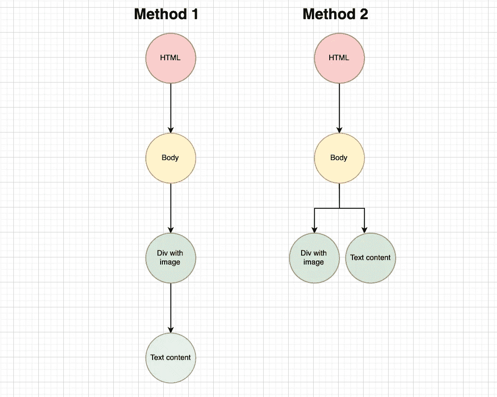

你如何编写你的 HTML 可以影响你如何设计你的页面。

## **1。**在图像上添加文本

您可以使用照片编辑器或幻灯片应用程序(如 PowerPoint、Google Slides 或 KeyNote)将文本添加为图像的一部分。然而，这种方法在这种设计中不起作用，因为内容在较小的屏幕上会被截断。

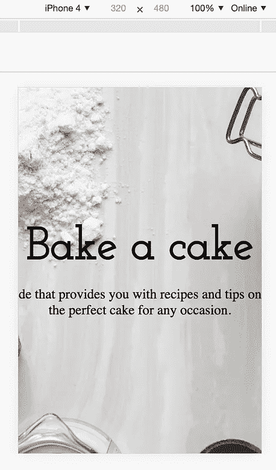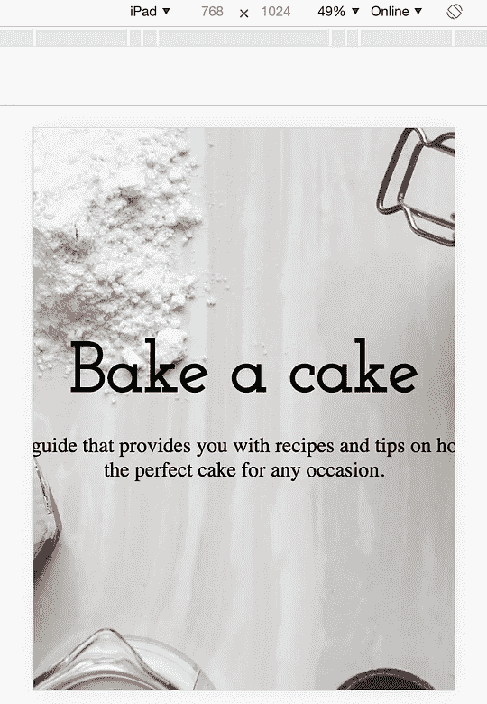

修复了不同屏幕尺寸上的文本

## **2。调整图像的不透明度或清晰度**

您可以使用照片编辑器或在 CSS 中调整背景图像的不透明度和清晰度。让我们把重点放在后者上。

如果您的文本嵌套在带有背景图像的元素中，当您调整图像的`opacity`时，您的文本会褪色。同样，如果您在图像上应用`blur`属性，文本也会变得模糊。那可能不是你想要的效果。

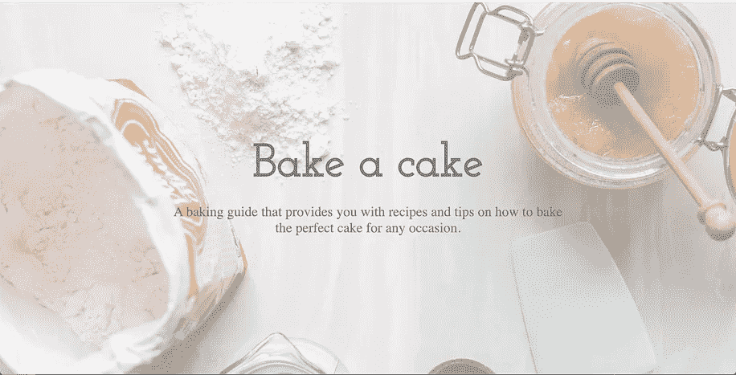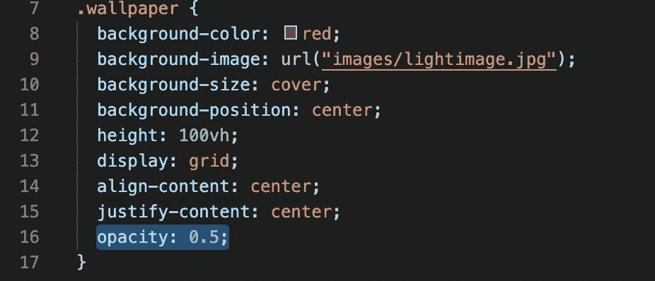

相反，您可以使用`linear-gradient`属性，这将在保持文本颜色的同时使图像变亮。

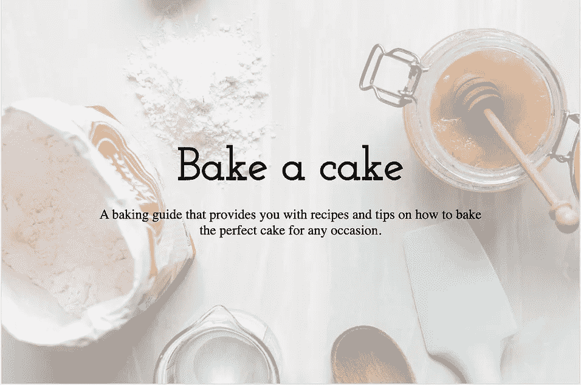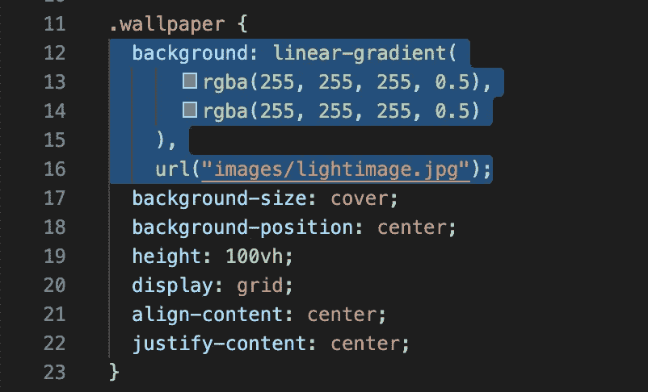

来自[stackoverflow.com](https://stackoverflow.com/questions/4997493/set-opacity-of-background-image-without-affecting-child-elements)的解决方案

要直接调整背景图像的`opacity`或`blur`属性，同时保持文本不受影响，需要编辑 HTML。文本不能是带有背景图像的元素的子元素。您需要使用起始代码中的[方法 2](https://codepen.io/aliceyt/pen/OJPNOqz) 中的代码来实现设计。

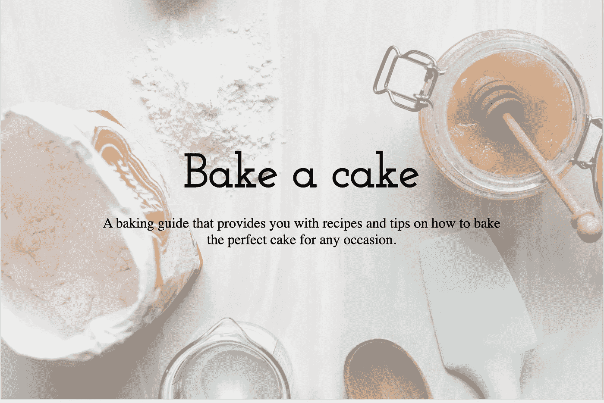

## **3。给文本添加背景颜色**

您可以给文本添加白色背景。然而，有些人可能不喜欢这种设计，因为文本和背景之间的对比过于鲜明。你也不能使用不透明度，因为它会使文本淡出。

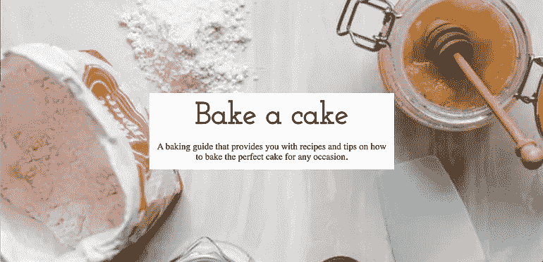

如果你想采用这种设计，添加背景色的更好方法是使用 RGBA 色值，而不是纯色。

## **4。改变文本的位置**

您可以考虑手动调整文本，使其在图像的清晰背景下定位，但这可能不是一个可行的解决方案，因为文本的位置会根据不同的屏幕大小而变化。

## **5。使用图像和文本的颜色混合**

`mix-blend-mode`是一个有趣的属性，可以用来在保持可读性的同时设置文本样式。如果你有一个干净的形象，它就会起作用。

## 6.加深图像并使用浅色文本

最后，你可以用`linear-gradient`使图像变暗，并使用白色文本，而不是保持黑色文本和浅色背景。

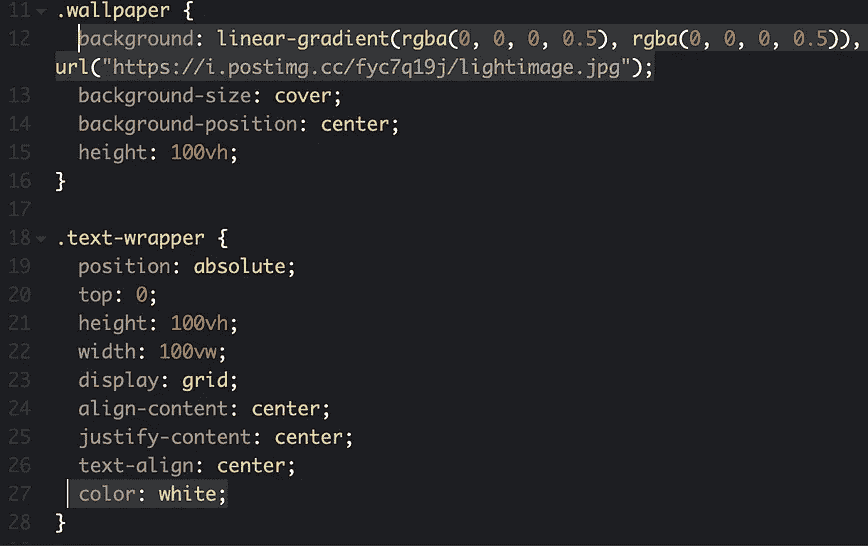

# 摘要

我分享的设计和代码只是一些你可以用于网页的常见代码。到目前为止，您应该已经熟悉如何使用以下 CSS 属性在网页上组合文本和图像:

*   `background-image: url(<url>)`
*   `background: linear-gradient(<value>)`
*   `color`
*   `mix-blend-blend`
*   `filter: blur(<value>)`
*   `opacity`
*   `blur`