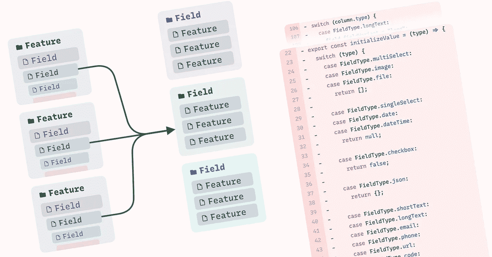
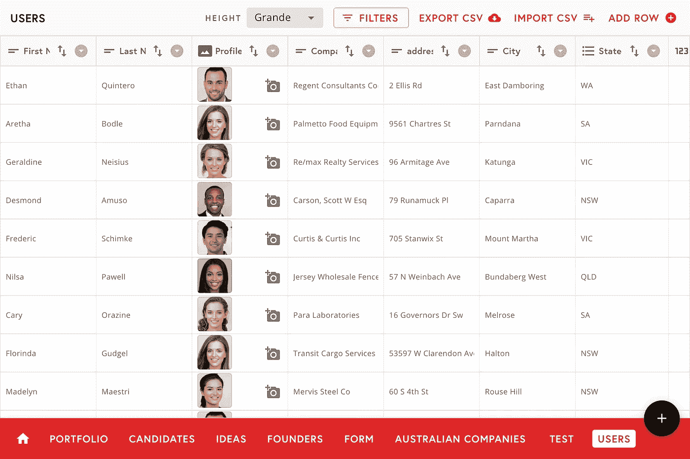
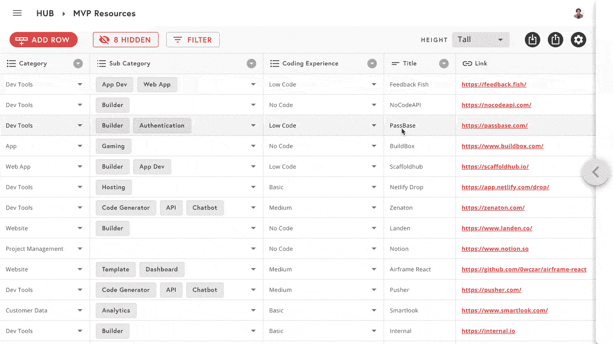
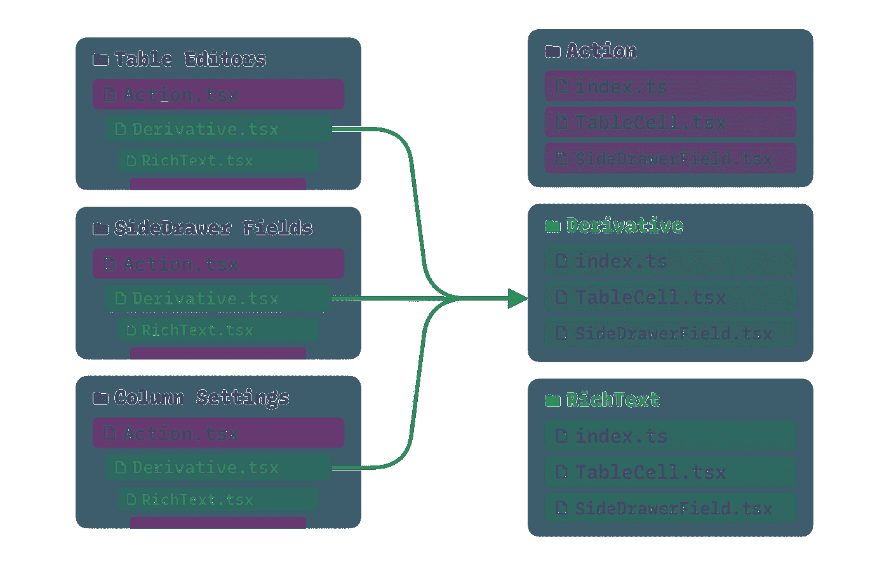
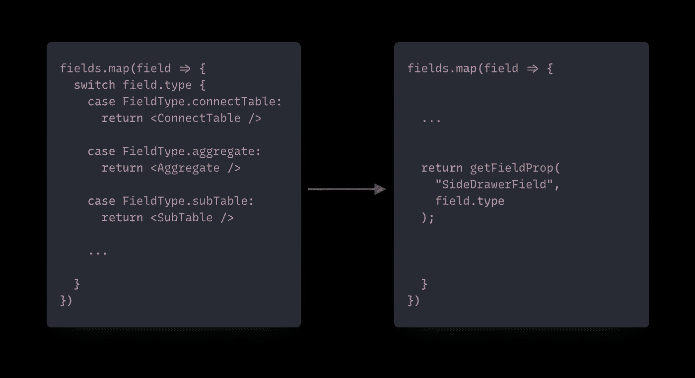

# 我们在开源 React 项目中重构了 10K 代码行

> 原文：<https://betterprogramming.pub/we-refactored-10k-lines-of-code-in-our-open-source-react-project-5eb844cccf28>

## 了解我们重构背后的方式、时间和原因

作者照片。

当从事任何项目时，特别是在 MVP 阶段，我们作为开发人员在写代码时通常优先考虑一件事:确保它*工作*。不幸的是，这可能意味着编写的代码过度关注 MVP 的需求，所以我们最终得到的代码难以维护或者难以扩展。当然，这不是一个容易避免的问题，因为我们不是生活在一个理想的世界里。时间的力量总是与我们作对——有时我们只是需要推出一些东西。

我是一名软件工程师，正在开发一款开源的 React 应用程序，它将电子表格用户界面与 Firestore 和 Firebase 的全部功能结合在一起。我们用一些基本代码碰到了这个问题:所有不同的[字段类型](https://docs.rowy.io/field-types/supported-fields)的代码，从简单的`ShortText`到复杂的`ConnectTable`字段。

经过重构，我们现在有了一个更坚实的基础来构建更多的功能，我们消除了一些难以发现的错误，我们现在甚至有了一个关于我们的贡献者如何编写新字段类型的[指南。](https://docs.rowy.io/field-types/add)

# 当代码发臭，技术债务成为大问题时

当我们第一次开始构建 Rowy 时，我们的想法是构建一个电子表格界面。很自然，最终的产品与之非常匹配。查看旧的截图，它与 Excel 和 Google Sheets 等电子表格程序非常相似，这一点很值得注意:

2020 年 2 月的旧建筑截图

我们使用 [React 数据网格](https://adazzle.github.io/react-data-grid/)来实现这一点。当用户双击单元格时，它接受用于呈现单元格的“格式化程序”组件和用于编辑单元格的“编辑器”组件。我们围绕这一点构建代码，将`formatters`和`editors`与`Table`的代码放在一起，成为文件夹。

几个月后，我们添加了`SideDrawer`，这是一个类似表单的 UI，可以在主表上滑动。它旨在使一次编辑一行中的所有字段变得更容易，我们发现这是我们用户的日常工作流程。当时，构建这个新代码最合理的方式似乎类似于我们构建`Table`的方式，所以我们在`SideDrawer`文件夹中创建了一个`Fields`文件夹。

但是当我们维护这些代码时，裂缝开始出现。

我们与众不同的字段类型之一是`Action`，它在表格上显示一个按钮，让用户使用 Firebase Cloud 函数基于行的数据运行代码，并在同一个单元格中显示结果。我们将它用于一些新颖的应用，比如使用 [Firebase Auth 自定义角色](https://firebase.google.com/docs/auth/admin/custom-claims)在 Rowy 中设置数据库的访问控制。

我们有一个 bug，当被`Action`单元调用时，云函数没有接收到正确的参数。但是为了更新代码，我们不得不在*两个独立的位置*—`Table`格式化程序和`SideDrawer`字段中完成。不仅如此，由于时间限制，我们复制了调用云函数的代码。共享代码没有明确的位置，而且这个 bug 的优先级太高，我们没有时间正确回答这个问题。

最后一根稻草是当我们注意到我们没有一致地实现列锁特性。有些字段在`SideDrawer`中保持可编辑，但在`Table`中不可编辑，反之亦然，或者我们根本没有为那个字段实现它。这是在之后添加这个特性*的结果，我们已经实现了每个字段类型的最低要求，所以我们必须通过每个`Table`格式化程序和每个`SideDrawer`字段——字段类型的数量是我们的两倍。这种繁琐的手动过程显然容易出错。*

此时，我们知道是时候重构了。

# 成功的重构

我们发现了主要问题:我们没有一个单独的地方来存储每个字段类型的代码。它分散在整个代码库中——`Table`格式化器和编辑器、`SideDrawer`字段、列设置等等。这种分散迅速增加了为字段类型添加新功能和清除错误的成本。

我们做的第一件事是完全颠倒我们的代码结构。我们没有按照每个使用字段类型的特性对代码进行分组，而是按照字段类型本身对代码进行分组。

新方法转化为一个名为`fields`的新顶级组件文件夹，包含每个字段类型的子文件夹。在每个文件中，我们都有像`TableCell.tsx`和`SideDrawerField.tsx`这样的文件。然后我们可以在一个配置对象中导出这些特性，这样所有这些代码只需要由消费者导入一次。这类似于 React Hooks 解决的一个问题:[将相关代码](https://reactjs.org/docs/hooks-intro.html#complex-components-become-hard-to-understand)分组，不必考虑生命周期方法。

这种方法还简化了我们在整个代码库中导入字段代码的方式。在之前的`Table`和`SideDrawer`中，我们将依赖`switch`语句循环遍历每个字段类型，直到我们可以获取正确的组件*和*逐个导入每个字段。因此，每当我们添加一个新的字段类型时，我们也必须向这些`switch`块添加一个新条目——再次增加了开发成本。相反，我们可以为每个字段配置创建一个数组，然后在代码库中共享它。所以我们只需要定义一个新的字段类型*一次。*

此外，config 对象让我们快速实现新特性，并确保所有的字段都正确实现。现在我们可以简单地检查一个字段的配置是否有属性。由于我们使用的是 TypeScript，每个 config 对象都必须实现我们的接口，这可以强制某些特性(接口的属性)成为特定的类型，比如接受特定属性的 React 组件。这个新功能允许我们修复列锁定实现，并使开发新特性(列的默认值)变得更加容易。我们所要做的就是向接口添加一个新的属性。

考虑到这一点，我们的重构不仅使我们的代码更容易维护和修复错误，而且它还提供了一个更加坚实的基础，在这个基础上我们可以为字段构建高级功能并消除额外的开发成本。

# 未来的教训

当然，如果我们最初采用这种方法，我们可以避免所有这些痛苦和额外的工作。但是我们并不是生活在一个理想的世界里。我上面提到的所有不理想的解决方案都是我们受到时间限制的结果——特别是当我们同时处理其他项目时，这直接影响了日常工作。

我们中的许多人工作的企业并没有将优秀的代码质量作为其主要目标。作为开发人员，我们被雇佣来构建满足业务需求的技术解决方案，而“如何”是抽象的。然而，在这种情况下，我们结构不良的代码和累积的技术债务直接影响了我们的工作能力。

在写这篇文章的时候，我遇到了[重构。Guru](https://refactoring.guru/) ，重构的优秀指南。我们显然满足了他们关于何时重构的第一个建议:“当你第三次做某件事时，开始重构。”

这段经历教会了我们许多关于代码结构和何时需要重构的宝贵经验。我希望你通过阅读我们的旅程获得了一些见解。