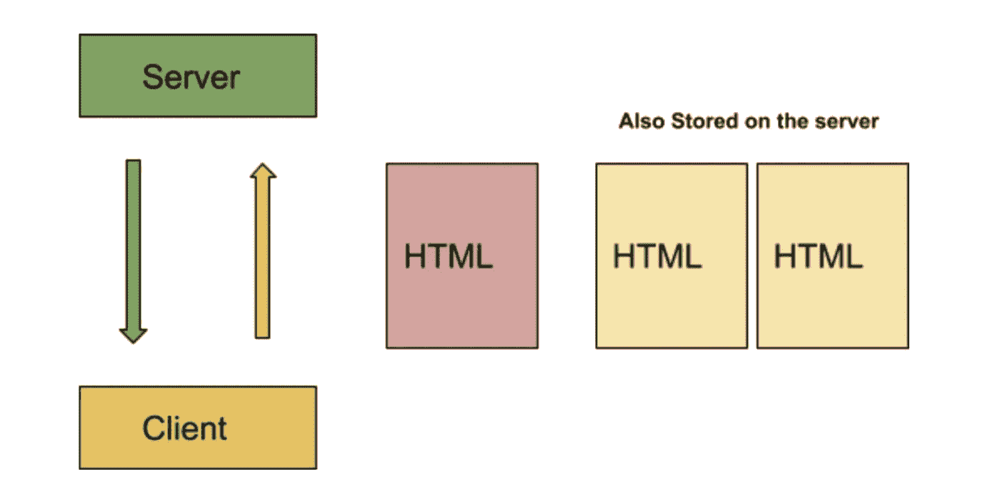
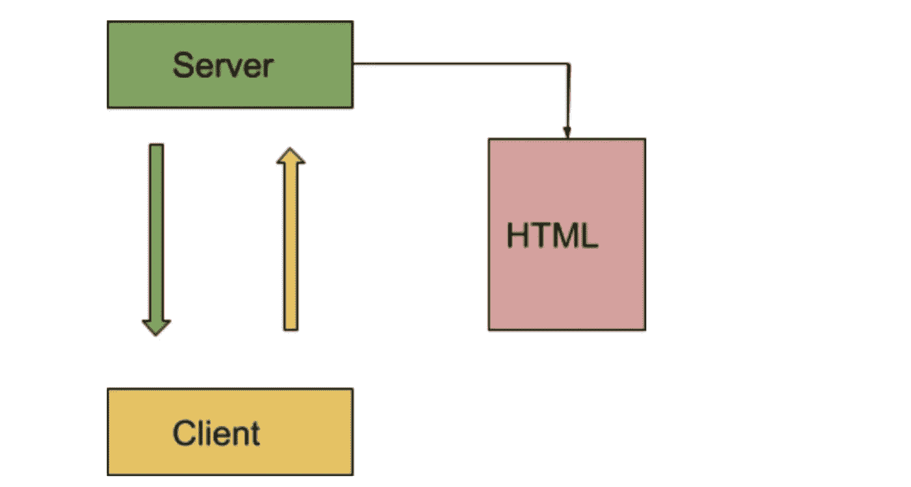
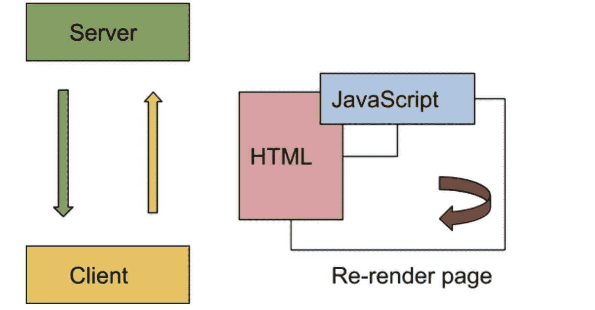

# 2021 年的 Web 开发:动态、静态、单页架构

> 原文：<https://betterprogramming.pub/web-development-in-2021-dynamic-vs-static-vs-single-page-architecture-399d0c3defe6>

## 了解最适合你的网站的架构

作者图片

人们很容易忽略，我们有更多的方法来建立网站，而不仅仅是单页应用程序。

在这篇文章中，我想看看我们拥有的这些重要的免费替代品中的三个，并帮助你理解什么时候你可能想要使用哪个替代品来为 2021 年建立你的网站。

# **静态网络应用**

静态 web 应用架构(图片来源:作者)

第一种方法是最深入、最古老的方法:静态网站，其中有一个 HTML 文件或一堆 HTML 文件。

我们可以把 HTML 文件放到服务器上。然后这些文件将被提供给用户。如果你的用户进入一个网页，每次他们都会进入从服务器返回的不同的 HTML 文件。

## 为什么以及应该在哪里使用静态网站？

如果人们有一个没有动态内容的基本页面，就像个人主页，内容不会经常改变，那么开发人员可以用 CSS 或者 JavaScript 构建一些 HTML 文件，并将其部署到服务器上。

## 那么为什么开发者不使用它呢？

即使你有更频繁变化的内容，你也可以使用静态站点生成器来拥有一些数据源(数据库)。然后你可以定义你的页面通常应该是什么样子，每个页面的框架是什么样子，等等。让我们来看看这个过程:

*   然后这个静态站点生成器可以由您来运行——您开始生成过程。
*   生成器会查看所有数据源，获取数据，并获取预定义的 HTML 框架。
*   然后，它插入数据并抛出许多预先生成的 HTML 文件，这些文件不是在服务器上生成的，而是在您的机器上或云中生成的。(但不作为传入请求的一部分)。

最棒的是，甚至有解决方案，像[盖茨比](https://www.gatsbyjs.com/)和 [NextJS](https://nextjs.org/) ，允许你构建一个 React 应用。

当你构建一个静态网站时，它会获取用户可能访问的每个页面，并预先生成 HTML 页面。然后不管你加载哪个页面，你都是要加载完成的 HTML 代码。

但是一旦它被加载到单页应用程序中，它就会接管并执行。最棒的是，在那之后，你将再次获得那种快速的、类似移动应用的体验。这就是静态站点对于许多用例的巨大优势。

## 优势

*   当网络连接很慢时，静态网站是很好的选择，因为它们也能提供完整的内容。
*   伟大的搜索引擎优化。
*   没有性能问题，因为页面既不需要在服务器上生成，也不需要在浏览器中生成。

## 不足之处

*   页面生成也是一个很大的缺点，因为它不适合内容或用户生成内容的快速变化。
*   一切都是预先生成的，你不希望每秒钟都预先生成整个页面。
*   如果您想完全自动化，使用静态站点生成器设置一个完整的工作流会很有挑战性。

# **动态网络应用**

动态网络应用架构(图片来源:作者)

在这里，响应返回的 HTML 代码是根据对服务器的请求动态呈现的。这是一个很大的要求，因为你只需简单地编写 HTML 代码，然后用静态网站的方法把它放在服务器上。然而，开发者不能建立像网上商店或博客这样的东西。

因此，每当您需要用户生成的内容，或者您希望显示的动态内容发生很大变化时，例如，用户购物车中的内容，动态方法都是很好的。在这里开发者不能把它们写在 HTML 文件上。

解决方案是由服务器处理传入的请求。HTML 文件将在服务器上生成，然后返回给用户。

然后，服务器端代码将访问数据库，获取数据，将所有这些部分缝合在一起，并在服务器上构建 HTML 代码。

作为开发人员，您通常会定义一个模板，并确定动态点在模板中的位置。

## 为什么以及应该在哪里选择动态 web 应用程序？

在动态网站方法中，服务器端通过每次点击呈现所有内容。但是，加载新页面会导致新的请求，然后响应服务器上生成的页面。

然而，尽管现代引擎真的很快，但还是有轻微的延迟，如果没有动态内容发生变化，我们甚至可能需要一个新的页面。

假设我们只想要一个网站的“关于”或“联系”页面。这里出现了一个单页应用程序。这里，如果服务器上有一个 HTML 文件的单个页面，那么只有一个文件返回给用户。然而，在这个文件中，发生的核心事情是加载并启动大量 JavaScript，然后执行 JavaScript 代码，从服务器获取数据，并构建整个 HTML 页面。

> JavaScript 的巨大优势之一是它在浏览器中运行，我们看到的一切都在浏览器中呈现。

对于即时发生的事情，不需要发送额外的请求来加载新页面。有时需要发送请求来获取新数据。

然而，在此期间，通常，我们可以展示一个旋转器等。所以有改善用户体验的窍门。这些都是免费的方法，通常看起来像单页应用程序。

然而，事实证明，另外两个选项并没有过时。

## 优势

*   它会向您发送完成的代码。
*   它还负责服务器上的所有繁重工作。
*   因此你的浏览器不必这样做。

## 不足之处

*   每一个新的页面都必须被加载，你可能需要等待。
*   因此，这种感觉有点不像手机应用程序。
*   net 后端开发是紧密相连的，因为一切都发生在服务器上。

# **单页网络应用**

单页 web 架构(图片来源:作者)

最后一种方法是构建单页面应用程序。这是最现代的方式，它基本上是受移动应用程序的启发。

通常我们不必等待新页面的加载。在获取一些数据时，我们可能偶尔会看到一个微调器。但总的来说，我们停留在应用程序体验中，事情会立即发生。在我们点击某个地方后，我们会立即得到一个新的页面，我们希望将这种体验带到浏览器中。

## 为什么以及应该在哪里使用单页 web 应用程序？

对于在服务器上生成内容的动态页面，有一个不错的选择。

例如，如果你正在建立一个搜索引擎优化和动态内容都很重要的网上商店，这可能会很棒。

动态页面可能是完美的，因为单页面应用程序通常存在搜索引擎优化的问题。

在单页面应用程序中，搜索引擎不一定要等待浏览器中运行的 JavaScript 代码完成呈现(尤其是当您首先需要从 JavaScript 代码中获取一些内容时)。

服务器端应用程序不会动态生成内容，因为我们已经获取了一个完成的页面。这样做的好处是，当应用程序在用户浏览器中运行时，不会影响它的性能。

尤其是在较慢的设备上，它可能是真实的。因此，动态网站上的动态页面(其中的内容是在服务器上根据每个请求生成的)不会出现在任何地方。它们无处不在，并且有自己的使用案例。

## 优势

*   内容高度动态、搜索引擎优化至关重要的用例。
*   您希望从用户那里获得性能。
*   在这些场景中，您不会从用户端消除性能影响。
*   你作为开发者，只关注前端。
*   高反应性和伟大的即时感觉，你没有页面重新加载时间。
*   您将获得出色的用户体验。

## 不足之处

*   搜索引擎优化可能是一个真正的问题——一个可以解决的问题，但是，它仍然可能是一个问题。
*   所有繁重的工作都发生在浏览器中。
*   特别是在较慢的设备上，这可能是一个问题，在较慢的网络上也是如此。

# **结论**

常见的缺点是对所有三种方法的反应都不太积极。然而，这些选项中的每一个都有一个权衡。

这就是我的结论。这些都是免费的选项，我希望你能清楚地知道什么时候该使用哪个选项，以及每个选项的优点。所有这三种类型的开发网站都可以满足开发者的需求。

感谢阅读！