# 下一级 Webpack 仪表板

> 原文：<https://betterprogramming.pub/webpack-dashboard-with-create-react-app-vue-cli-and-custom-configs-49166e1a69de>

## 使用 webpack-dashboard 升级 webpack

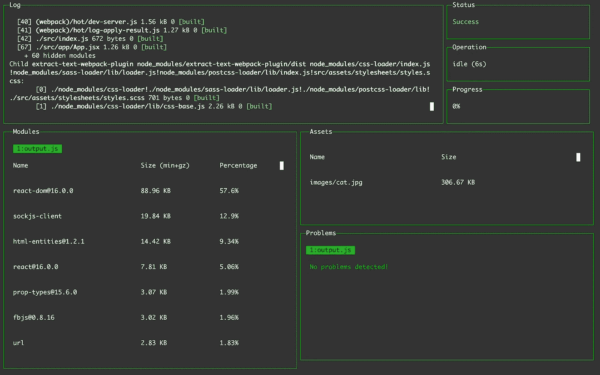

终端内漂亮的 webpack 仪表盘

Webpack-dashboard 在 GitHub 上有超过 13，000 颗星，但我几乎从未遇到开发团队使用该插件。

为什么不利用这个伟大的插件呢？

*注意:别忘了，如果有人偷窥的话，你可以假装你在美国国家航空航天局工作！*

> 当使用 webpack 时，特别是对于一个开发服务器，你可能习惯于看到这样的东西— [根据 webpack-dashboard GitHub 页面。](https://github.com/FormidableLabs/webpack-dashboard)

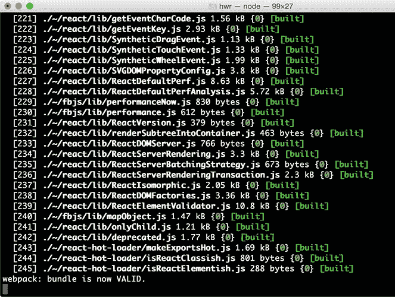

我们都熟悉上面的 webpack 日志。虽然有时候我会想——这个屏幕到底是给谁看的？一个超级外星种族？

这就是为什么 webpack 日志迫切需要一个新的更友好的用户界面，而 webpack-dashboard 可以做到这一点。

# **Webpack-Dashboard** 前来救援！

这个插件改善了 webpack 日志的视觉效果。现在当你运行你的开发服务器时，你基本上是在 NASA 工作。

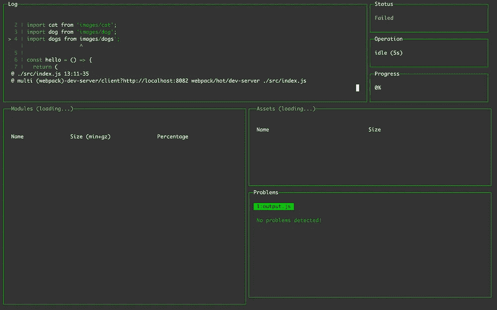

好多了

编译错误和日志不是更易于阅读吗？

让我们看看两个最流行的搭建工具是如何使用 webpack 日志记录的。

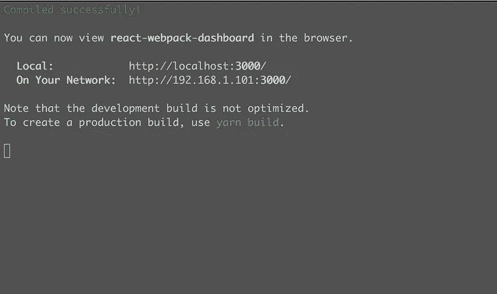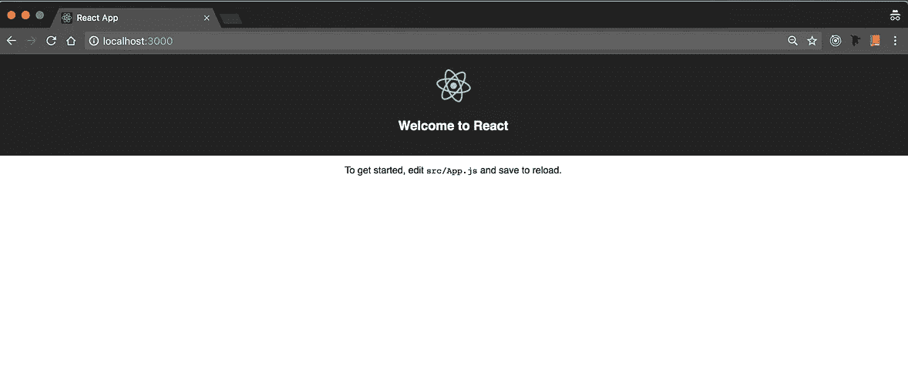

[创建-反应-应用](https://github.com/facebook/create-react-app)

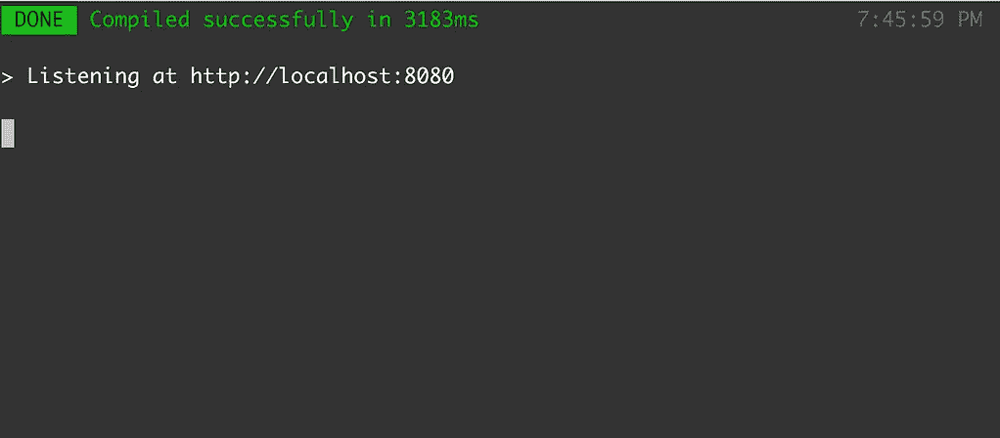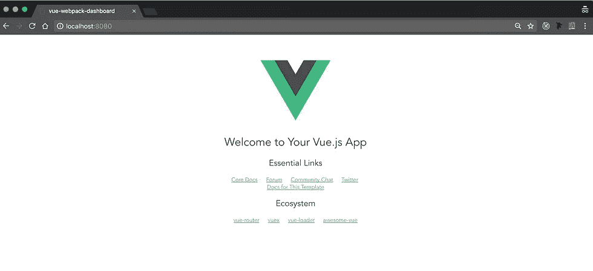

[Vue-CLI](https://cli.vuejs.org/)

从上面的例子中——web pack 让我们知道我们的应用程序是否编译成功。它还让我们知道 webpack 服务器当前正在使用哪个端口。

我们当然可以通过在屏幕上显示更多有用的信息来改善这一点。

# 使用 Create-React-App 和 Vue-CLI 处理错误

下面是目前使用 webpack 时编译错误的样子。

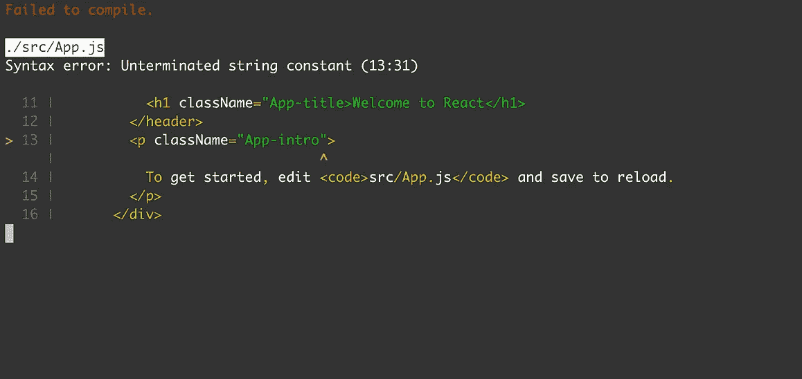

左— **反作用**和 **Vue** —右

非常好——在出现语法错误后，我们会立即得到通知。

更重要的是:我们不仅会收到通知，还会收到错误消息，以及错误发生的位置。

# 创建-反应-应用程序和 Vue-CLI 生产输出

当我们决定将我们的应用程序捆绑起来用于生产时，我们会得到以下结果。

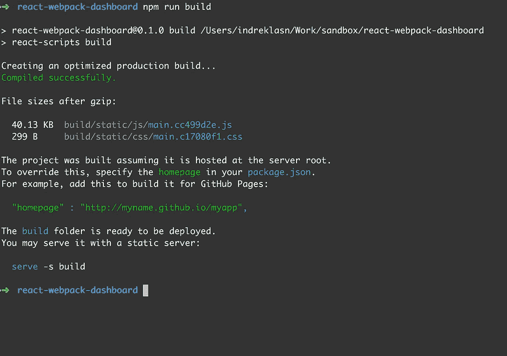

没有抱怨——但是有些地方我们可以改进。让我们来看看 webpack dashboard 如何帮助我们。

# 使用带有自定义配置的 Webpack-Dashboard

我已经使用 Webpack 建立了一个基本项目。克隆项目，安装依赖项，并使用以下命令启动项目。

```
git clone [git@github.com](mailto:git@github.com):indreklasn/webpack-2.0-from-scratch.git && cd webpack-2.0-from-scratch && npm i && npm run start
```

如果你很好奇，这里有一个分五章的指南，介绍如何设置这个 webpack 配置，强烈建议你通读一下！

在粘贴命令并耐心等待之后，您应该会看到下面的屏幕。

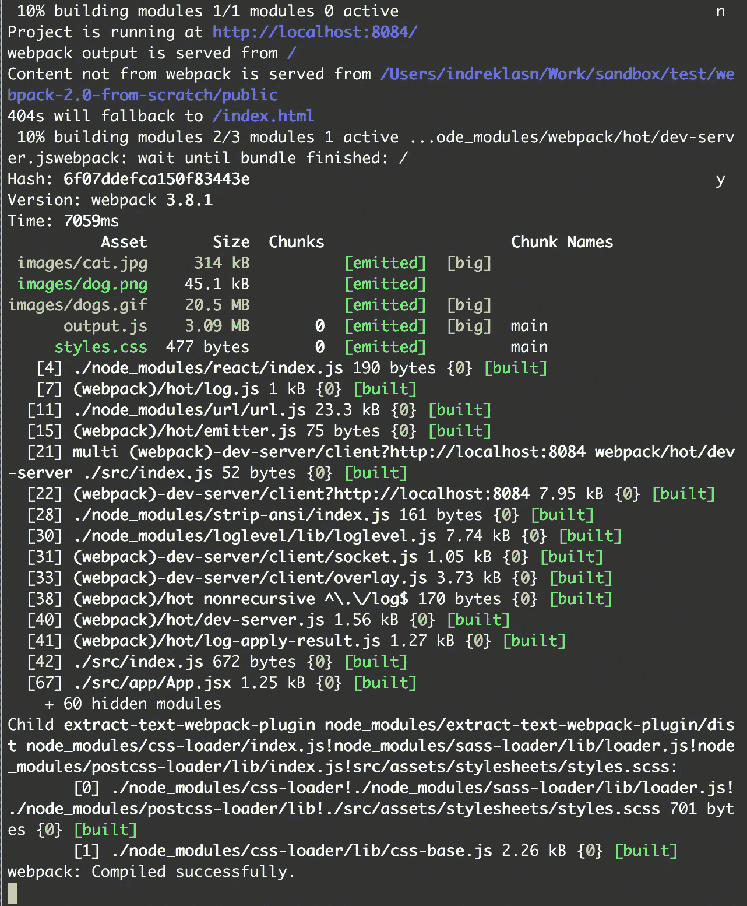

太好了！按预期工作。让我们从 webpack-dashboard 开始。

# 安装 web pack-仪表板

## 通过 NPM 安装

```
$ npm install --save-dev webpack-dashboard
```

## 通过纱线安装

```
$ yarn add --dev webpack-dashboard
```

接下来—需要在`webpack.config.js`中的 webpack-dashboard 插件，并使用`new`关键字调用该插件，如下所示:


然后，将您的开发服务器启动脚本修改为之前的样子:

```
"scripts": {
    "dev": "node index.js", # OR
    "dev": "webpack-dev-server", # OR
    "dev": "webpack",
}
```

用`npm run start`打开我们的网络包，我们会得到以下内容

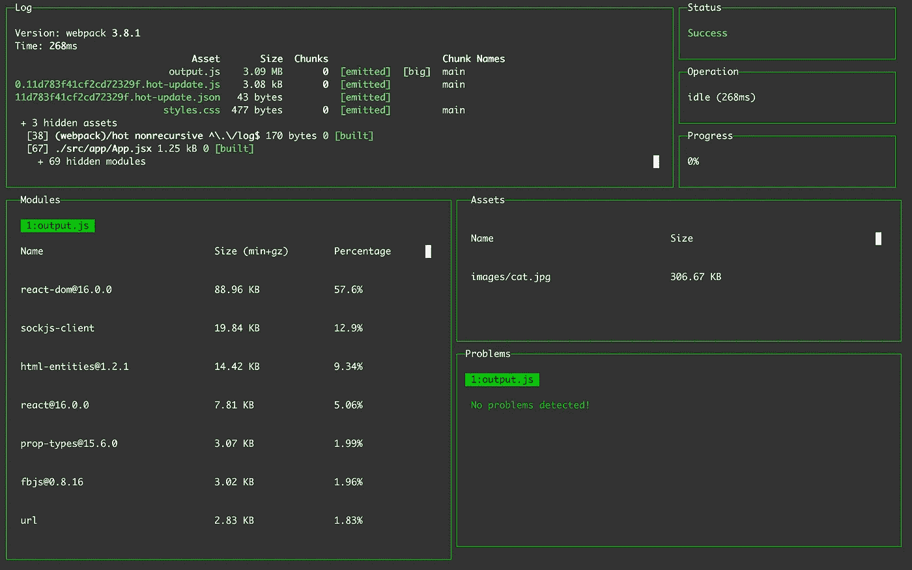

Booyah！厉害！

顺便说一句——我们不需要这个巨大的仪表板。这里有一个调整窗口大小的实际例子。

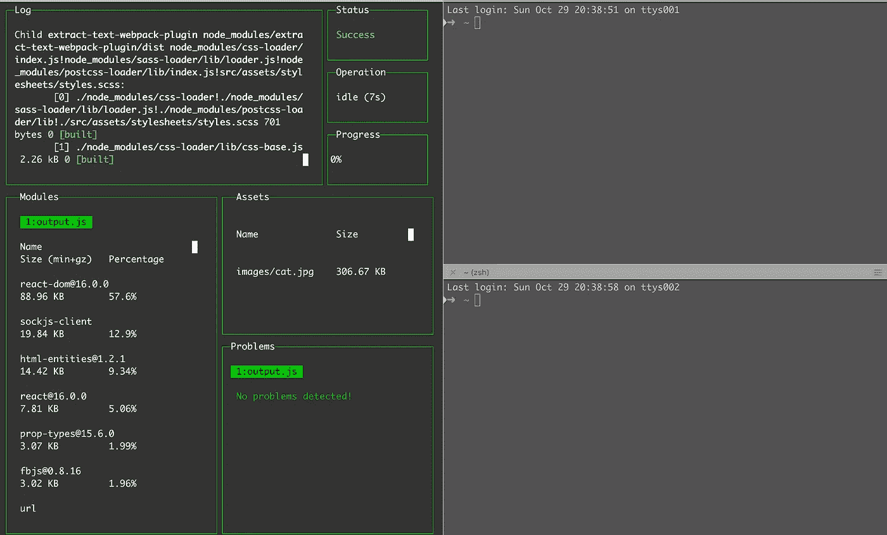

[我用的是 iTerm2](https://www.iterm2.com/) 。

# 使用 Webpack-Dashboard 创建-反应-应用程序


```
npm i -g create-react-app && create-react-app react-webpack-dashboard && cd react-webpack-dashboard && npm i webpack-dashboard --save-dev && npm run eject
```


现在，我不是一个大风扇喷射，但如果你找到一个变通办法，请让我知道！

我们用与自定义配置相同的方式设置它。

打开`config/webpack.config.dev.js`并要求仪表板插件。另外，不要忘记在`plugins: []`部分包含插件。你可以用 CTRL + F 搜索插件部分。应该在第 214 行。

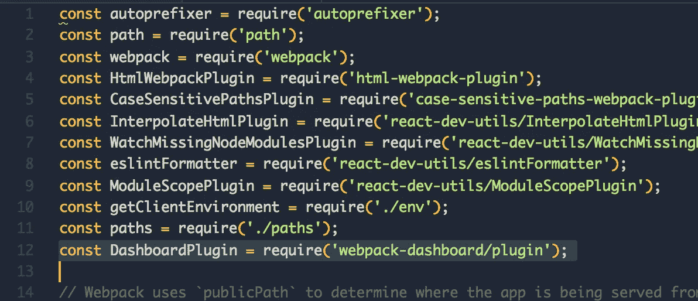

打开`package.json`，将启动脚本更新如下:

```
"start": "webpack-dashboard -- node scripts/start.js",
```

测试时间！运行以下命令`npm run start`

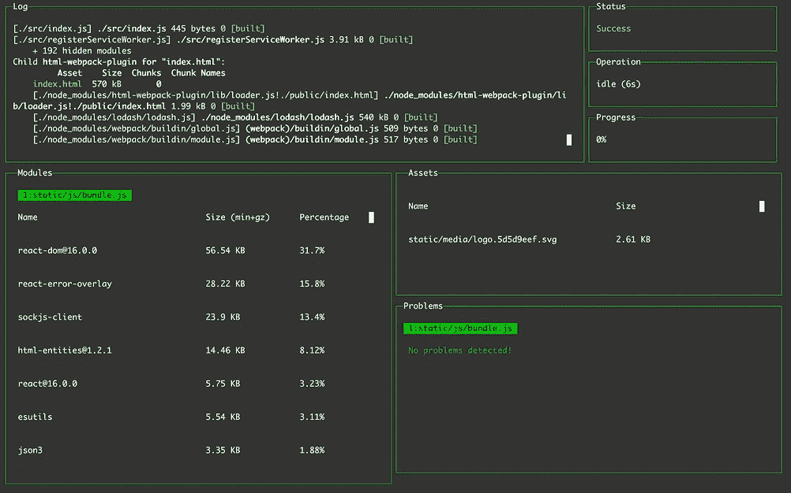

作品。

# 带 Webpack-Dashboard 的 Vue-CLI


Vue 没有弹出的概念。这是显而易见的，因为我们不需要做出牺牲。

打开`build/webpack.dev.conf.js` —需要插件(*行 9* )并插入插件(*行 23* )

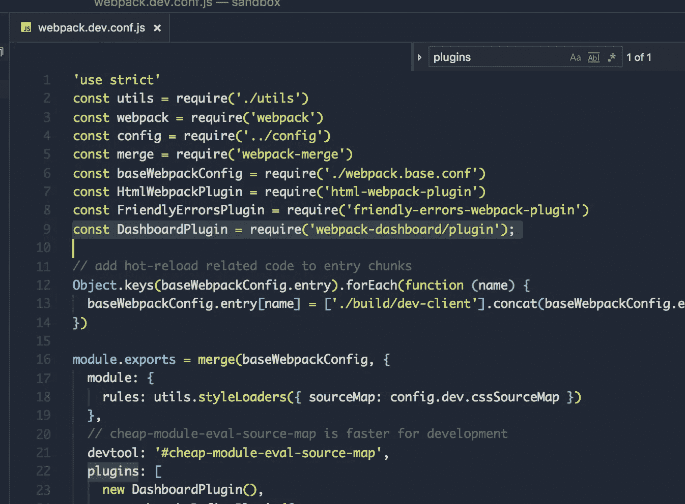

最后，转到`package.json`，将开发脚本更改如下:

```
“dev”: “webpack-dashboard — node build/dev-server.js”,
```

测试它:

`npm run start`

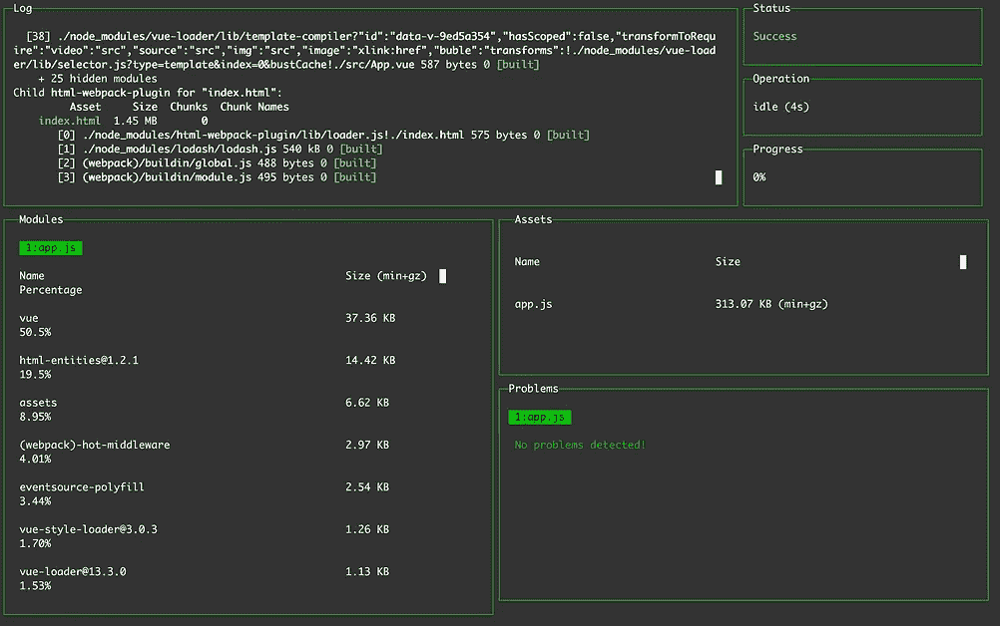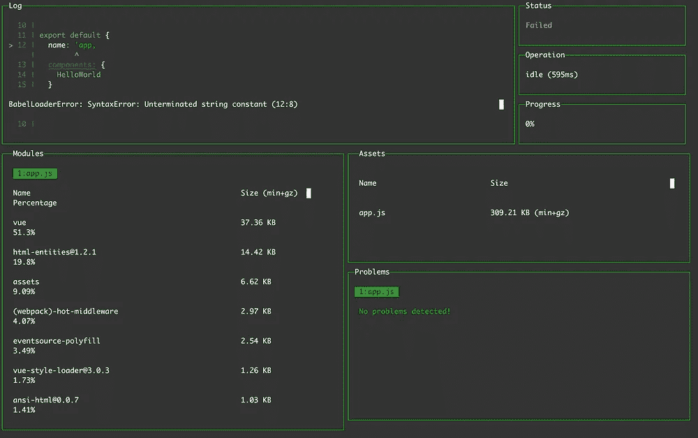

有用！

# 结论

特别感谢 webpack-dashboard 的创造者。请对他们的辛勤工作表示感谢— [去启动 GitHub 上的资源库吧！](https://github.com/FormidableLabs/webpack-dashboard)

感谢阅读，编码快乐！