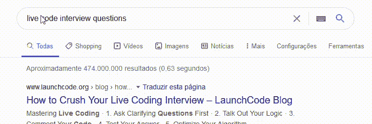

# 我们把编码面试过程全搞错了

> 原文：<https://betterprogramming.pub/weve-got-the-coding-interview-process-all-wrong-15a552b0f224>

## 迫切需要改变我们选择候选人的方式

在 [Unsplash](https://unsplash.com?utm_source=medium&utm_medium=referral) 上由 [Tim Gouw](https://unsplash.com/@punttim?utm_source=medium&utm_medium=referral) 拍摄的照片。

你看到一份描述完美的工作。你满足了所有的要求，公司和它的位置都很棒。好像这份工作是为你量身定做的。完全匹配。

你回顾你的简历，写一封完美的求职信，然后申请。几天后，你收到一封回复邮件。他们喜欢你的申请，并通知你你已经被批准进入下一轮:与经理的现场代码面试。

你又慌了。你上一次做的不好。你什么都忘了。一片空白。但这一次将会不同。毕竟，这是你梦寐以求的工作。你为面试学习了一周。你回顾算法，做一些代码挑战，检查在这些情况下最常问的问题。

面试开始了——几个打破僵局的问题。关于你的简历和过去经历的一些事情。没什么大不了的。然后，代码部分。你打开浏览器，阅读任务，问一些问题以确保你理解了一切，然后…一片空白。

你所有的恐惧又开始上升。你开始认为你不够好，你是个失败者，你犯了罪，被抓了。面试官试图帮助你，但你没有任何进展。你知道你不一定要做对。你只需要朝着正确的方向前进。

但是已经太晚了。你知道，他们知道:采访结束了。再问几个关于工作和公司的问题，然后是那句名言“几天后你会收到我们的电子邮件，知道你是否被批准参加下一轮面试。”

十分钟后，你在淋浴时解决了问题。“我怎么会这么笨？那太容易了！”

几天后，电子邮件来了。你还没有被批准。

照片由[埃里克沃德](https://unsplash.com/@ericjamesward?utm_source=unsplash&utm_medium=referral&utm_content=creditCopyText)在 [Unsplash](https://unsplash.com/s/photos/struggle?utm_source=unsplash&utm_medium=referral&utm_content=creditCopyText) 拍摄。

# 缺陷

你可能经历过几次这种情况。如果你是一名经理，你会看到很多优秀的候选人在现场代码面试或测试中僵住了。你知道他们理解这个话题以及如何解决，但是他们就是不能处理这个情况。

## **编码面试是基于记忆的**

问题是，开发人员被要求在白板(或其现代在线等价物)上仅仅根据他们的记忆来解决复杂的问题。尽管你可以说你思考的方式比代码本身更重要，但它仍然在很大程度上取决于你能记住多少。

如果你像我一样内向，很可能你不擅长这个。也许你只是过了糟糕的一天。或者你以前从未见过这个算法。或者是[冒名顶替综合症](https://www.bbc.com/worklife/article/20200724-why-imposter-syndrome-hits-women-and-women-of-colour-harder) [再](https://www.nbcnews.com/better/health/how-impostor-syndrome-holding-you-back-work-ncna814231)。

这就像一个吉他手，而不是知道如何演奏一首歌，你被要求描述大调音阶的七个模式。

在网上快速搜索会找到很多网站和教程，教你如何通过面试。我们创造了另一个不必要的步骤——一个怪物，真的。

许多候选人学习算法只是为了通过面试，而不是因为他们需要它们来解决一个真正的问题。

## 它们是单向的

在真正的编码中，你花了很多时间与他人互动，问问题，寻找错误，测试你的代码，或者教导他人。

在现场代码面试中，这些方面实际上都没有被评估。只是你有多擅长解决伪装成编码的难题。一个人。

## 对真实问题的拙劣模拟

描述编程挑战的方式也存在缺陷。它们通常是标准的一般性问题，而不是公司日常处理的问题。

这可能是一种判断候选人是否是一个好的程序员的方式，但不是他们是否适合公司。

这些算法式的面试有一些缺陷，但许多公司一直在进行。这是有原因的。

由[罗伯特·科林斯](https://unsplash.com/@robbie36?utm_source=unsplash&utm_medium=referral&utm_content=creditCopyText)在 [Unsplash](https://unsplash.com/s/photos/kids?utm_source=unsplash&utm_medium=referral&utm_content=creditCopyText) 上拍摄。

## **酷孩子这么做并不意味着这是对的**

如果你需要雇人，但不知道怎么做，你会找知道怎么做的人。

你可能会看到谷歌、T2、脸书和 T4 的亚马逊是如何做到这一点的。“他们必须知道自己在做什么。”

虽然他们花了时间思考他们的面试过程，但这并不意味着他们做得对。

这并不意味着这就是你所需要的。他们和你有不同的需求和期望。

## 他们只测试基础知识

人们相信，具有良好计算机科学基础的人将成为优秀的软件开发人员——良好的基础真的可以帮助你提高解决问题的技能。

他们在计算机科学项目的最初几年被涉及，面试官希望你了解他们。

有可能你将不得不开发你自己的数据结构，最好有一些作为开始的指南。如果你对基础的感到舒服，你可能会对难的感到满意。

然而，一些评估者真的可以把这搞砸。他们想要一个*具有挑战性的*面试问题来过滤掉不合适的问题，但最终会产生一个基于*知识*方面而不是*解决问题*方面的挑战。

[Ivan vrani](https://unsplash.com/@hvranic?utm_source=unsplash&utm_medium=referral&utm_content=creditCopyText)在 [Unsplash](https://unsplash.com/s/photos/broken?utm_source=unsplash&utm_medium=referral&utm_content=creditCopyText) 上拍摄的照片。

# 其他方法也有缺陷

“面试”候选人还有其他方法，但它们也有自己的问题。

你可以测试人们的相关知识，比如框架或者 OOP 概念，但是他们和编码的人有同样的问题。你刚刚改变了话题。

你试着询问他们过去的经历，看看他们在不同的任务中是如何成功的。但是你实际上可能是在测试他们听起来是否成功，卖得好不好——而不是他们是否真的做了什么。

对于初级开发人员来说，他们只是还没有时间或机会参与项目。

你可能会要求提供他们所做工作的证据，比如投资组合或存储库。如果他们为一家公司工作，他们可能不能分享他们在那里做了什么。

或者他们没有。他们想用空闲时间做些别的事情，而不是编程(这没什么错)。

你可以给他们发一个家庭作业问题，但是你怎么知道那是不是真的是他们的作业，或者他们是否愿意在空闲时间做？

[西格蒙德](https://unsplash.com/@sigmund?utm_source=unsplash&utm_medium=referral&utm_content=creditCopyText)在 [Unsplash](https://unsplash.com/s/photos/tips?utm_source=unsplash&utm_medium=referral&utm_content=creditCopyText) 上拍照。

# 改进的技巧

尽管我们的面试方法已经过时，但这并不意味着我们应该完全抛弃它们。

有一些方法可以提高他们，以确保他们检查工作所需的技能。

作为一名评估者，这是你应该问自己的第一个问题:“这真的是在评估一名候选人在这里会做什么吗？还是我只是复制粘贴了别人的作品？”

结合上述方法是一个很好的开始。您可以测试开发人员需要具备的不同技能。

## 项目评估

筛选不适合的一个好方法是给候选人发一份家庭作业。

这样，他们可以选择他们最喜欢的 IDE，查找他们不记得的任何内容，并解决一个实际问题，就像他们在现实世界中一样。

在这里要小心。很容易[发送一个对候选人来说似乎是辱骂的项目。](http://www.gayle.com/blog/2013/09/18/companies-who-give-candidates-homework-assignments-knock-it-off)

*   保持简短。他们的时间和你的一样宝贵。
*   把说明写得非常清楚，但是也要给他们留有创造性的空间。重要的是要知道从任务中能期待什么。
*   要求适当的文件，这样你就可以知道他们的方法和思考过程。
*   让它与公司的业务保持一致。

这里重要的部分是观察候选人如何从需求到生产解决一个问题。

你可以在网上这样做，应聘者分享他们的屏幕，这样你就可以看到整个过程。

## 现场采访

您有一个很好的项目评估测试过滤器，但是有时您需要更多的数据来分析我们前面谈到的原因。

然后，你可以进行现场面试，询问一些问题，比如:

*   Bug 修复:在他们的代码中插入一个 bug，并要求他们修复它。这也可以在另一个项目中实现，这样你就可以看到他们是如何成功地使用其他人的代码的。
*   重构:询问候选人认为他们可以在他们的代码(或其他)中改进什么。你可以看到他们有多了解什么是好的代码或者如何扩展产品。
*   结对编程:让他们向其他程序员教授或解释他们的代码。这将显示他们对自己所做的事情(如果他们真的做了)的理解程度，以及他们与他人沟通的能力。

请记住，始终保持这一步简单和可解决的。这样，候选人可以专注于重要的事情——而不是试图想出一个解决方案或对没有完成问题感到紧张。

Artur Aldyrkhanov 在 [Unsplash](https://unsplash.com/s/photos/final?utm_source=unsplash&utm_medium=referral&utm_content=creditCopyText) 上拍摄的照片。

# 最后的想法

为一个角色寻找一个好的候选人的过程对公司和候选人来说都是漫长而紧张的。这可能会持续几个月，浪费很多钱，公司最终甚至可能找不到一个好的匹配。

大多数软件开发公司目前使用的方法可能会产生误导。他们可能会选择一个人，他装饰了教科书上的所有内容，但不知道如何应用它或这样做的含义。

做采访没有简单的方法。所有的面试方法都有缺陷。你需要找到对你的公司和你试图扮演的角色有意义的东西。测试你的过程是否真的在工作，如果有必要就改变它。你不会在第一次尝试中找到完美的解决方案。

如果你找到了雇佣开发者的好方法，请与全世界分享。这对大家都好。