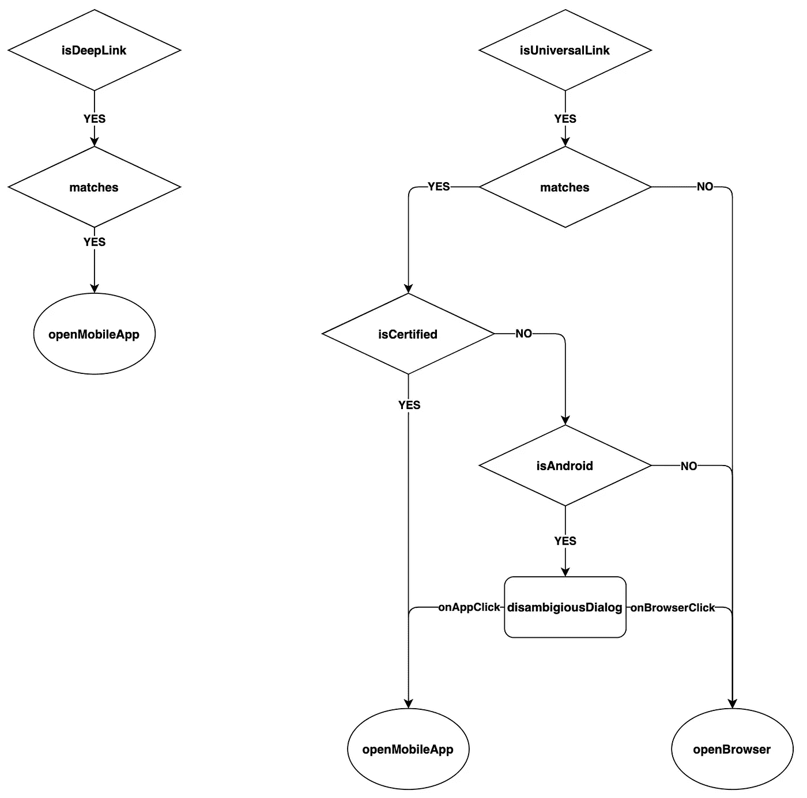

# 深度链接的不同目的是什么？

> 原文：<https://betterprogramming.pub/what-are-the-different-purposes-of-deep-links-253ee1118b06>

## 找出深层链接


汉斯-彼得·高斯特在 [Unsplash](https://unsplash.com/s/photos/confusion?utm_source=unsplash&utm_medium=referral&utm_content=creditCopyText) 上拍摄的照片。

如果你是一个移动开发者，你应该熟悉深层链接。它们为您的应用程序带来了导航机制。有了它们，您可以:

*   将你的用户从任何地方重定向到你的移动应用。
*   在您的移动应用程序中导航至特定页面。

那么为什么人们经常对它们感到困惑呢？为什么在交流深层链接时准确是如此重要？

要回答第一个问题，我需要解释什么是深层链接以及它们是如何表现的。因为有不同类型的深层链接，你会想要更深入地挖掘以清除混乱。

因为这就引出了第二点:深度链接可以变成对付获取和留存的有力武器。他们把你的用户吸引到你的应用上。

为此，你将与非技术人员打交道——大部分来自你的产品/营销团队。你必须注意如何传达你的需求。否则，你最终会交付一些意想不到的东西。

让我们解开这些链接是什么，以及如何利用它们。

# 深度链接有哪些不同的类型？

您可以看到深层链接作为带标记的 URL 打开您的移动应用程序，而不是浏览器。我们可以把它们分为三类。

## 1.深层链接

您可以通过它们的语法来识别它们:它们从您选择的定制方案开始。让我们与一个常规的 URL 进行比较:

```
https://www.myawesomewebsite.com/amazingpath  // Regular URL
mycustomscheme://myawesomewebsite/amazingpath // Deep link URL
```

把深层链接看作是为你的应用程序定制的 URL。

## 2.通用链接

苹果首先为 iOS 9 推出了[通用链接](https://developer.apple.com/ios/universal-links/)。当在你的浏览器上导航时，它们在你的移动电话上提供无缝导航。

本质上，它们是你拥有的常规 URL——比如上面例子中的那个。想象一下，除了手机应用程序，你还有一个网络应用程序。在浏览 web 应用程序时，您可能希望将用户重定向到您的移动应用程序。

与深层链接一样，您必须在移动应用程序中声明这个 URL。此外，您的 web 应用程序必须证明它允许您的移动应用程序拦截其 URL。否则，这将是一个重大的安全漏洞。想象一下，你声明谷歌是一个通用链接。每次你的用户在手机浏览器上打开谷歌，你的手机应用程序就会启动！

认证采用 JSON 文件的形式，您必须上传到 web 应用程序根目录下的`.well-known`文件夹中。根据您正在开发的平台，该文件将具有不同的名称:

*   `apple-app-site-association.json`为 [iOS](https://developer.apple.com/library/archive/documentation/General/Conceptual/AppSearch/UniversalLinks.html)
*   `assetlinks.json`为[安卓](https://developer.android.com/training/app-links/verify-site-associations)

## 3.应用链接

它们只不过是 Android 开发者用来称呼通用链接的术语。如果你想在 Android 开发者中使用这个术语，那很好。但是为了你的读者的理智，我建议避开这个名字，坚持使用通用链接。

# 它们是如何工作的？

我们可以把如何接近它们分成两个阶段。

## 1.侦查

检测阶段依赖于您的移动应用程序是否支持深度链接，或者通用链接。您必须声明您支持手机应用程序中的给定链接。

您必须声明一个包含 scheme(下面的红色部分)和 host(绿色部分)的对。如果您希望您的移动应用程序拦截链接，两者必须匹配。


作者照片。

然而，当你的移动应用程序拦截一个链接时，它会根据它是深度链接还是通用链接而有不同的行为。我在下面举例说明了两种情况:



作者照片。

我们可以观察深层链接有多简单。如果有匹配，他们要么打开你的手机应用程序，要么什么都不做。

对于通用链接来说，就比较棘手了。主要优势在于万一你的移动应用不支持 URL 时的后备。它将打开浏览器，因为链接仍然是一个常规的 URL。

如果您的移动应用程序支持该 URL，系统将执行检查以确保您的证书有效。你的手机应用会拦截链接并自行打开，或者退回到浏览器。

然而，Android 操作系统的行为有所不同。即使证书不是决定性的，系统也会提示一个消除歧义的对话框，让用户选择如何继续。因此，如果您没有在 web 应用程序中认证您的通用链接，您仍然可以打开您的移动应用程序。

## 2.从语法上分析

到目前为止，你的移动应用程序可以拦截所有与你支持的方案和主机匹配的 URL。除此之外，你的应用程序将仅仅启动并登陆你的主页。您需要将用户重定向到移动应用程序中的特定页面。

为此，您需要解析附加到您的 URL 的路径(上面的蓝色部分)。根据它，你的应用程序必须处理到你的页面的路由。这部分完全由开发者决定。

## 深度链接与通用链接处理

当您想要支持深度链接或通用链接时，您必须同时处理检测和解析步骤。但是考虑一下这个:

*   从功能上来说，你看不出它们有什么区别。
*   从技术上来说，检测部分也会差不多。然而，解析会因为它们的 URL 格式而有所不同，这给开发人员带来了额外的成本。

# 添加深度/通用链接的成本是多少？

检测部分不会花多少钱。开发人员需要在移动应用程序的清单中添加新支持的 URL。该任务围绕着解析和路由到您的移动应用程序中想要的目的地。

如果您正在为 iOS 开发，并且想要支持另一个通用链接，那么您需要更新您的认证 JSON 文件，并将其重新加载到您的 web 应用程序中。Android 平台不需要这一步。

# 如何选择深度链接或通用链接

尽管这些链接有一个共同的目标——将你的用户重定向到你的移动应用中——但它们有不同的目的。

在引入通用链接之前，深度链接是唯一可以用来填充这个角色的工具。现在两者是互补的。

您将希望支持围绕您的产品进行全球交流的通用链接。它们确保正确地重定向到您的手机或 web 应用程序。

你会更喜欢深度链接，只针对你的移动应用程序。你可以想象以下场景:

*   在推送通知有效负载中插入深层链接。
*   在邮件活动中包含深层链接，以重新激活您的用户。
*   让一个 API 给你发送一个深层链接，让你的移动应用知道在一个特定事件上导航到哪里。

# 结论

记住这些原则，我希望你能更好地理解深层链接的概念以及链接背后的东西。

正如你所看到的，只要你理解它们的细微差别以及如何使用它们，它们并不复杂。但是请确保在与不同的相关团队交谈时采用适当的术语。