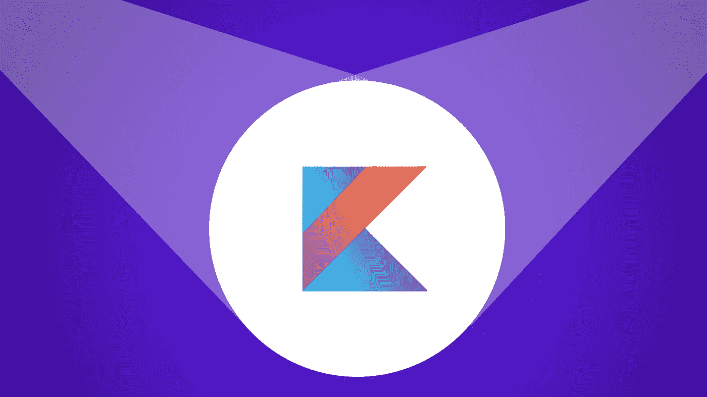

# 在 Kotlin 1.4 中我们可以期待什么？

> 原文：<https://betterprogramming.pub/what-can-we-expect-in-kotlin-1-4-e5374587e020>

## 了解 Kotlin 和 Android 的未来

科特林语是一种年轻的语言，但它发展很快。Kotlin 1.4 的第一个预览版(M1 和 M2)已经发布了，它们带有许多令人兴奋的特性。

我们可以很容易地写一系列关于这些特性的文章，所以这里我们只关注 Kotlin 下一个版本中最重要的创新:语言的更新，标准库的新功能，最重要的是，一种全新的多平台项目方法。

## 为 Kotlin 1.4 设置项目

在继续介绍 Kotlin 1.4 的新特性之前，如果您想现在就开始使用它，这里是必需的`build.gradle.kts`(注意，Kotlin 1.4 仍处于预览状态)。

当然，当以 JVM 为目标时，我们只需用 JVM 替换“多平台”即可。这里重要的部分是添加预览库的必要性，并将 Kotlin 的版本设置为“1.4-M2”。

## 语言更新

该语言的核心并没有真正更新，但有一些受欢迎的变化:

*   **混合命名和位置参数**:在 1.4 之前，写参数的名称迫使我们写所有参数的名称，但是这个问题已经被修复。

*   **Break and continue inside when**:如果我们在一个循环中使用一个`when` 子句，我们现在可以使用`when`中的`continue` 和`break` 指令。

*   **`**typeof**`**函数**:一个新的方便的函数，允许我们获取一个`KType`对象，当我们可以获取一个具体化的泛型类型的`KType`对象时，这个函数特别有用。**

*   ****尾随逗号**:现在可以在参数列表的最后一个参数后添加一个尾随逗号，通过复制/粘贴可以更容易地切换参数的位置。**

# **更新的标准库**

**Kotlin 的标准库包含了大量的函数和类，方便的完成了 Java 标准库。随着 Kotlin 的每一次更新，新的特性都会加入标准库，从而提高 Kotlin 的可用性。**

**这可以通过添加新功能，或者最终取消或删除一些不安全的功能来实现。在删除的功能中，我们可以列举:**

*   **`mod`操作员最终被`rem`取代。**
*   **现在不赞成将浮点类型转换为字节和短整型**

**对于增加的功能，我们有:**

*   **标准库现在对所有平台都是通用的，包括`kotlinx.corountines`、`kotlinx.serialization`和`kotlinx.io`。**
*   **反射 API 现在对所有平台(JVM、JS、Native)都是通用的**

## **Kotlin 多平台变得更好**

**在这个新版本中，Kotlin 多平台有许多新奇之处:**

*   **统一后端:三个独立的后端(JVM、JS 和 Native)将合并成一个独特的后端。**
*   ****多平台项目现在可以分层**:例如，我们可以将目标`linuxX64Main`、`mingwX64Main`、*、`macosX64Main`、*、*作为一个公共父目标的子目标，我们可以称之为`nativeMain`。这允许更好地分解代码。***
*   **多平台项目生成名为`KLib`的新包。**
*   **多平台项目现在需要 Gradle 6.0 或更高版本。**

**对于那些使用 Kotlin 多平台项目的人来说，这是个好消息。例如，由于项目的层次结构，我们不必为每个平台重写三次相同的代码。**

**而且**KLib 格式似乎真的很有前途**。目前，还没有办法构建一个包含所有目标(JVM、JS、Native)代码的包。如果您的多平台项目依赖于另一个多平台项目，则必须为每个目标添加依赖关系。如果在下一个版本中，有可能只依赖一个包，这将是一个巨大的进步。**

# **全球改进**

**随着语言、标准库和多平台项目支持的改进，Kotlin 也有了一些改进，这将使它更容易使用:**

*   **更强大的类型推断(在更多用例中自动推断类型，lambda 的最后一个表达式和可调用引用的智能转换，等等)。)**
*   **Kotlin/Native 编译和执行的改进性能。**

**Kotlin 1.4 还没有发布，所以在发布之前我们可以期待更多的变化。但是第一次预览是令人兴奋的，特别是如果你正在处理多平台项目。**

**如果你不知道它们是什么，你应该看一看这篇文章，这篇文章解释了你如何为 JVM、浏览器和本地平台编写相同的代码。**

**虽然这是一个令人惊叹的特性，但在 Kotlin 1.3 中，仍然存在一些缺点:标准库的一些功能并不适用于所有平台，打包系统不实用，相似目标之间没有可能的代码分解。看到 Kotlin 1.4 要修复这些东西，那真是好消息。**