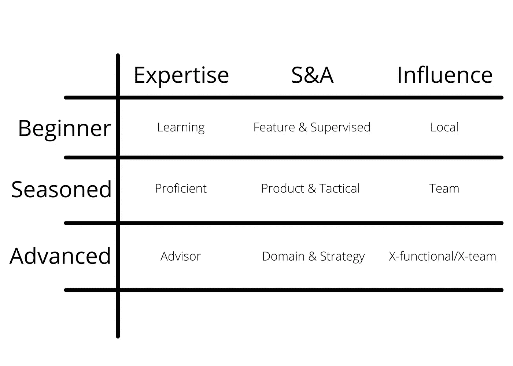

# 成为一名高级软件工程师需要什么？

> 原文：<https://betterprogramming.pub/what-does-it-take-to-become-a-senior-software-engineer-8accd950d98>

## 研究生院没人教我们的重要技能

妮可·沃尔夫在 [Unsplash](https://unsplash.com/s/photos/computer-programming?utm_source=unsplash&utm_medium=referral&utm_content=creditCopyText) 上的照片

十多年前，公司倾向于根据他们对编程语言、框架、技术栈等的经验来雇佣开发人员。

尽管雇佣精通某个特定堆栈的工程师是可取的，但这并不重要。毕竟，优秀的软件开发人员可以通过互联网上的大量知识快速学习和提升。

以此为绝对基准，公司开始重视具有强大补充软技能的开发人员，因为他们的技术专长现在是在行业中工作的基准，为大学一毕业就开始职业生涯的人设置了更高的门槛。

# 三个基本特征

做了 11 年的工程经理后，我观察到科技公司通常最看重的技能。我注意到一种模式通常分为三类:

## 1.专业技术和工艺

理解计算机科学的基本概念是成为软件工程师的基础。尽管这是常识，但这门科学是庞大的，并且在不断发展。

## 2.范围和自主权

我们不再生活在一个单独工作并从 UML 图中实现规格说明就足够了的世界。那些知道如何驾驭需要最少监督的复杂性的人现在是非常有价值的专业人士。

## 3.沟通和影响

尽管没有人指望你成为一名熟练的心理学家，但我们已经过了程序员都是说着不知所云的外星语言的内向者的时代。在市场上，知道如何与人合作以及与非技术合作伙伴互动是一项有价值的技能。

# 成为高级软件工程师

我讨厌头衔。在我看来，“高级软件工程师”是一个模糊的术语。大多数时候，它只是一个头衔，代表你在公司阶梯上的位置，如果[有一个](https://www.quora.com/Why-does-Netflix-have-only-one-level-for-software-engineers)。

也就是说，被认为“资深”取决于许多不同的方面，比如你的技能与你工作的行业的相关性，你的公司对你的期望，你做出的贡献，以及许多其他不可预测的点。有时候，甚至你之前工作过的公司也要考虑很多因素。

这就是为什么我想帮助你了解可以让你达到更高水平的重要方面，这些方面基于对每个水平的期望，分为以下几个等级:初学者、经验丰富者和高级者。

图片来自作者

这个网格以一种简化的方式描绘了软件工程师的职业轨迹。它通常比这更复杂，但它仍然是识别职业转折点的一个很好的指南。请注意，我没有在不同的级别上使用如此流行的“助理”、“中级”和“高级”。

同样，这些是非常主观的许多其他因素。然而，高级软件工程师应该表现出高级水平中描述的所有特征。这里有一个更好、更广泛的方式来理解网格的含义:

# 开始软件工程师的职业生涯

作为这个新的冒险之地的初学者，有许多唾手可得的果实可供你借鉴。其实学习才应该是你的重点。你应该从各种各样的问题中获取尽可能多的知识。

大多数时候，你会致力于非常具体的问题、小特性或错误修复，直到你加速并很好地理解你正在帮助开发的产品或系统。

您将与更有经验的工程师合作，并从代码评审和合作伙伴的反馈中学习。这个级别的工程师花费合理的时间学习，直到他们熟练使用工具并获得更多的领域知识。

# 作为一名熟练的开发人员工作

此时，您已经接触了几年，掌握了计算机科学的基础知识，包括算法设计、数据结构、设计模式以及您使用的工具和框架。您至少对您所使用的技术堆栈的一部分有非常深刻的经验。

现在人们理所当然地认为，你可以在很少监督的情况下交付复杂的软件。事实上，还有一个期望，你可以帮助经验较少的工程师成长，并指导他们执行你制定的战术计划。你帮助人们审查他们的代码，解决问题，开发新的功能。

在你的职业生涯中，这是你开始有机会领导小项目和有时限的计划，并可能开始更多地接触跨职能合作伙伴和一些非技术利益相关者的时候。大部分软件工程师都停留在这个水平很多年。

# 一个高级软件工程师的成长

总体而言，编码开始变得不那么重要，因为你现在是团队和整个组织的精明代言人。现在，您已经了解了如何在整个领域的应用程序的架构级别上做出困难的权衡。

作为一名领域专家，您拥有公司代码库的很大一部分，监督它的发展和其他工程师的工作，并建议其他团队如何更好地接近或集成您的服务和应用程序。

作为一名顾问，你的贡献在多个团队中清晰可见。你很有影响力，其他工程师和跨职能合作伙伴会不断向你寻求建议。这是你开始考虑向领导角色转变的转折点。一般要好几年才能落地到这个水平。你的下一步是扩大你的工作在团队、组织、公司和整个行业的影响。

尽管大学和训练营让你做好了开发软件的准备，但随着你职业生涯的发展，这项技能开始变得不那么重要，而其他软技能变得更加重要。我希望这篇文章能启发人们反思自己的轨迹，以及如何进行下一步。