# docker 文件包含哪些内容？

> 原文：<https://betterprogramming.pub/what-goes-into-a-dockerfile-ff0ace591060>

## 从头开始构建 Dockerfile 文件，不需要任何经验

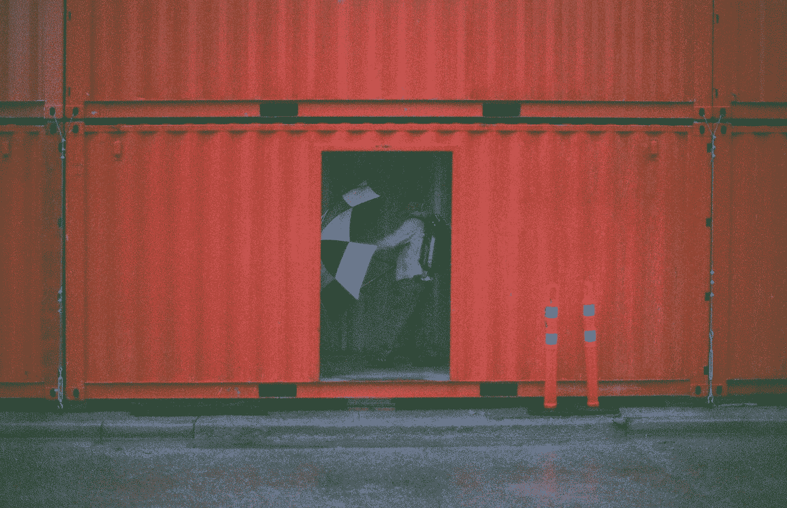

贾斯汀·贝克在 [Unsplash](https://unsplash.com?utm_source=medium&utm_medium=referral) 上的照片

# Docker 是什么？

你们中的一些人可能已经熟悉 Docker 是什么，可以跳过这个小的介绍部分。不过，我会简单介绍一下这个问题以及 Docker 试图解决的问题。

我们先来看看维基百科给出的定义:

> Docker 是一组平台即服务(PaaS)产品，使用操作系统级虚拟化来交付称为容器的软件包中的软件。
> 
> 容器是相互隔离的，捆绑了它们自己的软件、库和配置文件；他们可以通过明确定义的渠道相互交流。
> 
> 所有容器都由单一操作系统内核运行，因此比虚拟机更轻量级。— [维基百科](https://en.wikipedia.org/wiki/Docker_(software))

这听起来像一个伟大的销售谈话，但它使用了很多昂贵的话。Docker 只是一个工具，通过使用所谓的*容器*，使应用程序的创建、部署和运行更加容易。

这些容器允许我们开发人员将应用程序所需的一切打包(例如，库、依赖项)。然后，我们可以将包裹作为一个整体运输。

现在，我将向您展示的是您可以在 docker 文件中找到的所有关键指令。这将允许你理解和创建基本的 Docker 文件，而不需要那么多的理论。

如果你想尝试这些例子，你必须安装 Docker。我将在这里讨论的所有指令的概述:

*   `FROM`
*   `RUN`
*   `CMD`
*   `COPY`
*   `ADD`
*   `WORKDIR`
*   `ENTRYPOINT`
*   `ENV`
*   `LABEL`
*   `HEALTHCHECK`
*   `STOPSIGNAL`
*   `VOLUME`
*   `EXPOSE`

# 从

几乎你遇到的每一个 docker 文件都会以下面形式的`FROM`指令开始:

```
FROM <image>[:tag]
```

这条指令将为 Dockerfile 设置基础映像，这意味着后面的每条指令都适用于这个基础映像。

您可以选择指定 Docker 在执行`docker build`命令期间需要使用或提取的特定`tag`，默认为最新的标签。

您也可以指定多个`FROM`指令，这被称为多阶段构建，但是我想让事情简单一些，并为那些有兴趣深入研究这个主题的人提供一个到 Docker 的[链接。](https://docs.docker.com/develop/develop-images/multistage-build/)

所以，我们先来一个实际的例子！在您的操作系统中的某个位置创建一个文件夹。添加一个空 Dockerfile 文件(不带扩展名)并添加以下内容:

```
FROM ubuntu
```

如前所述，这将从 Ubuntu 获取最新的基础映像。让我们建立我们的第一个 docker 文件！为此，我们将使用下面的`docker build`命令:


我们现在已经创建了一个名为`demo_docker`的 Docker 图像。`-t`命令行选项是`-tag`的简写，并为您的 Docker 容器命名。

我们还指定了`.`，它只是我们当前文件夹的简写。现在我们有了 Docker 容器，让我们运行它，看看会发生什么:


这个命令运行 Docker 容器，并在容器中创建一个交互式的[Bash](https://www.gnu.org/software/bash/manual/html_node/What-is-Bash_003f.html)shell(`-it`)。它还会在退出时自动移除容器(`--rm`)。

要退出 Docker 容器，我们可以使用简单的`exit`命令。这就是你如何构建和运行你的第一个 Docker 容器。我们的命令现在只有一个建造阶段。到目前为止没那么复杂，对吧？

# 奔跑


照片由[布鲁诺·纳西门托](https://unsplash.com/@bruno_nascimento?utm_source=medium&utm_medium=referral)在 [Unsplash](https://unsplash.com?utm_source=medium&utm_medium=referral) 上拍摄

这个指令做它所说的，它运行命令。或者更具体地说，它执行特定的命令。使用多行`RUN`来执行多个命令是可能的，但是我建议在一行中合并尽可能多的命令。

这里有一个重要的原因:层缓存。如果一个图层被缓存，而另一个没有，您可能会处于与预期不同的状态。这会导致一片混乱。阅读更多关于 Dockerfile 的 Dockerfile 最佳实践[。](https://docs.docker.com/develop/develop-images/dockerfile_best-practices/)

现在，让我们举个例子，把下面几行放到你的 docker 文件里。`apt-get update`命令从存储库中下载包列表，并更新它们以获得关于最新版本的包及其依赖项的信息。

之后，我们安装了我当前操作系统中没有安装的 tree 命令。即使在构建并运行 Docker 容器之后，也不会。只影响 Docker 形象。

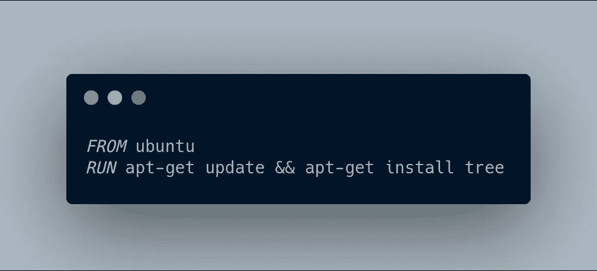

现在让我们像前面一样运行`build`命令:

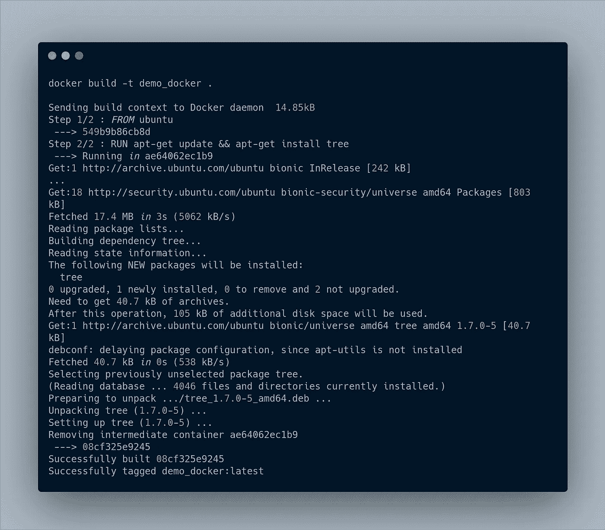

然后，我们像前面一样运行 Docker 容器:

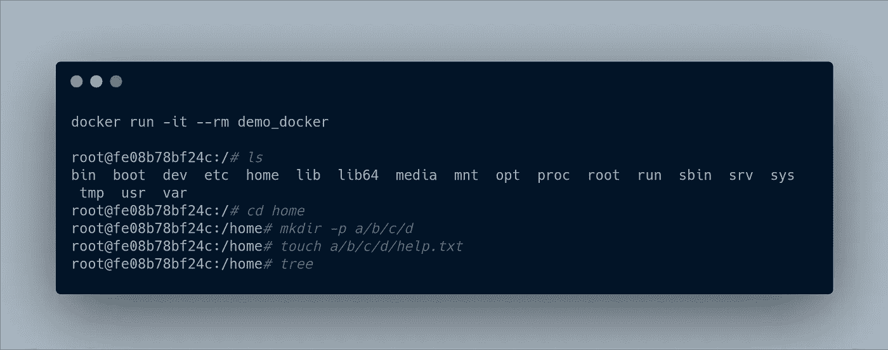

我们转到主文件夹，创建一个包含四个文件夹的目录结构，然后我们在目录`d`中创建一个文件。如果我们现在运行 tree 命令，我们将得到目录结构的概述，看起来有点像下图。

之后，我们退出 Docker 容器，它又消失了。这就是我如何断定`RUN`指令非常容易使用的原因。


# 煤矿管理局

`CMD`指令设置了一个默认命令，当您运行 Docker 镜像而没有指定命令时，该命令将被执行。这允许您执行以下操作，例如:

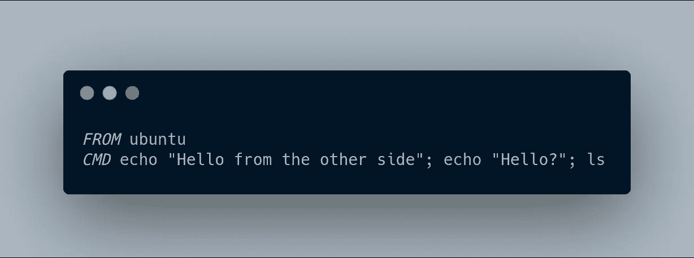

构建并再次运行 Docker。您可能已经注意到，也可以依次运行不同的命令。我带你去看。

如果您通过在不同的行上指定每个指令来做同样的事情，那么只有最后一条指令会被执行。如果你想看实际操作，你可以自己尝试一下。

还可以向 Docker 映像提供不同的命令，该命令将被执行，而不是 Docker 文件中的指令中指定的命令。我举两个例子:

*   第一个命令通过指定`/bin/bash`来启动 Bash 解释器。
*   第二个命令告诉你“嗨”。

这涵盖了`CMD`指令的基础知识。

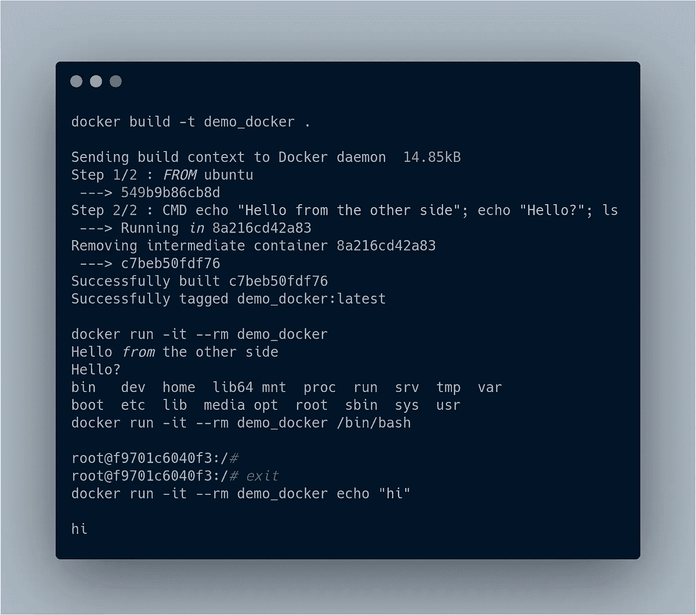

# 复制

`COPY`指令将本地机器上的一个文件夹复制到 Docker 映像中。当 Docker 映像启动并运行时，您也会在映像中看到该文件夹。让我们通过一个例子来看看我们是如何做到这一点的:

首先，我们需要创建一个 Dockerfile 文件:

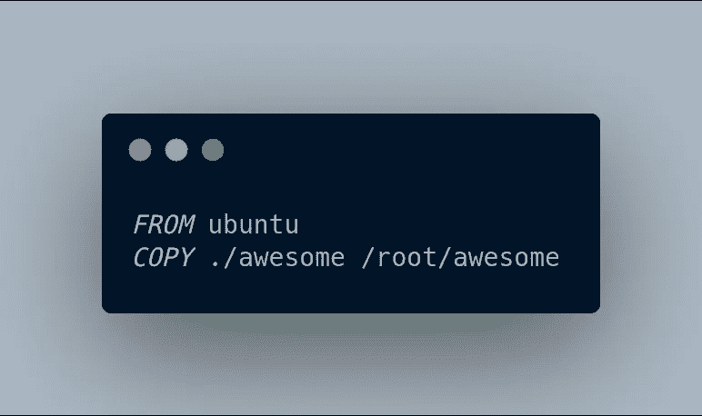

我来解释一下`COPY`指令。这里我们说我们将把 awesome 文件夹的内容(里面有一个文件`wow.html`)复制到 Docker 容器的根文件夹里面的 awesome 文件夹中。

如果我们指定了一些子文件夹，这个命令也会自动复制子文件夹。为了防止一些文件夹或文件被复制，你可以在一个 [docker 忽略文件](https://docs.docker.com/engine/reference/builder/)中指定它们。我将创建一个`docker_copy`容器，向您展示它的样子:


请记住:源路径必须在构建的上下文中。你不能写`COPY ../folder2`，因为在`docker build`的第一步，上下文目录和子目录被发送到 Docker 守护进程。

# 注意缺陷障碍 (Attention Deficit Disorder)

`COPY`和`ADD`的作用类似。它们都允许您将文件从特定位置复制到 Docker 映像中。`ADD`指令允许您执行与`COPY`指令相同的操作，但是除此之外，它还支持另外两个源:

*   您可以直接从源代码中提取 TAR 文件。
*   您可以使用 URL 代替本地文件目录。

## 提取一个 TAR 文件

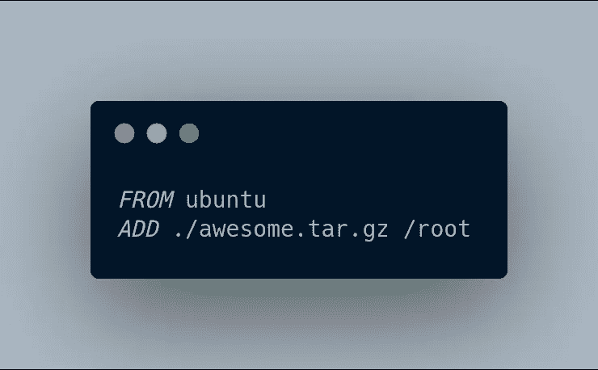

让我们运行`build`和`run`命令来检查发生了什么:

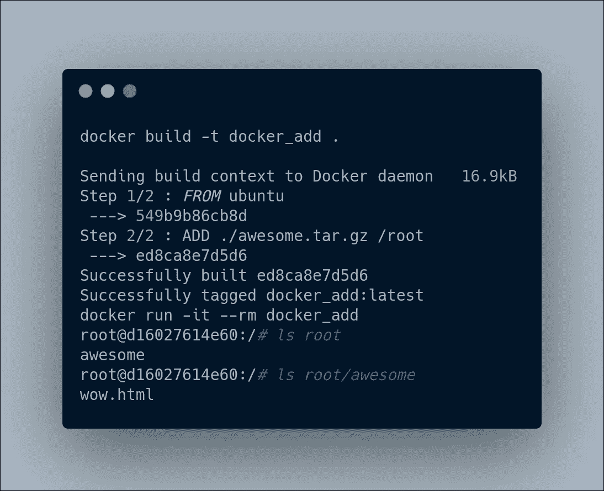

`ADD`指令允许你指定你想要它的位置，所以你可以说把它复制到根文件夹里面。它与常规的`ADD`或`COMMAND`指令略有不同，因为您没有指定结果文件夹的名称。

## 使用 URL


现在让我们构建并再次运行它:

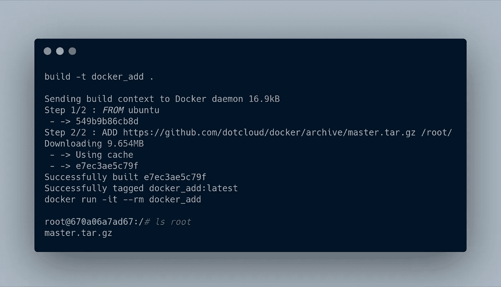

我第一次想到的是“这太出乎意料了”。但是它做了它应该做的事情。

根据[文档](https://docs.docker.com/engine/reference/builder/)，当`<src>`是一个 URL 并且`<dest>`确实以一个结尾斜杠结束时，那么从 URL 中推断出文件名并且文件被下载到`<dest>/<filename>`。

使用`ADD`指令时，请记住这一点。如果你想下载不止一个文件，我推荐你使用 curl 下载。

# 工作方向

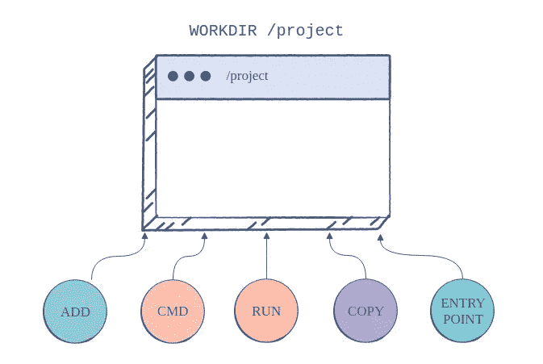

[工作指令](https://www.educative.io/edpresso/what-is-the-workdir-command-in-docker)指令的受影响指令

`WORKDIR`指令用于在任何给定时间定义 Docker 容器的工作目录。该命令在 Dockerfile 文件中指定。

任何连续的`RUN`、`CMD`、`ADD`、`COPY`或`ENTRYPOINT`指令都将在指定的工作目录中执行。我首先给你一个没有`WORKDIR`指令的例子:

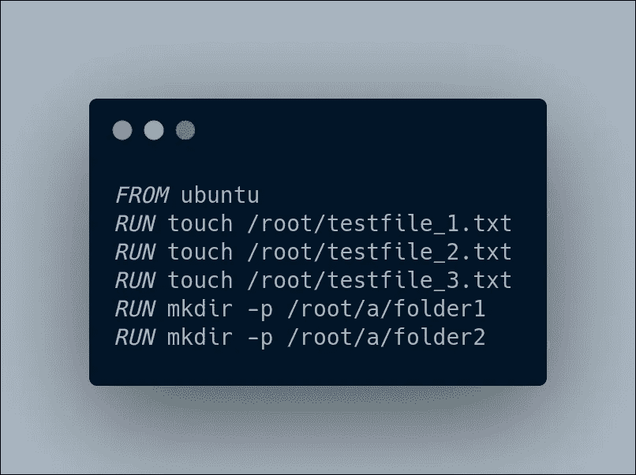

这个 Dockerfile 文件的问题在于重复的数量。在每条指令中，我们都明确指定了根文件夹。在最后两个命令中，我们甚至需要在根文件夹中指定一个子文件夹。

这只是一个小例子，但是只要指定一次当前工作文件夹就很好了。`WORKDIR`指令正是为我们做的。

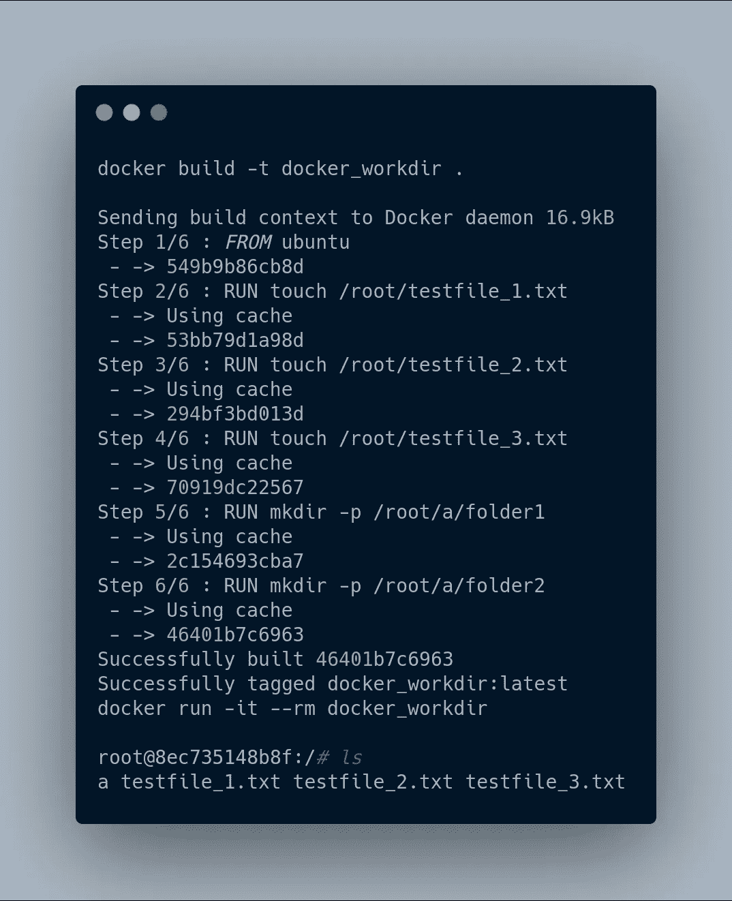

Docker 构建和运行步骤完全按照我们的要求去做。然而，我们希望避免重复，所以在下一个 docker 文件中，我们指定我们的根文件夹是我们当前的工作目录。

我们甚至在稍后指定另一个工作目录，这是通过指定`/root/a`文件夹来实现的。`WORKDIR`指令提高了 Dockerfile 文件的可读性，并避免了重复。

当工作目录的位置在开发过程中改变时，改变每一条指令会变得有点困难。

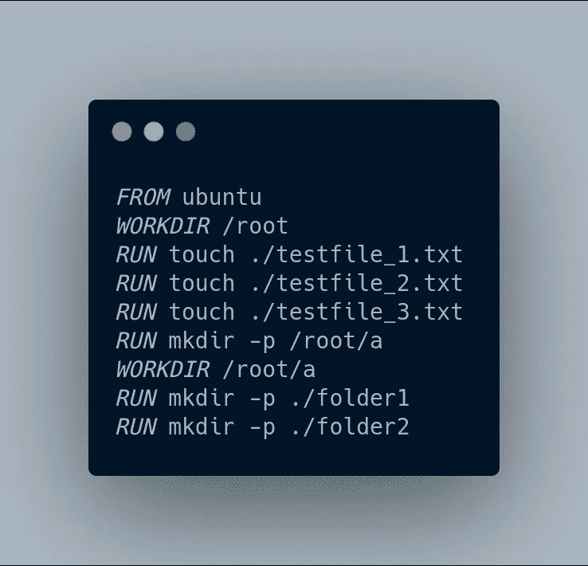

上面的 Dockerfile 文件现在将导致构建过程中的九个步骤。结果和前面的例子一样，所以我把它省略了。但是你可以自己尝试一下！

这里我们唯一的不同是，当我们开始运行 Docker 容器时，我们将在`/root/a`文件夹中。

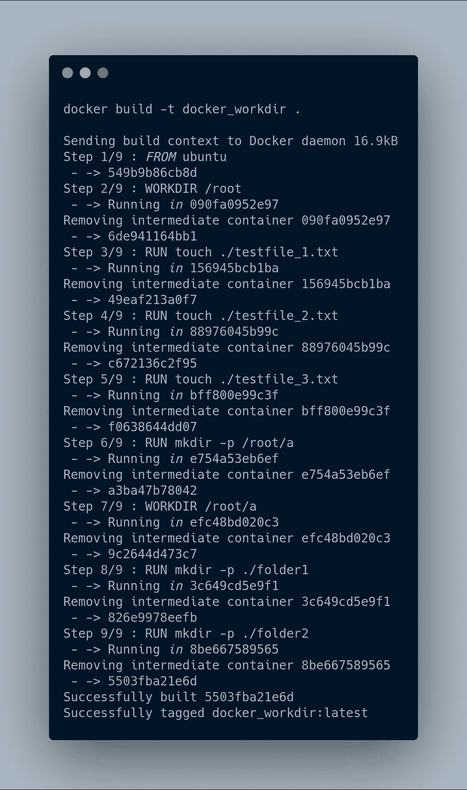

这就结束了`WORKDIR`指令。大多数情况下，您将使用它来指定执行`build`或`test`命令的文件夹。

# 入口点

docker 文件的`ENTRYPOINT`指令乍一看与`CMD`指令相似。它指定了运行时要执行的默认命令，并且您不能覆盖它。

所以，我的建议是，如果你想指定一个在容器启动后运行的命令，并且不希望用户覆盖它，那么使用`ENTRYPOINT`。

```
FROM ubuntu
ENTRYPOINT ls
```

上面的 Dockerfile 文件导致下面的构建和运行。如您所见，`pwd`命令没有覆盖 does 文件中的`ls`命令。这与`CMD`指令不同。


# 包封/包围（动词 envelop 的简写）

`ENV`指令允许您为 Docker 容器设置环境变量。

> 环境变量是一个动态命名的值，它可以影响计算机上正在运行的进程的行为方式。它们是流程运行环境的一部分。— [维基百科](https://en.wikipedia.org/wiki/Environment_variable)

大多数程序员都很熟悉环境变量，所以我在这里就不赘述了。我只举一个 Dockerfile 的例子，我会讨论发生了什么。

```
FROM ubuntu
ENV workdir=/root/
CMD echo $workdir
```

所以，我在这里做的是使用`ENV`指令创建一个环境变量`workdir`。这允许我在容器运行的任何时候使用它。

在本例中，我将使用美元符号前缀输出环境变量。当构建和运行容器时，您会看到`root`目录被打印到控制台。这是一个非常有用的指令。

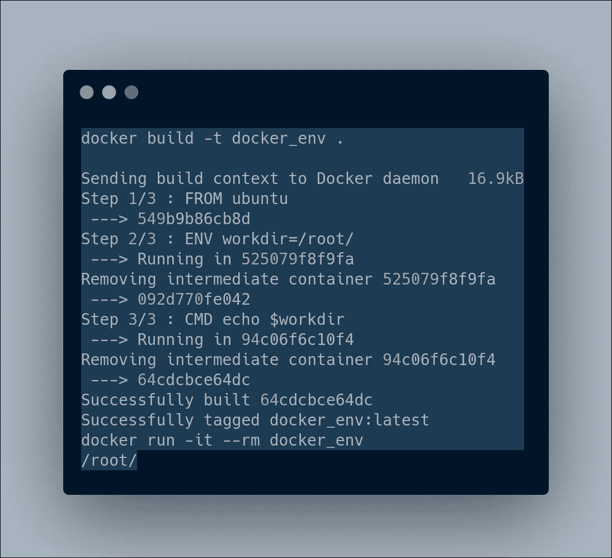

# 标签

`LABEL`指令允许您向图像添加元数据。它总是一个键值对，建议将标签值放在引号中。

我将给出一个使用`LABEL`指令的 Dockerfile 文件的简单例子:


当您运行常用的`build`和`run`命令时，此 Docker 会变为活动状态:


当使用命令行运行容器时，也可以指定一个`LABEL`指令。当有很多正在运行的容器时，`LABEL`指令允许你搜索特定的键。

它还可以给你更多的关于 Docker 图像、作者或更多东西的信息。我同意这不是最令人兴奋的功能。例如，您还可以在标签上过滤活动容器:

```
**docker images --filter label=description="Baby don't hurt me."**
ID: 2de9f0eddcfd
```

# 健康检查

`HEALTHCHECK`指令告诉 Docker 如何测试一个容器来检查它是否还在工作。为了解释`HEALTHCHECK`指令，我将首先创建一个 Dockerfile:


让我解释一下不同的[参数](https://docs.docker.com/engine/reference/builder/#healthcheck):

*   `interval`(默认为 30 秒):健康检查将在容器启动后首先运行 5 秒钟，然后在每次检查完成后 5 秒钟再次运行。
*   `timeout`(默认为 30 秒):如果一次检查耗时超过 3 秒，则认为检查失败。
*   `retries`(默认为三次):容器的健康检查连续两次失败才被视为不健康。
*   命令:检查`nope`目录是否存在，否则`exit`出错。

让我们开始构建我们的 Docker 容器:


当我们打开一个不同的码头，我们可以检查运行码头集装箱。前十秒，容器无法意识到是不健康还是健康。

两次重试后，这成为可能，我们看到 11 秒后`HEALTHCHECK`得出结论，它不是不健康的。事实的确如此，因为文件夹`nope`从不存在于 Ubuntu 的基础映像中。

```
**docker ps**
Status: Up 5 seconds (health: starting)
**docker ps**
Status: Up 9 seconds (health: starting)
**docker ps**
Status: Up 11 seconds (unhealthy)
```

当我在 Docker 容器中运行`mkdir nope`时，状态将变得健康。在等待一会儿直到第一次健康检查成功之后，我现在再次运行 Docker `ps`命令。

您会注意到，当 Docker 容器之间存在依赖关系时(例如，在执行数据库查询之前等待数据库启动)，这个命令非常有用。

```
**docker ps**
Status: Up About a minute (healthy)
```

# 停止信号

如果你曾经试图用`docker stop`命令杀死一个 Docker 容器，你可能会注意到 Docker 会首先友好地请求进程停止，如果它在 10 秒内不同意，它将强行杀死它。这是因为 Docker 容器的默认`STOPSIGNAL`是一个`SIGTERM`信号。

您可以通过将`STOPSIGNAL`指令指定为`SIGKILL`来改变这一点。当您在容器上运行`docker stop`时，Docker 容器将立即关闭。

该过程立即终止。要自己检查这一点，请使用下面的 Dockerfile 文件。

```
FROM ubuntu
STOPSIGNAL SIGKILL
```

让我们构建并启动容器:

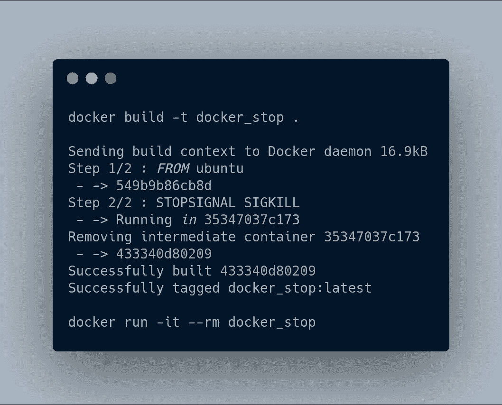

现在打开一个新的终端并执行以下步骤:

```
docker ps
```

有一个标识符为`50b3f43b5588`的运行容器。

```
docker stop 50b3f43b5588
```

现在没有容器在运行，因为目标 Docker 容器立即退出。

# 卷

让我们创建一个 Dockerfile，将根文件夹指定为一个卷。在我们最初的图像中，根文件夹中会有一个`hello.txt`。

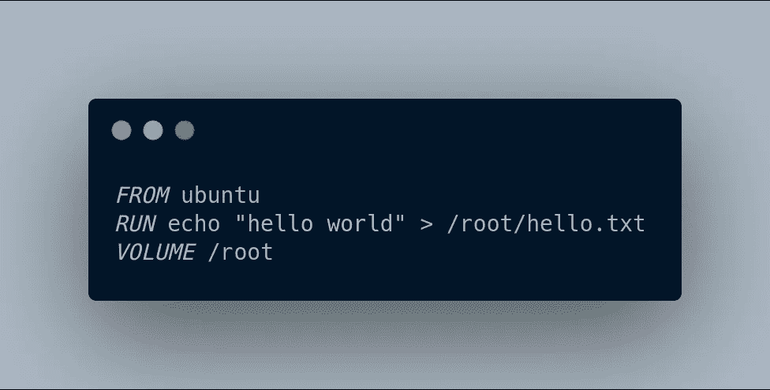

现在让我们通过创建一个 Docker 映像，添加一个新的`answer.txt`文件来增加趣味。

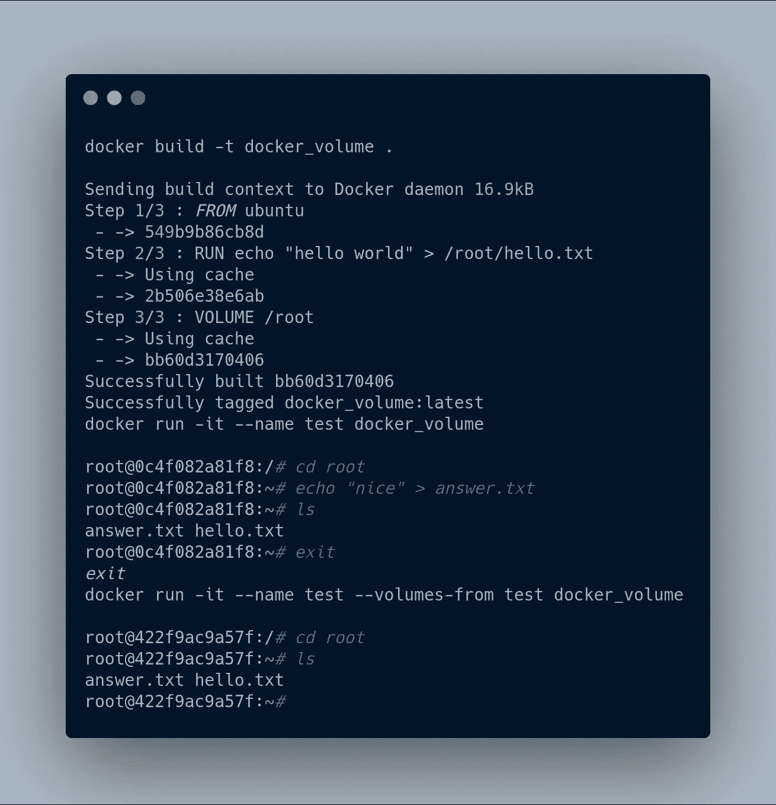

`--volumes-from`参数允许我们使用不同容器的容量，因此允许我们在容器之间保存数据。

# 揭露

`EXPOSE`指令通知 Docker 容器在运行时监听特定的网络端口。您还可以指定端口是侦听 TCP 还是 UDP(默认为 TCP)。

公开端口是记录使用了哪些端口的一种方式，但不映射或打开任何端口。暴露端口是可选的。默认情况下，当您创建一个容器时，它不会向外界发布它的任何端口。

要使一个端口对 Docker 之外的服务可用，或者对没有连接到容器网络的 Docker 容器可用，使用`--publish`或`-p`标志。这将容器端口映射到 Docker 主机上的一个端口。

# 结论


[Jp 瓦列里](https://unsplash.com/@jpvalery?utm_source=medium&utm_medium=referral)在 [Unsplash](https://unsplash.com?utm_source=medium&utm_medium=referral) 上的照片

原来如此。我已经介绍了最重要的 Docker 指令。

如果你错过了什么，请看看 Docker [文档](https://docs.docker.com/engine/reference/builder/#onbuild)。我相信你会在这里找到你想要的一切。你应该知道足够开始。我会说:“去创造吧！”