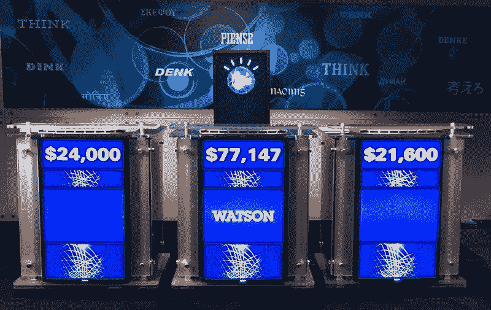

# 我在为 IBM 沃森的发明者工作时学到了什么

> 原文：<https://betterprogramming.pub/what-i-learned-as-a-developer-while-working-for-the-inventor-of-ibms-watson-7e76b4a2d4ba>

## 有时候逻辑比正确更重要

来源:维基媒体(CC BY-SA 4.0)

2018 年，我受雇于大卫·费鲁奇博士，他是 IBM 著名问答计算机[沃森](https://blog.ted.com/how-did-supercomputer-watson-beat-jeopardy-champion-ken-jennings-experts-discuss/)的发明者，该计算机在《危险边缘》中击败了冠军肯·詹宁斯 2011 年。

离开 IBM 后，费鲁奇博士创办了自己的人工智能研究公司 [Elemental Cognition](https://ec.ai/) ，目标是开发一种能够理解语言背后的含义并像人一样给出答案背后的推理的人工智能。

如果 EC 成功的话,《星际迷航》中的电脑将最终成为现实。除了是人工智能的突破和扰乱数十亿美元的产业外，这样的计算机可以帮助医生治疗疾病或帮助工程师设计应对全球变暖的解决方案。

我最终在 EC 呆了大约一年，哇，这是一个挑战——不仅仅是智力上的，还有情感上的。虽然结果证明这不是一个长期的适合，但我做了一些真正有趣的工作，并从经验中成长。以下是我在为世界上最著名的计算机科学家之一工作时学到的一些东西。

# 合乎逻辑比正确更重要

作为人工智能领域的领先专家，费鲁奇博士痴迷于逻辑。我没见过，但他可能有一张斯波克的照片挂在某处的墙上。我在康涅狄格州威尔顿的 EC 办公室里看到的挂在墙上显眼位置的海报题为“你不应该犯逻辑谬误”

逻辑谬误是推理中的一个缺陷。例如，当事实通常更加复杂和微妙时，声称某个想法不是好就是坏。这就是“非黑即白”的一个例子这也被称为*假困境*。

我们有时都会犯这种错误，有些很容易犯——尤其是当我们的情绪受到影响的时候。尽管许多人无意制造这些，但其他人故意使用它们来达到邪恶的目的，来操纵他人。一些政治家或权威人士在这方面取得了很好的效果。

我很小的时候就开始编程，逻辑对我来说也很重要。我的墙上没有斯波克的照片，但我应该**爬上亚马逊，然后分心*。然而，尽管我对逻辑有热情，也有多年的实践，我发现自己也有一个坏习惯，就是在压力下犯逻辑错误。事实上，这让我和费鲁奇医生有了麻烦。*

我经常被要求解释我所做决策背后的原因，甚至是那些被广泛接受为行业标准最佳实践的决策。例如，为了解释为什么我选择了 [React](https://reactjs.org/) 而不是他们自己开发的 [jQuery](https://jquery.com/) 框架，我不仅要给出利弊，还要给出工具和方法如何导致这些利弊。我不得不使用[第一原理](https://fs.blog/2018/04/first-principles/)，或者不可约的真理来推理。

我有能力提出那个论点，但我没有。至少，不是马上。首先，我已经很多年没有提出这个特别的论点了，而且已经忘了是如何提出的。jQuery 是 Javascript 框架的布兰妮。第二，我有点慌张，他们会质疑一些在我看来如此明显的事情。我们的截止日期很紧，我感到时间紧迫，必须把事情做完。我也想给他们留下深刻印象。我只是挥舞着手臂说，“这是行业最佳实践，多年来一直如此。这就是脸书和网飞的做法。”

我的逻辑谬误是[诉诸权威](https://yourlogicalfallacyis.com/appeal-to-authority)和[随大流](https://yourlogicalfallacyis.com/bandwagon)。当然，某样东西被广泛接受为标准的事实是有价值的。脸书使用它的事实也是如此。但这并不意味着它一定很适合我们的目的。欧共体不是脸书。此外，很多流行的东西并不是好主意，比如[企业敏捷](https://www.forbes.com/sites/stevedenning/2019/05/23/understanding-fake-agile/?sh=26fdc07a4bbe)或 [ORMs](https://korban.net/posts/postgres/2017-11-02-the-case-against-orms/) 。

虽然我可能是对的，但我的推理是懒惰和有缺陷的。我可能会感到沮丧或压力，但这是工作的一部分。

不幸的是，根据第一原理解释事情可能是一项艰巨而耗时的任务。一个人必须组织他们的思想，也许画一些图表，并找到中立的参考资料，这些资料本身必须从基本原则出发，不能有逻辑缺陷。这是我认为管理层不陷入太多细节如此重要的一个原因——员工要么被迫犯逻辑谬误，要么花费大量你没有的时间。

多年后，我仍然袖手旁观我的建议。毕竟效果很好。我们按照我的方法进行，项目成功且按时完成。只要我在那里，它就一直是一个可伸缩的、有效的、高性能的解决方案。一切都解决了，对吗？

不幸的是，没有。你看，正确没有被信任重要。犯逻辑谬误表明一个人缺乏推理能力，这可能会损害你的可信度。

了解这些逻辑谬误不仅会帮助你在工作中，而且在生活中做出更好的决定。这也有助于让你远离那些试图操纵你的人。

# 不要被花哨的学位或具有挑战性的问题吓倒

我是房间里少数没有博士学位的员工之一。我有点紧张，但真的很兴奋有机会从事真正的前沿科学，这与我通常从事的应用有点不同。

我担心的是他们是否会认真对待我。有时候，在那些拥有名牌大学的名牌学位的人身边，我有一种无能的感觉。我确信这是我投射给别人的东西，而不是他们实际上如何看待我。

这次经历告诉我，我确实是在投射。我受到了重视，并能够与科学家进行深入的交谈。博士并不一定更聪明(尽管我确信这些人是)，他们只是碰巧毕生致力于某个特定领域的研究——而且他们是该领域的专家。但我也喜欢认为自己是我工作的专家。

在一天结束的时候，我能够学到足够的东西与他们一起工作，解决有趣的，具有挑战性的问题。这才是真正重要的。

# 总是从多个角度看问题

每当我着手一个新的软件项目时，我试图回答的最重要的问题之一就是“我们正在谈论的事情是什么？”它们是如何定义的，更重要的是，它们之间的关系是什么？这就是所谓的 ***数据模型*** 。这是我们试图描述的世界的抽象。简单的例子:`A *class* has a *curriculum*, *teacher*, *students*, and *schedule*.`

根据我的经验，你的软件的成功取决于你如何预先定义你的数据模型。事实证明，数据建模也是 AI 中最难的问题之一。他们称之为知识表示，简称 KR。

想象下面这个虚构的小故事:

> 爱丽丝踢了球。“哦，不！”，她说。“走错路了！”站在她身后的约翰拿到球，传给了站在球门正前方的简。她踢了一脚，得分了！爱丽丝的队赢了。

这是怎么回事？显然，这是一场足球比赛，但远不止于此。爱丽丝和她的队友是有动机、感情和行动的人类。有一个时间表的事情发生的各种行为者和结果，以及更多。但是，计算机如何以结构化的方式表示所有这些信息呢？同样的结构是否适用于其他故事？这是一个非常困难的问题。

我工作的一部分是想出一种方法来可视化机器的理解。最大的教训之一就是不要试图让所有的事情都符合一个观点。围绕不同枢轴或透镜的复制通常是降低复杂性数量级的有利折衷。你可以用同样的思维来解决其他问题——多种观点都可能是正确的，每一种观点都讲述了故事的不同部分。

# 尽快失败

如果你有在创业公司工作的经验，那么你可能对构建不完整或不断变化的需求并不陌生。这令人沮丧，但通常是不可避免的，因为企业正在学习。

在 EC 工作时，这要糟糕一个数量级。科学本身是不断变化的。毕竟这是一个研究项目。最重要的是，我以前没有人工智能的经验。开始的时候，我真的很难把所有这些东西整齐地装进我的脑子里。

我受雇设计和建造一个新的直观的用户界面，可以向普通人展示系统在想什么，并帮助它学习。它也可以被研究人员用作帮助获得洞察力的工具。

很难知道我做的是否正确，我很紧张。毕竟，我是在向 IBM 沃森的发明者展示。如果他(和科学家们)认为我在胡说八道呢？

我可以谈谈如何应对冒名顶替综合症，但我不会，因为关于这个主题的文章已经够多了。相反，我会给你一个简单的逃生出口:停止反抗，直接失败。

我发现，向一个更有见识的人展示一些毫无意义的东西，要比花时间让自己提前理解要快得多。当然，我想尽可能多地学习；这让我成为一个更好的设计师和建筑师。但是我不需要自己或者一遍就从基本原则开始学习。只要他们给你改正错误的机会，别管别人的看法。如果我没有开始这样做，我不知道我的项目是否会按时启动。天啊，压力小了。

费鲁奇博士和科学家们非常接受我的工作，我们经历了许多快速的迭代，最终完成了我认为我们都感到自豪的东西。我想从来没有人质疑过我的能力。

# 了解与理解

“知道”和“理解”有很大的区别。了解通常意味着能够回忆起个别事实。它是静态的。*理解*意味着能够从基本原则出发，对这些事实进行逻辑推理。这是背诵你所阅读的信息和能够把它教给别人之间的区别。

> 我不知道人是怎么了:不通过理解来学习；他们通过其他方式学习——死记硬背或其他方式。他们的知识是如此脆弱！—理查德·费曼

我们的人工智能系统不仅要有知识，还要能理解。我不会说我知道这是如何在符号推理人工智能中实现的；这在我的脑海中挥之不去(在 NDA 之下)。然而，这加强了我的信念，我自己的理解确实直接影响了我写的软件或我设计的界面的价值。

我非常重视设计师和工程师对潜在问题或技术的理解，而不仅仅是做经理告诉他们做的事情或遵循流行的模式。了解基本原理将有助于您选择正确的工具，以及如何正确使用它。

设计师或程序员的部分工作是教学。设计师教一个人如何通过他们的设计与软件交互。程序员通过编写可读和合理的代码来教其他程序员事情是如何工作的——但你不能在不理解的情况下教学。

# 文化不适应不是你的错

我在 EC 的工作快结束时，我知道我在挣扎。但这与我的工作质量无关，因为我一直得到很好的反馈。

正如你所料，每个人都很热情和专业。他们也很聪明，和他们交谈也很有趣。但是我真的不适合。我来自一个非常不同的文化，我不太擅长适应他们的文化。我努力达成共识。我们有不同的价值观、期望以及工作和协作方式。

我在高中创办了第一家公司，从大学开始，我职业生涯的大部分时间都在快速发展的创业公司工作。我痴迷于效率、交付产品和构建可伸缩、可靠的软件。我的项目有利益相关者和客户。我是在创业文化中锻造的。

费鲁奇博士曾称我为“物质的建造者”我认为它很适合我。

该团队的大部分成员来自学术界，其中许多人来自最初的 IBM Watson 团队。EC 没有客户，也没有专门的应用程序。这是故意的；他们想成为一家纯粹的研究公司，摆脱利润率和客户期限的束缚。他们不希望他们的人工智能因任何特定的问题而过度适应。他们不想重复在 IBM 发生的事情，有些人觉得对他们技术的误解和今天对适销产品的需求扼杀了他们在《危险边缘》上的研究。

所有这一切的结果是摩擦增加，沟通失败。我对自己很苛刻，把这件事当成了私人恩怨。我可能从理智上理解了这不是我的错，但看起来确实是。

文化契合对任何团队都很重要。如果你们的价值观不一致，那就不会长久。EC 做的对他们很管用，对我就不行。这没什么不好。

我做了富有挑战性的工作，进入了一个全新的快速发展的领域。我和一些顶尖的计算机科学家并肩工作。我发明了一种可视化 KR 的新方法，谁知道呢，也许我在某种程度上对 AI 有所贡献。

读这篇文章的 EC 的每一个人，感谢你们给我这个惊人的机会。我希望我有所帮助。我学到了很多。