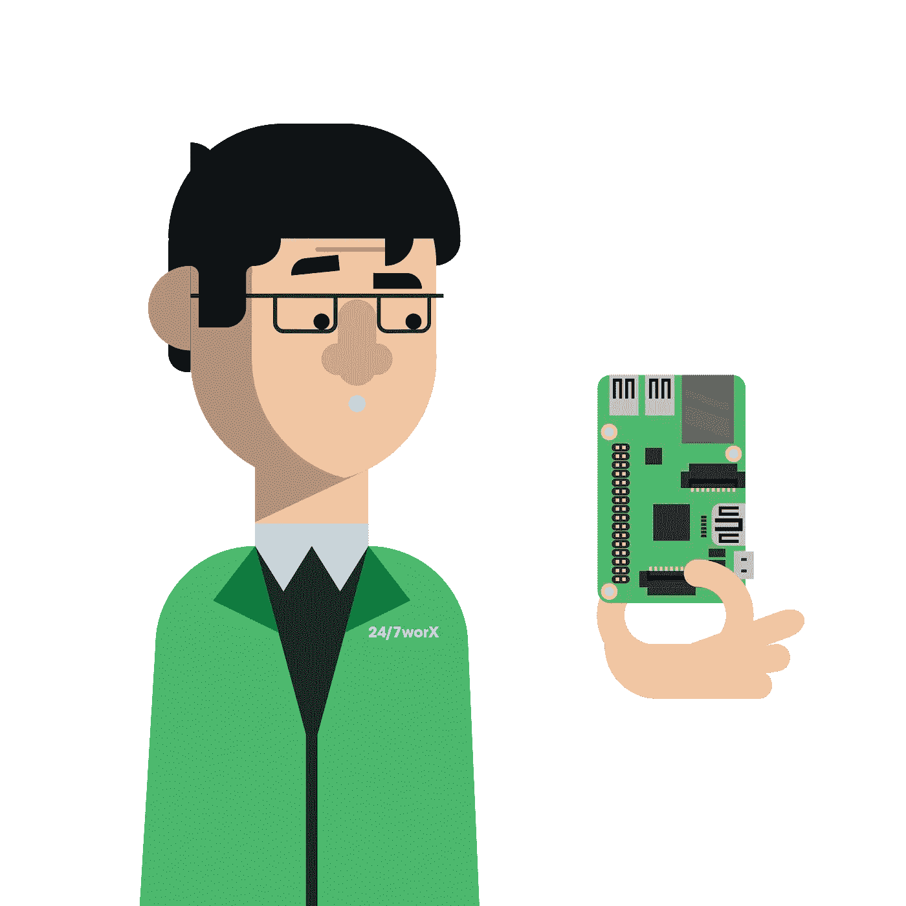

# 在进入科技行业之前我希望知道的事情

> 原文：<https://betterprogramming.pub/what-i-wish-i-knew-before-breaking-into-tech-9c1bad91efcd>

## 我学到的东西，所以你不必

[清洁图像](https://www.cleanpng.com/png-product-design-illustration-human-behavior-cartoon-6584745/preview.html)

# 如果我当时知道我现在知道的…

后知之明是 20/20，回顾过去并思考你会做什么不同的事情总是很容易的。如果我能做些什么，我很乐意帮助任何学习编码的人，轻轻地引导他们走向成功。

我知道每个人都有自己的做事风格或方式，任何人都可以遵循你的道路并取得相同结果的想法是愚蠢的。但是许多人可以从其他已经经历过的人那里学习，所以我经常喜欢分享我的经验给其他人学习。

# 你不需要去学校

科技是许多专业人士走非传统路线的行业之一。

与成为医生、会计或牙医不同，在科技行业工作不需要特殊的学位或特定的专业领域。许多背景不同的人已经转向科技行业:从音乐家到银行家、厨师到营销人员，许多人都跃跃欲试。

我度过了许多不眠之夜，学习如何学习

随着学生贷款危机继续失控，许多人都在考虑其他教育途径，科技行业是非常宽容你的工作经历和背景的行业之一。[许多大型科技公司已经放弃了传统过时的招聘政策](https://www.cnbc.com/2018/08/16/15-companies-that-no-longer-require-employees-to-have-a-college-degree.html)，比如药检、大学学位或某项平均绩点。

# 但是你也许应该去上学

话虽如此，一个人不应该放弃在一所声望很高的学校接受正规教育的机会。当然，每个人的情况不同，但如果你能负担得起四年制学位，那就去做吧。

尽管许多公司正在降低准入门槛，但四年制学位仍是招聘人员和猎头的主要筛选条件。

仅仅因为不专注于计算机科学也有可能在科技领域找到一份职业，并不意味着这是最佳或理想的职业。我是一个从不认真对待学校的人，这反过来又导致我从一个工作岗位跳到另一个工作岗位，直到我 25 岁时在科技行业找到了第一份真正的工作……而且那只是入门级别的工作。

毕业四年后，我可能损失了几十万美元的工资和复利。相关专业的四年制学位可以让我在大学毕业后更早地开始职业生涯。

# *网上有大量免费资源*

当人们问我如何学会编码时，我喜欢告诉他们我毕业于 YouTube 大学。

当然，这是一个笑话，但有一些事实是我欠 YouTube 多少，因为它为开发人员和编码人员提供了这么多免费的有用内容。

freeCodeCame 可能是网上学习如何交互式免费编码的最佳资源。在这个项目上，每个人都欠昆西·拉森很多。

一个简单的搜索就能为你找到一长串任何语言、任何框架的基础教程:云、系统、编码、设计、项目管理、网络……任何东西都能在 YouTube 上找到。

YouTube 不仅有很棒的内容，网上还有很多免费的互动学习环境。我最喜欢的包括:

*   [自由代码营](https://www.freecodecamp.org/)
*   [代码学院](https://www.codecademy.com/)
*   [W3Schools](https://www.w3schools.com/)

# 但是很多资源已经过时了

正如我刚才提到的，任何东西都可以在 YouTube 上找到，如果你做一些挖掘，还有一些很棒的免费资源。但是也有很多垃圾。也许*垃圾*不是正确的词，所以我们会用*陈旧。*

最糟糕的事情莫过于跟随一个教程，但仅仅学习了几个小时就发现这个项目需要一个过时的或被否决的包或模块。为 Teamtreehouse、Codecademy 或 Linux Academy 等公司的内容付费可能看起来违反直觉(正如我刚才所说，那里有大量的免费资源)，但你可以保证你得到更新的相关内容，与当前的时代和趋势保持同步。

每月支付 20-30 美元是一种节省你时间和精力的方式，也是在学习编码或学习任何新技能时保持自信的方式。最初的几周是至关重要的，你最不需要的就是因为糟糕的音频质量或 YouTube 上糟糕的分辨率而失去注意力。

不过，我会避免大量购买认证课程、导师或训练营。每月支付 25 美元是一回事，而花 15000 美元参加编程基础速成班是另一回事，除非你已经很好地掌握了计算基础，否则这些课程很可能不会坚持。

# 你用什么语言学习并不重要

学习编码的目标与其说是技术技能，不如说是解决问题和跳出框框思考。变量、函数和循环之间的差别非常小——无论您是在学习 Python、Ruby、JavaScript 还是 PHP 的编程基础。

Ruby 和 Python 中具有相同输出的数组示例。图片来源:乔丹风暴。

编程本身只是一个概念。从简单的角度来看，你是在告诉计算机通过命令来完成一些任务。你可以多次告诉计算机做某件事，在大多数情况下，一旦你学会了代码的基本原理，它在任何现代流行的面向对象语言中都应该看起来很相似。

# 但是找到一个和你的领域相关的，并坚持下去

如果你还没注意到，我喜欢自相矛盾。学习编码应该是语言不可知的，但是当你找到你的利基或专长时，你会想要选择一种在你希望工作的行业或领域中流行的语言。

当你想专注于前端工作或设计时，学习如何用 Java 编码是毫无意义的。你最好学习如何用 JavaScript、Ruby 甚至 Python 编码(有些人可能会说学习用 Java 编码无论在什么领域都毫无意义，不过我跑题了)。

作为一名云安全工程师，我学习了如何使用 Bash 编码，并发现自己正在学习 Python，因为所有用于云环境的安全和基础设施工具都是用 Python 构建的。

显然，用其他语言学习编码比用 shell 要直观得多，但是考虑到我在系统管理方面的背景，shell 只是我们许多 IT 人员的首选。

变量是变量，循环是循环。不管是 Ruby、Python 还是 PHP，从长远来看，了解你所在领域的专用语言是有帮助的。

# 结论

每个人的旅程都是独一无二的。我没有走传统的上学路线，自学如何编码，爬上了通常的技术职业阶梯。其他人在学校学习计算机科学，大学一毕业就在谷歌和脸书找到了工作。毫无疑问，有些人可能比其他人走得更容易，但这是否是一种特权、经济或毅力完全是另一个话题。

如果我希望你能从这件事中得到什么，那就是每一点都有一个对应点。每个主张都有其他人指出规则的例外。找到适合你生活方式的道路，并坚持走下去。