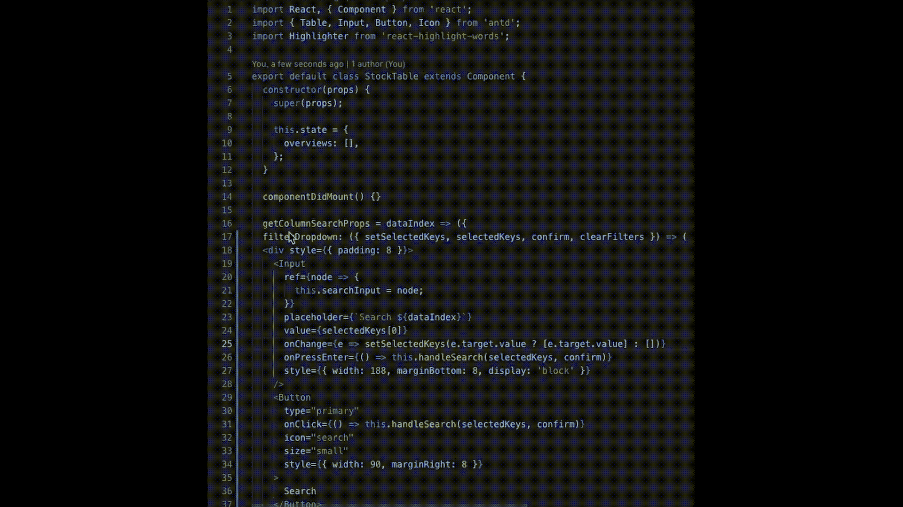
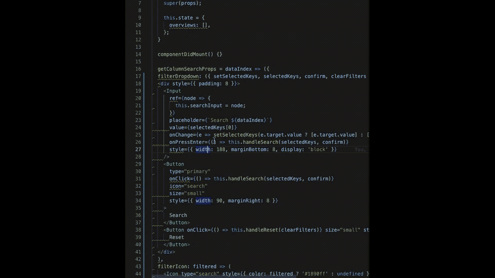
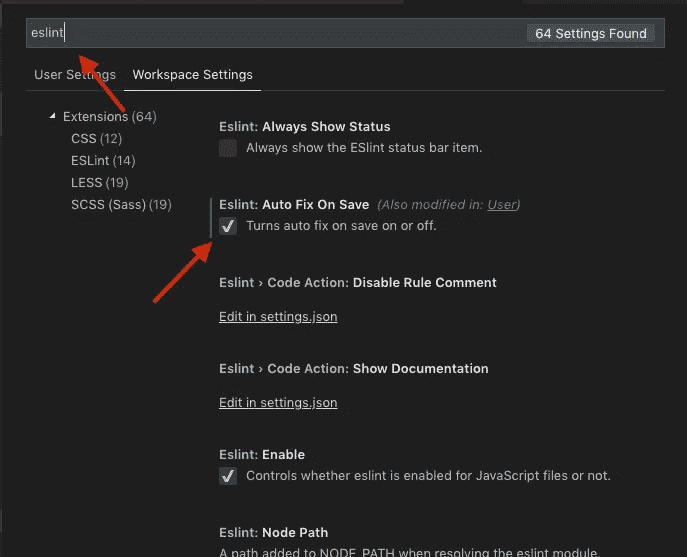

# 当我开始使用 React.js 时，我希望我知道什么

> 原文：<https://betterprogramming.pub/what-i-wish-i-knew-when-i-started-to-work-with-react-js-3ba36107fd13>

## 每个 React 开发人员都应该知道的 7 个有用的技巧


照片由[本·怀特](https://unsplash.com/@benwhitephotography?utm_source=medium&utm_medium=referral)在 [Unsplash](https://unsplash.com?utm_source=medium&utm_medium=referral) 上拍摄

自 2013 年 5 月 29 日首次发布以来，React.js 已经接管了互联网。包括我自己在内的许多开发人员将他们的成功归功于这个令人惊叹的框架，这已经不是什么秘密了。

有了这么多的 React.js 教程，我希望在我开始的时候，他们中的一个能告诉我这些技巧。

# 你不需要。使用箭头函数时绑定(this)

通常，当您有一个受控组件时，您会看到这样的内容:

你要为每一个存在的方法编写`.bind(this)`，因为大多数教程都告诉你这样做。如果您有几个受控制的组件，那么在您的`constructor(){}`中将会有一大堆代码。

## 相反，您可以:

怎么会？

ES6 的 arrow 函数使用了[词法作用域](https://whatis.techtarget.com/definition/lexical-scoping-static-scoping)，这让方法可以访问它被触发的地方的`this`。

# 当服务人员与你作对时

服务人员非常适合渐进式网络应用程序，它允许离线访问，并为网络连接不良的用户进行优化。

但是，当您没有意识到服务人员正在缓存您的静态文件时，您会重复部署您的热修复程序。

却发现你的网站没有更新。😰

不要惊慌，确保你的`src/index.js`:

```
// Make sure it's set to unregister
serviceWorker.unregister();
```

从 16.8 版本开始，这一行默认应该是`serverWorker.unregister()`。

但是如果他们决定再次改变，你会知道去哪里找。

# 99%的时间你不需要弹出

[Create React App](https://github.com/facebook/create-react-app) 为`yarn eject`您的项目提供了一个选项来定制您的构建过程。

我记得我试图定制构建过程，让 SVG 图像自动内联到我们的代码中。我花了几个小时试图理解建造过程。我们最终得到了一个注入 SVG 标签的导入文件，并将站点的加载速度提高了 0.0001 毫秒。

退出 React 项目就像打开正在行驶的汽车的引擎盖，并在运行中改变引擎以加快 1%的速度。

当然，如果您已经是一名 Webpack 高手，那么定制构建过程以满足项目需求是值得的。

当你试图准时交付时，把你的努力集中在它把针向前移动的地方。

# ESlint 保存时自动修复节省了大量时间

我们都复制了一些格式不正常的代码，由于它看起来很难看，我们最终花费时间手动添加空格。



使用 ESLint 和 Visual Studio 代码插件，它可以在保存时为您修复。



## 怎么会？

1.  在您的`package.json`中，添加一些开发依赖项，并执行`npm i`或`yarn`:

```
"devDependencies": { "eslint-config-airbnb": "^17.1.0", "eslint-config-prettier": "^3.1.0", "eslint-plugin-import": "^2.14.0", "eslint-plugin-jsx-a11y": "^6.1.1", "eslint-plugin-prettier": "^3.0.0", "eslint-plugin-react": "^7.11.0"}
```

2.安装 ESLint 扩展:


3.启用保存时自动修复:



# 你不需要 Redux，Styled-components 等等…

每个工具都有其用途。也就是说，了解不同的工具是有好处的。

> 如果你只有一把锤子，那么所有的东西看起来都像钉子——亚伯拉罕·马斯洛

您需要考虑您使用的一些库的设置时间，并问自己:

*   我试图解决的问题是什么？
*   这个项目会长久地受益于这个库吗？
*   React 已经提供现成的东西了吗？

现在有了[上下文](https://reactjs.org/docs/context.html)和[钩子](https://reactjs.org/docs/hooks-intro.html)可以反应，还需要 Redux 吗？

我强烈推荐 [Redux Offline](https://github.com/redux-offline/redux-offline) 用于当你的用户处于糟糕的网络连接环境中时。

# 重用事件处理程序

如果您不想一遍又一遍地输入相同的内容，重用事件处理程序可能是一种选择:

# setState 是异步的

天真的我会写下这样的话:

## 选项 1:传递状态

## 选项 2:将辅助函数设置为 setState 的回调

# 结论

这些建议为我节省了很多时间，我相信还有更多的时间。请在评论区分享它们。