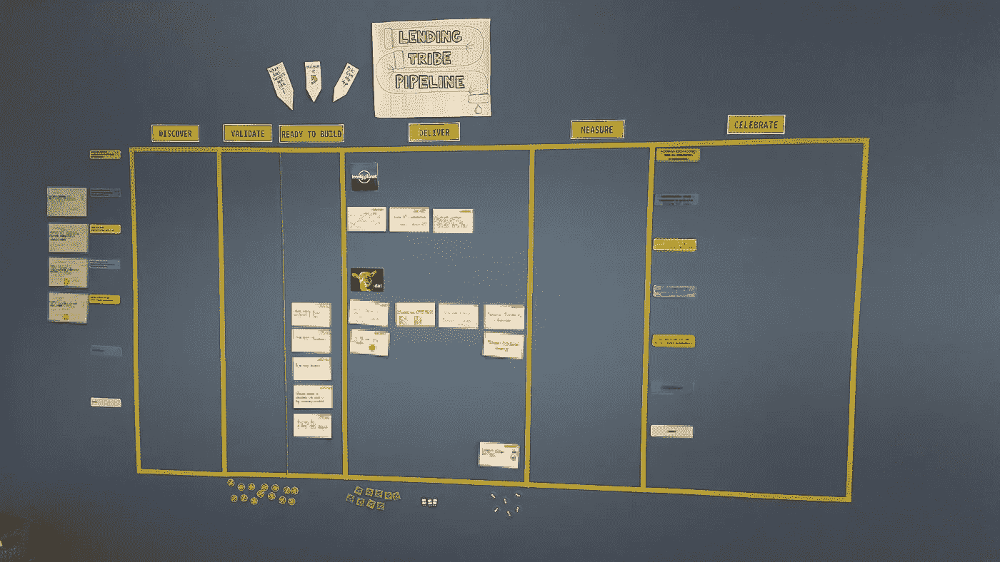

# 如果我们用状态而不是日期来构建软件会怎么样？

> 原文：<https://betterprogramming.pub/what-if-we-built-software-with-states-and-not-dates-b334cfe1745>

## 没有路线图的软件交付计划

由 [Unsplash](https://unsplash.com?utm_source=medium&utm_medium=referral) 上的 [Tabea Damm](https://unsplash.com/@tabeadamm?utm_source=medium&utm_medium=referral) 拍摄的照片

我们已经过半了。我和产品经理坐在一个狭小、不通风的会议室里。愿景、规划和战略围绕着我们。约束是生活的现实。

资源永远不够，时间永远不够，工作永远太多。我们能做的最重要的事情是什么？我们有足够的人来做这件事吗？需要多长时间？下一步是什么？什么时候开始生产？

但是有些地方不对劲。我们正在看“电子表格”。这是彩色编码，布局整齐，格式良好。看起来很专业。非常自信。

有颜色表示确定性，字体**表示状态，有日期表示预计完成，有日期表示预计开始。但是我们在挣扎。**

电子表格。这就像一个路线图，但是是横向的。

我们正试图找到一个地方来插播即将推出的新功能。这很难。要添加工作，我们需要根据日期来安排。我们别无选择，只能暗示我们正在估计交付日期，而我们所要做的只是在我们做一些产能规划时想象一种可能的现实*。*

电子表格没有给我们足够的背景。这些团队还要多久才能开始做别的事情？我们能相信这些估计吗，或者它们只是“空中手指”？嵌入式设计人员是免费提供帮助，还是正忙着为已经在运行的东西做准备？

我是说，我们可以去问问他们。但是要求对电子表格进行主动更新的全部目的是为了避免同步中断，并且有一个单一的事实来源。但是，通过试图为每个人提供一些东西，它很难变得有用。

“这样不行，我不知道这个故事处于什么状态，”产品经理说，“我需要……”

然后顿悟袭来，我们都抬起头，齐声说道，“国家，不是日期！”

# 状态，而不是日期

快进一年。“电子表格”不见了。我们用“墙”来代替它，这是一个看板，代表我们所有正在进行的产品、设计和工程计划的当前状态。

我们每两周在墙前聚会一次，围绕“三角洲”进行简短的讨论。从右到左工作，有什么变化吗？这是一个发现和协调的地方。不是讨论的地方，而是发现讨论需要发生的地方。

我们有状态，没有日期！

有一段时间，我很开心。然后有人让我在[合流](https://www.atlassian.com/software/confluence)上更新我小队的路线图。我的心跳加速，眼皮后面有什么东西开始抽搐，我发现自己非常小心谨慎地选择着自己的用词。我不开心。

路线图！或者是…？

这是从坟墓里回来的电子表格。我们不是有这场战斗吗？我不是赢了吗？然而，现在它又转世了。不同的身体，相同的灵魂。

当我的身体和思想准备战斗时，当抗议不请自来时，我真的想知道，为什么这让我如此困扰？为什么它会在我的皮肤下？为什么我最终会在路线图和日期上僵持不下？恐怕我已经获得了一个“名声”。

事实上，我可能做得有些过头了，有一天，我们的前 CTO 把我拉到一边，问道:“你怎么了，伙计？似乎有一些深刻的心理创伤！”

是的，有。绝对有。我不喜欢最后期限。谁知道。但不是那样的。不仅如此。经过深刻的自我反省，我发现了一种模式。

# 词语很重要

是语义学。太吹毛求疵了。“路线图”这个词本身真的让我很困扰。是这个词。但是 T2 很重要。

当你的开发经理让你为一个新的前端项目设计一个“MVC”架构，你照做了，三天后骄傲地拿着几页 [Visio](https://products.office.com/en-us/visio/flowchart-software) 图回来，却被告知:“那不是 MVC！”

“是的，”你抗议道，下嘴唇颤抖着。“我可以给你看我一直在读的这本大学教科书，因为我也在业余时间完成计算机科学硕士学位，而我一直埋头于建筑图中，排除了与人接触和快乐，所以这就是你想要的 MVC 架构。先生。”

“不，不，不，”你被告知。“我想要的是……”

我会省略剩下的对话，因为重要的部分是，当这位开发经理解释完之后，你会说:“哦。哦！哦。没错。我明白了。这完全说得通。我可以做到这一点。”

“但那不是 MVC *，*，如果你一开始就用了正确的词语，我就不会浪费三天时间。如果不明白你的意思我早就要求澄清了，但是我知道“MVC”是什么意思，所以我没有，所以我们能不能不叫 MVC？因为事情不是这样的。”

但这是一场你会输掉的战斗，你与每一个新员工的每一次谈话都是从“我们有这个架构，老板称之为“MVC”*但它不是 MVC…* 而且，我必须警告你，你发现的任何以“Stack”结尾的类实际上都是一个队列。”

# 不再有路线图

上面的例子个人很痛苦，但只是浪费了时间。还有其他例子。我们不再整理积压的工作，而是细化它们。当谈到主服务器和副本服务器时，我们必须停止使用术语“主”和“从”。

我们现在谈论的是“气候危机”，而不是“气候变化”或“全球变暖”。这是[故意的](https://theconversation.com/language-matters-when-the-earth-is-in-the-midst-of-a-climate-crisis-117796)。[语言要紧](https://nicolagriffith.com/2011/07/11/lame-is-so-gay-a-rant/)。真的，[真的](https://nicolagriffith.com/2014/11/02/etymology-and-insult/)重要。

将你的语言与你的意图相匹配是一件好事，想象一下如果我们重复使用有其他意思的单词，我们将会有正确的对话。

我想，这就是为什么当我听到“路线图”被用来描述现代软件公司，比如我现在工作的公司，规划他们的工作时，我开始过度呼吸的潜在原因。

我们做的这件事——不是路线图。我变得激动不是因为我不想估计(嗯，不仅仅是…)，而是因为我试图从根本上改变我们正在进行的对话。

路线图。我们应该停止使用那个词。不是因为“不是你想的那个意思”，而是因为它就是！我想谈点别的。

# 关于产品的难以忽视的真相(路线图)

我从 Marty Cagan(受 [*启发的*](https://www.goodreads.com/book/show/35249663-inspired') 的作者)那里偷来了这一节的标题，他在自己的的一篇[文章中用它来简洁地总结为什么利益相关者驱动的路线图不起作用:](https://svpg.com/the-inconvenient-truth-about-product/)

1.  我们的大多数想法都行不通。
2.  即使是可行的想法也可能需要多次迭代才能正确。

因此，我们正在应对多层次的不确定性。我们不仅要处理技术上的不确定性(“实施需要多长时间？’)，我们不得不担心“它”是否是构建的正确事物！

肯特·贝克在他的“3X”演讲中雄辩地抓住了这一点:[探索、拓展、提炼](https://www.youtube.com/watch?v=YGhS8VQpS6s)。

产品路线图在“提取”阶段可能是有意义的，当你已经建立了一个有利可图的产品，你希望在它的基础上继续发展。但是在“探索”阶段，我们的目标是下很多小赌注，希望得到一大笔钱。

此外，如果我们工作做得很好，我们会超越眼前的地平线。我们还会有一些更好的想法可以尝试，这取决于哪些想法会有回报，或者没有回报，视情况而定。

前面提到的产品经理曾经对我说:“我需要一个流程图来实现这一点，而不是路线图！”

在这种情况下，预测整个季度或更长时间的开发工作是不明智的。我还认为路线图的存在提供了一定程度的虚假信心。

人们很容易开始将评估视为承诺，并绞尽脑汁构建已经售出但并不存在的特性。一旦签订了合同，就很容易夸大取悦“一个客户”的重要性——那个单一的客户——从而损害更多的潜在受众。

我不止一次地看到一个开发团队被维护或完成一个只有最小百分比的客户使用的特性的需求所压垮。或者根本没有。

有时候这是不可避免的。发现市场对我们的努力没有反应为时已晚。有时我们会及时发现这一点。打破基于发布我们不再想构建的特性的契约是不愉快的。更糟糕的是无论如何都要被迫构建这个特性。

那么，考虑到这些危险，为什么还要有路线图呢？难道我们不能扔掉它，更好地面对不确定性吗？这样，我们就不会试图出售我们还没有开发的功能。没有危险，我们将承诺一个任意的日期作为“最后期限”。

我试过了！哦，我多么努力…

当我向我们的前任首席技术官提出这些精确的论点时，他带着真正的好奇心问道:“如果这些特性中的一些将从根本上改变我们销售产品、营销产品和培训用户的方式，我们如何协调所有这些活动？”

我羞怯的回答是:“嗯……我们进行自下而上的估算，并计划一个每个人都能努力实现的日期。”

“在这种情况下，”有人温和地问我，“为什么我们不能对所有正在进行的项目都这样做，并把它写下来呢？”这样，我们都有一个可以指向的文档，并减少了这么多同步状态会议的需要？”

“我承认这只是我们最好的猜测，但我们不应该总是愿意努力了解我们的项目是如何跟踪和传播我们当前的理解吗？这难道不比一直开状态会议好吗？”

听起来太有道理了！也许我们需要状态*和*日期。但是，如果我试图将它们放在同一个文档中，并将其称为“路线图”，我们最终会进行错误的对话。

所以，我想分解一下。我想弄清楚我们*应该*进行什么样的对话，然后我们可以从那里回溯。

我已经确定了我认为是我们自己的创业公司试图解决的两个关键难题。)转向路线图:

1.  我们怎么知道我们正在做最重要的事情呢？
2.  我们如何跟踪真正重要的日期的承诺？

# 重要的事情重要的事情

“我如何知道产品团队正在做最重要的事情？”

这个看似简单的问题，其实有微妙之处。基本上，我们只关注三个时间范围，“现在、下一个和以后”。

如果我们不断地将“以后”归档的最重要的工作放在“下一个”堆的顶部，并且当我们开始新的工作时总是从堆的顶部挑选，那么“现在”发生的事情一定是最重要的事情。

微妙之处在于我们如何决定什么是重要的。对谁重要？我们如何衡量“重要”和“紧急”的区别？如果我们推迟一个特征会发生什么？什么是“延误的成本”？

我们还必须明白，工作有它自己的动力。如果我们的公司需要快速改变策略，我们既不想放弃一个大的未完成的功能，浪费大量的精力(更不用说拖着未完成的代码到处跑所产生的技术债务)，也不想不合理地拖延时间来完成一个我们不再认为具有战略重要性的功能。

一种表示方法是“[加权最短作业优先](https://www.scaledagileframework.com/wsjf/)”。概念来源于“安全”，这……我怎么能够外交？…不太可能是[明智的](https://medium.com/@seandexter1/beware-safe-the-scaled-agile-framework-for-enterprise-an-unholy-incarnation-of-darkness-bf6819f6943f)实施。这是敏捷和精益完美结合的地方。

我有工程背景，在我们寻找客户价值时，我非常依赖我信任的产品经理来决定他们想把赌注下在哪里。

但是敏捷软件原则的作用是确保工作被适当地划分范围和分割，并且技术风险是已知的。

然后，我们知道我们可以在哪里利用产品的现有部分，我们需要在哪里投资新的架构，或者梳理所有早期创业公司在寻求最小可行产品的过程中积累的错综复杂的“意大利面条代码”。

但是现在，这项工作从何而来？如果你在“探索”模式下工作，将解决方案和特性从外部推给工程团队不太可能是一个好主意。

最有效的产品公司将建立一个自主团队，围绕特定目标，由[商业战略和愿景](https://svpg.com/the-alternative-to-roadmaps/)引导。也许我们设置 [OKRs](https://rework.withgoogle.com/guides/set-goals-with-okrs/steps/introduction/) 。也许，我们应该每周，甚至每天回顾我们朝着这些目标的进展。

产品、工程和设计部门将通力合作，找出可能“推动发展”的潜在想法。然后，这些可以形成我们添加到“以后”视野中的任务。

这不是一个路线图。马蒂·卡甘称之为“[机会积压](https://svpg.com/the-opportunity-backlog/)”。BaseCamp 的工作人员称之为“[赌桌](https://basecamp.com/shapeup/2.1-chapter-07)”。我发现这两个选项都比“路线图”更可取。

但是，如果我们不使用传统的路线图，我们如何将它可视化呢？我个人更喜欢看板式的跟踪“史诗”的板，理想的是按流程、目标或产品主题分组。

这为我们提供了一种非常简单的方法来获得对“现在、下一个、以后”前景的概述，同时还允许我们了解整个组织的工作流并对其做出反应。

如果你住在同一个地方，有足够的空间，你很难打败一堵巨大的墙的灵活性和个性。我也喜欢在物理空间中工作的约束，这是对列大小的自然限制，并且能够将团队聚集在一起，站在它周围“与董事会交谈”。

如果你没有空间，或者你的团队是分散的，你选择的项目管理软件很可能有一些能力来创建一个“史诗”的董事会。

前雇主的“部落墙”

当每个业务部门的代表和团队领导定期站在董事会面前时，这样的董事会可以很好地工作。

这使得每周“跟踪变化”、讨论风险和假设以及发现即将到来的工作和其他业务单位之间的隐藏依赖关系变得很容易(例如，“哦，在我们发布之前，市场营销将需要为此写一些文稿！”).

我认为这样的会议不是一个深入讨论状态和跨部门依赖的地方，而是一个发现这些对话需要发生的地方。结果应该是“不出意外”。

需要注意的是，与任何“活文档”一样，如果要维护它，就需要不断地审查和利用它。

另外，仅仅因为这是一堵大墙，每个人在去他们办公桌的路上都会经过，并不意味着每个人都会去看它。或者理解每张卡的含义。

如果你没有一个常规的站立或异步的等效墙，你不太可能看到任何好处。

这种板不直接处理的另一件事是当时的*。*

# 承诺，而不是截止日期

有时日期并不重要，我们可以相信一个内在激励的团队能够完成任务，做出关于规模和范围的明智决策。

有时候会。

*   我们试图及时完成这一功能，并在今年晚些时候的行业会议上展示它，这合理吗？
*   作为一个内部利益相关者，我如何知道我需要多少时间来准备一个功能发布，例如，作为一个营销主管，我如何知道我需要多长时间来制作外发信息？
*   在资源有限的情况下，我们如何管理争用？如果高优先级任务需要专门的资源(即设计、前端、来自数据科学家的输入)，那么该资源需要多长时间才能释放出来？如果我们的交付管道中有一列空了，一个过度工作的产品经理需要多长时间来填满它？

我不想在这里深究整个#NoEstimates 的争论。[其他](https://plan.io/blog/noestimates-6-software-experts-give-their-view/)已经做到了。让我们从信任的地方开始。

我的团队会相信，如果我们必须在某个日期前完成工作，那并不是因为某个功能被卖给了一个尚不存在的客户。这并不是因为有人认为我们的开发人员如果没有一个迫在眉睫的最后期限，他们就会懈怠下来，慢慢来。这并不是因为一个手指在空中的猜测被写在路线图的一个方框里，并被错误地视为一个承诺。

我的团队会知道，如果我被迫提供估计和日期，那是因为我收到了一个有意义的问题的答案:“为什么？我的回答会改变什么样的业务成果？”他们知道是因为我告诉他们我问过了，我也告诉了他们答案。

回答这个问题的一个好例子是，我们想测试一个销售策略，以确定它是否值得追求。销售策略包括一个有时间限制的“免费试用”。

我们接近年底，我们觉得如果免费试用期在新的一年结束，中断将减少我们得到的反馈的数量和质量。

从一年的最后一天开始回溯，我们实际上可能期望收到反馈，我们设计了一个发布日期。我们的选择是如期上市或者推迟一个月。

作为一家担心“天桥”的年轻初创公司，我们决定浪费一个月的时间来决定采取哪种销售策略比试图实现一个非常雄心勃勃的日期更有风险。

我们设定了一个发布日期，并积极地确定范围，尽可能地细分我们的需求，删除那些不符合要求的需求，并选择一些捷径和设计妥协来达到目标。

我们知道，如果这行得通，我们以后会投入时间“把它做好”。如果失败了，我们就把它都扔了。理解了这一点，我们相应地设计了这个特性。

它工作得非常出色，我们用一套最少但可行的功能完成了发布日期，并且没有熬夜或周末加班。用传奇人物蒂姆·奥廷格的话说:“切片有效，挤压无效。”

一个来自“塑造”的相关宝石是[胃口](https://basecamp.com/shapeup/1.2-chapter-03#setting-the-appetite)的概念。我们都知道“项目管理铁三角”。俗话说:“你可以按时、按预算、按范围……随便挑两个。”

丰田能够证明“铁三角”是[一个谎言](https://www.thisamericanlife.org/403/transcript)，同样的原则已经被[证明在软件开发环境中起作用](https://itrevolution.com/book/accelerate/)。我们实际上可以同时提高我们的速度、质量和产品。

“偏好”的工作方式是通过人为约束“时间”轴来强制做出适当的范围决定。一个特性只有在可以快速修复的情况下才值得去做吗？它是否重要到足以证明子系统重写是正确的？

偏好是一种反映企业对投资多少时间是明智的看法的方式，同时还留有余地，以尊重产品开发团队对在该时间框架内可以实际实现什么的意见。

理解建议的范围在偏好窗口内是否现实需要很好的估计。估计很难。估计是上下文相关的。

我们工程师经常会说这样的话:“我在网上找到了这个东西，如果它能工作，我们几个小时就能完成。如果没有，就又回到了绘图板，所以谁知道呢？也许一两个星期？”“两小时或两周”的估计时间范围可能对任何人都没有帮助。

我同意 Shape Up 的评估，即[估计值没有反映不确定性。同样，我们需要状态，而不是日期。](https://basecamp.com/shapeup/3.4-chapter-12#estimates-dont-show-uncertainty)

Shape Up 建议使用一个“[山](https://basecamp.com/shapeup/3.4-chapter-12#work-is-like-a-hill)的比喻来反映这种不确定性。一旦你到达山顶，一旦所有的未知和技术风险被冲走，你就可以做出马蒂·卡甘所说的“[高度诚信承诺](https://svpg.com/managing-commitments-in-an-agile-team/)”。

所以，经过一点交换，我认为我们*可以*有状态和日期。但是我们仍然没有谈论路线图。这个过程要复杂得多。

我们正在讨论评估我们的机会积压项目的价值和可行性，以便我们能够做出高质量的承诺。这有点拗口，但也许“交付管道”是一个很好的短语来总结这个过程及其近乎无限的变体。

# 也许是 Oobeya？

路线图易于理解，易于理解，并且易于放在一张幻灯片上。但这是谎言。

在这篇文章中，我讨论了一些我认为对每个人都更健康的选择。但是我们不再有一份简单的文件可以分享。

我们有 okr，并分享我们朝着这些目标取得的进展。我们有我们的赌桌或机会积压，我们的交付渠道，我们的承诺时间表。我想象不出任何一个单一的视觉形象能包含所有这一切。

但这让我想起了一位前任雇主在我们白手起家创建银行时尝试过的一件事。这个词在日语中是“大房间”的意思，脱胎于丰田生产体系。Oobeya 项目管理的关键是可视化工作的原则。

我们希望可视化的元素包括:

*   绩效指标(我们的 okr 或 KPI，反映业务目标)；和
*   “宏观计划”(我们的交付渠道)。

Oobeya 技术包含了我们在本文中讨论的所有元素，并通过引入客户的声音、业务异议和对团队流程的主动监控进一步扩展了它们。

这个房间被项目中的每个人定期访问，并被用作所有活动的同步点。

Oobeya 房间的元素—来源 [InfoQ](https://www.infoq.com/articles/lean-project-management-oobeya/)

然而，我们的目标不仅仅是查看这些元素，而是使用它们来实现对任何问题、风险或瓶颈的快速检测和补救。试着用路线图去做吧！

这就是我对这个词，这个概念的关注。

它提供了一个非常方便的思维捷径，如果我们放弃它——后退一步——并重新评估我们试图实现的结果，我们就无法实现改进。