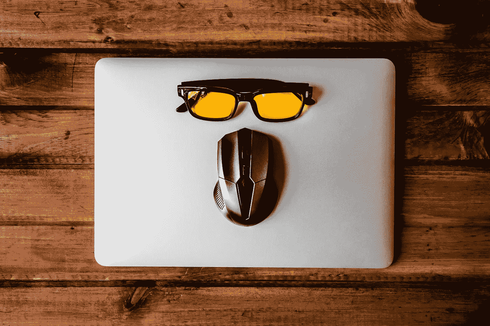
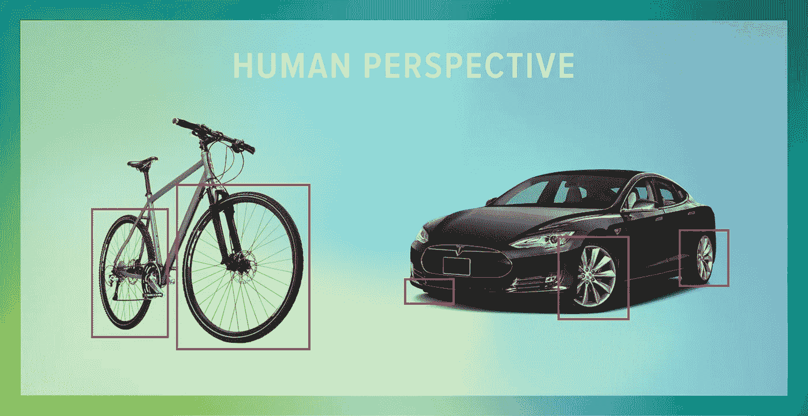
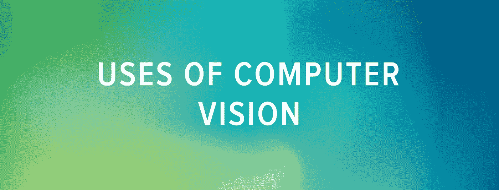

# 什么是计算机视觉，它是如何工作的

> 原文：<https://betterprogramming.pub/what-is-computer-vision-and-how-it-works-2d6593ffbf29>

## 我们能教机器看东西吗？

来自[突发](https://burst.shopify.com/wood?utm_campaign=photo_credit&utm_content=Picture+of+Gaming+Glasses+%26+Mouse+-+Free+Stock+Photo&utm_medium=referral&utm_source=credit)的 [Shopify 合作伙伴](https://burst.shopify.com/@shopifypartners?utm_campaign=photo_credit&utm_content=Picture+of+Gaming+Glasses+%26+Mouse+-+Free+Stock+Photo&utm_medium=referral&utm_source=credit)的照片。

我们自动感知和解释来自周围世界的视觉信息。因此，实现计算机视觉可能看起来是一项微不足道的任务。但是人工模拟一个花了数百万年进化的过程真的那么容易吗？

如果你想了解更多关于计算机视觉技术背后的东西，以及 ML 工程师如何教机器看东西，请阅读这篇文章。

# 什么是计算机视觉？

计算机视觉是人工智能和机器学习的一个领域，它研究允许训练计算机感知和解释来自现实世界的视觉信息的技术和工具。

看世界是最简单的部分:为此，你只需要一台相机。然而，仅仅将相机连接到计算机是不够的。具有挑战性的部分是分类和解释图像和视频中的对象，它们之间的关系，以及正在发生的事情的上下文。我们希望计算机能够解释图像、视频片段或实时视频流中的内容。

这意味着计算机必须有效地解决这三项任务:

*   自动理解图像中的对象是什么，以及它们的位置。
*   对这些对象进行分类，并理解它们之间的关系。
*   了解场景的背景。

换句话说，这个领域的总体目标是确保机器理解图像的能力与人类一样好，甚至更好。正如您将在后面看到的，这非常具有挑战性。

# 计算机视觉是如何工作的？

为了让机器识别视觉对象，必须对成千上万个例子进行训练。例如，你希望有人能够区分汽车和自行车。你会如何向人类描述这项任务？

通常，你会说自行车有两个轮子，而机器有四个轮子。或者自行车有踏板，而机器没有。在机器学习中，这被称为[特征工程](https://manningbooks.medium.com/the-computer-vision-pipeline-part-4-feature-extraction-6343ef063588)。

然而，您可能已经注意到，这种方法远非完美。有些自行车有三个或四个轮子，有些汽车只有两个。此外，摩托车和轻便摩托车可能会被误认为是自行车。算法将如何对这些进行分类？

当你在构建越来越复杂的系统(例如，面部识别软件)时，[错误分类](https://www.researchgate.net/post/How_to_correct_the_misclassification_to_achieve_better_accuracy)的情况会变得更加频繁。简单地说明每个人的眼睛或头发颜色是不行的:ML 工程师将不得不进行数百次测量，如眼睛之间的距离、眼睛和嘴角之间的距离等。，能够描述一个人的脸。

此外，这样一个模型的准确性还有很多需要改进的地方:改变光线、面部表情或角度，你就必须重新开始测量。

以下是解决计算机视觉问题的几个常见障碍。

## 不同的照明

对于计算机视觉来说，收集关于真实世界的知识是非常重要的，真实世界在不同种类的照明下表示物体。滤镜可能会使球看起来呈蓝色或黄色，而实际上它仍然是白色的。红灯下的红色物体变得几乎看不见。

## 噪音

如果图像有很多噪声，计算机视觉很难识别物体。计算机视觉中的噪声是指图像中的单个像素看起来比实际情况更亮或更暗。例如，当外面下雨或下雪时，检测道路上违规行为的摄像机就不那么有效了。

## 陌生的角度

从几个角度给物体拍照是很重要的。否则，如果角度发生变化，计算机将无法识别。

# 重合

当图像上有多个对象时，它们可能会重叠。这样，物体的一些特征可能会保持隐藏，这使得机器更难识别它们。

# 不同类型的对象

属于同一类的东西，可能看起来完全不一样。例如，有许多类型的灯，但是算法必须成功地识别床头柜灯和天花板灯。

# 虚假相似性

不同类别的项目有时看起来很相似。例如，你可能遇到过从某个角度拍摄的照片会让你想起某个名人的人，但在现实生活中却不会如此。在计算机视觉中，误识别的情况很常见。比如萨摩耶小狗，在一些图片中很容易被误认为小北极熊。

几乎不可能考虑所有这些情况并通过特征工程来防止它们。这就是为什么今天，计算机视觉几乎完全由深度人工神经网络主导。

卷积神经网络在提取特征方面非常[高效](https://www.sciencedirect.com/science/article/pii/S2405896317335346)，并允许工程师节省手工工作的时间。 [VGG-16 和 VGG-19](https://towardsdatascience.com/top-10-cnn-architectures-every-machine-learning-engineer-should-know-68e2b0e07201) 是最著名的 CNN 架构。诚然，深度学习需要大量的例子，但这不是问题:每年大约有 6570 亿张照片上传到互联网上！

# 计算机视觉的应用

解读数字图像和视频在许多领域都很方便。让我们看一些使用案例:

*   **医学诊断。**图像分类和模式检测广泛用于开发软件系统，以辅助医生诊断危险疾病，如肺癌。一组研究人员已经训练了一个人工智能系统来分析肿瘤患者的 CT 扫描。该算法显示出 95%的准确率，而人类只有 65%。
*   **工厂管理。**以最大的精确度检测制造过程中的缺陷非常重要，但这很有挑战性，因为这通常需要在微观层面上进行监控。比如需要检查几十万个螺丝的螺纹时。计算机视觉系统使用来自摄像机的实时数据，并应用 ML 算法来分析数据流。这样很容易找到低质量的商品。
*   **零售。**亚马逊是第一家开设没有任何收银员或收银机的商店的公司。Amazon Go 安装了数百个计算机视觉摄像头。这些设备跟踪顾客放入购物车的商品。摄像头还能够跟踪客户是否将产品放回货架，并将其从虚拟购物车中移除。顾客通过 Amazon Go 应用程序付费，无需排队。摄像头还可以防止入店行窃，防止缺货。
*   **安全系统。**面部识别应用于企业、学校、工厂，基本上是任何重视安全的地方。美国的学校应用面部识别技术来识别性犯罪者和其他罪犯，并减少潜在的威胁。这种软件还可以识别武器，以防止校园暴力行为。同时，一些航空公司使用人脸识别来识别乘客身份和办理登机手续，从而节省时间并降低检票成本。
*   **动物保护。**生态学家受益于使用计算机视觉来获取有关野生动物的数据，包括跟踪稀有物种的移动、它们的行为模式等。，而不打扰动物。计算机视觉提高了科学发现图像审查的效率和准确性。
*   **自动驾驶车辆。**通过使用传感器和摄像头，汽车已经学会识别保险杠、树木、电线杆和周围停放的车辆。计算机视觉使它们能够在没有人类监督的情况下在环境中自由移动。

# 计算机视觉中的主要问题

计算机视觉在各种不同的领域帮助人类——但它的发展可能性是无限的。这里有一些有待改进和发展的领域。

# 场景理解

计算机视觉擅长寻找和识别物体。然而，它在理解场景的背景时会遇到困难，尤其是当它很重要的时候。看看[这幅图](https://static.life.com/wp-content/uploads/migrated/2015/03/150309-solar-eclipse-01-671x1024.jpg)，举个例子。你觉得他们在干什么(别看网址！)?

你马上就会明白，这些都是头上戴着纸箱子的孩子。这不是某种试图揭露学校教育无意义的后现代艺术。这些孩子正在观看日食。但是如果你没有这个背景，你可能永远也不会明白发生了什么。

人工智能在绝大多数情况下仍然会有这种感觉。为了改善这种情况，我们需要发明通用的人工智能(即人工智能，其解决问题的能力或多或少相当于人类，并且可以普遍应用)，但我们距离做到这一点还很远。

# 隐私问题

计算机视觉与隐私有很大关系，因为不同国家的政府正在采用人脸识别系统来促进国家安全。安装在莫斯科地铁的人工智能摄像头[帮助抓捕罪犯](https://www.hrw.org/news/2020/10/02/russia-expands-facial-recognition-despite-privacy-concerns)。与此同时，中国当局[对维吾尔人](https://www.cnet.com/news/in-china-facial-recognition-public-shaming-and-control-go-hand-in-hand/)(一个穆斯林少数民族)进行侧写，并挑出他们进行追踪和监禁。当面部识别无处不在时，你所做的一切都可能受到政策和羞辱。人工智能伦理学家仍在试图找出无处不在的计算机视觉对公众福祉的影响。

# 总结

计算机视觉是一个创新领域，它使用最新的机器学习技术来构建软件系统，在不同领域帮助人类。从零售到野生动物保护，智能算法解决图像分类和模式识别的问题，有时甚至比人类更好。

想了解更多的技术吗？继续阅读我们的博客，关注我们的其他精彩内容。

*最初发布于*[*https://sero Kell . io*](https://serokell.io/blog/guide-to-computer-vision)*。*