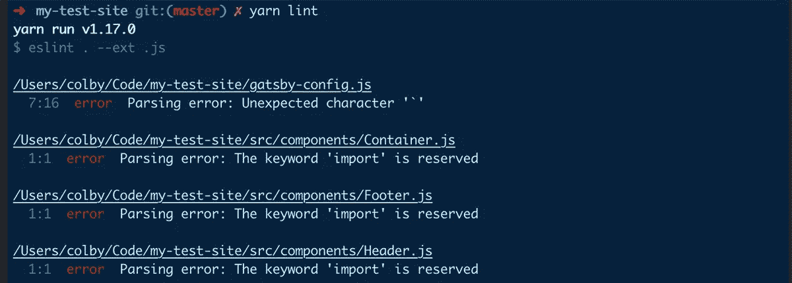
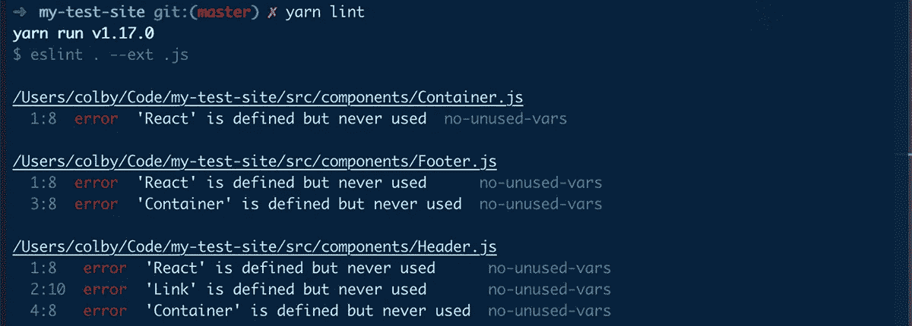

# 什么是林挺？

> 原文：<https://betterprogramming.pub/what-is-linting-66e7876708f3>

## 软件开发中最大的挑战之一是时间。林挺能帮上什么忙？


照片由 [Aron 视觉效果](https://unsplash.com/@aronvisuals?utm_source=unsplash&utm_medium=referral&utm_content=creditCopyText)在 [Unsplash](https://unsplash.com/s/photos/time?utm_source=unsplash&utm_medium=referral&utm_content=creditCopyText) 上拍摄

软件开发中最大的挑战之一是时间。这是我们不容易得到更多的东西，但林挺可以帮助我们充分利用我们所拥有的时间。

# 什么是林挺？

> ***"Lint*** *，或称****linter****，是一款分析源代码以标记编程错误、bug、风格错误和可疑构造的工具。"——*[*维基百科*](https://en.wikipedia.org/wiki/Lint(software))

简而言之，linter 是一种以编程方式扫描代码的工具，目的是找到可能导致代码健康和风格方面的错误或不一致的问题。有些人甚至可以帮你修理它们！

以下面的例子为例:

```
const test = 'I am a test';
console.log(`Test: ${test}`);
const test = 'Another one.';
```

我们声明了常量`test`两次，我们的 JavaScript 引擎会不高兴的。

有了正确的 linter 设置和观察器配置，您不会在代码运行时被捕获为错误，而是会通过后台运行的 linter 立即得到一个错误:

```
10:9  error  Parsing error: Identifier 'test' has already been declared

   8 |   const test = 'I am a test';
   9 |   console.log(`Test: ${2}`);
> 10 |   const test = 'Another one.';
     |         ^
```

很明显，你有两个相同的`const`声明，因为这只有三行，但是在一个更复杂的应用程序中，这可以节省大量的时间去寻找一个并不总是很明显的讨厌的 bug。

# 林挺能帮上什么忙？

[很多东西](https://eslint.org/docs/rules/)，包括但不限于:

*   从语法错误中标记代码中的错误。
*   当代码不直观时给你警告。
*   为常见的最佳实践提供建议。
*   记录待办事项和待办事项。
*   保持一致的代码风格。

你能想到的大多数东西可能已经以这样或那样的形式存在了，如果没有，你甚至可以创建符合你需求的自定义规则。

# 这有什么帮助，我为什么要关心？

上面列表中最大的主题可能是这些问题将会被立即提出来。这些问题不再会在你运行应用程序的过程中悄悄出现，也不会在代码审查过程中给别人带来焦虑。

你和你的评论者将不再无休止地争论是否要在 JS 语句的结尾加上分号([你应该](https://stackoverflow.com/a/444082))。

所有那些因为一个愚蠢的语法错误或者你和你的队友在回顾中的微小互动而使你停止工作的时刻都需要时间。

它们累积起来，最终夺走了你可以用来修复另一个 bug 或开发产品下一个伟大特性的时间。

# 我如何开始？

尽管大多数(如果不是全部的话)其他主流语言都有 linters，但出于本文的目的，我将重点讨论 JavaScript。同样的原则也适用，但是工具可能有点不同。

我将介绍如何在 React 应用中设置基本的林挺。你可以通过旋转自己的 React 应用程序或使用我的[Gatsby](https://www.gatsbyjs.org/)starter 来轻松跟进。

# 你的棉绒

首先，我们需要一个棉绒。[可能 JavaScript 世界中最流行的](https://trends.google.com/trends/explore?geo=US&q=eslint,jshint,jslint)是 [ESLint](https://eslint.org/) 。您的 linter 实际上将是定义规则和解析您的测试文件的引擎。

ESLint 本身是作为一个 [npm 包](https://www.npmjs.com/package/eslint)提供的，一旦安装，它允许你设置一个基本的配置文件，并使用一些命令行工具立即投入运行。

让我们首先添加我们的 ESLint 依赖项:

```
yarn add eslint -D
```

我们将其安装为`devDependency`(因此有了`-D`标志)，因为这不是我们的应用程序需要运行的东西。安装成功后，让我们将它作为脚本添加到我们的`package.json`中:

```
...
"scripts": {
  ...
  "lint": "eslint .  --ext .js"
  ...
},
...
```

在上面的例子中，我们在整个项目目录中运行 linter，处理任何扩展名为`.js`的文件。

如果你正在处理一个有许多文件类型的大型项目，也许有一些你不想被标记，你可以[改变那个标志或者更具体的用其他选项](https://eslint.org/docs/user-guide/command-line-interface)。

为了支持 ESLint，我们还需要做一件事。让我们在项目的根目录(可能是您的`package.json`所在的位置)添加一个名为`.eslintrc.js`的文件，并将文件内容简化为:

```
module.exports = {};
```

一旦你准备好了，你就可以跑`yarn lint`了...得到一个错误。



Lint 结果-导入错误

这是可以的，也是我们项目所期望的，所以让我们继续。

# 您的解析器

JavaScript 开发人员链中的一个常用工具是 [Babel](https://babeljs.io/) ，它允许您编写具有并非所有浏览器都支持的特性的代码，例如使用[箭头功能](https://developer.mozilla.org/en-US/docs/Web/JavaScript/Reference/Functions/Arrow_functions)，这些功能在 [ES6](http://es6-features.org/#Constants) 中可用，以及其他约定，如通过`import`导入文件。

您编写的代码可能已经通过 Babel 在浏览器中运行，但默认情况下这不适用于 ESLint，因此 ESLint 允许您指定一个解析器，该解析器允许林挺处理查看与您的浏览器看到的代码相同的代码。

在这种情况下，我们想要使用 [Babel 的 ESLint](https://github.com/babel/babel-eslint) 解析器。

要设置它，我们首先要安装我们的依赖项:

```
yarn add babel-eslint -D
```

通常，如果你正在使用`babel-eslint`，你会希望确保`babel`安装在它旁边，但是在我们的例子中，Gatsby 已经使用了`babel`，所以我们不一定需要添加它。

设置好之后，我们需要用一些新选项来更新我们的`.eslintrc.js`配置文件:

```
module.exports = {
    "env": {
        "browser": true,
        "node": true,
        "es6": true
    },
    "parser": "babel-eslint"
};
```

这里，我们让 ESLint 知道我们的环境将在 Node (Gatsby 的预编译)中运行，在浏览器(应用程序)中，它将使用 ES6。

这有助于 ESLint 知道如何运行你的代码。此外，我们希望将我们的解析器设置为`babel-eslint`。

一旦我们准备就绪，再次运行`yarn lint`,然后...嗯，什么都没发生。


Lint 结果—什么也没发生

这仍然是意料之中的，因为我们没有设置任何规则！

# 您代码的插件

写一个 [React](https://reactjs.org/) app？Babel 解析器可以帮助您转换代码，但是您可能很难高效工作，因为 ESLint 需要了解它应该如何工作来 Lint 您的 React 文件。

ESLint 的部分魅力在于它允许你[配置插件](https://eslint.org/docs/developer-guide/working-with-plugins)，这些插件有机会为你创建和设置规则。幸运的是，除了我们上面的 Babel 解析器做一些繁重的工作之外，我们还有一个可用的 [React 插件](https://github.com/yannickcr/eslint-plugin-react)来做这些工作，并为我们处理林挺 JSX。

让我们首先安装我们的依赖项:

```
yarn add eslint-plugin-react -D
```

此外，让我们再次更新我们的`.eslintrc.js`文件:

```
module.exports = {
    "settings": {
        "react": {
            "version": "detect"
        }
    },
    "env": {
        "browser": true,
        "node": true,
        "es6": true
    },
    "plugins": [
        "react"
    ],
    "parser": "babel-eslint"
};
```

我们在这里添加的是一个设置，它会自动检测您使用的 React 版本，这有助于让您的林挺得到正确解析，然后设置我们上面安装的 React 插件。

最后一次，我们将运行我们的`lint`脚本，但什么也没得到:


Lint 结果—什么也没发生

# 由他人观点定义的规则

如果你真的不确定从哪里开始，或者只是想快速启动并运行，建议你启用 [ESLint 自己推荐的规则](https://eslint.org/docs/rules/)。让我们把它添加到我们的`.eslintrc.js`配置文件中:

```
module.exports = {
    "settings": {
        "react": {
            "version": "detect"
        }
    },
    "env": {
        "browser": true,
        "node": true,
        "es6": true
    },
    "plugins": [
        "react"
    ],
    "extends": [
        "eslint:recommended"
    ],
    "parser": "babel-eslint"
};
```

让我们运行我们的`yarn lint`。

哇哦。这会立即给你很多错误，看起来好像有什么地方出了问题。



Lint 结果—对错误做出反应

因为我们正在运行 React 应用程序，我们也想确保我们的 linter 理解它应该遵循的规则，所以让我们也将 React 插件添加到`.eslintrc.js`配置设置中:

```
"extends": [
    "eslint:recommended",
    "plugin:react/recommended"
],
```

现在，如果你运行`yarn lint`，你会得到一些更符合逻辑的东西。


Lint 结果-正常错误

如果你一直跟着，看起来我们的 starter 应用程序在我们对`Layout.js`的`propTypes`验证中有一个放错了位置的分号和一个丢失的道具。写这个帮我搞定了自己的回购！

更进一步，如果这些似乎不符合你的需求，许多开发者和团队已经发布了他们自己的配置，ESLint 允许你轻松地利用它们。

一些受欢迎的包括:

*   [Airbnb 的配置](https://www.npmjs.com/package/eslint-config-airbnb)
*   [半标准](https://github.com/standard/eslint-config-semistandard)
*   [谷歌的 JS 风格指南](https://github.com/google/eslint-config-google)

对现有选项不满意？你甚至可以[创建并发布你自己的](https://eslint.org/docs/6.0.0/developer-guide/shareable-configs)到任何一层，在其他层之上作为起点，或者从头开始。

# 让它做工作(大部分)

你不会认为我会让你自己修理这些东西吧？好吧，你可能需要修复一些，但是让我们试着让 ESLint 为我们修复一些。

如果您注意到了，在我们运行上面的命令之后，ESLint 给了我们一条额外的消息:


Lint 结果-修复选项

所以，我们来试一试吧！我们跑吧:

```
yarn lint --fix
```

你知道吗，它现在只给了我们一个林挺误差。


Lint 结果— 1 个错误

结果是 ESLint 能够自动修复我们的分号问题，但是我们仍然需要手动将`pageName`添加到`Layout`的`propTypes`中，这并不是一个很大的提升。

再跑一次，最后又什么都没有了！但这次因为一切看起来都很好。


Lint 结果-无错误

# 勇往直前，编写混乱的代码！

开玩笑的。这里的好消息是，您现在可以轻松地查看代码库的总体健康状况，并有望自动修复大部分代码。

当你和团队中的其他人一起工作时，这将会省去很多麻烦，通常来说，让你所有的代码整洁是件好事。

这个帖子才刚刚开始。ESLint 是一本开放的书，有大量的插件和规则，它不是游戏中唯一的林挺工具。

尝试一下，找到最适合你和你的团队的方式。从长远来看，将它配置到您的应用程序所花费的时间将会节省您很多时间。

# 查看资源和林挺工具

*   林挺框架。
*   JSHint:ESLint 的替代方案。
*   [Stylelint](https://github.com/stylelint/stylelint):CSS 和类似 CSS 语法的林挺工具，如 [Sass](https://sass-lang.com/) 。
*   牛逼的 ESLint :一个简单的牛逼配置、解析器、插件和其他工具的列表，用来提升你的 ESLint 游戏。
*   Webhint:一个关于可访问性、速度和更多网站最佳实践的林挺工具。
*   A11y JSX 插件 : ESLint 插件，用于检查 JSX 元素的可访问性规则。