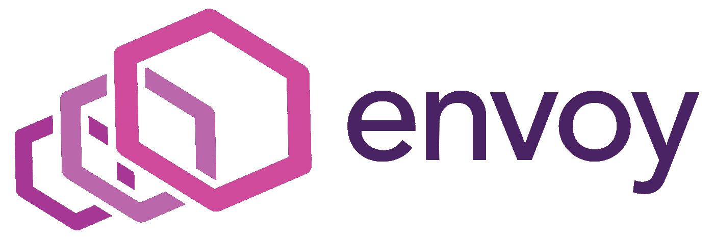

# Lyft 特使。那是什么？

> 原文：<https://betterprogramming.pub/what-is-lyft-envoy-9dfb45470f19>

## Envoy 是一个开源的云原生代理，致力于解决重要的分布式系统缺陷

GitHub 上[特使的照片。](https://github.com/envoyproxy/artwork/blob/master/PNG/Envoy_Logo_Final_PANTONE.png)

长久以来， [Lyft](https://www.lyft.com/) 一直在为开源社区贡献一些[的精彩项目](https://lyft.github.io/)。

Envoy Proxy 是他们顶级的开源产品之一，针对的是微软、网飞、SAP、VMware 和优步等公司的许多开发人员正在努力解决的问题。

2017 年 9 月，Envoy 捐赠给[云原生计算基金会](https://www.cncf.io/cncf-envoy-project-journey/)。

# 介绍

时至今日，构建软件系统的现代方式是利用[微服务架构](https://docs.microsoft.com/en-us/azure/architecture/guide/architecture-styles/microservices)。

由 [Vlad Hilitanu](https://unsplash.com/@vladhilitanu?utm_source=medium&utm_medium=referral) 在 [Unsplash](https://unsplash.com?utm_source=medium&utm_medium=referral) 上拍摄的照片。

> “微服务(也称为微服务架构)是一种架构风格，它将应用程序构建为一组服务，这些服务具有以下特点:
> 
> 高度可维护和可测试
> 
> 松散耦合
> 
> 可独立部署
> 
> 围绕业务能力组织
> 
> 由一个小团队拥有
> 
> 微服务架构支持快速、频繁、可靠地交付大型复杂应用。它还使组织能够发展其技术堆栈。”— [微服务 io](https://microservices.io/)

此外，随着微服务架构的出现，行业正稳步走向云原生解决方案。

一个云原生实体|照片由[鲍里斯·斯莫克罗维奇](https://unsplash.com/@borisworkshop?utm_source=medium&utm_medium=referral)在 [Unsplash](https://unsplash.com?utm_source=medium&utm_medium=referral) 上拍摄

> “云原生技术使组织能够在现代动态环境(如公共云、私有云和混合云)中构建和运行可扩展的应用。容器、服务网格、微服务、不可变基础设施和声明式 API 就是这种方法的例子。
> 
> 这些技术使得松散耦合的系统具有弹性、可管理性和可观察性。与强大的自动化相结合，它们允许工程师以最少的劳动频繁地、可预测地做出高影响力的改变。“— [云原生计算基础](https://github.com/cncf/foundation/blob/master/charter.md)

因此，总体而言，云原生微服务系统是一个非常好的策略，但不幸的是，没有不带刺的玫瑰。

# 问题

微服务往往会给软件系统带来一些复杂性。

由[蒂姆·高](https://unsplash.com/@punttim?utm_source=medium&utm_medium=referral)在 [Unsplash](https://unsplash.com?utm_source=medium&utm_medium=referral) 上拍摄的照片。

很长一段时间以来，软件工程师一直在努力解决这些常见的微服务陷阱。

这种软件架构引入的困难之一是**调试**。微服务几乎不可能调试，这很不幸，也绝对是一个严重的问题。

这是由于它们的模块化和异构性。使用许多不同的技术开发了许多不同的服务。这直接暗示了几个问题:

1.  由于在向系统发出一个请求的过程中会有多个服务调用，因此很难准确地追踪到请求执行的最终问题的根源。
2.  此外，每个服务都可以有自己特定的日志记录机制，有自己的工作流和自己的缺点——如果这种机制存在的话。这意味着日志记录可能不一致，难以管理，并且可能很快失控。

由于糟糕的调试功能，甚至缺乏调试功能，开发人员将无法快速准确地识别问题。这将不可避免地使工程师对系统失去信心，从而大大降低生产率。

# 解决方案

这是特使开始发光的地方。

> “Envoy Proxy 是一款现代化、高性能、小尺寸的边缘和服务代理。Envoy 为您的服务增加了弹性和可观察性，并且它以一种对您的服务实现透明的方式做到了这一点。”— [数据线](https://www.datawire.io/envoyproxy/getting-started-lyft-envoy-microservices-resilience/)

Envoy 不仅解决了这些问题，还提供了一些非常方便的特性来简化调试和开发。

当用作服务代理时，Envoy 被部署为一个 [sidecar 应用程序](https://docs.microsoft.com/en-us/azure/architecture/patterns/sidecar)。

由[叶戈尔·迈兹尼克](https://unsplash.com/@vonshnauzer?utm_source=medium&utm_medium=referral)在 [Unsplash](https://unsplash.com?utm_source=medium&utm_medium=referral) 上拍摄的照片。

作为某个服务的边车意味着特使直接连接到它。由于 Envoy 是一个代理，它的职责是接收、处理和监控所有进出服务的流量。

在理想情况下，软件系统的每个服务都应该有一个特使代理侧柜，从而为系统带来多种重要好处:

1.  使用 Envoy 的服务发现机制，所有代理收集和分发收集的流量数据，从而提供分布式日志记录、跟踪和统计。这大大增强了调试能力。
2.  同样，由于 Envoy 的服务发现功能，服务本质上只需要知道 Envoy 代理的地址，因为其他服务可以通过域名解析。这实现了网络透明性，允许开发人员主要关注业务逻辑，消除了他们了解网络拓扑和与其他服务通信的更深入逻辑的需要。网络透明的概念相当强大。
3.  此外，Envoy 代理在给定服务的所有副本之间提供了过多的高级负载平衡功能。仅举几个例子，主动/被动健康检查、电路断开、自动重试、超时、全局速率限制等等。其中一些特性可以很容易地提取到客户端库中，但当我们审视单个微服务系统中涉及的所有不同技术堆栈时，在这些新技术中反复移植这些库将需要相当多的努力。此外，维护这个库的所有端口也很麻烦。

# 结论

Envoy 为微服务软件系统、网络透明性和通用最佳实践通信设计模式提供关键的调试功能。

使用 Envoy 代理使软件系统更加透明、更有弹性、更易于开发、调试起来更简单。

如果你觉得 Envoy 是你想了解的东西，你可以从官方文件开始，从 T2 GitHub 页面开始，或者从 Lyft 工程师 Matt Klein 的精彩视频开始。