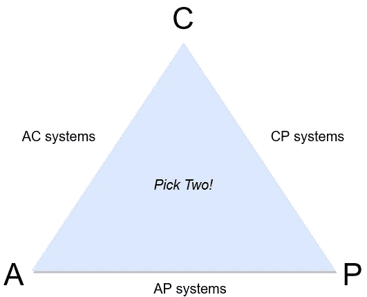

# 什么是 C.A.P 定理，为什么你需要它来选择正确的 NoSQL 数据库？

> 原文：<https://betterprogramming.pub/what-is-the-c-a-p-theorem-and-why-you-need-it-to-pick-the-right-nosql-database-da24744204b4>

## “鱼和熊掌不可兼得”这个古老的好定理

照片由[马修·奎罗斯](https://unsplash.com/@queirozmm?utm_source=unsplash&utm_medium=referral&utm_content=creditCopyText)在 [Unsplash](https://unsplash.com/s/photos/thinking?utm_source=unsplash&utm_medium=referral&utm_content=creditCopyText) 上原创，作者编辑

在 NoSQL 世界中，任何数据库都有三个特征。不是因为你需要确保你拥有这三样东西，而是因为你需要明白你至少拥有两样。

没错，C.A.P 定理指出，在 NoSQL 数据库的这三个非常受欢迎的属性中，你最多只能拥有两个。这就是为什么你需要了解它——因为你需要知道当你在两个非常相似的选择中做出选择时，你将会牺牲什么。

因此，让我们快速地介绍一下这个定理，然后为每个类别举一些例子，这样你就知道从这里开始该怎么做了。

# 所有 NoSQL 数据库的 3 个神奇属性

C.A.P 代表 **C** 一致性， **A** 可用性， **P** 划分。

但是让我们深入一点。

**一致性**完全是关于数据一致性，或者换句话说，确保在分布式环境中，数据库的每个节点在任何给定时间都拥有完全相同的信息。想象一下，有两个节点有来自您的电子商务网站的采购订单。如果它们之间没有数据一致性，并且它们充当唯一的集群，那么当您的客户端应用程序查询过时的节点时，它可能会向您显示丢失的事务。如果代码不仅显示，而且根据数据进行计算，结果可能是灾难性的。

因此，一致性绝对是任何分布式 NoSQL 数据库的一个重要特征。但是，并不是所有的都能提供。那么他们会怎么做呢？他们追求所谓的“最终一致性”这意味着虽然在某一点上集群可能不一致，但最终会一致。这有助于确保你不会遇到我之前提到的那种问题。

**可用性**代表“高可用性”,或者换句话说，无论发生什么，数据库总是可用的能力。然而，这与[不同，不应与“容错”](https://dzone.com/articles/fault-tolerance-is-not-high-availability)相混淆。高可用性数据库通常在多个地理区域都有副本，这样，如果出现大规模网络中断，仍然可以通过其他副本访问它。例如，只在我们的一台服务器上安装和运行的系统不可能具有高可用性，因为一旦那台服务器出现故障，我们就会丢失数据库。

**分区**代表“分区容差”，或者换句话说，能够支持数据库所在集群中的断开链接。考虑一个表示您的数据库集群的图。您有多个节点共享数据并正常工作，但突然出现了问题，集群的一部分出现了故障。如果数据库是“分区容忍”的，尽管突然缺少一些节点，它仍然可以工作。

考虑到这一点，这个定理基本上是说，你不可能在一个系统中拥有所有三种选择。你可以选择两个，意思是，你可以有:

*   **AP 系统**。高可用性和分区容错数据库，无论发生什么情况，都将始终响应您的请求。他们做到了这一点，但他们无法确保如果出现部分网络中断，所有剩余节点都将拥有最新版本的数据。换句话说，如果查询错误的节点，您将使用旧数据。
*   **CP 系统**。一致和分区宽容的数据库，无论发生什么情况都可以保护数据。每个节点将始终保持一致。但是他们这样做是以牺牲可用性为代价的。每次发生分区时，需要关闭不一致的节点，这意味着最终可能需要完全关闭系统。
*   **空调系统**。高度可用和一致的数据库将始终使用最新版本的数据响应来自任何节点的所有请求。当然，除非集群中发生了分区，否则整个事情都会泡汤，因为在这种情况下您无法确保一致性。

CAP 图的可视化表示

现在，有一个关于空调系统的警告:在分布式环境中，分区几乎是不可避免的，所以尽管你可能想试着拥有一个空调系统，但很有可能你永远无法实现。这通常是所有基于 SQL 的数据库都存在的问题，即使它们可以集群化，并且信息可以跨节点复制或共享，分区也会导致问题。

现在让我们快速看一下你可能想使用的有趣的 AP 和 CP 系统的例子。

# 高可用性和分区容错系统

如前所述，无论发生什么情况，AP 系统将永远为您服务(没有 100%的可用性，但您明白这一点)。关于它们的警告是，数据可能并不总是到处更新。

这些系统的例子有:

*   [卡珊德拉 DB](https://cassandra.apache.org/_/index.html) 。这是一个分布式 NoSQL 数据库，可以处理大量的信息。虽然它可以被配置为数据一致，但这样做会失去可用性，从而将其从 AP 系统转移到 CP 系统。默认情况下，其数据一致性级别将其归入此类别。如果您不介意在某些情况下读取陈旧的数据，可以使用它，就像这个类别中的许多其他系统一样。
*   [CouchDB](http://couchdb.apache.org/) 。这是一个基于 JSON 的数据库，这意味着信息存储在 JSON 记录中。它提供了与许多现代基于网络技术的良好集成，甚至允许基于 JavaScript 的转换。Couch 的一致性模型是“最终一致性”模型，他们通过增量复制来实现这一模型，这意味着他们定期从一台服务器到另一台服务器复制文档更改。最终，整个集群是一致的。
*   [MemoryDB](https://aws.amazon.com/memorydb/) 。最近，AWS 宣布推出基于 Redis 的托管数据存储。通过在多个可用性区域之间复制事务日志，他们还拥有最终的一致性模型。如果您正在寻找一个可靠的键值存储，这是一个很好的选择。

AP 系统强大而可靠，只要您能不时处理一些陈旧的数据，它们就是很好的选择。

# 一致且分区相容的数据库

现在我们来谈谈硬币的另一面(因为记住，我们在这里忽略了交流系统):CP 系统。

这些系统不是高度可用的(至少默认情况下不是)，这就排除了它们的任何基于云的版本。

CP 系统的例子有:

*   [HBase](https://hbase.apache.org/) 。一个模仿 Google Bigtable 论文的开源 NoSQL 数据库。它提供了对大数据的实时访问(例如，我们谈论的是数十亿行和记录)。默认情况下，HBase 被认为是 CP，因为它提供了一个非常狭窄和强制的一致性模型。每个写操作都通过他们所谓的“区域服务器”路由，并且只有一个。如果该服务器出现故障，群集在恢复在线时将变得不可访问。这也从可用性中删除了“A”。像这里列出的所有其他选择一样，它可以被[配置成高可用性](https://docs.cloudera.com/HDPDocuments/HDP2/HDP-2.6.2/bk_hadoop-high-availability/content/ha-hbase-intro.html)，当然是以牺牲数据一致性为代价。
*   [MongoDB](https://www.mongodb.com) 。MongoDB 可能是最常见的 NoSQL 数据库之一，它是一个基于文档的数据库，很像 CouchDB(也支持 JSON 格式的记录)。然而，与 Couch 不同，Mongo 在默认情况下被视为 CP，这意味着它更喜欢在分布式环境中保持数据一致(因为所有读写操作在默认情况下都由副本集上的主节点提供服务)，只要副本集的一半节点相互连接，如果这种情况没有发生，那么就不能选择新的主节点，并且该集会关闭。

当数据对您至关重要，并且您总是需要更新数据时，CP 系统通常是您想要的。当然，这为灾难性的网络问题敞开了大门，这些问题会完全拒绝对数据库的访问。也就是说，您必须考虑以下问题:考虑到您当前的基础架构，出现这种情况的可能性有多大？如果是，找到快速解决这一问题的替代方案的成本是多少？

# 结论

有很多关于 CAP 功能和分布式 NoSQL 数据库的讨论。事实上，一些开发人员甚至说，鉴于 CAP 的范围是如此有限，我们应该停止谈论它(从字里行间可以看出，它只关心集群中有分区时会发生什么，但它没有提到延迟、服务器问题和其他实际问题。

所以请有所保留，不要把它当成某些人认为的终极圣经。然而，我相信理解 CAP 定理代表了什么以及每个属性如何与其他属性交互对于理解大数据分布式架构如何工作至关重要。于是就有了那个。

你呢？你对这个话题有什么看法？你是 CAP 的追随者吗？在评论里留下你的想法，大家一起讨论吧！