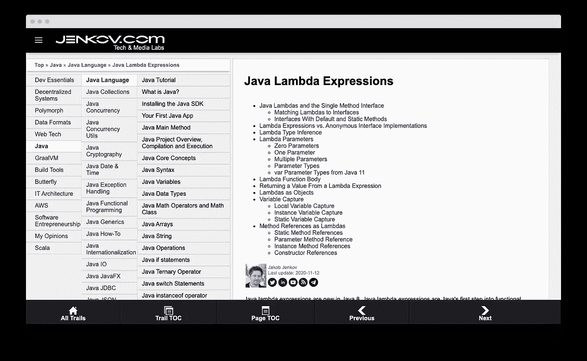
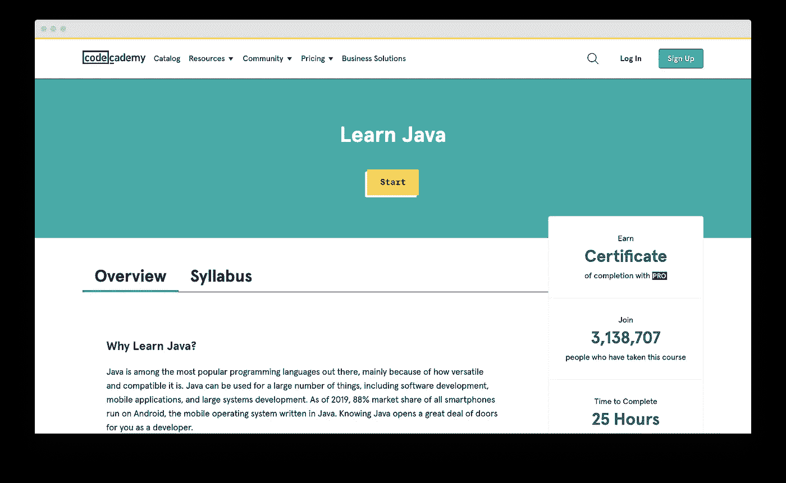

# 一个程序员新手要学会什么才能快速找到一份好工作？

> 原文：<https://betterprogramming.pub/what-should-a-novice-programmer-learn-to-find-a-good-job-quickly-763c88faf775>

## 深入了解各种编程语言等等


在这篇文章中，我将分享我对选择第一种编程语言的想法，什么是“学习编程”，以及如果你想尽快成为一名程序员，你应该学习什么。

# 这个“学编程”是什么意思？

开始学习编程既难又容易。简单，因为现在你可以找到各种各样的教程和视频给初学者。通常他们是免费的。第一个任务和理论可能看起来非常简单和符合逻辑。

还有，很难。因为从各种各样的材料中进行选择是极其困难的。网上太多了，很难区分独立评论和自定义评论，尤其是对一个初学者来说。

另外，很多时候，免费教程只是刚开始好。它们很少从方法论的角度来思考。他们很少有很多精心选择的编码任务，也很少有办法确保你的代码是好的和正确的。

事实证明，继续比开始更难。从零开始有很多免费的资料，但是越往前走就越少。

另外，一个初学者很难回答的问题，学编程是什么感觉？如果我被问到这个问题(或者即使我没有被问到，哼),我通常会给我的学生这样的回答:

1.  学习如何使用代码执行某些任务(计算机和编程语言本身如何“思考”)。
2.  直接获取未来工作所需的知识。

第一点比较笼统。它不依赖于语言(虽然现在仍然依赖于语言，但我在后面写 Python 的时候会举一个小例子)，绝对是所有潜在程序员都需要的。正确的方法和好的导师(或深思熟虑的课程)让初学者从最开始的任务开始掌握所有必要的技术以及语言的语法。这些任务包括替换两个数字，寻找最大值和最小值，计算数字的阶乘，以及其他简单的算法。

在你学习的第一步就完成这些任务是非常重要的。这就像对于一个新手钢琴家来说，手的正确位置:你可以长时间不使用它，但从一开始就解决这个问题会更容易和更有效。

下一个普遍的问题是算法和数据结构。关于这个话题有很多不同意见。事实是，在训练时非常重视算法，但在实际工作中，你不必实现标准的算法或数据结构。在所有或多或少流行的编程语言中，它们早已以尽可能好的方式实现了。

因此，大多数情况下，潜在的程序员只会在学习和面试中遇到他们。我指的是像排序和搜索列表或数组中的元素这样的算法，或者您自己的数据结构实现，例如，堆栈、队列、树、集合、列表等等。

比方说，在 Java 中，你可以在 Java 集合框架中找到所有这些数据结构，在它的方法中有算法的最佳实现。其他流行语言也是如此。然而，如果你不仅想成为一名程序员，还想成为一名真正优秀的程序员，我建议你对算法和数据结构给予足够的关注。

这对于理解计算机的“思维”和其中进程的组织非常有用。如果你精通这些话题，并在实践中仔细研究，我保证你会比那些不精通的人获得巨大的优势。特定语言或框架的特定知识变得过时，而形成算法工作的思维方式将永远伴随着你。而且在工作和面试中很多时候都会派上用场。

第二点(直接获取未来工作所需的知识)取决于你未来想做什么，与你计划学习的领域和语言联系更紧密。

现在，让我们看看如何选择编程语言。

# 先学什么语言有意义？

语言的选择取决于你想在哪里工作。当然，除非你已经形成了偏好。当我问一个人想做什么程序时，我听到很多答案。以下是最受欢迎的:

*   网站
*   网络应用
*   移动应用
*   比赛
*   有趣的大项目
*   科学项目
*   操作系统、驱动程序、管理不同系统的程序

这里有一些简短的回答，可以让你根据你想要创建的东西来决定应该使用哪种语言:

*   网站(前端)— JavaScript、类型脚本
*   网站(服务器端)——Python、PHP、JSNode、Ruby
*   网络应用:Java，C#，Python
*   移动应用:Java、kot Lin(Android 版)、Swift(iOS 版)
*   视频游戏:C++，C#，游戏引擎
*   企业项目:Java、C#
*   科学项目:Java、Python
*   操作系统，驱动程序:C，C++
*   嵌入式系统:Java

这些是一般性建议；它们不是通用的。例如，浏览器中的游戏可以用 JavaScript 编写，没有人阻止你用 Java 创建操作系统。

接下来，让我们看看选择会有多有用。

# 我还没决定…

然而，最常见的是，我听到对这个问题非常不同的回答:

*   “我还没决定。”
*   “我不能肯定。也许……”然后上面的一个选项出现了。大多数人根本不确定自己想要什么。

他们说，在这种情况下，语言并不发挥特殊作用。有时候，在开始学习如何编程时，学习基本的算法原理是很好的，不要使用特定的语言，而是专注于可以理解的方案和通用伪代码。在这种情况下，学习不依赖于语言。

然而，现代编程语言非常清晰，逻辑性很强。如果你的目标是尽快找到一份工作，那么立即开始学习有用的知识和一门适用于工作的语言会更好。因此，同时研究语言的语法和解决第一个编码任务，并隐含地学习语言的基本结构和最简单的算法是如何工作的是有意义的。

过去，学校往往从 Pascal 开始，这是一种专门为学习而设计的语言。这是一种结构清晰的好语言，有助于理解过程编程的基础，甚至有点面向对象。然而，在实践中并不使用它(很少有例外)。所以深度学习 Pascal 是浪费时间。

今天，小学生经常接触到可视化语言 Scratch 的编程。这是一个非常好的工具，我必须说，非常强大。但它是专门用于研究和创建教育项目的。你在工作中不太可能会用到它(除非你想加入它的开发者的团队……嗯，或者教小孩子编程)。

如果一个人还不知道自己作为程序员到底想做什么，那么选择一种流行的通用编程语言是有意义的。“通用”意味着它可以用于各种领域和各种类型的编程。如果你从上一点来看这个列表，你会发现有几种语言经常重复出现。它们是 Java、Python、C#和 C++。也许除了 C ++，所有这些语言都适合初学者。

# 为什么不是 C++？

记住，我说过，首先要学的是一门使用频率高、不太难的语言。所以，C++是一种非常强大和复杂的语言，它允许专业人员创建几乎任何东西，并且程序将是有效的。然而，如果使用不当，同样的工具会让你“搬起石头砸自己的脚”

简而言之，如果你想创建高性能的应用程序或 AAA 游戏，你需要 C ++ …但不是马上。最好先学习我写过的其他三种语言中的一种。

# Python？

今天，大学和高中经常为初学者选择 Python 语言。这是一个明智的选择，因为 Python 的进入门槛很低。它有一个简单的语法，其结构是这样的，当你用其他语言编程时，你不需要注意你必须控制的一些事情。

Python 的一切都很好，但是有几个特性。如果你不知道要不要做程序员，但是想尝试(或者需要学习)编程，我推荐 Python。但是如果你想短期内成为一名程序员(并且不确定是做网站还是科学编程)，出于方法论的原因，我不会推荐 Python。

事实是 Python 有很多语法上的好处，也就是说，使代码简洁的结构。这似乎是好的。然而，我了解到，这种糖有时隐藏了一个程序员新手应该从一开始就理解的简单动作的本质。

这里有一个例子。首先要做的事情之一，就是向学生解释计算机内存是如何工作的，以及什么是编程逻辑，就是交换两个变量的位置。

```
a = 5b = 7
```

我们需要交换`a`和`b`。通常，这个问题是在一个附加变量的帮助下解决的。在这个过程中，一个有能力的导师会解释说 a 和 b 是内存区域的名字，在那里写有值`\u200b\u200bof`变量(或者有一点不同，取决于语言)。

通常，它是这样解决的(在任何语言中):想象你的值在两个容器中，`a`和`b`。对于解决方案，创建一个`tmp`缓冲变量，即第三个临时容器。

在第一步，其中一个值被传送给它，例如`5`。接下来，来自`b`的值，也就是`7`被放入“释放”的容器`a`，然后变量从临时容器转移到容器`b`。这是伪代码的样子。请注意，`=`符号不是等号，而是一个赋值运算符(几乎所有编程语言都是一样的)。

```
a = 5
b = 7
tmp = a
a = b
b = tmp
```

现在`tmp`变量已经完成了它的工作。变量`a`有`7`，变量`b`有`5`。这个简单的任务对于从程序员之路的开始就很好地理解是非常重要的。这个问题在任何编程语言中都可以解决。

这个问题也可以使用两个临时变量来解决:

```
a = 5
b = 7
tmp1 = b
tmp2 = a
a = tmp1
b = tmp2
```

没人会费心用 Python 这样解决。但是，语法糖允许您像这样编写解决方案:

```
a, b = 5, 7
a, b = b, a
```

就这样，任务完成。这里也有交换，也有临时变量(最有可能是两个)，但如果能这样简单解决，前两种方式谁来解决问题？这很好。但是对于理解这样一个决定的编程本质来说，许多重要的方面都被忽略了。在 Python 中有很多这样的例子。这就是为什么如果你正在独立学习，我不会推荐 Python 作为你的第一编程语言。

如果一个人在一个有能力的老师指导下学习编程，他们很可能会要求学生用第一种方法解决类似的问题，然后展示 Python 的这一特性，使其如此吸引人。另外，还有一点，Python 之后，学习其他语法不那么简洁的语言会相当困难。

然而，Python 通常是一个不错的选择。它用途广泛，但以下是它最常用的地方:

*   Python 是 web 开发中最常用的。已经为它编写了许多框架:FastAPI、Flask、Tornado、Pyramid、TurboGears、CherryPy，以及最流行的 Django。他们还用 Python 编写解析器，从网页中收集信息。
*   DevOps。对于这些专家编写的任何脚本来说，Python 都是必不可少的。
*   科学研究和机器学习。由于其简洁性、简单的语法和丰富的工具集，Python 已经成为科学家们最喜欢的语言。Python 有专门的库，允许你构建图表、进行研究和进行计算。
*   测试。Python 的另一个应用领域是测试自动化。许多 QA 自动化专业人员选择 Python 是因为它简单。对于那些几乎没有应用程序开发经验的人来说，这是非常好的。发达的社区、逻辑语法和可读性简化了学习过程。

# Java？Java！

很多专门研究 Java 的大学都教授 Java。这种语言并非没有缺陷。这么说吧，挺啰嗦的。尤其是与 Python 相比。但是，它的逻辑相当容易理解，在复杂性上更接近于中等甚至简单的语言。重要的是，学习更简单的语言(如 Python)和更复杂的语言(如 C ++)将变得更容易。

Java 是一种通用语言，可以在所有有 Java 机器的平台上工作。Java 机器是一台虚拟计算机，是真实硬件和程序员代码之间的一层。对于几乎任何平台，从咖啡研磨机到超级计算机，您都可以创建 Java 机器并用 Java 编写程序。

如果某个平台上没有 Java 机器，这很可能是由于市场营销和协议，而不是无法创建一个。顺便说一下，不仅 Java 可以在 JVM 上工作，其他流行的语言也可以，比如 Kotlin。对于一个初学者来说，学习它们比学习 Java 更难，但是学习 Java 之后，它们会变得非常好。

我推荐初学者用 Java。它非常受欢迎，有很好的文档记录，并且非常简单，但是主要的范例不会被新手程序员所忽视。

像 Python 一样，Java 是一种通用语言。然而，即使是通用语言也有其传统优势:

*   首先，Java 用于创建从一个服务器接收数据、处理数据并进一步发送数据的服务器应用程序。大多数情况下，这些都是大型分布式企业级应用程序，需要大量程序员来开发和维护。交易和金融应用程序的服务器部分。在这些领域中，传统上需要可靠性，所以 Java 经常参与其中，
*   移动开发中有很多 Java。最初，Android 是为 Java 而改进的。现在，科特林也被加入其中。智能手机游戏通常使用 Unity 引擎编写，该引擎支持 C#语言。
*   大数据。Hadoop 和其他大数据技术都以这样或那样的方式使用 Java，比如 Apache 的 Hbase 和 Accumulo 或 ElasticSearch。虽然 Java 在这个领域不占优势，但是有些技术比如 MongoDB 是用 C++写的。如果 Hadoop 或 ElasticSearch 扩张，Java 有潜力在这一增长领域占据更大份额。
*   嵌入式系统。Java 在嵌入式系统领域也很广泛。你可以看到这个平台的能力。使用 Java 只需要 130 KB(在智能卡和传感器上)。Java 最初是为嵌入式系统开发的。这个领域是 Java 最初的“编写一次，在任何地方运行”活动的一部分，这个活动似乎取得了成果。
*   科学编程。Java 占有相当大的份额，尽管从历史上看，Python 一直是这个领域的领导者。
*   测试自动化。对于那些想成为测试人员的人来说，Java 测试人员是最好的选择之一。
*   软件工具。许多有用的软件和开发工具都是用 Java 编写和开发的，比如 Eclipse、IntelliJ Idea 和 Netbeans IDE。

# C#呢？

很长一段时间都不会说 C#了。这种语言与 Java 非常相似。它是微软对 Java 出现的回应。它们有几乎相同的优缺点，只是 Java 更受欢迎一些。如果你决定从事游戏开发，也许我会推荐你学习 C#。

这种语言支持最流行的游戏引擎之一 Unity，以及 Godot 不断增长的能力。你可以在这些引擎和大型项目上做移动和独立项目。对于其他人，我建议坚持使用 Java。

# 具体应该学什么？

因为我认为 Java 是初学者最好的编程语言，所以我将以它为例来描述我认为有必要学习的东西。Java 知识包括以下内容:

核心 Java。正如你所理解的，这是语言的基础，它的主要结构和库。下面是一个简短的列表，列出了如果你想申请 Java 初级开发人员或培训生的职位，你今天需要非常了解的内容。

*   句法
*   面向对象的程序设计(Object Oriented Programming)
*   集合框架
*   异常处理
*   Java 输入/输出流
*   Java 多线程/并发
*   λ表达式

# 从哪里学习核心 Java 主题

[CodeGym](https://codegym.cc/) 是我最喜欢的核心 Java 在线课程之一。非常注重实践。有超过 1，200 个编码任务，带有代码验证和提示来帮助学生解决任务。此外，它还包含涵盖所有核心 Java 主题的简短讲座(目前除了 lambdas)。


jenkov.com 上的 [Lambda 表情。在这里你可以找到一个很好的教程，里面有你需要知道的关于 lambdas 的一切。](http://tutorials.jenkov.com/java/lambda-expressions.html)



[Java on CodeCademy](https://www.codecademy.com/learn/learn-java) 。CodeCademy 是最著名的实践学习平台之一。在本课程中，您可以找到大多数核心 Java 主题。



# 算法和数据结构

正如我上面所说，我强烈建议花一些时间来分解算法和数据结构，并编写自己的示例。这将极大地帮助你从众多 Java 初级申请者中脱颖而出。这一点常常将 IT 大学毕业生与没有受过技术教育的人区分开来。

由于这些算法已经讨论过很多次了，所以可以用书作为指南。比如罗伯特·塞奇威克和凯文·韦恩的[算法](https://algs4.cs.princeton.edu/home/)。这些作者在 Coursera 上也有在线课程。这是我的最爱之一，它使用 Java。

# 实用程序库和有用的组件

这一点不是关于一般的编程，而是关于工作工具的良好知识，即库和组件。我建议你先学习核心 Java 和算法，或者，如果你赶时间，同时学习。

*   Servlets 是扩展服务器功能的 Java 软件组件。
*   JDBC 是 Java 应用程序和数据库之间交互的独立于平台的标准。JDBC 被实现为 Java SE(标准版)附带的 java.sql 包。
*   log4j 是最著名的消息日志库。它允许您用 Java 代码编写库调用，然后在不改变已经编写的代码的情况下灵活地定制它。
*   杰克逊/JSON。JSON (JavaScript Object Notation)是一种极其流行的开放标准文件格式和数据交换格式，而 Jackson 是一种用于 Java 的高性能 JSON 处理器。

[文字教程](https://www.tutorialspoint.com/log4j/index.htm)关于 tutorialspoint 上的 log4j

CodeGym 在他们的核心 Java 课程中有一些 JSON、log4j、JDBC 主题和练习。

[edu reca 上的 Java servlet](https://www.edureka.co/blog/java-servlets)

# 春天/冬眠

独自学习这些工具是非常困难的。一段时间以前，没有人向那些寻找第一份工作的人要求他们的知识。然而，时代变了，需求也大大增加了。

尽管有可能，但学会自己和他们一起工作是很困难的。但是，在这种情况下，我会建议找课程，和导师一起做。

学习 Spring 和 Hibernate 的最好方法是找一个小团队和一个导师一起上课，但这并不总是可能的。我找到了一些学习它们的有趣资源。给他们一个机会。

[拜尔东春季教程](https://www.baeldung.com/spring-tutorial)

[春季实战任务](https://kciray8.github.io/KciTasks/App/src/)

spring.io 上的 [Spring 教程](https://spring.io/guides)和 [spring boot guide](https://spring.io/guides/gs/spring-boot/)

[冬眠和春季](https://www.udemy.com/course/spring-hibernate-tutorial/)冬至

Udemy 上的 RESTful API

# 设计和架构模式以及编程原则

设计模式是解决某些特定问题的成熟解决方案。如果一个新人知道了，他会更容易加入团队，开始工作。否则，你将不得不在工作场所快速学习它们。

因此，在发出简历之前，我建议你花时间阅读一下模板，并付诸实践。MVC 这样的架构模式也是如此。我总是让我的学生用 MVC 设计一些程序。即使一个非常简单的任务用 MVC 也很复杂，但是他们知道如何使用它。而且，如果对于小任务，模板的使用是一个令人头痛的问题，那么在大项目中，它们是一个救星。

根据“亲、干、实”的原则，阅读简单易懂的代码也是有益的。老实说，它们很容易理解，但付诸实践需要时间。

在哪里学习和阅读模式和原则:

*   [重构大师](https://refactoring.guru/design-patterns/java)
*   [固，亲，干，YAGNI](https://mohitkhare.me/blog/solid-dry-kiss-yagni/)

*感谢阅读！*

*敬请期待更多。*