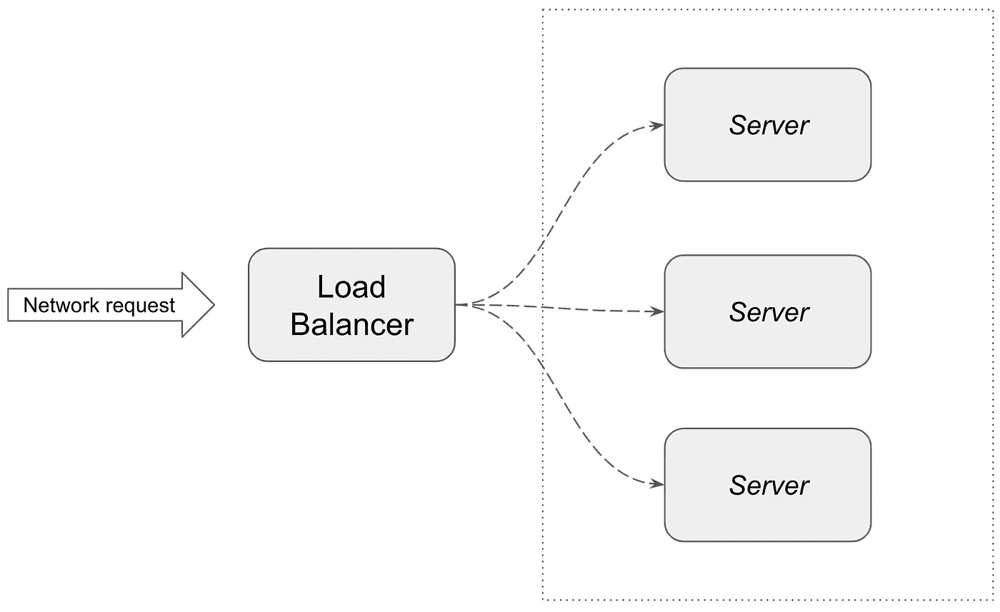

# 什么是负载平衡器？

> 原文：<https://betterprogramming.pub/whats-a-load-balancer-85657879b138>

## 了解如何高效处理网络流量

卢卡·布拉沃在 [Unsplash](https://unsplash.com?utm_source=medium&utm_medium=referral) 上的照片。

当你有一个单页网站作为名片时，事情看起来相当不错。为所有用户提供服务不存在任何问题，并且它始终可用。但是如果你有一个大的系统，情况会发生巨大的变化——特别是随着流量的增加。

一开始，我们认为这对于拥有几千名活跃客户的用户群来说应该不成问题。有一天，你的网站到达了一个转折点，它不能有效地处理所有的请求。活跃用户的数量正在增长。每个人都对增长感到兴奋。然而，现在工程师们必须想出如何处理增加的负载。如果系统没有准备好，一切都必须立即解决，这可能会成为一个关键时刻。计算集群的数量应该增加。存储节点也需要扩展。

高效处理网络流量的一个重要部分是*负载平衡器*。

# 原则

负载平衡的主要思想就体现在它的名字中。这意味着在多个计算资源之间分配流量负载。让我们看看下图:

负载平衡模式。作者照片。

我们看到*负载平衡器*是一个接收所有网络流量的节点。它不做任何计算工作。它的主要目的是将请求重新路由到计算节点*服务器*。同时，*服务器*执行所有的重要工作:处理请求和准备响应。服务器通常位于私有网络中，对外界不可用。换句话说，只有*负载平衡器*节点可以访问*服务器*节点。

每个负载平衡器可以使用不同的算法来分配负载。虽然[循环调度](https://en.wikipedia.org/wiki/Round-robin_scheduling)算法是最简单的一种，但它可能并不合适。这主要是因为它没有考虑每个节点上的实际负载。因此，通常在一个地方有多种算法，这些算法考虑了每个服务器上的连接数、响应时间和资源使用情况。

*负载平衡器*节点将检查每个节点的健康状态。如果服务器不断出现故障，它将停止接收流量，直到恢复。负载平衡器确保没有请求被发送到不健康的实例。

模式中描述的方法还增加了整个设置的安全性。由于负载平衡器是互联网的单一入口点，因此它还可以具有不一定与负载平衡相关的其他功能。首先想到的是，它可以充当防火墙，保护系统免受攻击者的攻击。即使在一个模式上，它看起来也像一个保护*服务器*节点的守卫。

# 具体例子

让我们探索一下亚马逊网络服务(AWS)能提供什么。有两种类型的负载平衡器可用(不包括不推荐使用的那种):应用程序负载平衡器和网络负载平衡器。它们之间的主要区别是它们操作的网络层。

一个[应用负载均衡器](https://docs.aws.amazon.com/elasticloadbalancing/latest/application/introduction.html)工作在网络层 7 (HTTP)。它支持 HTTP/HTTPS 协议的各种功能，并利用它们来实现适当的性能。除此之外，它支持 WebSockets。对于大多数 web 应用程序来说，这种类型的负载平衡器就足够了。

一个[网络负载平衡器](https://docs.aws.amazon.com/elasticloadbalancing/latest/network/introduction.html)提供了非常高的性能，因为它运行在网络层 4 (TCP)上。它可以通过 TCP 或 UDP 协议进行连接。使用它的一个很好的例子是当预期有高实时流量时(例如数据流和消息应用)。

负载平衡器是无服务器组件中常规且重要的元素。如果我们有一个 lambda 函数，它会使用一个负载平衡器。好的方面是我们不需要设置和维护它。这就是无服务器世界的美妙之处。幕后的集成负载平衡器负责处理网络请求，并能够自动处理增加的流量。

# 结论

如今，负载平衡器已经成为一种常见的组件。它们使应用程序更具弹性，并为最终用户提供最佳性能。如果你学会了如何正确地应用它们，你的解决方案将会得到一个现代的、坚实的架构。