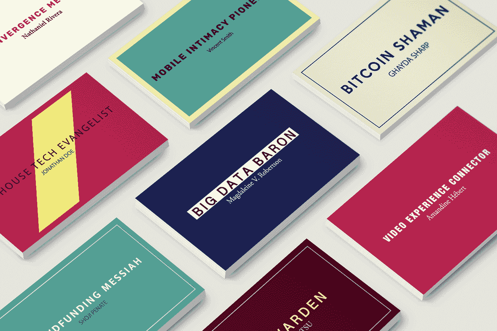

# 名称又能代表什么呢很多，如果你在科技行业工作的话

> 原文：<https://betterprogramming.pub/whats-in-a-name-a-lot-if-you-re-working-in-tech-962e612b5c84>

## 这不是一个简单的角色描述，而是一个身份徽章

作者借助由 [cosmo-studio-2](https://br.freepik.com/cosmo-studio/2) 设计的矢量创建的图像

截至 3 月 15 日，世界获悉埃隆·马斯克(Elon Musk)的头衔从特斯拉的首席执行官(CEO)变为该公司的“技术王”(即“技术之王”)。

这家电动汽车巨头的首席执行官[向美国证券交易委员会(SEC)提交了一份文件](https://sec.report/Document/0001564590-21-012981/)，要求正式注册他的新头衔，并要求汽车制造商的财务总监(CFO)成为“硬币大师”

这种变化意味着什么？提交给美国证券交易委员会的文件指出，“埃隆和扎克也将保持各自的首席执行官和首席财务官的职位。”因此，新标题的原因尚不清楚，甚至可能不会有任何重大的实际影响。

如果你不熟悉科技行业文化，你可能会认为这只是[马斯克的又一个怪癖](https://www.bbc.co.uk/newsround/55188055)。另一方面，如果你从事科技行业，你可能已经遇到过一些这样的招聘信息:

图片来源:[7 生活](https://www.7liveshr.com/jobs)

# 这些职称从何而来？

富有想象力的职位头衔的使用至少可以追溯到世纪之交。

到了网络繁荣时期，科技公司的雇主通常会有一个非传统的头衔来反映他们行业的新颖性和颠覆性。但是这种做法并不仅限于当时的软件业，它出现在几乎每一个商业领域，从食品到娱乐业。这一趋势在“[未来的职位头衔](https://www.fastcompany.com/section/job-titles-of-the-future)”中流行开来，这是《快公司》的一个常规节目，采访了职位头衔不同寻常的人。

如今，修改经典的职位名称可以用于不同的目的。

在一个人才匮乏的市场，尤其是科技行业，修改招聘广告中的经典头衔是为了脱颖而出，吸引更多的求职者。有些公司只是在经典的专业头衔上加一个创意形容词，像“全栈魔术师”而不是全栈开发者；但其他人甚至更进一步，完全改变了标题，如“[像素沙皇](https://www.businessinsider.com/completely-ridiculous-ceo-titles-2010-9#seth-priebsatch-chief-ninja-1)”

这一战略[旨在专门针对千禧一代](https://www.businessinsider.com/rebranded-job-titles-millennials-ninja-rock-star-evangelist-2018-11)，他们已经构成了美国劳动力中最大的一代[。根据 2016 年盖洛普(Gallup)的一项研究，千禧一代的员工不认同企业文化中的保守思想，也不像上几代人那样区分自己在工作场所的角色。最后一点体现在对工作中有意义的目标的需求，以及对在工作场所被倾听、被认可和被理解的需求。非常规的职称似乎是满足这些需求的一种尝试。例如，虽然数据科学家的头衔被视为严格的技术角色，但“学习数据故事讲述者”似乎具有创造性和同情心，即使工作职能最终几乎相同。](https://www.pewresearch.org/fact-tank/2018/04/11/millennials-largest-generation-us-labor-force/)

# 这些头衔在求职市场中有效吗？

在招聘广告中使用创造性的命名似乎可以有效地吸引创新型的候选人。Scalable Press 的营销主管 Julia Li 在《华尔街日报》的一篇文章中表示:“如果有人自称是成长型黑客，他们通常会有不同的技能组合:更多的是技术背景，不怕打破几个鸡蛋。”。

修改后的职称也可以赋予企业权力，尊重员工，并建立收取高价的权威。这就是费城擦鞋连锁店弗雷泽企业有限公司(Frazier Enterprises，Inc. )的动机，在多年来客户称他们为擦鞋童之后，该公司正式将其员工命名为“擦鞋艺术家”。

然而，这种方法的优点可能无法弥补它的缺点。

首先，它导致整个公司缺乏一致性。不仅同事可能会质疑“全栈魔术师”和“全栈摇滚明星”之间的区别，而且客户也可能不理解标题的含义。这就是发生在谷歌“首席互联网传道者”温顿·瑟夫身上的事情虽然他的定制标题无法更准确地描述他周游世界谈论互联网的角色，但他承认在他的商务旅行中被问了几次他是否相信上帝。

另一个问题是可搜索性降低。求职者如何在搜索工作列表时知道使用哪些关键搜索词？可以肯定的是，大多数人会继续使用更常见的关键词，从而更容易在搜索结果中过滤广告。因此，公司没有在竞争对手的报价中脱颖而出，而是看到他们的申请人范围在缩小。简历中非常规的头衔也不太能有效地向未来的新雇主描述候选人的工作经历。

当谈到包容性时，也有一些微妙之处需要讨论。作为一名女工程师，当我在技术工作论坛上遇到这些创造性的头衔时，我觉得它们是从一系列极客刻板印象中精选出来的。我倾向于开玩笑地哀叹“美少女战士”职位的缺乏，而“[忍者”总是有很多机会](https://www.indeed.com/lead/weird-job-titles-year-in-review)。更严肃地说，有科学证据表明，招聘广告的措辞会影响不同的候选人对职位的看法，尤其是所用的语言会让他们在男性主导的工作场所减少归属感；所以也许我的偏执是有原因的。

# 给自己命名，还是自我授权？

根据 2018 年 Pearl Meyer 调查，只有 6%的公司让员工选择自己的职称，这是一个不幸的低数字，因为它有一个很大的优势:更高的自主权。正如 Caliper 人力资源副总裁托马斯·舍恩菲尔德(Thomas Schoenfelder)，[指出](https://www.wsj.com/articles/who-wants-to-be-a-ninja-job-titles-get-a-rebranding-1542204005):“如果你定义了自己的头衔，你就能更快地获得所有权。”

但这还不是全部。关于自封头衔的[心理影响的研究](https://journals.aom.org/doi/10.5465/amj.2012.0338)表明，这种做法对员工的心理健康有积极的影响，从而提高了他们的生产力水平。鼓励员工思考自己的独特价值，并用一个独特的定制标题来表达，有助于获得肯定感，关注工作中有回报的一面，而不是艰辛，并减少情绪疲惫。

当谈到招聘广告中不常见的标题时，我看不出这样做有什么好处。我也没有野心在我的名片上写一个古怪的头衔。但我看到了拥有一个能真实代表我日常工作的头衔的好处。技术专长非常具体，每个专业人员都有一套独特的技能。除了我自己，谁是给我的职能取一个准确名称的最佳人选？

这就是为什么去年我开始以用户体验工程师(简称 UX 工程师)的身份展示自己。尽管我是一名全栈开发人员，但在我心里，从大学时代起，我就对人机交互(HCI)有着特殊的地位。所以当我看到自己在一个没有设计团队的小组织中工作时，我很自然地承担了通常属于 UX/UI 设计师的职责。一旦我深入了解 UX/UI 知识，我开始发现自己和同事之间的差异。当他们严格关注项目的技术方面时，我开始成为用户的拥护者。通过承认这是我作为一个独特的专业人士的定义，我决定通过合并 UX/用户界面设计师和工程师的头衔来明确我的角色标签。

你是否也觉得有必要想出一个个性化的职位名称？LinkedIn 和 Twitter 的简历是激发灵感的良好开端，但如果你需要额外的推动力，我有一些适合每种风格的就业机会生成器的建议。如果你喜欢古怪的创业氛围，那么[硅谷头衔生成器](https://siliconvalleyjobtitlegenerator.tumblr.com/)就是为你准备的。对于设计师来说，[伪设计头衔](https://designtitles.com/)才是你要找的。但是，如果你更传统，想要与变得更加奢侈区分开来，就像我一样，那么[狗屁工作机会生成器](https://www.makebullshit.com/job-title-generator.php)就是你所需要的。