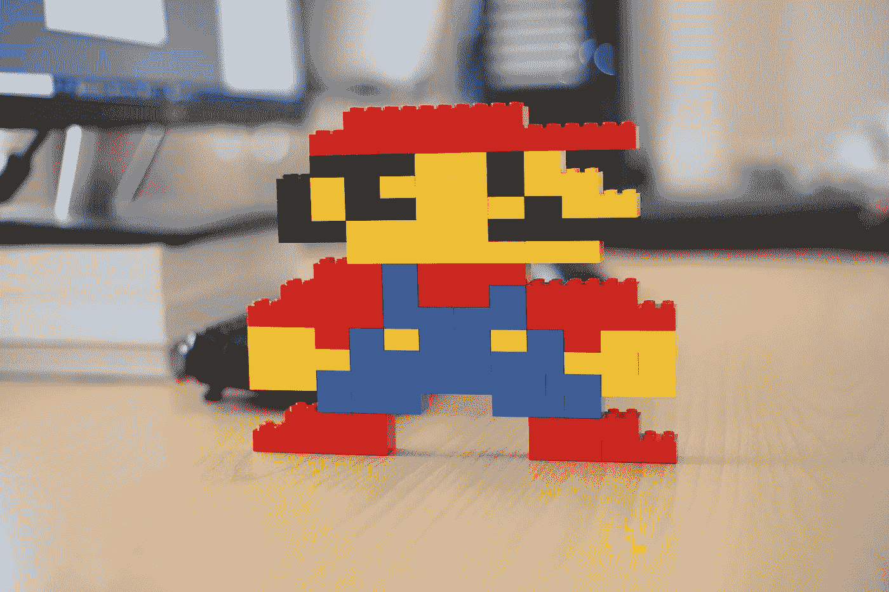

# C# 9.0 有什么新特性？你应该知道的 3 个特征

> 原文：<https://betterprogramming.pub/whats-new-in-c-9-0-3-features-you-should-know-f229c14c633>

## 丰富您的代码！

在 [Unsplash](https://unsplash.com?utm_source=medium&utm_medium=referral) 上由 [Sahand Babali](https://unsplash.com/@sahandbabali?utm_source=medium&utm_medium=referral) 拍摄的照片。

 [## 通过我的推荐链接加入媒体

### 作为一个媒体会员，你的会员费的一部分会给你阅读的作家，你可以完全接触到每一个故事…

dleroari.medium.com](https://dleroari.medium.com/membership) 

工具箱里的工具越多，就越容易为工作选择合适的工具。编程也是如此。你知道的越多，解决不同性质的挑战就越容易。

在本文中，我们将介绍 C# 9.0 的一些新特性，这些特性将帮助您更高效地编写代码。这些是您应该了解的特性，因为它们将提高代码的可读性，并允许您和您的团队编写可扩展的干净代码。

# 1.记录

C#面临的挑战之一是没有简单的方法来复制对象。最接近的方法是创建对象的新实例或安装第三方库。

## 代码示例

以下示例将演示如何使用`record`关键字创建一个对象，并将其复制到一个新对象中:

如上所示，我们对想要构建的东西建模，然后构建它。我们首先建造一个名为`falcon9`的火箭，它的位置设置为火星，三个引擎随时准备发射。

几年后，我们想制造一个相同的火箭(`falcon10`)，但只是改变了位置。为了实现这一点，我们需要使用`with`关键字。这个关键字只能在我们使用`record`关键字创建模型时使用。他们两个都有关系。这允许我们复制现有的对象。但是实际上，它创建了一个新的对象实例，并将现有对象的属性复制到新对象中。

## 何时使用它们

当您需要复制具有十个以上属性的对象时，我会考虑使用记录。这是因为它不需要对现有代码进行重大更改，如上面的示例所示。此外，它看起来比手动复制对象的属性更干净，可读性更好，因为手动复制会增加文件大小和代码行。总之就是好看一点而已。

# 2.模式匹配增强

模式匹配提供了一些操作符，我们可以用它们来增强代码的可读性，比如`and`、`not`、**、**和`or`。在 C#或任何其他编程语言中，条件语句是用来控制系统行为/流程的关键部分。出于这个原因，这些语句易于阅读是很重要的，这样开发者就可以理解系统试图达到的目的。

每当我阅读包含不等式运算符(`!=`)的`if/switch`语句时，我的大脑需要一些额外的时间来处理它。我们如何使它更具可读性？

## 代码示例

## 何时使用它们

这是我强烈推荐的，因为它增加了代码的可读性。因为像`&&`这样的运算符总是读作`and`或者`!=`读作`not equal`，所以使用符号没有任何意义。只需坚持文字，节省开发人员解释这些符号的额外时间。

# 3.顶级语句

当学习像 C#这样的面向对象语言时，通常会有一些样板代码被添加到文件中，这可能会分散注意力——特别是如果您想教授、学习或快速尝试一些东西。

这个特性的总体目标是让开发者更容易创建教学材料，同时改变传统的显示典型主类的方式。

## 代码示例

在 C#这样的常见 OOP 语言中，主类是初始化区域。代码执行的第一个地方。运行应用程序的心跳。下面的代码用一些代码演示了`Main`类，我们稍后将把这些代码转换成顶级语句:

假设您想教授代码或清理主文件，以提供类似脚本的体验或使其在视觉上看起来更好。您唯一需要做的事情是删除名称空间、类和 main 方法:

## 何时使用它们

顶级语句非常适合为新人创建易于理解的教学材料，这样他们就可以专注于重要的事情，而不是周围的混乱。值得注意的是，它们不会改变任何事情。它们只是让代码看起来更易读。

请注意，我们只能有一个顶级语句文件，所以这是我们在教授或尝试快速示例时可以使用的更多内容。我不建议新的或正在进行的项目这样做，因为我看不出将基于脚本的语言与 OOP 语言混合的价值。

# 摘要

编写代码是一门艺术。这几个技巧可能不会让你一夜之间成为专家，但它们肯定会帮助你编写出稍微好一点的代码。可读的代码易于维护和扩展，从长远来看，您会意识到编写干净代码的好处——尤其是当您需要扩展您或其他人曾经使用过的功能时。