# 服务器端 Swift 有什么新功能？

> 原文：<https://betterprogramming.pub/whats-new-in-server-side-swift-3834e70d2281>

## 查看 ServerSide.swift 2019 上的演讲和演示

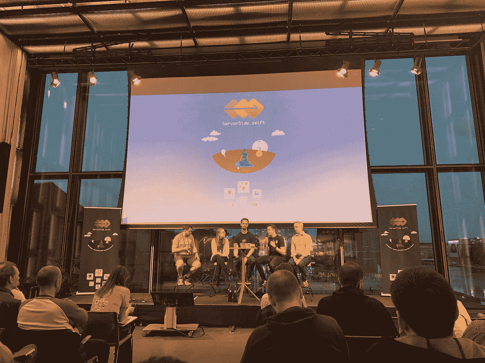

小组讨论@ ServerSide.swift 2019 图片 Andrea Scuderi

上周，我有幸参加了在美丽的丹麦首都哥本哈根举行的为期两天的[server side . swift conference](https://www.serversideswift.info)2019。

大会作为一个奇妙的空间，聚集了来自世界各地对 [Swift](https://developer.apple.com/swift/) 充满热情的人们，围绕服务器端的 [SwiftLang](https://swift.org/) 分享想法、实践、创新和工具。

活动在丹麦建筑中心 Blox 的灵感建筑中组织，会议被丹麦建筑师 Bjarke Ingels 的展览所包围。

虽然对你们中的一些人来说，在一个建筑中心庆祝一个技术会议可能看起来不寻常，但我实际上发现它很迷人，因为它提醒我们也是建筑师，以不同的方式，因为我们的艺术是编写软件，但仍然是建筑师。

DAC 上的 Bjarke Ingels 展览 Andrea Scuderi 摄影

BLOX DAC 拍摄的哥本哈根风景——图片来源:Andrea Scuderi

会议的目的是与像我一样对服务器端 Swift 充满热情的人一起学习和分享许多不同的相关主题。

它还向 Swift 开发人员展示了后端全景中不可思议的机会。新的 [swiftNIO 2](https://github.com/apple/swift-nio) 和 [async-http-client](https://github.com/swift-server/async-http-client) 为 Swift 在后端打开了许多可能性。

在这篇文章中，你会发现一个简短而甜蜜的总结，它总结了最相关的演讲和我从每个演讲中带回家的要点。

我的目标是让你们了解这次会议的内容，如果你们像我一样好奇，它甚至可以作为一个起点，让你们了解迷人的服务器端 Swift 世界。

对于那些刚刚接触这个话题的人来说，服务器端 Swift 意味着使用由苹果公司在 2015 年开源的 [Swift](https://github.com/apple/swift) 语言来开发不仅基于 macOS 而且基于 Linux 的服务器应用程序。

# SSWG — Swift 服务器工作组

Vapor 联合创始人洛根·赖特的演讲。

Swift [服务器](https://swift.org/server/)工作组是一个独立的指导小组，其目标是最终推荐用于 Swift 服务器应用开发的库和工具。

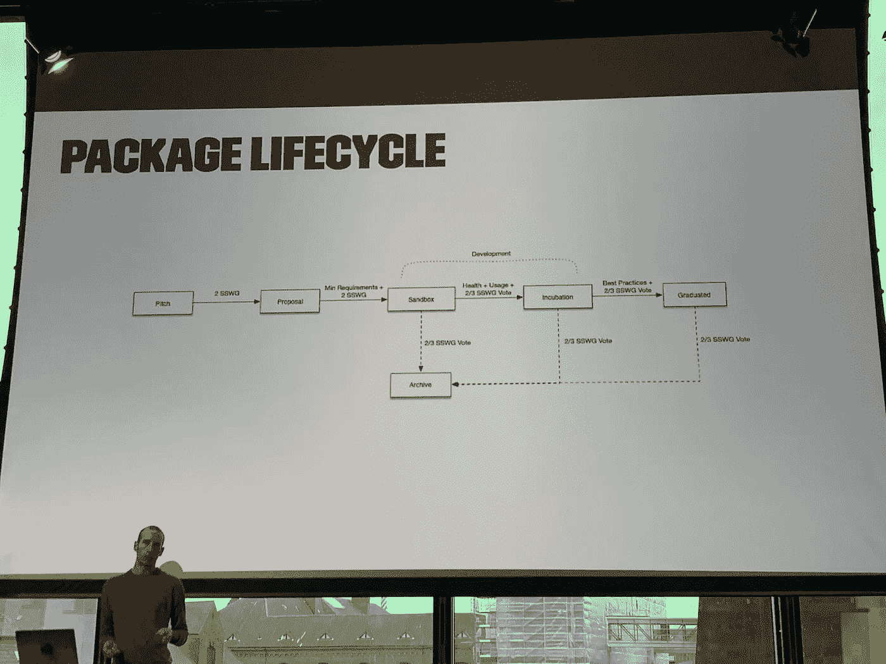

洛根·赖特在 Vapor 摄影安德里亚·斯卡德里

会议上解释了孵化过程，揭示了社区可用的以下工具。

Swift NIO:面向高性能协议服务器和客户端的事件驱动网络应用框架，非阻塞。

*   日志 API:Swift 的日志 API。
*   Metrics API:用于 Swift 的 metrics API。
*   PostgresNIO:用于 [PostgreSQL](https://www.postgresql.org/) 的非阻塞、事件驱动的 Swift 客户端。
*   Redis 客户端:用于 [Redis](https://redis.io/) 的非阻塞、事件驱动的 Swift 客户端。
*   HTTP 客户端:构建在 SwiftNIO 上的 HTTP 客户端库。
*   APNS 客户端:构建在 swift-nio 上的 HTTP/2 APNS 库。
*   Statsd 客户端:使用 [statsd](https://github.com/statsd/statsd) 协议的 swift-metrics 后端。
*   Swift Prometheus:Swift 中的客户端 [Prometheus](https://prometheus.io/) 库。

特别是，Swift NIO 2.0 框架已达到分级状态，这意味着它:

*   采用所有 SSWG 毕业要求。
*   有来自至少两个组织的提交者。
*   获得 SSWG 的绝对多数票进入毕业阶段。

Swift NIO 开发工作由苹果公司支持，并为服务器端 SDK 提供了大量机会。

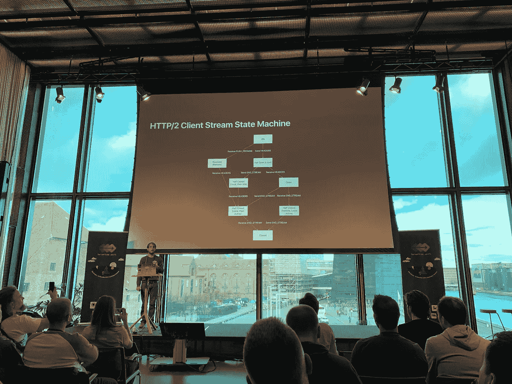

科里·本菲尔德在苹果公司——照片安德里亚·斯库德里

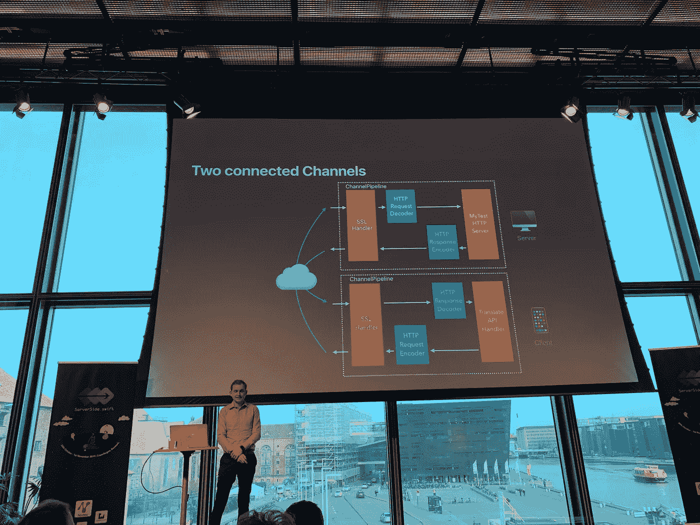

约翰内斯·维斯在苹果公司——安德里亚·斯库德里摄影

苹果公司的 Cory Benfield 对在 Swift 中构建状态机有着非常有趣的见解，用于实施 SwiftNIO 和苹果公司的 Johannes Weiss 的*测试 SwiftNIO 系统*。

强烈建议研究 SwiftNIO 的实现。

# Swift 中的静态站点生成

作者约翰·桑德尔。

下一个是 John Sundell 关于他如何在不使用 JavaScript 的情况下用 Swift 开发他的博客的演讲。

他使用了挑衅性的免责声明“使用 Swift 生成。100%不含 JavaScript”，解释说去掉 JavaScript 有助于他的博客搜索引擎优化。他用一个热重装的现场演示展示了非常优雅的代码，他预计该工具将在今年年底开源。

该工具由三个名为 *Ink、Plot、Publish* 的包组成。

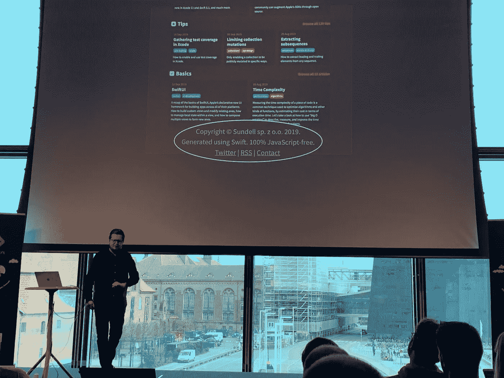

约翰·桑德尔——安德烈·斯库德里

# 基图拉

IBM 的 Ian Partrige。

谈到框架，有人谈到了 Kitura，这是一个为用 Swift 编写的 web 服务而创建的 web 框架和 web 服务器。

介绍了项目的发展，解释了该工具从版本 2.7 开始完全支持 SwiftNIO 2.0。一个很大的改进来自于 2.9 版本对 OpenAPI 的支持。

一个名为 [Appsody](https://appsody.dev) 的新工具允许使用 [Kubernetes](https://kubernetes.io/) 部署 Kitura 解决方案，使用 Prometheus 和 [Grafana](https://grafana.com/) 进行度量。

一个[非常好的教程](https://github.com/IBM/Kitura-SOS-Workshop)已经发布了。

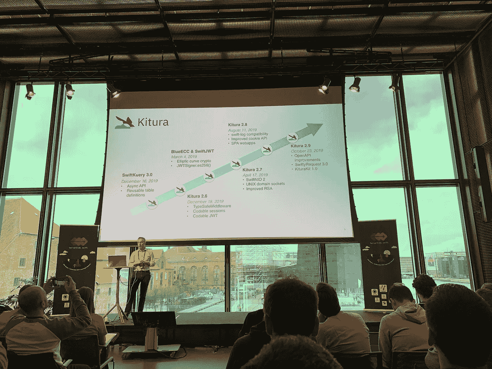

IBM 的伊恩·帕特里奇——安德里亚·斯库德里

# 蒸汽

[著名的服务器端 Swift web 框架 Vapor](https://vapor.codes) 在 4.0 版本中引入了对 SwiftNIO 2.0 和 HTTP/2 协议的支持。围绕 Vapor 及其在生产中的应用进行了大量演示:

Skelpo 的 Ralph Küpper 的 [*构建微服务*](https://speakerdeck.com/calebkleveter/resilient-microservices-in-vapor) 和 Skelpo 的 Caleb Kleveter 的*使用 Vapor 构建弹性微服务*介绍如何使用 Vapor 设计微服务。

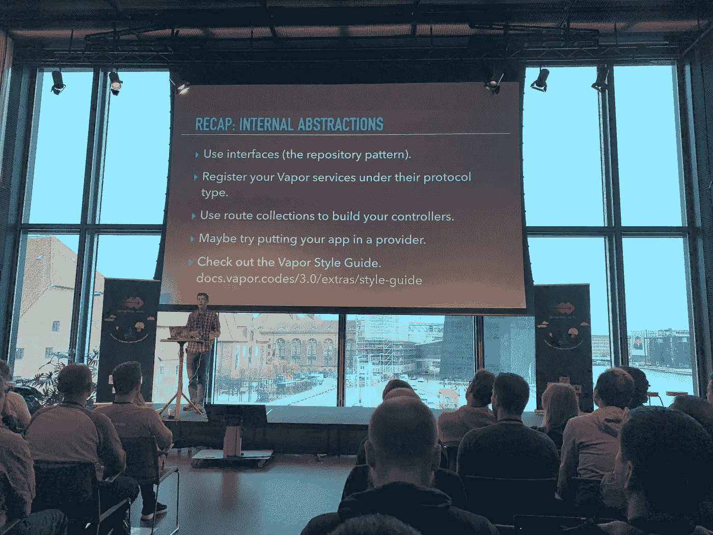

拉尔夫·库伯@斯凯尔波——安德烈·斯库德里摄影

*让我们通过 Swift 使用 Vapor 实现无服务器化*。有一个[教程](https://github.com/timirahj/Server-Side-Swift-using-Vapor-Talk)可用。

蒂米拉·詹姆斯@ Cloudinary——照片安德里亚·斯库德里

Vapor 联合创始人坦纳·尼尔森的《Vapor 入门》。

Jonas Schwartz 在 Linux 上的快速开发。

关于使用 Linux 作为开发平台的热情洋溢的演讲。

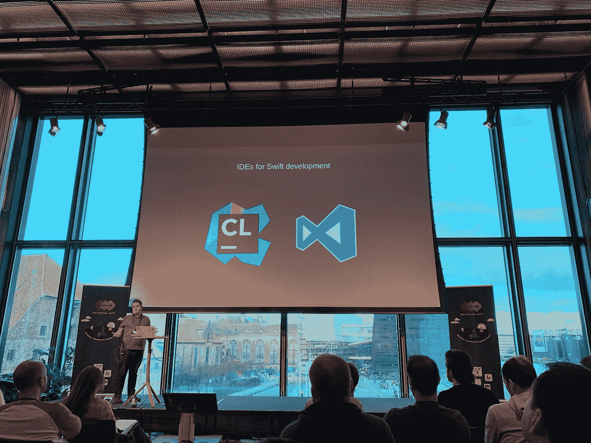

乔纳斯·施瓦茨——照片安德里亚·斯卡德里

# gRPC

来自 TimingApp 的丹尼尔·阿尔姆的演讲。

这个关于用 gRPC 增强你的 Web APIs 的演讲介绍了开源的 gRPC，一个基于 Google 内部 API 架构的消息系统。

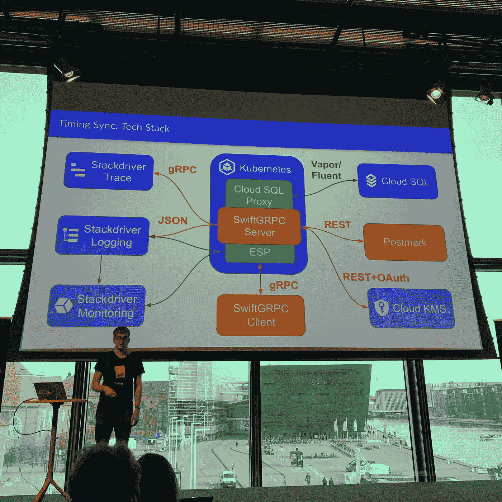

丹尼尔·阿尔姆，来自蒂明加普——安德烈·斯库德里摄影

# MongoDB

来自 MongoDB 的 Kaitlin Mahar 的谈话。

关于 MongoDB 在创建和支持 Swift-MongoDB 客户端方面的承诺，非常有趣的见解: [*在快速移动的生态系统中维护库*](https://speakerdeck.com/kmahar/maintaining-a-library-in-a-swiftly-moving-ecosystem) *。*

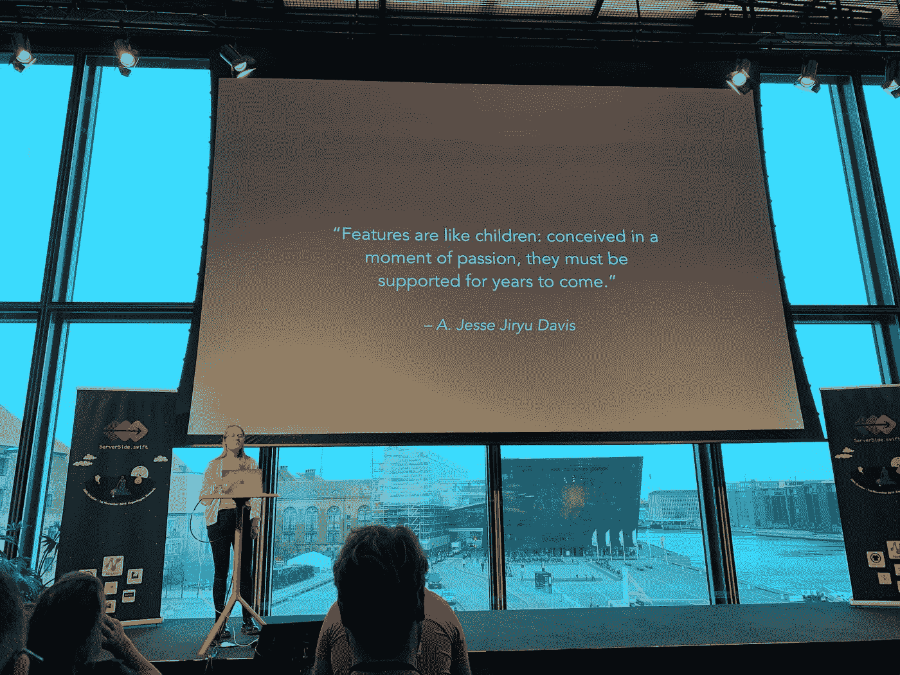

来自 MongoDB 的 Kaitlin Mahar 照片:Andrea Scuderi

# AWSSDKSwift

由乔·史密斯从懈怠谈话。

这个关于*流利 NoSQL:创建 FluentDynamoDB* 的演讲揭示了 [AWSSDKSwift](https://github.com/swift-aws/aws-sdk-swift) ，一个开源的、由社区维护的框架，用于与[亚马逊网络服务](https://aws.amazon.com/)和 [FluentDynamoDB](https://github.com/gonsuke/fluent-plugin-dynamodb) 的实现进行交互。

AWSSDKSwift 允许您使用 Swift 的 AWS 服务。

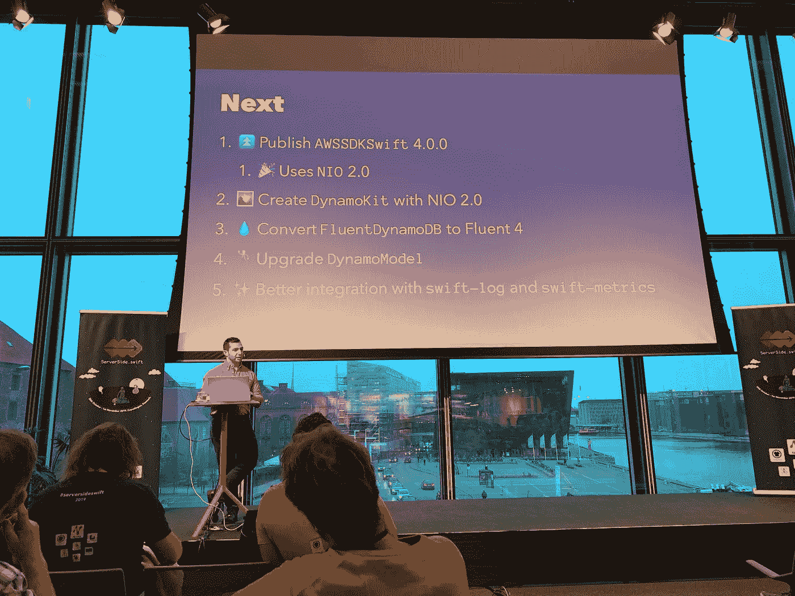

来自 Slack 的乔·史密斯——照片安德里亚·斯库德里

# 烟雾框架

亚马逊网络服务的西蒙·皮尔金顿的演讲。

用 Swift 编程语言编写的轻量级服务器端服务框架。

在*构建 Smoke 框架的下一个版本*中，解释了[工具](https://github.com/amzn/smoke-framework)如何从 Swagger/OpenAPI 定义和框架的演变中生成代码，现在支持 SwiftNIO 2。

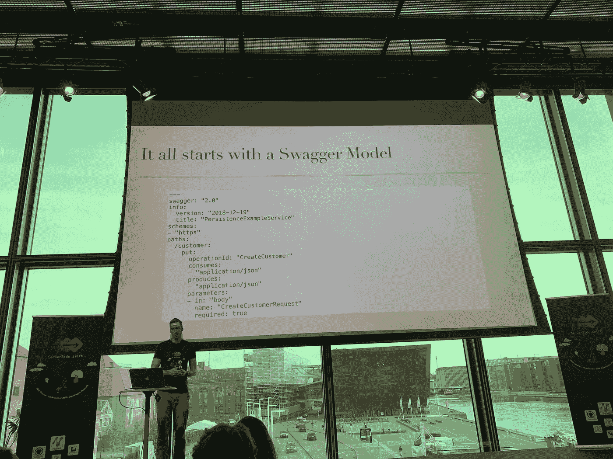

亚马逊网络服务公司的西蒙·皮尔金顿

# 生产中的服务器端 Swift

在与所有参与者交谈时，描述了生产中的大量用例。我发现以下介绍非常相关:

【ManuscriptsApp 的 Matias Piipari 写的《我们如何蒸发我们的 Mac 应用》。

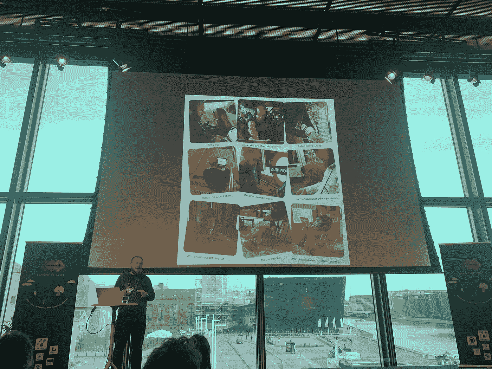

Matias Piipari @ ManuscriptsApp 图片 Andrea Scuderi

*全栈 Swift 开发:方式和原因【EqualExpertsGermany 的 Ivan Andriollo。*

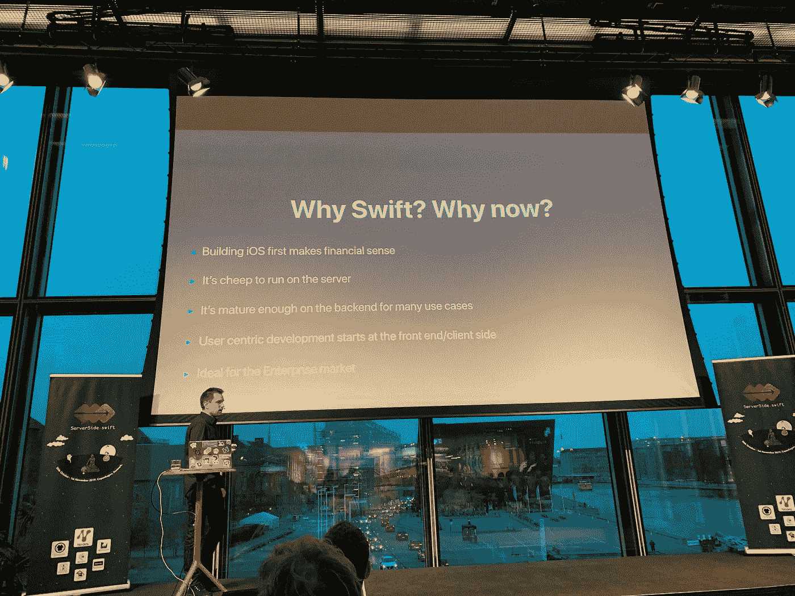

来自德国 EqualExperts 的 Ivan Andriollo 照片 Andrea Scuderi

*用 Swift 构建高科技机器人——来自前线的故事*作者:来自 StyleShoots 的 Gerwin de Haan 和 Mathieu Barnachon。

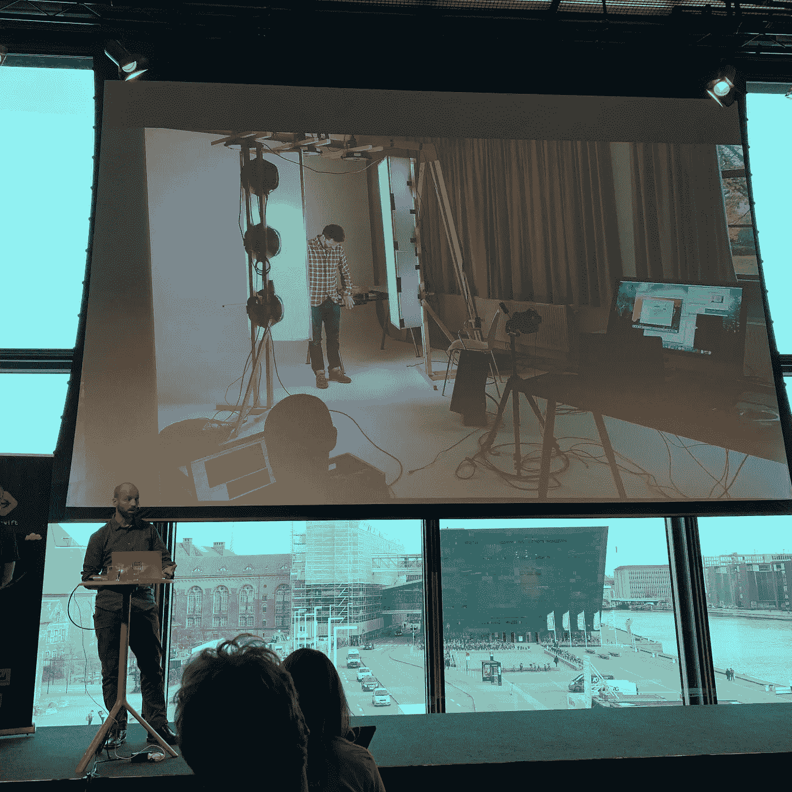

gerwin de Haan & Mathieu barna chon @ style shots——Andrea Scuderi 摄影

来自 NodesAgency 的 Heidi Hermann。

海蒂·赫尔曼(Heidi Hermann from no desagency)——照片安德里亚·斯库德里

我在 Swift 中运行 AWS Lambda 的工具， [Swift-Sprinter](https://github.com/swift-sprinter/aws-lambda-swift-sprinter) 在小组讨论中被提及。该工具通过使用 AWSSDKSwift、SwiftNIO 2 和 HTTPClient 等其他库，允许您在 AWS 上使用无服务器架构。

我不会透露小组讨论的全部内容，因为录音很快就会提供。

# 结论

服务器端的 Swift 生态系统发展非常迅速，开始吸引创新者和新的生产项目。

参与开发工具的人员的热情和能力非常高，鉴于 Swift 社区在开源方面的参考，我们可以打赌，在不久的将来，它将会越来越多。

非常感谢所有的组织者，[马丁·拉塞克](https://instagram.com/martin_lasek)，[蒂姆·康登](https://twitter.com/0xTim)，[斯蒂芬·d·萨默](https://twitter.com/steffendsommer)和奥利维亚·李普曼，他们在活动组织中表现出色。明年见！