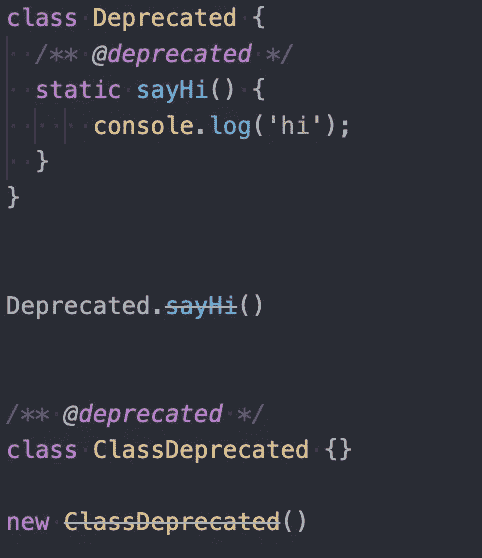

# TypeScript 4 中的新功能

> 原文：<https://betterprogramming.pub/whats-new-in-typescript-4-fe8d50f08e31>

## 了解此主要版本更新中的新增内容


照片由[巴拉特·帕蒂尔](https://unsplash.com/@bharat_patil_photography?utm_source=medium&utm_medium=referral)在 [Unsplash](https://unsplash.com?utm_source=medium&utm_medium=referral) 上拍摄

在进入文章之前，我想说恭喜你，打字稿！

几天前发布了新版 TypeScript。有很多有趣的功能。在这篇文章中，我将向您简要介绍一下发生了哪些变化。(如果您想了解详情，请查看此[开发说明](https://devblogs.microsoft.com/typescript/announcing-typescript-4-0-beta/)。)

## 放弃

TypeScript 4 还不是稳定版本；这是测试版。所以你应该确保你真的可以在你的产品代码中使用这个版本，因为 *beta* 意味着他们可能会在最终发布之前改变一些特性。

# 可变元组类型

假设我们在 TS 3.9 基础上编写了函数`concat`。

## TS 3

TS 3.9 基础版

该函数有两个参数，每个类型都扩展了`any[]`。看看调用该函数的三个结果。

`r1`类型是`any[]`，尽管它是函数取`string[]`和`number[]`类型值的结果，因为函数`concat`无法使用`T`和`U`推断返回类型。

所以我们不得不像`r2`和`r3`那样手动转换返回类型。即使在 TS 3.x 中可能有某种解决方案，我们真的只是需要一些很酷的东西，所以我们不必考虑这些。

在 TS 4 中，你现在能做的就是像下面这样传播类型。

```
type Spread = [...ArrNum, ...ArrStr];
```

如果一个类型由一些长度未知的类型组成，TS 4 会把它们当作一个类型的数组。

```
type StrStrNumNum = [...Strings, ...Numbers];
```

否则，TS 4 可以计算每个类型中有多少相同的类型，这样它就可以将它们传播到新的类型中。

## TS 4

TS 4.0 基础版

我们现在在 TS 4 中需要做的就是将函数的返回类型声明为`[…T, …U]`；那我们就不用每次都去投结果了。另外，现在`r1`也有合适的型号，而不是`any[]`。

你可以点击查看更多关于这个[的细节。](https://devblogs.microsoft.com/typescript/announcing-typescript-4-0-beta/#variadic-tuple-types)

# 标记元组元素

使用 TS 4 中的 type 关键字，现在您可以告诉 TS 您传递给函数的参数的每种类型。

## TS 3

TS 3.9 基础版

## TS 4

TS 4.0 基础版

你可能看不出它们之间的巨大差异；TypeScript 团队引入这个特性是为了更好的可读性。当你想表达其余的论点时，你可以这样写你的类型:

```
type Foo = [first: string, second: number, ...rest: any[]];
```

要记住的一点是，如果你给类型一个标签，你必须给所有的类型一个标签，就像这样:

```
// Error
type Bar = [first: string, number];// It works
type Baz = [first: string, second: number; 
```

你可以在这里查看更多关于这个[的细节。](https://devblogs.microsoft.com/typescript/announcing-typescript-4-0-beta/#labeled-tuple-elements)

# 从构造函数推断类属性

在 TS 3 基础中，你的类成员属性必须有一个特定的类型，除非你没有关闭`noImplicitAny`选项。

TS 3.9 基础版

否则，`Student`类的属性`age`会给你一个错误，它隐式地有一个`any`类型。而`getDoubleAge`的返回类型也是一个`any`，因为`age`是`any`类型。

在 TS 4 中，它可以通过属性在构造函数中的初始化方式更自然地推断出类型。

TS 4.0 基础版

需要记住的一点是，由于 TS 4 从构造函数中检查成员属性类型，所以您应该始终确保不会混淆 TypeScript。

查看上图。TS 不知道`age`应该考虑哪种类型。

你可以在这里查看关于这个[的更多细节。](http://You can check out the more details about this from here.)

# 短路赋值运算符

一个很简单的对比。现在你可以在 TS 4 中做到这一点。

TS 3.9 基础版

与上面截图中的`=`一样，TS 3 中不支持符号`&&`、`||`和`??`。但是在 TS 4 中，它们是受支持的。

TS 4.0 基础版

所以现在你可以用这个功能来做这件事:

```
let values: string[];

// Before
(values ?? (values = [])).push("hello");

// After
(values ??= []).push("hello");
```

你可以在这里查看更多关于这个[的细节。](http://You can check out the more details about this from here.)

# `'unknown'` on ' `catch'`子句绑定

以前，TS 中一个令人不舒服的特性是您不能在`catch`子句中控制错误类型的类型。

TS 3.9 基础版

但在 TS 4 中，为了更好的安全性，它让你将其类型改为`unknown`。但是您仍然不能将类型更改为自定义类型。

TS 4.0 基础版

在`catch`子句中，您可以像下面这样更改类型。

```
if (typeof e === 'string') {
  // It works now
  console.log(e.toUpperCase());
}
```

你可以在这里查看更多关于这个[的细节。](http://You can check out the more details about this from here.)

# `'@deprecated'`

在 TS 4 中，您可以让其他开发人员知道有些方法已经过时了。

TS 3.9 基础版

一些 JavaScript 编辑器工具更直观地让你知道它们已经过时了。当然，TS 本身也让你知道这一点。

TS 4.0 基础版

如果你使用 VS 代码作为 JavaScript 编辑器，那么把它更新到最新版本并重启程序。VS 代码会让你更容易注意到什么被否决了。



在带有 VS 代码的 TS 4.0 基础版中

你可以在这里查看更多关于这个[的细节。](https://devblogs.microsoft.com/typescript/announcing-typescript-4-0-beta/#deprecated-support)

# 结论

如果你想进一步了解我介绍的新特性，你可以在这里查看。似乎 TS 4 并没有太多的重大变化，目前推出的版本是测试版，所以我们应该跟踪它的变化或错误修复。

如果你想安装这个测试版，可以通过 npm 或者 Yarn 安装。

```
npm i -D typescript@beta
yarn add -D typescript@beta
```

# 参考

*   [“发布 TypeScript 4.0 测试版”](https://devblogs.microsoft.com/typescript/announcing-typescript-4-0-beta/)通过微软开发博客