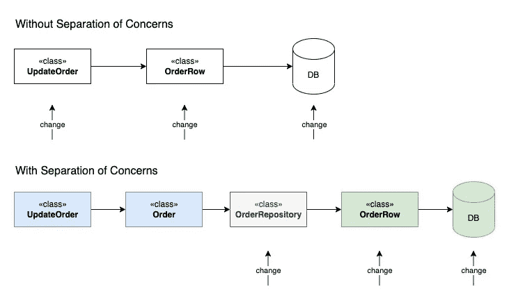

# 为什么采用关注点分离会导致更好的应用程序设计

> 原文：<https://betterprogramming.pub/why-adopting-separation-of-concerns-leads-to-better-application-design-1e9b79504baa>

## 不要在没有考虑使用关注点分离的情况下构建另一个应用程序


由 [Clark Van Der Beken](https://unsplash.com/@snapsbyclark?utm_source=medium&utm_medium=referral) 在 [Unsplash](https://unsplash.com?utm_source=medium&utm_medium=referral) 上拍摄的照片

你是否曾经在一两个类中做了改变，导致了整个测试套件的失败？我很确定我们都有过这样的经历。很可能，这意味着您的应用程序没有足够的(或任何)关注点分离。

在我遇到的所有设计原则中，我相信关注点的分离给我工作的应用程序带来了最大的好处。原因有很多，我们将在下面详细讨论。在高层次上，我相信它是最有益的，因为它有助于构建模块化的应用程序——这从来都不是一件坏事。

# 什么是关注点分离？

关注点分离是一种设计原则，提倡在应用程序中创建不同的层。这些层应该是松散耦合的，一个主要的好处是一个层中的变化对其他层的影响有限或者没有影响。

违反这一原则的一个典型例子是在应用程序中传递原始数据库记录。保护您的领域层免受数据库变化影响的一种常见方法是使用[存储库模式](https://docs.microsoft.com/en-us/dotnet/architecture/microservices/microservice-ddd-cqrs-patterns/infrastructure-persistence-layer-design#:~:text=of%20Work%20patterns.-,The%20Repository%20pattern,from%20the%20domain%20model%20layer.)。存储库通常负责持久层和领域层之间的转换，将它们各自的关注点分开。

为什么这种分离很重要？因为，当正确实现时，它可以防止持久层中的更改影响域层(反之亦然)。

举例来说，如果您从 SQL 更改为 MongoDB，或者将字段名从`last_name`更改为`surname`，这应该不会对域层产生影响。然而，如果您的应用程序没有很好地分离关注点，那么这些更改将会非常耗时。

# 我们如何实现关注点分离？

以字段名的变更为例，这是变更的爆炸半径，包括关注点分离和不分离。箭头代表数据传输的方向。颜色代表不同的层，存储库充当两层之间的翻译。



图片来源:阿什莉·皮科克

正如您所看到的，利用关注点分离包含了变更的爆炸半径，特别是保护核心域(蓝色)免受任何变更。这是可能的，因为`OrderRepository`正在处理翻译。因此，当`OrderRepository`从数据库接收到一条记录时，它可以处理现在已更改的字段名称的映射。

我们也可以选择重命名域层中的字段，但是不需要“大爆炸”——我们可以在单独的 PR 中对域层进行更改，并且该更改将仅限于域层和存储库。

在这个特殊的例子中，还有一个好处值得强调——我们如何持久存储数据和我们如何在域中表示数据之间没有耦合。当出于性能原因需要以某种方式存储数据时，这尤其有用，但是领域层不应该因为持久层的性能问题而受到影响。

在我的职业生涯中，这几次被证明是无价的。最明显的例子是，我们在上线几个月后发现了一个性能问题。我们需要彻底重组我们如何持久存储数据，我们彻底改变了数据库模式的重要部分，除了持久层之外，任何层都没有任何影响或变化。

# 关注点分离的更多好处

上面，我们讨论了持久层的变化可能影响领域层的场景。从本质上来说，它们是紧密耦合的，一方的变化不会影响另一方。

当我们考虑应用程序的其他方面，以及它们可以有多少层时，松散耦合变得更有价值。例如，您的领域层将需要以某种方式从您的应用程序中公开——也许通过 API 或 UI。如果不分离关注点，那么您的域层可能必须知道它是如何暴露的(例如，保存百分比的字段需要一个方法来附加一个%符号)。

不过，有一种更好的方法——将公开领域层的问题分离到另一层，通常称为表示层。在表示层中，您将拥有视图模型或 presenter 类，它们将处理公开您的领域层的问题。

## 更好的可测试性

在一个关注点分离良好的应用程序中，我们可以很容易地独立测试每一层。有了现代测试框架，无论如何都可以用模拟来做到这一点，但是这使得测试变得繁琐而痛苦。

关注点的分离使得整个过程对工程师来说更加干净和友好。这主要是因为您不应该需要做大量的测试设置，或者更糟糕的是，如果您正在测试领域层，那么让您的数据库运行。

## 轻便

当关注点的分离被正确实现时，就有可能轻松地“提升和移动”整个层，而不会对其他层产生重大影响。

根据我的经验，可移植性的一个用例是它允许您在不同的服务之间轻松迁移。在我的职业生涯中，一个用例是当我们最初将我们的新特性集构建为包含在主模块中的库时。它有适当的关注点分离，monolith 和我们的新库之间的任何交互都通过一个适配器进行(基于[六边形架构](https://en.wikipedia.org/wiki/Hexagonal_architecture_(software)))。

一年后，库需要从 monolith 中提取，因为直接耦合到 monolith 会大大减慢我们的开发速度。由于 monolith 和我们的库之间的所有通信都通过适配器进行，我们将库提取到它自己的独立服务中，使用[扼杀者 Fig 模式](https://docs.microsoft.com/en-us/azure/architecture/patterns/strangler-fig)一次迁移一个用例。这使我们能够轻松安全地将库移植到新的服务上。

# 摘要

当正确应用时，关注点分离是一个非常强大的设计原则。我强烈建议您亲自尝试一下，无论是在现有的项目中重新构建这些层，还是在您的下一个新项目中。如果你不确定从哪里开始，就从小处开始，像我上面做的那样使用存储库模式！

```
**Want to Connect With the Author?**I run a free newsletter providing fortnightly technical book recommendations, including my key takeaways from the books. Interested? [Sign up here!](https://subscribe.technicalbookclub.com/?utm_source=medium&utm_medium=article&utm_campaign=separationofconcerns)
```