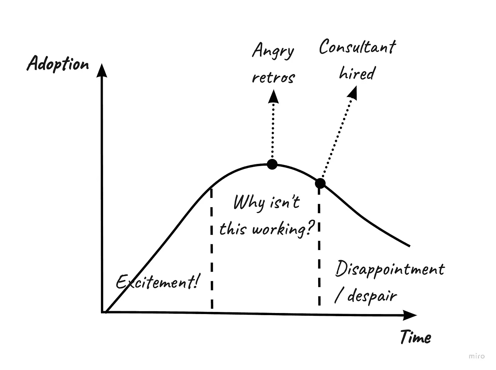

# 为什么所有的项目管理框架都失败了(什么会有效)

> 原文：<https://betterprogramming.pub/why-all-project-management-frameworks-fail-and-what-would-work-instead-700a546219b>

## 所有不同的项目管理框架(Scrum、看板、Shape Up 等。)遵循类似的模式

凯莉·豪克在 [Unsplash](https://unsplash.com?utm_source=medium&utm_medium=referral) 上的照片

我曾经使用过一些不同的项目管理框架——Scrum、看板、瀑布、Shape Up——并且看到它们都有相似的模式。

事情是这样的。一个新的框架出现在雷达上，人们越来越兴奋。早期采用者跟风，希望这次事情会有所不同。人们开始相信他们的问题有解决的办法；一条他们不知何故被锁进的隧道的出路。其他人加入只是为了避开 FOMO，增加他们的工作申请。

项目管理框架生命周期

几年后，框架成熟了。到目前为止，这个领域的每个人或多或少都很熟悉它。但是我们仍然没有解决问题。我们还在隧道里。关于我们是否“正确地”做了这个框架的争论开始爆发。有时，在这个阶段会引入顾问和教练。但是障碍依然存在。

框架饱和。我们开始认识到，事实上，这不是对某些障碍的反应。出于惯性，一些组织仍然继续使用这个框架，但是总体来说它变得越来越不流行了。

然后，一个新的框架爆发了。循环又开始了。

# 中断的循环

为了理解为什么会发生这种情况，我们需要更多地了解这些问题是什么，以及它们为什么会发生。

组织中的问题通常是反馈回路中断的结果。如果你曾经学习过系统思维，这将是一个熟悉的概念(如果你没有，我强烈推荐[安德鲁·和宁](https://medium.com/u/64489f920403?source=post_page-----700a546219b--------------------------------)关于这个主题的文章，如下)。

 [## 系统思维第一部分——要素、相互联系和目标

### 即使是最复杂的系统，也有一套强大的工具来理解和解锁。

medium.com](https://medium.com/better-systems/systems-thinking-part-1-elements-interconnections-and-goals-27877e1c5975) 

中断的反馈回路会阻止系统自我调节。例如，假设一位经理的晋升完全基于他们的管理水平，而没有考虑他们的报告的反馈。就向下管理而言，没有反馈回路来调节什么可能是潜在的破坏性行为。如果他们以牺牲报告为代价进行管理，晋升甚至会奖励不良行为。这个循环不是像健康的反馈循环那样纠正模式，而是强化模式。

图片: [Pixabay](https://pixabay.com/es/photos/portsoy-escocia-puerto-hist%c3%b3rico-1244583/)

项目管理框架给出了一些结构，但是如果那些破碎的反馈环仍然存在，问题将会继续发生。例如，Scrum 旨在通过让产品负责人整合和优先化请求来缓解开发团队中最严重的瓶颈。然而，一个常见的后果是利益相关者寻找另一种方式。他们将直接向开发团队提出请求，或者与 PO 经理交谈。这其实不是他们的“错”——记住，当他们的工作被优先化时，他们通常会得到某种形式的奖励(他们的团队更快乐，他们朝着实现目标更进一步，等等)。).有一个错误的反馈回路在驱动着他们。除非这个问题得到解决，或者至少得到承认，否则很难解决。

在没有完全理解这些反馈循环的情况下，将流程放在适当的位置总是一个肤浅的解决方案。我们解决这些问题的最大希望是，首先尽我们所能修复这些反馈回路。

# 沟通技巧的作用

许多组织中有缺陷的反馈回路的核心是沟通技巧。我们需要更好地分享、倾听和理解障碍。比起 Scrum 的基础，让团队中的所有人学习自信沟通和积极倾听的基础可能更好。这将为他们提供所需的工具，让他们友好地、建设性地表达反馈意见，并倾听反馈意见。

请注意，你在组织层级中的位置越高，沟通技巧就越重要。一个能够公开地、尊重地、不具攻击性地谈论他们所看到的事情，并倾听他人意见的经理通常会为整个团队定下基调。

# 那么，有什么解决办法呢？

项目管理框架不能保证提高基本的沟通技巧。有时，他们甚至会让事情变得更糟。当团队指出项目管理框架是真理的唯一和确定的来源时，这会阻止他们拥有自己的观点。这导致他们强调一个问题，因为“这不是好的敏捷实践”，而不是诚实和坦率地谈论它对他们的影响。

那么解决办法是什么呢？错误的反馈回路是系统性的。不仅仅是个人问题，团队、整个组织，甚至社会本身都会奖励不良行为，忽略重要问题。所以**在期望方面，我们需要现实一点**。我们不会在一夜之间解决我们组织的所有问题。甚至在未来 5 年内。

就我个人而言，我喜欢在看邻居的房子之前先打扫自己的房子(俗话说)。除了练习，我还积极学习和阅读有关沟通的知识(如果你没有，试着谷歌一下:谈判、冲突管理、非暴力沟通、果断沟通、积极倾听)，以确保我的技能保持敏锐。我也一直在寻找对我自己沟通的反馈。

在我管理的团队中，我经常引入一系列沟通规范。这包括不打断和主导谈话，如何分享你所看到的信息，让其他人更容易倾听，一些“触发词”(如[这些](https://medium.com/@penelope_l/2-words-to-ban-from-product-development-7dbb31a4af2d))和积极倾听的信息。这是一个动态列表，所以我们可以根据需要不断更新。

这是一个开始。这并不意味着你不能使用项目管理框架——嘿，拥有一套现成的流程来帮助每个人快速达成共识是非常有用的。然而，这是不可能的，除非你有一个透明和尊重的沟通基础。也许有人应该为此建立一个框架:-)

你同意吗？或者项目管理框架比我想象的要多？